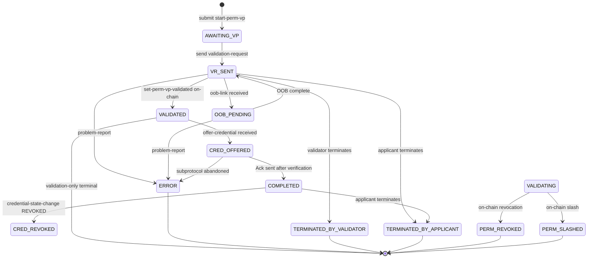
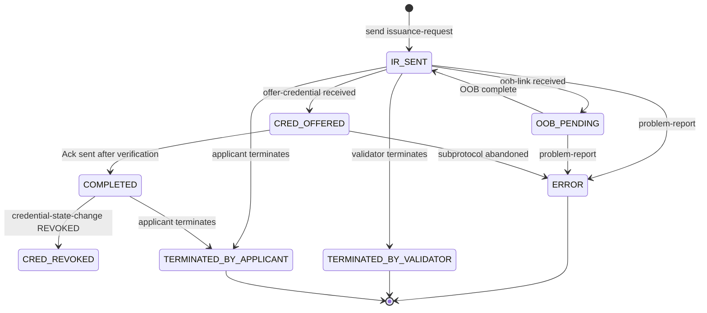
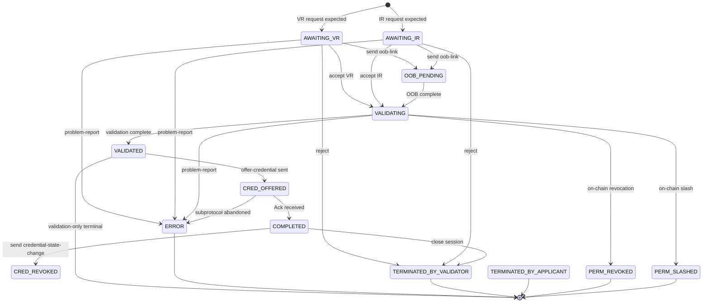
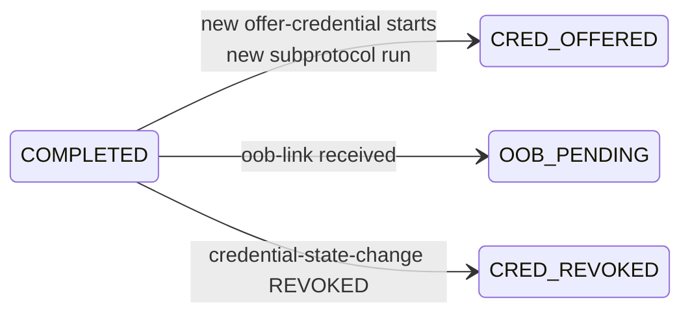

# Verifiable Trust Flow Protocol 1.0 (vt-flow)

- **Authors:** Tarun Vadde (<vaddeofficial@gmail.com>)
- **Status:** DRAFT
- **Status Note:** This document is a draft intended to kick off design discussion.
- **Supersedes:** None
- **Start Date:** 2026-04-16
- **Tags:** feature, protocol, verifiable-trust, credentials, verana
- **Tracking Issue:** [verana-labs/vs-agent#404](https://github.com/verana-labs/vs-agent/issues/404)
- **DIDComm Envelope Compatibility:** Envelope-agnostic — a single v1.0 protocol carried by either DIDComm v1 (Aries-style) or DIDComm v2 envelopes. See [DIDComm Envelope Compatibility](#didcomm-envelope-compatibility).

## Summary

The **Verifiable Trust Flow Protocol** (`vt-flow`) is a DIDComm superprotocol that orchestrates the acquisition of a Verifiable Trust Credential between an **Applicant** and a **Validator**. It carries VPR-specific state (`perm_id`, `session_uuid`, `agent_perm_id`, `wallet_agent_perm_id`) across a multi-step flow and delegates credential delivery to the [Issue Credential V2 protocol (RFC 0453)][rfc0453] as a subprotocol, linked via the DIDComm thread / parent-thread mechanism (per [RFC 0008][rfc0008] in v1 envelopes, and equivalent `thid`/`pthid` fields in v2 envelopes).

`vt-flow` covers two flow variants described in §5 of the [VS-Agent Core Specification][vs-core]:

- **Validation Process** (§5.1) — required when a Credential Schema's management mode is `GRANTOR` or `ECOSYSTEM`. The Applicant first creates an on-chain Validation Process (`start-perm-vp`) before DIDComm interaction. The Validator performs off-chain validation, transitions the on-chain permission to `VALIDATED` (`set-perm-vp-validated`), then — **optionally** — issues a credential. Validation-only outcomes (no issuance) are valid terminal states.
- **Direct Issuance** (§5.2) — used when the Applicant is a `HOLDER`, the Validator is an `ISSUER`, and the schema permits direct issuance (`validation_fees = 0`, Validator opts in). No on-chain Validation Process is required.

Both variants share the same state machine, message set, and error model. They differ only in the initial request message (`validation-request` vs `issuance-request`) and in whether on-chain Validation Process precedes credential delivery.

## Motivation

Today, Verana VS onboarding and credential issuance require manual REST calls against a `POST /v1/vt/issue-credential` admin endpoint plus out-of-band blockchain transactions. This works for demos but has three structural problems:

1. **No agent-to-agent semantics.** Credential exchange happens out-of-band via curl rather than through an authenticated DIDComm channel. There is no way to authenticate the requester as a peer VS, and there is no protocol state to resume from on reconnection.
2. **No binding to on-chain state.** The REST call does not correlate to a Permission Session. The `createOrUpdatePermissionSession` transaction and the credential delivery are two separate actions with no shared session identifier.
3. **No standard error, retry, or revocation channel.** Revocation notifications, OOB requests for additional information, and credential updates all require bespoke glue rather than a protocol contract.

`vt-flow` addresses these by defining a DIDComm protocol that:

- Authenticates both sides as Verifiable Services (see [VS-CONN-VS][vt-spec-conn-vs]) before data exchange.
- Carries `perm_id` / `session_uuid` / `agent_perm_id` / `wallet_agent_perm_id` in-band so both agents can coordinate on-chain transactions against a shared session.
- Delegates credential delivery to [Issue Credential V2][rfc0453], reusing its format negotiation, attachment machinery, and state handling without reimplementation.
- Adopts [Problem Report (RFC 0035)][rfc0035] for errors so existing DIDComm tooling handles them uniformly.
- Keeps the DIDComm connection open after `COMPLETED` so the Validator can push credential state changes (e.g., `CRED_REVOKED`) through the same authenticated channel.

## Tutorial

### Name and Version

- **Protocol Name:** `vt-flow`
- **Version:** 1.0
- **Protocol URI:** `https://didcomm.org/vt-flow/1.0`

Message type URIs follow the pattern:
```
https://didcomm.org/vt-flow/1.0/<message-name>
```

### Protocol Identification

The protocol is identified by the message type URI of the first vt-flow message received on the connection (`validation-request` or `issuance-request`).

### Key Concepts

| Concept | Description |
|---|---|
| **Verifiable Trust Credential (VTC)** | A W3C Verifiable Credential (JSON-LD) governed by a Verana Credential Schema. |
| **Credential Schema** | An on-chain resource in the VPR that defines the format and validation rules for a credential. Each schema has a management mode (`OPEN`, `GRANTOR`, `ECOSYSTEM`) that determines whether a Validation Process is required. |
| **Permission** | An on-chain record granting a DID a specific role (`ISSUER`, `VERIFIER`, `HOLDER`, `ISSUER_GRANTOR`, `VERIFIER_GRANTOR`) for a schema. Obtained either directly (`OPEN` mode) or through a Validation Process. |
| **Validation Process (VP)** | An on-chain state transition used when a Credential Schema requires validator approval. Initiated with `start-perm-vp`, transitioned to `VALIDATED` with `set-perm-vp-validated`. |
| **Permission Session** | An on-chain record created by `createOrUpdatePermissionSession` that binds a specific credential issuance to a validator permission. Identified by `session_uuid`. |
| **vt-flow session** | A DIDComm conversation between an Applicant and a Validator identified by the `thid` of the first vt-flow message. |
| **Superprotocol / Subprotocol** | Per [RFC 0003][rfc0003], `vt-flow` is the outer (super)protocol; Issue Credential V2 runs nested inside a vt-flow session and is linked via `~thread.pthid`. |

### Two Identifiers, Two Purposes

Two identifiers carry session semantics in vt-flow. They serve different layers and **MUST NOT** be conflated:

| Identifier | Layer | Purpose |
|---|---|---|
| `thid` (DIDComm `~thread.thid`) | DIDComm correlation | Links all vt-flow messages in one session, and carried as `pthid` on all Issue Credential V2 subprotocol messages. Equals the `@id` of the initial `validation-request` or `issuance-request`. |
| `session_uuid` (vt-flow message body field) | On-chain / VPR | Identifier used for `createOrUpdatePermissionSession`. Also used by the Validator to re-attach an existing flow to a new DIDComm connection on reconnection (see [Reconnection](#reconnection)). |

### Roles

Two roles participate in `vt-flow`:

- **Applicant** — the party requesting a credential. Always initiates the DIDComm connection. The Applicant may be any of: `ISSUER_GRANTOR`, `VERIFIER_GRANTOR`, `ISSUER`, `VERIFIER`, or `HOLDER`, depending on the schema and target permission.
- **Validator** — the party authorized to validate and (optionally) issue the credential. The Validator may be an `ECOSYSTEM` controller, `ISSUER_GRANTOR`, `VERIFIER_GRANTOR`, or `ISSUER`.

The valid Applicant/Validator pairings are enumerated in §5.1 of the [VS-Agent Core Specification][vs-core].

### Verifiable Service Identity Check

Per [VS-Agent Core Specification][vs-core] §5.1 step 2 and §5.2 step 1, both parties **MUST** verify the peer is a Verifiable Service per [VS-CONN-VS][vt-spec-conn-vs] at the protocol level:

- The **Validator MUST** perform the check **on receipt of the first vt-flow message** (`validation-request` or `issuance-request`).
- The **Applicant MUST** perform the check **before sending** the first vt-flow message.

On check failure, the failing party **MUST** terminate the session with `problem-report` code `vt-flow.not-a-verifiable-service` (Flow State transitions to `ERROR`).

Implementations MAY cache VS-CONN-VS results to avoid redundant trust resolution if the result was obtained recently.

The DIDComm-version-specific binding mechanism (e.g., DID Exchange Request DID under v1, `from_prior` header under v2) is independent of vt-flow itself and is not normative for this protocol. Under DIDComm v1, a Validator MAY perform the VS-CONN-VS check earlier (before sending the DID Exchange response) as an optimisation to avoid establishing a connection that will be terminated immediately.

### States

Per [VS-Agent Core §5.6][vs-core], each vt-flow session has **two orthogonal state dimensions**:

1. **Connection State** — state of the underlying DIDComm connection (an abstraction exposed to the Administration API).
2. **Flow State** — stage of the vt-flow credential acquisition flow.

#### Connection State

| Value | Description |
|---|---|
| `NOT_CONNECTED` | No DIDComm connection established, handshake in progress, or the existing connection is closed. |
| `ESTABLISHED` | DIDComm connection fully open; vt-flow messages can be exchanged. For the Validator, the VS-CONN-VS check has also passed. |
| `TERMINATED` | Connection permanently closed (handshake abandoned, or the connection record was deleted). |

#### Flow State

All states enumerated below are normative. Valid `(Connection, Flow)` pairs, and whether the state applies to Applicant, Validator, or both, follow [VS-Agent Core §5.6][vs-core].

| Flow State | Applies to | Flow | Description |
|---|---|---|---|
| `AWAITING_VP` | Applicant | §5.1 | `NOT_CONNECTED`. Waiting for the Applicant to submit or renew an on-chain `start-perm-vp`. |
| `VR_SENT` | Applicant | §5.1 | `ESTABLISHED`. `validation-request` sent to Validator. |
| `AWAITING_VR` | Validator | §5.1 | `ESTABLISHED`. `validation-request` expected but not yet received, or last request was rejected (Applicant may retry). |
| `IR_SENT` | Applicant | §5.2 | `ESTABLISHED`. `issuance-request` sent to Validator. |
| `AWAITING_IR` | Validator | §5.2 | `ESTABLISHED`. `issuance-request` expected but not yet received, or last request was rejected (Applicant may retry). |
| `OOB_PENDING` | Both | Both | `ESTABLISHED`. Validator sent an `oob-link`; awaiting Applicant completion. |
| `VALIDATING` | Both | §5.1 | `ESTABLISHED`. Validator performing off-chain validation. |
| `VALIDATED` | Both | §5.1 | `ESTABLISHED`. Validator called `set-perm-vp-validated` on-chain; `vp_state` is now `VALIDATED`. In §5.1, this is a valid terminal state if no credential will be issued. |
| `CRED_OFFERED` | Both | Both | `ESTABLISHED`. Issue Credential V2 subprotocol in flight. Applicant verifies on-chain digest while in this state; acceptance transitions to `COMPLETED`. |
| `COMPLETED` | Both | Both | `ESTABLISHED`. Credential delivered, verified, and accepted (Issue Credential V2 Ack sent). Connection remains open for future updates. |
| `CRED_REVOKED` | Both | Both | `ESTABLISHED`. Validator sent `credential-state-change` with `state=REVOKED`. Applicant removed the linked VP and deleted the credential. Connection remains open. |
| `TERMINATED_BY_VALIDATOR` | Both | Both | `TERMINATED`. Validator explicitly terminated the flow (rejection, timeout, or policy decision). |
| `TERMINATED_BY_APPLICANT` | Both | Both | `TERMINATED`. Applicant explicitly terminated the flow. |
| `ERROR` | Both | Both | `TERMINATED`. Unrecoverable protocol error (subprotocol `abandoned`, VS-CONN-VS failure, unreachable peer). |
| `PERM_REVOKED` | Both | §5.1 | `TERMINATED`. On-chain permission revoked (notification via indexer per [VS-Agent Core §7.2][vs-core]); Validator closed the connection. |
| `PERM_SLASHED` | Both | §5.1 | `TERMINATED`. On-chain permission slashed; Validator closed the connection. |

#### Error Handling

All protocol errors are modelled with the adopted `problem-report` message (see [Problem Report (adopted)](#problem-report-adopted)). Errors that allow retry (e.g., `vt-flow.invalid-claims`) return the Validator to `AWAITING_VR` / `AWAITING_IR` and allow the Applicant to resend a corrected request. Fatal errors **MUST** transition both parties' Flow State to `ERROR` and Connection State to `TERMINATED`.

Errors during the Issue Credential V2 subprotocol use the subprotocol's own `problem-report` message. The vt-flow Flow State transitions to `ERROR` when the subprotocol exchange transitions to `abandoned`.

### Flow Variants

#### Validation Process Flow (§5.1)

```text
Applicant                          VPR (Chain)                    Validator
    │                                  │                              │
    │ 1. start-perm-vp                 │                              │
    │ ────────────────────────────────>│                              │
    │ ← perm_id (vp_state=PENDING)     │                              │
    │                                  │                              │
    │ 2. DIDComm implicit invitation   │                              │
    │ ───────────────────────────────────────────────────────────────>│
    │                                  │                              │
    │ ─── vt-flow protocol begins ─────────────────────────────────── │
    │                                  │                              │
    │ 3. validation-request            │                              │
    │ ───────────────────────────────────────────────────────────────>│
    │    (Validator runs VS-CONN-VS check on receipt)                 │
    │                                  │                              │
    │   (optional) oob-link            │                              │
    │ <───────────────────────────────────────────────────────────────│
    │                                  │                              │
    │   (optional) validating          │                              │
    │ <───────────────────────────────────────────────────────────────│
    │                                  │                              │
    │                                  │ 4. set-perm-vp-validated     │
    │                                  │<─────────────────────────────│
    │                                  │                              │
    │   Flow State: VALIDATED (valid terminal if no issuance)         │
    │                                  │                              │
    │ ────── steps 5-10 optional: only if validator issues credential │
    │                                  │                              │
    │                                  │ 5. Generate credential       │
    │                                  │                              │
    │ ┌────── Issue Credential V2 subprotocol (pthid = vt-flow thid) ─┐
    │ │ 6. offer-credential            │                              │ │
    │ │ <──────────────────────────────────────────────────────────── │ │
    │ │ 7. request-credential          │                              │ │
    │ │ ──────────────────────────────────────────────────────────────>│
    │ │                                  │                              │ │
    │ │                                  │ 8. createOrUpdate            │ │
    │ │                                  │    PermissionSession         │ │
    │ │                                  │    MUST succeed BEFORE       │ │
    │ │                                  │    sending issue-credential  │ │
    │ │                                  │<─────────────────────────────│ │
    │ │                                  │                              │ │
    │ │ 9. issue-credential            │                              │ │
    │ │    (with ~please_ack)          │                              │ │
    │ │ <──────────────────────────────────────────────────────────── │ │
    │ │                                  │                              │ │
    │ │  Applicant MUST verify validator   │                              │ │
    │ │  authorization + recompute digest   │                              │ │
    │ │  against on-chain session record    │                              │ │
    │ │                                  │                              │ │
    │ │ 10. ack                        │                              │ │
    │ │ ──────────────────────────────────────────────────────────────>│
    │ └───────────────────────────────────────────────────────────────┘
    │                                  │                              │
    │  Flow State: COMPLETED                                          │
    │  Connection remains OPEN for future credential-state-change     │
```

#### Direct Issuance Flow (§5.2)

```text
Applicant                          VPR (Chain)                    Validator
    │                                  │                              │
    │ 1. DIDComm implicit invitation   │                              │
    │ ───────────────────────────────────────────────────────────────>│
    │                                  │                              │
    │ ─── vt-flow protocol begins ─────────────────────────────────── │
    │                                  │                              │
    │ 2. issuance-request              │                              │
    │ ───────────────────────────────────────────────────────────────>│
    │    (Validator runs VS-CONN-VS check on receipt)                 │
    │                                  │                              │
    │   (optional) oob-link            │                              │
    │ <───────────────────────────────────────────────────────────────│
    │                                  │                              │
    │                                  │ 3. Generate credential       │
    │                                  │                              │
    │ ┌────── Issue Credential V2 subprotocol (pthid = vt-flow thid) ─┐
    │ │ 4. offer-credential            │                              │ │
    │ │ <──────────────────────────────────────────────────────────── │ │
    │ │ 5. request-credential          │                              │ │
    │ │ ──────────────────────────────────────────────────────────────>│
    │ │                                  │                              │ │
    │ │                                  │ 6. createOrUpdate            │ │
    │ │                                  │    PermissionSession         │ │
    │ │                                  │    MUST succeed BEFORE       │ │
    │ │                                  │    sending issue-credential  │ │
    │ │                                  │<─────────────────────────────│ │
    │ │                                  │                              │ │
    │ │ 7. issue-credential            │                              │ │
    │ │ <──────────────────────────────────────────────────────────── │ │
    │ │ 8. ack                         │                              │ │
    │ │ ──────────────────────────────────────────────────────────────>│
    │ └───────────────────────────────────────────────────────────────┘
    │                                  │                              │
    │  Flow State: COMPLETED                                          │
```

Both variants converge on the Issue Credential V2 subprotocol when issuance occurs. The subprotocol runs on its own `thid` but every message carries `~thread.pthid` pointing to the vt-flow session's `thid`. Both agents use `pthid` to correlate subprotocol messages with the outer vt-flow state machine.

**Normative precondition for credential delivery:** Per [VS-Agent Core §5.1 step 7 and §5.2 step 5][vs-core], the `issue-credential` subprotocol message **MUST NOT** be sent until the Validator's `createOrUpdatePermissionSession` transaction has succeeded on-chain. The preceding subprotocol messages (`offer-credential`, `request-credential`) MAY happen before the on-chain session is created — only the credential delivery itself is blocked on it.

### Mapping to the Legacy `CRED_OFFER` Message (spec §5.4)

[VS-Agent Core §5.4][vs-core] lists `CRED_OFFER` as a vt-flow-native message carrying the signed credential. This specification **replaces** that message by delegating to the standard Issue Credential V2 subprotocol.

| Legacy concept (spec §5.4) | vt-flow 1.0 realization |
|---|---|
| `CRED_OFFER` — Validator delivers the signed credential | Issue Credential V2 subprotocol `issue-credential` message (linked to vt-flow via `~thread.pthid`) |
| `CRED_ACCEPT` — Applicant confirms verified + accepted | Issue Credential V2 subprotocol `ack` message. The Applicant **MUST NOT** send the Ack until it has verified the credential's on-chain digest against the Permission Session, preserving the "verified + accepted" semantics. |

### Messages

All vt-flow messages use DIDComm v1 envelope format with `@type`, `@id`, and `~thread` decorators. Message fields are top-level alongside these decorators (not nested in a `body` object).

#### validation-request

Sent by the Applicant to initiate a Validation Process flow (§5.1). **MUST** be the first vt-flow message sent in this variant. The message's `@id` becomes the vt-flow session's `thid`.

```json
{
  "@type": "https://didcomm.org/vt-flow/1.0/validation-request",
  "@id": "<uuid>",
  "~thread": {
    "thid": "<same as @id>"
  },
  "perm_id": "<applicant permission id, from start-perm-vp>",
  "session_uuid": "<applicant-generated uuid for the permission session>",
  "agent_perm_id": "<see field descriptions>",
  "wallet_agent_perm_id": "<see field descriptions>",
  "claims": {},
  "proofs~attach": [
    {
      "@id": "<attachment identifier>",
      "mime-type": "application/json",
      "format": "aries/ld-proof-vp@v1.0",
      "data": { "base64": "<bytes for base64>" }
    }
  ]
}
```

**Field descriptions:**

| Field | Type | Required | Description |
|---|---|---|---|
| `perm_id` | string | REQUIRED | The Applicant's on-chain permission ID created via `start-perm-vp`. The Validator validates this on-chain before transitioning to `VALIDATING`. |
| `session_uuid` | string (UUIDv4) | REQUIRED | UUIDv4 generated by the Applicant for the eventual on-chain Permission Session. Used by the Validator to re-attach an existing flow on reconnection. |
| `agent_perm_id` | string | REQUIRED | Per [VS-Agent Core][vs-core] §5.1 step 3: if the Applicant's Service credential was issued by another agent (delegated mode), the `validator_perm_id` of the Applicant's permission for that Service credential's validator. If the Service credential is self-issued (standalone mode), the `id` of the Applicant's own Service credential ISSUER permission. |
| `wallet_agent_perm_id` | string | REQUIRED | Wallet counterpart of `agent_perm_id`, same semantics. |
| `claims` | object | OPTIONAL | Credential claims the Applicant proposes. Validator MAY override. |
| `proofs~attach` | array | OPTIONAL | Supporting proofs as DIDComm attachments ([RFC 0017][rfc0017]). See [`proofs~attach` Format Registry](#proofsattach-format-registry). |

Upon receipt, the Validator **MUST** either accept and transition Flow State to `VALIDATING`, or reject with `problem-report` using a code from the [Error Codes](#error-codes) registry.

#### issuance-request

Sent by the Applicant to initiate a Direct Issuance flow (§5.2). Same shape as `validation-request` but carries `schema_id` instead of `perm_id`.

```json
{
  "@type": "https://didcomm.org/vt-flow/1.0/issuance-request",
  "@id": "<uuid>",
  "~thread": { "thid": "<same as @id>" },
  "schema_id": "<VPR credential schema id>",
  "session_uuid": "<applicant-generated uuid>",
  "agent_perm_id": "<see validation-request>",
  "wallet_agent_perm_id": "<see validation-request>",
  "claims": {},
  "proofs~attach": []
}
```

| Field | Type | Required | Description |
|---|---|---|---|
| `schema_id` | string | REQUIRED | The VPR Credential Schema ID of the desired credential. |
| *others* | | | As in `validation-request`. |

#### oob-link

Sent by the Validator when additional information outside of DIDComm is required.

```json
{
  "@type": "https://didcomm.org/vt-flow/1.0/oob-link",
  "@id": "<uuid>",
  "~thread": { "thid": "<vt-flow thid>" },
  "url": "https://example.com/verify/abc123",
  "description": "Please upload a proof of residence (PDF or image).",
  "expires_time": "2026-04-26T12:00:00Z"
}
```

| Field | Type | Required | Description |
|---|---|---|---|
| `url` | string | REQUIRED | Absolute HTTPS URL where the Applicant completes the OOB step. **MUST** be unique to this session (e.g., include a capability token). |
| `description` | string | REQUIRED | Human-readable explanation. Follows DIDComm l10n conventions ([RFC 0043][rfc0043]). |
| `expires_time` | string (ISO 8601) | OPTIONAL | Deadline after which the URL becomes invalid. |

`oob-link` **MAY** be sent multiple times during a session, including after `COMPLETED` for revalidation or extension.

#### validating

Informational message sent by the Validator after a request is accepted and validation is in progress.

```json
{
  "@type": "https://didcomm.org/vt-flow/1.0/validating",
  "@id": "<uuid>",
  "~thread": { "thid": "<vt-flow thid>" },
  "comment": "Validating applicant documentation."
}
```

| Field | Type | Required | Description |
|---|---|---|---|
| `comment` | string | OPTIONAL | Human-readable status. |

#### credential-state-change

Sent by the Validator to notify the Applicant of a post-issuance change to the credential's status. The connection remains open after `COMPLETED` specifically to carry these updates.

```json
{
  "@type": "https://didcomm.org/vt-flow/1.0/credential-state-change",
  "@id": "<uuid>",
  "~thread": { "thid": "<vt-flow thid>" },
  "subprotocol_thid": "<Issue Credential V2 thread id of the credential being updated>",
  "state": "REVOKED",
  "reason": "Permission revoked on-chain."
}
```

| Field | Type | Required | Description |
|---|---|---|---|
| `subprotocol_thid` | string | REQUIRED | The `thid` of the Issue Credential V2 subprotocol exchange that issued the affected credential. |
| `state` | string | REQUIRED | Credential status. Open enum; v1.0 defines one normative value. |
| `reason` | string | OPTIONAL | Human-readable explanation. |

**State values (v1.0):**

| Value | Applicant response |
|---|---|
| `REVOKED` | Applicant **MUST** remove the corresponding `LinkedVerifiablePresentation` from its DID Document (if present) and delete the credential from its credential store. Flow State transitions to `CRED_REVOKED`. The DIDComm connection remains open. |

**Forward compatibility:** Receivers **MUST** accept messages with unknown `state` values without error and **MAY** ignore them. This allows future versions to extend the enum (e.g., `REACTIVATED`, `SUSPENDED`, `UNSUSPENDED`, `RENEWED`) without breaking v1.0 parsers.

Per [VS-Agent Core Specification §5.3][vs-core], `REVOKED` is the only state defined in v1.0. Additional states are future work.

#### problem-report (adopted)

Adopted from [RFC 0035 Report Problem][rfc0035]. Used for all protocol errors. The `description.code` field **MUST** be one of the codes listed in the [Error Codes](#error-codes) registry. Conforms to RFC 0035 on-the-wire format:

```json
{
  "@type": "https://didcomm.org/report-problem/1.0/problem-report",
  "@id": "<uuid>",
  "~thread": { "thid": "<vt-flow thid>" },
  "description": {
    "code": "vt-flow.invalid-claims",
    "en": "Submitted claims do not satisfy the schema."
  },
  "who_retries": "you",
  "impact": "thread"
}
```

Values for `who_retries`, `impact`, and `where` follow RFC 0035 conventions (lowercase). Errors in the Issue Credential V2 subprotocol use the subprotocol's own problem-report message type (`https://didcomm.org/issue-credential/2.0/problem-report`), **not** this adopted message. The `pthid` on that subprotocol problem-report links it to the vt-flow session.

> **Implementation note.** Some DIDComm frameworks register the problem-report message under a legacy URI (`notification/1.0/problem-report`) and use UPPER-CASE enum values on the wire. The protocol specification uses RFC 0035 canonical forms; implementers may need to adapt. See [vt-flow-implementation.md](./vt-flow-implementation.md) for Credo-TS specifics.

### Subprotocols

`vt-flow` invokes [Issue Credential V2 (RFC 0453)][rfc0453] on a **new thread** whose messages **MUST** carry `~thread.pthid` equal to the parent vt-flow session's `thid`.

**Initiation:** The Validator initiates the subprotocol by sending `offer-credential`. The subprotocol MAY start at any time after Flow State `VALIDATED` (§5.1) or `VALIDATING`/`AWAITING_IR` (§5.2). The only hard constraint is: **the `issue-credential` message MUST NOT be sent until `createOrUpdatePermissionSession` has succeeded on-chain.**

**Credential format:** vt-flow is credential-format-agnostic; format selection is negotiated inside the Issue Credential V2 subprotocol. Implementations **MUST** support at least the `aries/ld-proof-vc@v1.0` format (W3C JSON-LD Verifiable Credential, [RFC 0593][rfc0593]) for ECS credentials.

**Verification before Ack:** The Applicant **MUST NOT** send the Issue Credential V2 `ack` until it has verified the received credential. Before sending the Ack, the Applicant **MUST**:
1. Query the VPR to confirm the Validator has an active `ISSUER` permission for the schema.
2. Recompute the credential's digest and verify it matches the digest recorded in the Permission Session created by `createOrUpdatePermissionSession`.

If verification succeeds, the Applicant sends the Ack. If verification fails, the Applicant sends a subprotocol problem-report instead and the subprotocol transitions to `abandoned`; the vt-flow session transitions to `ERROR`.

### Superprotocol/Subprotocol Event Correlation

The vt-flow session correlates with its Issue Credential V2 subprotocol through `~thread.pthid` on every subprotocol message. Implementations observe subprotocol state transitions and map them to vt-flow Flow State transitions:

| Subprotocol state | Applicant vt-flow transition | Validator vt-flow transition |
|---|---|---|
| `offer-sent` | — | `CRED_OFFERED` |
| `offer-received` | `CRED_OFFERED` | — |
| `request-sent` / `request-received` | (no transition) | (no transition) |
| `credential-issued` | — | (no transition) |
| `credential-received` | *(perform on-chain digest verification, then either Ack or problem-report)* | — |
| `done` | `COMPLETED` | `COMPLETED` |
| `abandoned` | `ERROR` (Connection → `TERMINATED`) | `ERROR` (Connection → `TERMINATED`) |

Receiving `credential-received` on the Applicant side is the hook point for on-chain digest verification.

### Reconnection

Per [VS-Agent Core §5.5][vs-core], if the Applicant reconnects after a connection closes:

1. The Applicant **MUST** establish a new DIDComm connection (via implicit invitation to the Validator's DID).
2. The Applicant **MUST** resend a `validation-request` or `issuance-request` matching the original, carrying the **same** `session_uuid`, `agent_perm_id`, `wallet_agent_perm_id`, and (for §5.1) `perm_id` or (for §5.2) `schema_id`.
3. The Validator **MUST** recognize the request as belonging to an existing session by matching on `session_uuid` (plus `perm_id` or `schema_id` for defence-in-depth) and re-attach the existing flow to the new connection.
4. The reattached flow's Flow State resumes from whatever stage it was in when the connection dropped.

If the Validator cannot find a matching session, a new session is created normally.

### State Machine Diagrams

Diagrams show the **Flow State** dimension only. Connection State transitions (`NOT_CONNECTED → ESTABLISHED → TERMINATED`) are implicit and accompany the Flow State changes shown.

#### Applicant — Validation Process Flow (§5.1)



#### Applicant — Direct Issuance Flow (§5.2)



#### Validator — Unified State Machine



#### Post-Issuance Transitions from `COMPLETED`

While in the `COMPLETED` Flow State, the DIDComm connection remains open. A fresh `offer-credential` received from the Validator starts a **new Issue Credential V2 subprotocol run** with a new subprotocol `thid` but the same `pthid` equal to the vt-flow session's `thid`.



---

## Reference

### Message Type URIs

All vt-flow message types use the base URI `https://didcomm.org/vt-flow/1.0/`.

| Message | Type URI |
|---|---|
| validation-request | `https://didcomm.org/vt-flow/1.0/validation-request` |
| issuance-request | `https://didcomm.org/vt-flow/1.0/issuance-request` |
| oob-link | `https://didcomm.org/vt-flow/1.0/oob-link` |
| validating | `https://didcomm.org/vt-flow/1.0/validating` |
| credential-state-change | `https://didcomm.org/vt-flow/1.0/credential-state-change` |
| problem-report (adopted) | `https://didcomm.org/report-problem/1.0/problem-report` |

Issue Credential V2 subprotocol messages use their canonical URIs (`https://didcomm.org/issue-credential/2.0/<name>`).

### Error Codes

Error codes are carried in the adopted `problem-report`'s `description.code` field. Codes preserve [VS-Agent Core §5.4][vs-core] naming in a hierarchical form with the `vt-flow.` prefix. The field `impact` drives state-machine response as defined by [RFC 0035][rfc0035].

| Code | Sender | Meaning | `who_retries` | `impact` |
|---|---|---|---|---|
| `vt-flow.vr-required` | Validator | Expected `validation-request` but received a different vt-flow message. | `you` | `thread` |
| `vt-flow.ir-required` | Validator | Expected `issuance-request` but received a different vt-flow message. | `you` | `thread` |
| `vt-flow.unsupported-message` | Either | Received a message type not supported in the current state. Note: if this is the first message on the connection, senders **SHOULD** prefer `vt-flow.vr-required` / `vt-flow.ir-required` over the generic code. | `none` | `connection` |
| `vt-flow.invalid-perm-id` | Validator | `perm_id` does not exist, does not reference the Validator's permission, or is in the wrong `vp_state`. | `you` | `thread` |
| `vt-flow.invalid-schema-id` | Validator | `schema_id` does not exist or is not supported by the Validator. | `you` | `thread` |
| `vt-flow.invalid-agent-perm-id` | Validator | `agent_perm_id` is malformed or does not resolve on-chain. | `you` | `thread` |
| `vt-flow.invalid-wallet-agent-perm-id` | Validator | `wallet_agent_perm_id` is malformed or does not resolve on-chain. | `you` | `thread` |
| `vt-flow.invalid-claims` | Validator | Submitted `claims` do not satisfy the schema. | `you` | `thread` |
| `vt-flow.invalid-session-uuid` | Validator | `session_uuid` is malformed or collides with an existing session. | `you` | `thread` |
| `vt-flow.not-a-verifiable-service` | Validator | Applicant's DID does not satisfy [VS-CONN-VS][vt-spec-conn-vs]. | `none` | `connection` |
| `vt-flow.validation-failed` | Validator | Off-chain validation of submitted documentation failed. | `you` (OPTIONAL) | `thread` |
| `vt-flow.oob-expired` | Validator | OOB link expired before Applicant completed the step. | `you` | `thread` |
| `vt-flow.session-terminated` | Either | Party explicitly terminated the session. | `none` | `thread` |
| `vt-flow.internal-error` | Either | Unspecified error. | varies | `thread` |

Errors during the Issue Credential V2 subprotocol use that protocol's own problem-report with codes like `issuance-abandoned` per [RFC 0453][rfc0453].

### Thread Correlation (`thid` / `pthid`)

Every vt-flow message **MUST** be associated with two logical identifiers:

- `thid` — the vt-flow session's thread id (equals the message id of the initial `validation-request` or `issuance-request`).
- `pthid` — optional parent thread id. Set only if vt-flow itself was nested inside a larger parent protocol.

Every message inside the Issue Credential V2 subprotocol **MUST** carry:

- Its own `thid` (the subprotocol's thread id).
- `pthid` set to the parent vt-flow session's `thid`.

The wire encoding of these identifiers depends on the DIDComm envelope version; see [DIDComm Envelope Compatibility](#didcomm-envelope-compatibility) for the concrete shapes.

### DIDComm Envelope Compatibility

`vt-flow` 1.0 is **envelope-agnostic**. The same protocol definition is carried unchanged by either:

- **DIDComm v1** ([Aries RFC 0005][rfc0005], Aries-style envelope), using `@type` / `@id` / `~thread` decorators, or
- **DIDComm v2** ([DIF DIDComm Messaging][didcomm-v2]), using top-level `type` / `id` / `thid` / `pthid` and a `body` envelope.

Message type URIs, field names, state machine, error semantics, and subprotocol composition rules are identical across envelopes. Only the **outer wrapper** (decorator naming, field placement, attachment structure) differs.

#### Mapping

| Logical element | DIDComm v1 (Aries) encoding | DIDComm v2 encoding |
|---|---|---|
| Message type URI | `"@type": "https://didcomm.org/vt-flow/1.0/..."` | `"type": "https://didcomm.org/vt-flow/1.0/..."` |
| Message id | `"@id": "<uuid>"` | `"id": "<uuid>"` |
| Thread id | `"~thread": { "thid": "<uuid>" }` | top-level `"thid": "<uuid>"` |
| Parent thread id | `"~thread": { "pthid": "<uuid>" }` | top-level `"pthid": "<uuid>"` |
| Message body fields | Top-level alongside decorators | Nested in `body` object |
| Attachments | `<field>~attach` suffix ([RFC 0017][rfc0017]) | top-level `attachments` array ([DIDComm v2 Attachments][didcomm-v2-attachments]) |

#### Example: same `validation-request` in both envelopes

**DIDComm v1 (Aries):**
```json
{
  "@type": "https://didcomm.org/vt-flow/1.0/validation-request",
  "@id": "8a3f7c2b-9e4d-4b1a-8f6c-2e5a7d3b9c1f",
  "~thread": {
    "thid": "8a3f7c2b-9e4d-4b1a-8f6c-2e5a7d3b9c1f"
  },
  "perm_id": "12345",
  "session_uuid": "f7e9c8a2-4b6d-4e1f-9a3c-5d8b2e7f1a4c",
  "agent_perm_id": "678",
  "wallet_agent_perm_id": "910",
  "claims": { "...": "..." }
}
```

**DIDComm v2 (equivalent):**
```json
{
  "type": "https://didcomm.org/vt-flow/1.0/validation-request",
  "id": "8a3f7c2b-9e4d-4b1a-8f6c-2e5a7d3b9c1f",
  "thid": "8a3f7c2b-9e4d-4b1a-8f6c-2e5a7d3b9c1f",
  "body": {
    "perm_id": "12345",
    "session_uuid": "f7e9c8a2-4b6d-4e1f-9a3c-5d8b2e7f1a4c",
    "agent_perm_id": "678",
    "wallet_agent_perm_id": "910",
    "claims": { "...": "..." }
  }
}
```

#### Canonical examples in this specification

All JSON message examples in [§Messages](#messages) use the DIDComm v1 (Aries) encoding as the canonical representation, because (a) it's what the initial implementations target, and (b) the transformation to v2 is mechanical and unambiguous per the table above.

#### Negotiation

The DIDComm envelope version is negotiated at the connection / transport layer, not at the vt-flow layer. Implementations **MUST NOT** branch protocol logic on envelope version; the same vt-flow state machine runs over either envelope.

### `proofs~attach` Format Registry

Default format identifier for `proofs~attach` entries:

| Format | Format Identifier | Link | Comment |
|---|---|---|---|
| W3C JSON-LD Verifiable Presentation | `aries/ld-proof-vp@v1.0` | [RFC 0593][rfc0593] | Default for vt-flow v1.0 |

Additional format identifiers **MAY** be negotiated by mutual agreement.

---

## Drawbacks

1. **Cross-layer coupling.** The protocol couples DIDComm message flow with Verana on-chain transactions. Correct timing is implementation work and cannot be fully specified at the protocol layer.
2. **Session persistence.** Because the connection is kept open after `COMPLETED` to receive `credential-state-change`, implementations must persist vt-flow state across restarts and reconnections.
3. **Atomicity.** Credential delivery and `createOrUpdatePermissionSession` are not atomic. A malicious or faulty Validator could record the session but never deliver the credential, or vice-versa. Applicants **MUST** verify the digest against the on-chain session before accepting.

## Rationale and Alternatives

### Why a superprotocol instead of extending Issue Credential V2?

The VPR-specific fields and on-chain coordination points are not generic to credential issuance. Shoehorning them into Issue Credential V2 would pollute a widely-adopted standard with VPR-only concerns and would not provide control over the order of operations. A superprotocol lets vt-flow keep VPR-specific state in its own messages, delegate generic credential delivery to Issue Credential V2 unchanged, and advance the vt-flow state machine via the subprotocol's existing state-changed events.

### Why `pthid` linking?

`pthid` is the standard mechanism defined in [RFC 0008][rfc0008]. Any conformant DIDComm agent can read and correlate it. Inventing a VPR-specific correlation ID would duplicate functionality and fracture tooling.

### Why adopt `problem-report` instead of a custom `ERROR` message?

[RFC 0035][rfc0035] is designed exactly for protocol errors, supports hierarchical codes, localization, retry semantics, and impact scoping. A custom `ERROR` message (as in the [VS-Agent Core §5.4][vs-core] draft) would duplicate this and break conventional semantics. The spec's error code names are preserved by mapping each to a `vt-flow.*` hierarchical code (e.g., `IR_REQUIRED` → `vt-flow.ir-required`).

### Why drop `CRED_ACCEPT` and use Issue Credential V2's native Ack?

The Issue Credential V2 protocol already defines an Ack message ([RFC 0015][rfc0015]) that signals the Holder has received the credential. If the Applicant is required to perform on-chain digest verification before sending the Ack, the native Ack carries the same "verified + accepted" semantics as the spec's `CRED_ACCEPT`. Adding a vt-flow-native message would duplicate the signal.

### Why not adopt Revocation Notification V2?

[RFC 0183 Revocation Notification][rfc0183] defines a one-way revocation message anchored to AnonCreds revocation registries. vt-flow primarily carries W3C JSON-LD credentials, which RFC 0183 does not address. Additionally, a one-way notification cannot carry future state transitions such as `REACTIVATED`. A vt-flow-native `credential-state-change` message preserves flexibility for future state values with a forward-compatible open enum.

### Single protocol with two entry points vs. two separate protocols

The two flows share approximately 90% of their state machine and all non-initial messages. A single protocol with two entry points is simpler to implement, test, and document.

---

## Prior Art

- [Aries RFC 0003 Protocols][rfc0003] — superprotocol/subprotocol concepts.
- [Aries RFC 0005 DIDComm][rfc0005] — DIDComm v1 envelope.
- [DIF DIDComm Messaging v2.1][didcomm-v2] — DIDComm v2 envelope.
- [Aries RFC 0008 Message ID and Threading][rfc0008] — `thid` / `pthid` mechanics.
- [Aries RFC 0015 ACKs][rfc0015] — adopted Ack semantics.
- [Aries RFC 0017 Attachments][rfc0017] — `~attach` decorator format.
- [Aries RFC 0035 Report Problem][rfc0035] — adopted error message.
- [Aries RFC 0043 l10n][rfc0043] — localization convention.
- [Aries RFC 0183 Revocation Notification][rfc0183] — credential revocation precedent (not adopted).
- [Aries RFC 0453 Issue Credential V2][rfc0453] — credential delivery, used as subprotocol.
- [Aries RFC 0454 Present Proof V2][rfc0454] — candidate subprotocol; not in v1.0 scope.
- [Aries RFC 0519 Goal Codes][rfc0519] — goal code conventions (not used).
- [Aries RFC 0593 JSON-LD Credential Attachment Format][rfc0593] — default `proofs~attach` format.
- [VS-Agent Core Specification §5][vs-core] — source of flow semantics.
- [VPR Specification v4][vpr-v4] — on-chain transaction definitions.
- [Verifiable Trust Specification v4][vt-spec] — VS-CONN-VS, VT-CRED-W3C-LINKED-VP, VT-ECOSYSTEM-DIDDOC.

---

[rfc0003]: https://github.com/hyperledger/aries-rfcs/blob/main/concepts/0003-protocols/README.md
[rfc0008]: https://github.com/hyperledger/aries-rfcs/blob/main/concepts/0008-message-id-and-threading/README.md
[rfc0015]: https://github.com/hyperledger/aries-rfcs/blob/main/features/0015-acks/README.md
[rfc0017]: https://github.com/hyperledger/aries-rfcs/blob/main/concepts/0017-attachments/README.md
[rfc0035]: https://github.com/hyperledger/aries-rfcs/blob/main/features/0035-report-problem/README.md
[rfc0005]: https://github.com/hyperledger/aries-rfcs/blob/main/concepts/0005-didcomm/README.md
[didcomm-v2]: https://identity.foundation/didcomm-messaging/spec/v2.1/
[didcomm-v2-attachments]: https://identity.foundation/didcomm-messaging/spec/v2.1/#attachments
[rfc0043]: https://github.com/hyperledger/aries-rfcs/blob/main/features/0043-l10n/README.md
[rfc0183]: https://github.com/hyperledger/aries-rfcs/blob/main/features/0183-revocation-notification/README.md
[rfc0453]: https://github.com/hyperledger/aries-rfcs/blob/main/features/0453-issue-credential-v2/README.md
[rfc0454]: https://github.com/hyperledger/aries-rfcs/tree/main/features/0454-present-proof-v2
[rfc0519]: https://github.com/hyperledger/aries-rfcs/tree/main/concepts/0519-goal-codes
[rfc0593]: https://github.com/hyperledger/aries-rfcs/blob/main/features/0593-json-ld-cred-attach/README.md
[vs-agent-repo]: https://github.com/verana-labs/vs-agent
[vs-core]: https://github.com/verana-labs/vs-agent/issues/402
[vpr-v4]: https://verana-labs.github.io/verifiable-trust-vpr-spec/
[vt-spec]: https://verana-labs.github.io/verifiable-trust-spec/
[vt-spec-conn-vs]: https://verana-labs.github.io/verifiable-trust-spec/#vs-conn-vs
