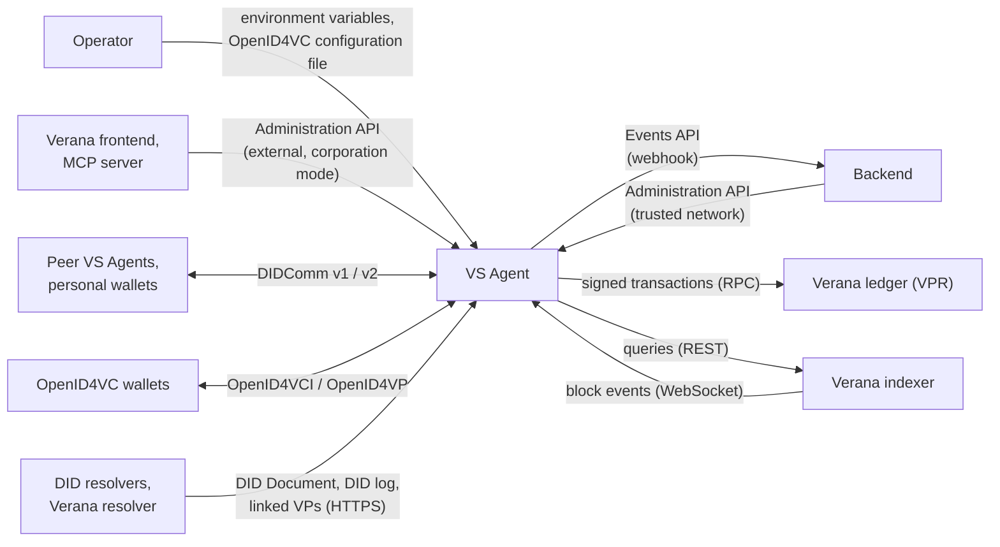
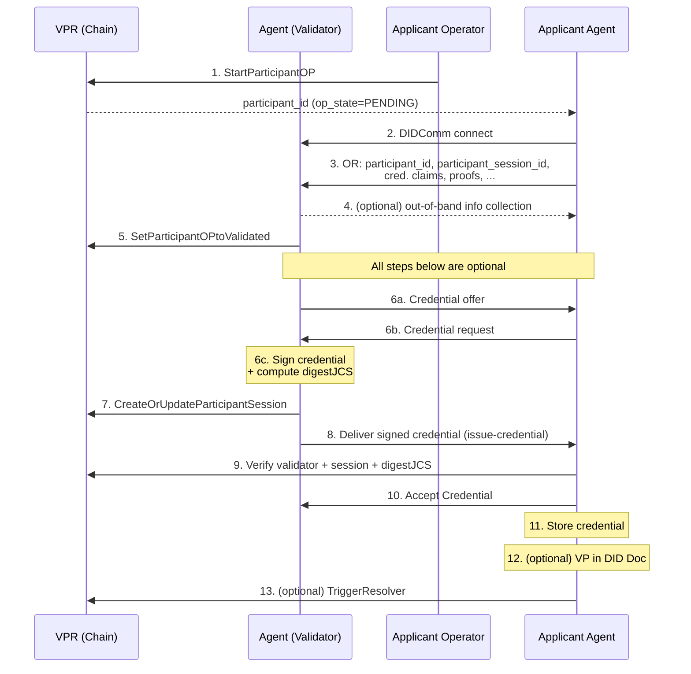
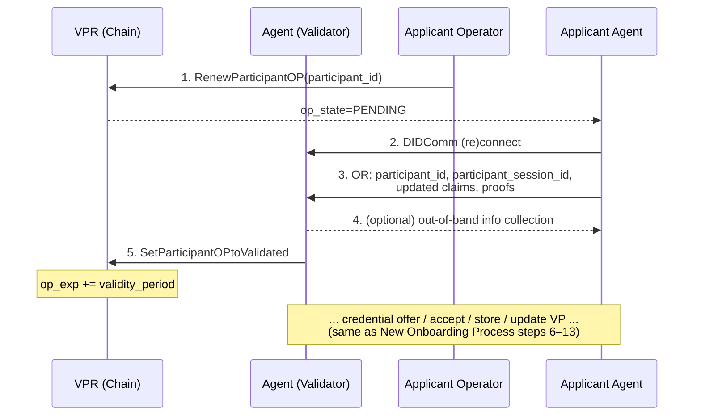
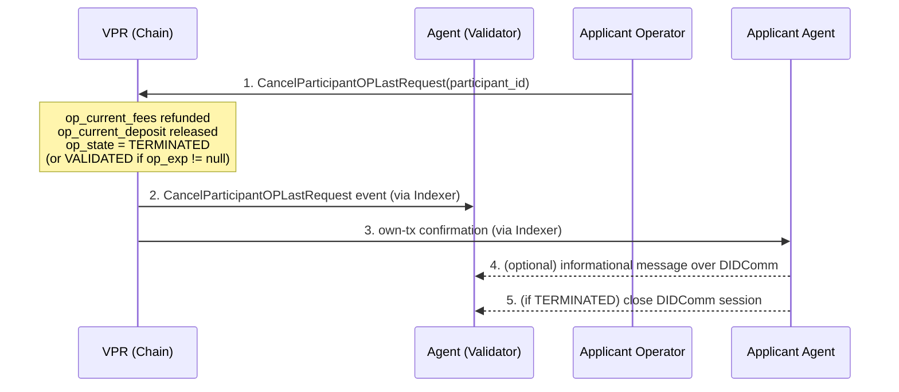
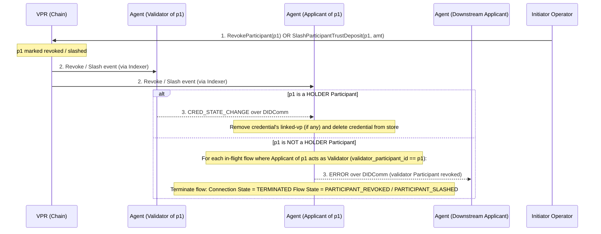
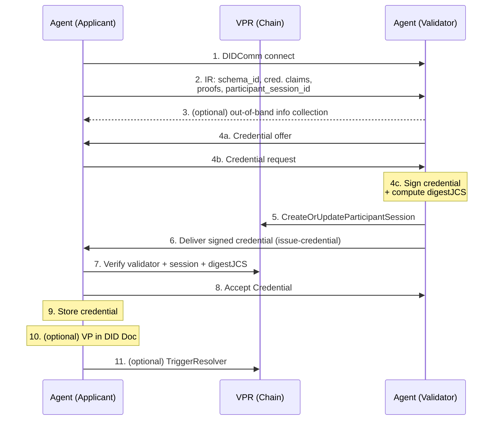
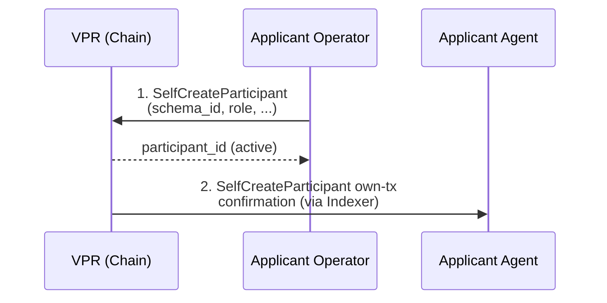
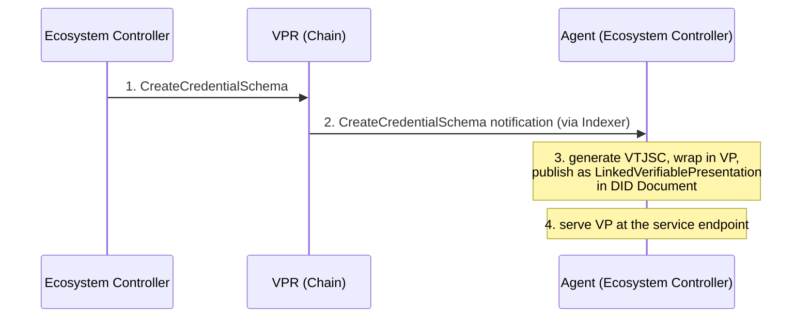

# VS Agent v4 Specification

**Latest Draft:** spec v4-draft11

## Abstract

The **VS Agent** is a container that provides the full stack required to operate a Verifiable Service. It bundles, in a single deployable unit:

- **Decentralized identity** — a resolvable DID whose DID Document is signed by the agent's keys and attested by `LinkedVerifiablePresentation` entries wrapping W3C Verifiable Credentials Data Model credentials that establish the operator, purpose, and governance context of the service.
- **DIDComm stack** — a full DIDComm implementation for establishing secure agent-to-agent communication channels with any other DIDComm-compatible peer.
- **Service endpoint declaration** — publishing one or more concrete service endpoints (DIDComm messaging, MCP, A2A, HTTP / website, and similar) in the agent's DID Document under a single resolvable DID.
- **Service bootstrap over DIDComm** — an initial exchange over the DIDComm channel through which peers obtain the credentials, access tokens, or configuration needed to consume any of the declared service endpoints.

By combining these components, the VS Agent allows backends to expose identified, verifiable, and governance-aware services without implementing DID resolution, credential lifecycle management, DIDComm encryption, or trust-layer integration themselves. The VS Agent is intentionally service-shape-agnostic: conversational chatbots integrated with messaging applications such as the [Hologram Messaging App](https://hologram.chat) are one of several deployment patterns, alongside MCP tool servers, A2A agents, and plain HTTP APIs.

This document specifies the normative behavior of a VS Agent implementation: its container configuration and bootstrap, its DID Document management, its credential acquisition and issuance flows, its indexer subscription and event model, its administration API, its events API, and its conformance to the Verifiable Trust specification.

## About this Document

In order to fully understand the concepts developed in this document, you should have some basic knowledge of DID, DIDComm, AnonCreds, the Verifiable Trust model, and the [ToIP stack](https://www.trustoverip.org/toip-model/). All terms used in this specification are defined in the [Terminology](#terminology) section.

**Version axes.** Three version numbers appear around the VS Agent, and they move independently. The `v4` of this document is the Verana release its specification belongs to, shared by every component specification under `v4/`. The `/v2` prefix of the Administration API is the version of that API alone. An implementation carries its own version, for example `vs-agent 2.0.0`. Prose that names a version names its axis: "Verana v4", "Administration API v2", "vs-agent 2.x".

### Audience

This document has three audiences, and is written so that each one can use it on its own:

- **Implementors**, human or automated, who build a VS Agent in any language and on any stack. The document describes the agent by its interfaces and its observable behavior. It specifies an internal procedure only where a peer, a caller, the VPR, or a conformance test observes the outcome of that procedure.
- **Integrators**, who build a backend against the [Administration API](#administration-api) and the [Events API](#events-api), and operators who deploy and configure the container.
- **Conformance test suites**, which enumerate the requirements of [Appendix A](#appendix-a-requirement-index) and exercise each one through one of the interfaces of the [Interface Inventory](#interface-inventory).

### Requirement identifiers

Each normative section carries an identifier in brackets in its heading, of the form `VSA-<AREA>-<SECTION>`, for example `[VSA-VTI-CFG-ENV]`. A section that numbers its statements individually appends an ordinal to that identifier: `[VSA-EVT-DEL-3]` is the third statement of [[VSA-EVT-DEL]](#vsa-evt-del-delivery). An identifier is stable across the revisions of this document: a requirement that a revision removes leaves its identifier unused, and a requirement that a revision adds takes a new identifier.

A row of a normative table is addressable by the identifier of its section and the value of its key column: the variable name in a configuration table, the `event_type` in a notification table, the event `type` in the event catalog, the method name in a method table.

[Appendix A](#appendix-a-requirement-index) lists every identifier of this document.

### Normative and non-normative content

A section is normative unless its first paragraph states otherwise. Within a normative section, the examples, the diagrams, the captions, and the notes set as block quotes are non-normative.

### Specification templates

Each method of the [Administration API](#administration-api) is described with the same fields, in this order: a one-sentence purpose, **Path parameters**, **Inputs**, **Output**, **Requirements**, **Errors**, and **Events** — the types of the [Event Catalog](#vsa-evt-cat-event-catalog) that the method can cause the agent to emit. A field that does not apply to a method is omitted.

Each behavior of [Agent Lifecycle](#agent-lifecycle) and [Verifiable Trust Behaviors](#verifiable-trust-behaviors) is described with its trigger, its preconditions, its steps — numbered, each one naming the actor that performs it — its resulting state changes, and its error conditions.

### [VSA-OVR-DT] Datetime encoding

This specification inherits the datetime encoding constraint of the [Indexer v4 Specification § Datetime encoding](../verana-indexer/spec.md#datetime-encoding): unless a field states otherwise, every datetime value that the agent emits — in an Administration API body, in an event envelope, in a log line — MUST be an ISO 8601 / RFC 3339 datetime string in UTC with the trailing `Z` designator.

## Conformance

As well as sections marked as non-normative, all authoring guidelines, diagrams, examples, and notes in this specification are non-normative. Everything else in this specification is normative.

The key words MAY, MUST, MUST NOT, OPTIONAL, RECOMMENDED, REQUIRED, SHOULD, and SHOULD NOT in this document are to be interpreted as described in [BCP 14](https://datatracker.ietf.org/doc/html/bcp14) [RFC2119](https://w3c.github.io/vc-data-model/#bib-rfc2119) [RFC8174](https://w3c.github.io/vc-data-model/#bib-rfc8174) when, and only when, they appear in all capitals, as shown here.

### Conformance targets

A conforming VS Agent implements every requirement of this document that is not scoped to one of the optional features below. For an optional feature, a conforming agent MUST implement every requirement of the feature when the feature is enabled, and MUST behave as the section of the feature prescribes when it is disabled.

| Feature | Enabled by | Sections scoped to the feature |
|---|---|---|
| External access to the Administration API | `ADMIN_API_AUTH_MODE` = `corporation` | [[VSA-ADM-AUTH-PROTO]](#vsa-adm-auth-proto-account-challengeresponse), [[VSA-ADM-AUTH]](#vsa-adm-auth-authentication) |
| Events API | `EVENTS_WEBHOOK_URL` set | [Events API](#events-api) |
| OpenID4VC | `OID4VC_CONFIG_FILE_LOCATION` set | [[VSA-PUB-OID]](#vsa-pub-oid-openid4vc-public-protocol-endpoints), [[VSA-ADM-OID-CE]](#vsa-adm-oid-ce-credential-exchanges), [[VSA-ADM-OID-PR]](#vsa-adm-oid-pr-presentations), [[VSA-ADM-OID-CS]](#vsa-adm-oid-cs-signing-certificates), [[VSA-VTI-FLOW-VERIFY-OID]](#vsa-vti-flow-verify-oid-openid4vp-trust-decision) |
| Optional DIDComm modules | Deployment choice, reported by [`listProtocols`](#vsa-adm-dc-proto-list-listprotocols) | [[VSA-ADM-DC-RC]](#vsa-adm-dc-rc-receipts), [[VSA-ADM-DC-RA]](#vsa-adm-dc-ra-reactions), [[VSA-ADM-DC-UP]](#vsa-adm-dc-up-user-profile), [[VSA-ADM-DC-MS]](#vsa-adm-dc-ms-media-sharing), [[VSA-ADM-DC-CL]](#vsa-adm-dc-cl-calls), [[VSA-ADM-DC-AM]](#vsa-adm-dc-am-action-menu), [[VSA-ADM-DC-QA]](#vsa-adm-dc-qa-question-answer), [[VSA-ADM-DC-MRTD]](#vsa-adm-dc-mrtd-mrtd) |
| Extension protocol modules | Deployment choice | [[VSA-ADM-DC-EXT]](#vsa-adm-dc-ext-extension-protocol-modules) |

Every other section applies to every conforming agent. [Protocol Modules](#vsa-dc-mod-protocol-modules) names the DIDComm modules that are REQUIRED.

## Terminology

- **Applicant** — In a credential acquisition flow, the peer that requests a `Participant` entry or a credential, and that initiates the DIDComm connection to the Validator.
- **AnonCreds** — Anonymous Credentials, a privacy-preserving verifiable credential format supporting selective disclosure and unlinkability.
- **Backend** — The application that a VS Agent serves. It calls the [Administration API](#administration-api) and consumes the [Events API](#events-api).
- **capability (OpenID4VC)** — One of the two OpenID4VC roles that the agent runs: issuer or verifier.
- **Corporation, Ecosystem, Credential Schema, Participant, Participant Session, Onboarding Process** — The VPR entities and processes, as the [Verifiable Trust VPR specification](https://github.com/verana-labs/verifiable-trust-vpr-spec) defines them. See [Corporation and Account Model](#corporation-and-account-model).
- **decentralized identifier (DID, DIDs)** — A decentralized identifier, as specified in [DID-CORE](https://www.w3.org/TR/did-core/).
- **DIDComm** — A peer-to-peer messaging protocol built on DIDs, as specified by the [DIDComm Messaging Specification](https://identity.foundation/didcomm-messaging/spec/).
- **Essential Credential Schema (ECS)** — One of the credential schemas that the Verifiable Trust specification requires a Verifiable Service to hold or to issue: ECS-Organization, ECS-Persona, ECS-Service.
- **external request, trusted-network request** — The two classes of Administration API requests, per [Trusted networks](#vsa-adm-access-net-trusted-networks).
- **flow (credential acquisition flow)** — One execution of an Onboarding Process or of a Credential Direct Issuance between an Applicant and a Validator, tracked by the agent as a flow record.
- **Operator** — The party that deploys the container and supplies its [configuration](#vsa-vti-cfg-configuration).
- **Validator** — In a credential acquisition flow, the peer that validates the Applicant, sets its `Participant` entry to `VALIDATED` on the VPR when an Onboarding Process is involved, and issues the credential.
- **Verifiable Public Registry (VPR, VPRs)** — A decentralized registry used to publish and resolve trust-related resources (Corporations, Ecosystems, Credential Schemas, Participants, Governance Frameworks, etc.), as specified by the [Verifiable Trust VPR specification](https://github.com/verana-labs/verifiable-trust-vpr-spec).
- **Verifiable Service (Verifiable Services)** — A service that identifies its operator, purpose, and governance context through verifiable credentials, as defined in the [Verifiable Trust specification](https://github.com/verana-labs/verifiable-trust-spec).
- **Verifiable Trust** — The open, decentralized trust layer specified at [verana-labs/verifiable-trust-spec](https://github.com/verana-labs/verifiable-trust-spec).
- **VS Agent** — The runtime component specified by this document, which hosts a Verifiable Service and exposes a REST API and event model to backend implementations.
- **VTJSC, Verifiable Trust JSON Schema Credential** — A W3C `JsonSchemaCredential` issued by an Ecosystem DID that references a `CredentialSchema` entry in a Verifiable Public Registry, cryptographically binding that schema to the Ecosystem in which it is defined. Specified in [VT-JSON-SCHEMA-CRED-W3C](https://github.com/verana-labs/verifiable-trust-spec/blob/main/spec.md#vt-json-schema-cred-w3c-verifiable-trust-json-schema-credential) of the Verifiable Trust Specification.
- **W3C Verifiable Credentials Data Model (W3C VC Data Model)** — The W3C Recommendation defining a standard data model for verifiable credentials, as specified in [W3C Verifiable Credentials Data Model v2.0](https://www.w3.org/TR/vc-data-model/).

## System Overview

*This section is non-normative.*

### Purpose and Deployment Unit

A VS Agent is one container. It holds one DID, one Verana account (its `vs_operator`), and belongs to one Corporation of the VPR. A backend pairs with the agent: the backend implements the business logic of the service, and the agent implements everything that makes the service verifiable — the DID and its DID Document, the credentials that accredit the service, the DIDComm and OpenID4VC channels, and the reaction to the on-chain state of the Verifiable Public Registry.

The agent is service-shape-agnostic. The backend can be a chatbot integrated with a messaging application, an MCP tool server, an A2A agent, or a plain HTTP API: the agent declares the endpoints of the backend in its DID Document, and the backend drives the agent through the [Administration API](#administration-api) and observes it through the [Events API](#events-api).

### System Context



*Figure 1 — System context. Each arrow is one of the interfaces of the [Interface Inventory](#interface-inventory).*

Resources created in a VPR (like the Verana ledger) are linked to DIDs that represent VS Agents. For this reason, a VS Agent receives notifications of changes in the ledger that are directly or indirectly linked to its DID, and updates its state accordingly.

**Examples:**

- **Ecosystem schema addition** — A new `CredentialSchema` is created in an Ecosystem. The VS Agent whose DID is the Ecosystem's `did` is notified and automatically generates the corresponding VTJSC, publishing it as a `LinkedVerifiablePresentation` in its DID Document.
- **Onboarding process lifecycle** — An applicant initiates an Onboarding Process to obtain a HOLDER `Participant` entry from an ISSUER for a given Credential Schema. The applicant creates the on-chain `Participant` entry (with `op_state = PENDING`) on the Verana ledger. The VS Agents of both applicant and validator (ISSUER) are notified and begin a userland onboarding flow over DIDComm. As the on-chain `Participant` state changes, the respective VS Agents receive further notifications and execute follow-up tasks (e.g., continuing the DIDComm exchange, issuing the credential).

Additionally, a Corporation controller needs to remotely query and manage the state of its VS Agents directly from the Verana frontend. To enable this, each VS Agent exposes a secure Administration API accessible to Verana accounts that have been granted administrative rights over the agent by the Corporation.

### Interface Inventory

| Interface | Counterpart | Direction | Transport | Section |
|---|---|---|---|---|
| Configuration | Operator | Inbound, at startup | Environment variables, one JSON file | [[VSA-VTI-CFG]](#vsa-vti-cfg-configuration) |
| Public Endpoints | DID resolvers, AnonCreds holders and verifiers, OpenID4VC wallets, DIDComm peers | Inbound | HTTPS under `PUBLIC_API_BASE_URL` | [Public Endpoints](#public-endpoints) |
| DIDComm | Peer VS Agents, personal wallets | Both | DIDComm v1 and v2 | [DIDComm Interface](#didcomm-interface) |
| Administration API | Backend; Verana frontend and MCP server in `corporation` mode | Inbound | REST / JSON | [Administration API](#administration-api) |
| Events API | Backend | Outbound | HTTP `POST` webhook | [Events API](#events-api) |
| VPR | Verana ledger | Outbound | Cosmos SDK RPC, signed transactions | [[VSA-VPR-TX]](#vsa-vpr-tx-on-chain-transactions) |
| Indexer | Verana indexer | Outbound: one subscription, queries | WebSocket, REST | [[VSA-VTI-NOTIF]](#vsa-vti-notif-notifications), [[VSA-VPR-QRY]](#vsa-vpr-qry-indexer-queries) |

### Corporation and Account Model

#### [VSA-VTI-CORP] Corporation

*This section is not normative.*

As defined in the [VPR Specification v4](https://verana-labs.github.io/verifiable-trust-vpr-spec/#corporation):

> A `Corporation` is the VPR-level entity representing an authority that acts in the registry. It carries a DID, a governance framework, and lifecycle attributes, and is anchored on-chain by a `policy_address` account that signs on its behalf. A Corporation may control [[ref: participants]] in zero or more [[ref: ecosystems]] and may itself be the controller of zero or more [[ref: ecosystems]].

A `Corporation` has, among other fields:

- `id` (uint64) — server-assigned, globally unique primary key.
- `policy_address` (account) — globally unique cosmos account that signs Msgs on behalf of the Corporation (typically a Cosmos SDK `group_policy_address`).
- `did` (string) — globally unique DID of the Corporation; the same DID MUST NOT be `Corporation.did` of two distinct Corporation entries.
- `language`, `active_version`.

Resources in the VPR (Ecosystems, Credential Schemas, Participants, Participant Sessions, Trust Deposits, Authorizations, Fee Grants) are owned by a Corporation, not by individual accounts. Individual Verana accounts operate on behalf of a Corporation through delegated authorizations (see [[AUTHZ-CHECK-1]] and [[AUTHZ-CHECK-3]] in the VPR specification).

The `VERANA_CORPORATION_ID` environment variable identifies the Corporation this agent belongs to (by its `id`, uint64). The agent SHOULD resolve the rest of the Corporation entry — `policy_address`, `did`, `active_version` — from the indexer at startup.

#### [VSA-VTI-CORP-OPERATOR] Agent Account (vs_operator)

The agent's Verana account, derived from `VERANA_ACCOUNT_MNEMONIC`, acts as the `vs_operator` for on-chain operations. Each `Participant` entry the agent operates on carries a `vs_operator` field (see [[Participant]](https://verana-labs.github.io/verifiable-trust-vpr-spec/#participant)) that MUST equal the agent's account.

#### [VSA-VTI-CORP-AUTHZ] Agent Account Authorizations

The `vs_operator` account should have been granted appropriate authorizations by the `VERANA_CORPORATION_ID` Corporation:

recommended:

- **`VSOperatorAuthorization`** (see [[VSOperatorAuthorization]](https://verana-labs.github.io/verifiable-trust-vpr-spec/#vsoperatorauthorization) and [[ParticipantAuthorizationRecord]](https://verana-labs.github.io/verifiable-trust-vpr-spec/#participantauthorizationrecord)): groups one or more `ParticipantAuthorizationRecord` entries, each keyed by `participant_id`, that grant the agent the right to execute, on behalf of the Corporation and in the context of that specific `Participant`, the message types declared in `record.msg_types` (typically `CreateOrUpdateParticipantSession`, `TriggerResolver`, `SetParticipantOPtoValidated`). See [[AUTHZ-CHECK-3]](https://verana-labs.github.io/verifiable-trust-vpr-spec/#authz-check-3-vs-operator-authorization-checks).
  - If `record.with_feegrant` is `true` for the relevant `Participant`, the Corporation's `policy_address` covers transaction fees via an on-chain `FeeGrant` and the agent account does not need to be independently funded.
  - If `record.with_feegrant` is `false`, the agent account MUST have sufficient balance to pay transaction fees.

> If no `VSOperatorAuthorization` record exists for a `Participant`, the VS Agent MUST have VNA balance in its `vs_operator` account to cover transaction and trust fees, and the Corporation `policy_address` MUST co-sign every message that targets that `Participant`.

### Operating Modes and Feature Switches

The behavior of the agent depends on a small number of configuration choices. Each one is normative in its own section; this table locates them.

| Choice | Variable | Values | Effect |
|---|---|---|---|
| ECS mode | `AGENT_MODE` | `standalone` (default), `delegated` | Whether the agent holds its own ECS-Organization or ECS-Persona credential and issues its own Service credential, or a parent Verifiable Service issues its Service credential. See [ECS Participants and Credentials](#vsa-vti-ecs-ecs-participants-and-credentials). |
| Admin API access | `ADMIN_API_AUTH_MODE` | `internal` (default), `corporation` | Whether external callers reach the Administration API at all. See [Trusted networks](#vsa-adm-access-net-trusted-networks). |
| DID method | `AGENT_PUBLIC_DID_METHOD` | `webvh` (default), `web` | The method of the DID the agent creates on first startup. See [[VSA-VTI-BOOT-DID]](#vsa-vti-boot-did-did-creation). |
| Indexer scope | `VERANA_INDEXER_SUBSCRIPTION_SCOPE` | `did` (default), `corporation` | Whether the agent observes its own DID only, or every resource of its Corporation. See [[VSA-VTI-NOTIF]](#vsa-vti-notif-notifications). |
| Events API | `EVENTS_WEBHOOK_URL` | unset (default), URL | Whether the agent delivers events. See [Events API](#events-api). |
| OpenID4VC | `OID4VC_CONFIG_FILE_LOCATION` | unset (default), local path or `https://` URL | Whether the agent serves the OpenID4VC capabilities. See [[VSA-VTI-CFG-ENV-OID]](#vsa-vti-cfg-env-oid-openid4vc). |
| Optional DIDComm modules | none; deployment choice | — | Which optional protocol modules the deployment serves. See [Protocol Modules](#vsa-dc-mod-protocol-modules). |

## [VSA-VTI-CFG] Configuration

### [VSA-VTI-CFG-ENV] Container Environment Variables

The table lists every environment variable of the VS Agent container. The subsection of each variable is normative.

| Variable | Required | Group |
|---|---|---|
| [`VERANA_CORPORATION_ID`](#vsa-vti-cfg-env-id-identity-and-corporation) | REQUIRED | Identity and Corporation |
| [`VERANA_ACCOUNT_MNEMONIC`](#vsa-vti-cfg-env-id-identity-and-corporation) | REQUIRED | Identity and Corporation |
| [`VERANA_RPC_ENDPOINT_URL`](#vsa-vti-cfg-env-net-network-configuration) | REQUIRED | Network Configuration |
| [`VERANA_INDEXER_BASE_URL`](#vsa-vti-cfg-env-net-network-configuration) | REQUIRED | Network Configuration |
| [`VERANA_CHAIN_ID`](#vsa-vti-cfg-env-net-network-configuration) | OPTIONAL | Network Configuration |
| [`VERANA_INDEXER_SUBSCRIPTION_SCOPE`](#vsa-vti-cfg-env-net-network-configuration) | OPTIONAL | Network Configuration |
| [`VERANA_INDEXER_DEFAULT_HANDLERS_OVERRIDE`](#vsa-vti-cfg-env-net-network-configuration) | OPTIONAL | Network Configuration |
| [`VERANA_GAS_ADJUSTMENT`](#vsa-vti-cfg-env-net-network-configuration) | OPTIONAL | Network Configuration |
| [`VERANA_AUTO_TRIGGER_RESOLVER`](#vsa-vti-cfg-env-net-network-configuration) | OPTIONAL | Network Configuration |
| [`AGENT_MODE`](#vsa-vti-cfg-env-mode-agent-configuration-mode) | OPTIONAL | Agent Configuration Mode |
| [`AGENT_DELEGATED_PARENT_VS_DID`](#vsa-vti-cfg-env-mode-agent-configuration-mode) | CONDITIONAL | Agent Configuration Mode |
| [`TRUSTED_ECS_ECOSYSTEM_DIDS`](#vsa-vti-cfg-env-mode-agent-configuration-mode) | CONDITIONAL | Agent Configuration Mode |
| [`ECS_CLAIMS_ORG_NAME`](#vsa-vti-cfg-env-ecs-ecs-credential-claims) | OPTIONAL | ECS Credential Claims |
| [`ECS_CLAIMS_ORG_LOGO_URI`](#vsa-vti-cfg-env-ecs-ecs-credential-claims) | OPTIONAL | ECS Credential Claims |
| [`ECS_CLAIMS_ORG_REGISTRY_ID`](#vsa-vti-cfg-env-ecs-ecs-credential-claims) | OPTIONAL | ECS Credential Claims |
| [`ECS_CLAIMS_ORG_REGISTRY_URI`](#vsa-vti-cfg-env-ecs-ecs-credential-claims) | OPTIONAL | ECS Credential Claims |
| [`ECS_CLAIMS_ORG_ADDRESS`](#vsa-vti-cfg-env-ecs-ecs-credential-claims) | OPTIONAL | ECS Credential Claims |
| [`ECS_CLAIMS_ORG_COUNTRY_CODE`](#vsa-vti-cfg-env-ecs-ecs-credential-claims) | OPTIONAL | ECS Credential Claims |
| [`ECS_CLAIMS_ORG_LEGAL_JURISDICTION`](#vsa-vti-cfg-env-ecs-ecs-credential-claims) | OPTIONAL | ECS Credential Claims |
| [`ECS_CLAIMS_ORG_ORGANIZATION_KIND`](#vsa-vti-cfg-env-ecs-ecs-credential-claims) | OPTIONAL | ECS Credential Claims |
| [`ECS_CLAIMS_ORG_LEI`](#vsa-vti-cfg-env-ecs-ecs-credential-claims) | OPTIONAL | ECS Credential Claims |
| [`ECS_CLAIMS_PERSONA_NAME`](#vsa-vti-cfg-env-ecs-ecs-credential-claims) | OPTIONAL | ECS Credential Claims |
| [`ECS_CLAIMS_PERSONA_DESCRIPTION`](#vsa-vti-cfg-env-ecs-ecs-credential-claims) | OPTIONAL | ECS Credential Claims |
| [`ECS_CLAIMS_PERSONA_DESCRIPTION_FORMAT`](#vsa-vti-cfg-env-ecs-ecs-credential-claims) | OPTIONAL | ECS Credential Claims |
| [`ECS_CLAIMS_PERSONA_AVATAR_URI`](#vsa-vti-cfg-env-ecs-ecs-credential-claims) | OPTIONAL | ECS Credential Claims |
| [`ECS_CLAIMS_PERSONA_CONTROLLER_COUNTRY_CODE`](#vsa-vti-cfg-env-ecs-ecs-credential-claims) | OPTIONAL | ECS Credential Claims |
| [`ECS_CLAIMS_PERSONA_CONTROLLER_JURISDICTION`](#vsa-vti-cfg-env-ecs-ecs-credential-claims) | OPTIONAL | ECS Credential Claims |
| [`ECS_CLAIMS_SERVICE_NAME`](#vsa-vti-cfg-env-ecs-ecs-credential-claims) | CONDITIONAL | ECS Credential Claims |
| [`ECS_CLAIMS_SERVICE_TYPE`](#vsa-vti-cfg-env-ecs-ecs-credential-claims) | CONDITIONAL | ECS Credential Claims |
| [`ECS_CLAIMS_SERVICE_DESCRIPTION`](#vsa-vti-cfg-env-ecs-ecs-credential-claims) | CONDITIONAL | ECS Credential Claims |
| [`ECS_CLAIMS_SERVICE_DESCRIPTION_FORMAT`](#vsa-vti-cfg-env-ecs-ecs-credential-claims) | OPTIONAL | ECS Credential Claims |
| [`ECS_CLAIMS_SERVICE_LOGO_URI`](#vsa-vti-cfg-env-ecs-ecs-credential-claims) | CONDITIONAL | ECS Credential Claims |
| [`ECS_CLAIMS_SERVICE_MINIMUM_AGE_REQUIRED`](#vsa-vti-cfg-env-ecs-ecs-credential-claims) | CONDITIONAL | ECS Credential Claims |
| [`ECS_CLAIMS_SERVICE_TERMS_AND_CONDITIONS_URI`](#vsa-vti-cfg-env-ecs-ecs-credential-claims) | CONDITIONAL | ECS Credential Claims |
| [`ECS_CLAIMS_SERVICE_PRIVACY_POLICY_URI`](#vsa-vti-cfg-env-ecs-ecs-credential-claims) | CONDITIONAL | ECS Credential Claims |
| [`PUBLIC_API_BASE_URL`](#vsa-vti-cfg-env-rt-agent-runtime) | REQUIRED | Agent Runtime |
| [`PUBLIC_API_PORT`](#vsa-vti-cfg-env-rt-agent-runtime) | OPTIONAL | Agent Runtime |
| [`AGENT_PUBLIC_DID_METHOD`](#vsa-vti-cfg-env-rt-agent-runtime) | OPTIONAL | Agent Runtime |
| [`MRTD_MASTER_LIST_CSCA_LOCATION`](#vsa-vti-cfg-env-rt-agent-runtime) | OPTIONAL | Agent Runtime |
| [`ADMIN_API_PORT`](#vsa-vti-cfg-env-adm-administration-api) | OPTIONAL | Administration API |
| [`ADMIN_API_AUTH_MODE`](#vsa-vti-cfg-env-adm-administration-api) | OPTIONAL | Administration API |
| [`ADMIN_API_TRUSTED_NETWORKS`](#vsa-vti-cfg-env-adm-administration-api) | OPTIONAL | Administration API |
| [`ADMIN_API_PUBLIC_URL`](#vsa-vti-cfg-env-adm-administration-api) | CONDITIONAL | Administration API |
| [`ADMIN_API_CORPORATION_ALLOWED_ACCOUNTS`](#vsa-vti-cfg-env-adm-administration-api) | CONDITIONAL | Administration API |
| [`EVENTS_WEBHOOK_URL`](#vsa-vti-cfg-env-evt-events-api) | OPTIONAL | Events API |
| [`EVENTS_WEBHOOK_API_KEY`](#vsa-vti-cfg-env-evt-events-api) | OPTIONAL | Events API |
| [`OID4VC_CONFIG_FILE_LOCATION`](#vsa-vti-cfg-env-oid-openid4vc) | OPTIONAL | OpenID4VC |
| [`AGENT_LOG_LEVEL`](#vsa-vti-cfg-env-log-logging) | OPTIONAL | Logging |
| [`ADMIN_API_LOG_LEVEL`](#vsa-vti-cfg-env-log-logging) | OPTIONAL | Logging |

#### [VSA-VTI-CFG-ENV-ID] Identity and Corporation

| Variable | Required | Description |
|---|---|---|
| `VERANA_CORPORATION_ID` | REQUIRED | The VPR `Corporation.id` (uint64) of the Corporation this agent belongs to. See [Corporation](#vsa-vti-corp-corporation). |
| `VERANA_ACCOUNT_MNEMONIC` | REQUIRED | BIP-39 mnemonic used to derive the agent's Verana blockchain account (the agent's `vs_operator`). See [Agent Account Authorizations](#vsa-vti-corp-authz-agent-account-authorizations) for the authorizations this account needs, and for the fallback mode when it has none. |

#### [VSA-VTI-CFG-ENV-NET] Network Configuration

| Variable | Required | Description |
|---|---|---|
| `VERANA_RPC_ENDPOINT_URL` | REQUIRED | Verana blockchain RPC endpoint URL (e.g., `https://rpc.testnet.verana.network`). |
| `VERANA_INDEXER_BASE_URL` | REQUIRED | Verana indexer API URL (e.g., `https://idx.testnet.verana.network`). |
| `VERANA_CHAIN_ID` | OPTIONAL | Chain ID. |
| `VERANA_INDEXER_SUBSCRIPTION_SCOPE` | OPTIONAL | Scope of the indexer subscription and of the REST catch-up: `did` (default) subscribes to the agent's own DID only, `corporation` subscribes to every event of `VERANA_CORPORATION_ID`. |
| `VERANA_INDEXER_DEFAULT_HANDLERS_OVERRIDE` | OPTIONAL | Comma-separated list of indexer `event_type` names whose default handler is disabled, or `*` for all of them. The operator sets it when a backend implements the reaction itself: the backend observes each chain event through the [`vpr.notification`](#vsa-evt-cat-event-catalog) event. State synchronisation is never affected. |
| `VERANA_GAS_ADJUSTMENT` | OPTIONAL | Multiplier the agent applies to the simulated gas of each transaction it signs. Default: `1.5`. A simulation signs with an empty signature and runs against the state of the moment, so it reports less gas than the delivery consumes; the multiplier covers that difference. Raise it when a transaction reports `out of gas` although its simulation succeeded. |
| `VERANA_AUTO_TRIGGER_RESOLVER` | OPTIONAL | Whether the agent sends `TriggerResolver` by itself after it publishes a credential or changes a service endpoint. Default: `true`. Set it to `false` when the operator triggers the resolver out of band. |

#### [VSA-VTI-CFG-ENV-MODE] Agent Configuration Mode

Agent mode depends on whether you want the agent to obtain an ECS-Organization or ECS-Persona credential (standalone): Verifiable Trust VS-REQ-3; or delegated Verifiable Trust VS-REQ-4.

See [comparison between VS-REQ-3 and VS-REQ-4](https://verana-labs.github.io/verifiable-trust-spec/#vs-req-verifiable-service-basic-requirements-and-linked-vps).

| Variable | Required | Description |
|---|---|---|
| `AGENT_MODE` | OPTIONAL | One of `standalone` or `delegated`. Default: `standalone`. See [ECS Standalone Mode](#vsa-vti-ecs-standalone-ecs-standalone-mode). |
| `AGENT_DELEGATED_PARENT_VS_DID` | CONDITIONAL | DID of the parent Verifiable Service that issues the Service credential of this agent. REQUIRED when `AGENT_MODE` = `delegated`. See [ECS Delegated Mode](#vsa-vti-ecs-delegated-ecs-delegated-mode). |
| `TRUSTED_ECS_ECOSYSTEM_DIDS` | CONDITIONAL | Comma-separated list of DIDs of the ECS Ecosystems the agent trusts for essential credential schemas, as required by [[WL-ECS]](https://verana-labs.github.io/verifiable-trust-spec/#wl-ecs-ecosystem-whitelists-and-vpr-scheme-resolution). REQUIRED when `AGENT_MODE` = `standalone`. |

#### [VSA-VTI-CFG-ENV-ECS] ECS Credential Claims

These variables carry the claims that the agent proposes for its own ECS credentials. The agent uses them in an onboarding process, and when it issues its own Service credential (see [ECS Participants and Credentials](#vsa-vti-ecs-ecs-participants-and-credentials)).

The agent derives the remaining claims of each schema, and reads no variable for them:

- `id`: the DID of the agent.
- `logoDigestSri`, `avatarDigestSri`, `termsAndConditionsDigestSri`, and `privacyPolicyDigestSri`: the agent fetches the resource at the paired URI claim and computes the digest of the response. The agent SHOULD retry a failed fetch, and SHOULD increase the delay between the attempts. When the fetch continues to fail, the agent MUST log a descriptive error that names the variable and the URI, and MUST stop the flow.

**ECS-Organization** ([VT-ECS-ORG-CRED-W3C]). The agent reads these variables in [ECS Standalone Mode](#vsa-vti-ecs-standalone-ecs-standalone-mode) only.

| Variable | Required | Claim |
|---|---|---|
| `ECS_CLAIMS_ORG_NAME` | OPTIONAL | `name` |
| `ECS_CLAIMS_ORG_LOGO_URI` | OPTIONAL | `logoUri` |
| `ECS_CLAIMS_ORG_REGISTRY_ID` | OPTIONAL | `registryId` |
| `ECS_CLAIMS_ORG_REGISTRY_URI` | OPTIONAL | `registryUri` |
| `ECS_CLAIMS_ORG_ADDRESS` | OPTIONAL | `address` |
| `ECS_CLAIMS_ORG_COUNTRY_CODE` | OPTIONAL | `countryCode` |
| `ECS_CLAIMS_ORG_LEGAL_JURISDICTION` | OPTIONAL | `legalJurisdiction` |
| `ECS_CLAIMS_ORG_ORGANIZATION_KIND` | OPTIONAL | `organizationKind` |
| `ECS_CLAIMS_ORG_LEI` | OPTIONAL | `lei` |

**ECS-Persona** ([VT-ECS-PERSONA-CRED-W3C]). The agent reads these variables in [ECS Standalone Mode](#vsa-vti-ecs-standalone-ecs-standalone-mode) only.

| Variable | Required | Claim |
|---|---|---|
| `ECS_CLAIMS_PERSONA_NAME` | OPTIONAL | `name` |
| `ECS_CLAIMS_PERSONA_DESCRIPTION` | OPTIONAL | `description` |
| `ECS_CLAIMS_PERSONA_DESCRIPTION_FORMAT` | OPTIONAL | `descriptionFormat` |
| `ECS_CLAIMS_PERSONA_AVATAR_URI` | OPTIONAL | `avatarUri` |
| `ECS_CLAIMS_PERSONA_CONTROLLER_COUNTRY_CODE` | OPTIONAL | `controllerCountryCode` |
| `ECS_CLAIMS_PERSONA_CONTROLLER_JURISDICTION` | OPTIONAL | `controllerJurisdiction` |

**ECS-Service** ([VT-ECS-SERVICE-CRED-W3C]). The agent issues this credential itself in [ECS Standalone Mode](#vsa-vti-ecs-standalone-ecs-standalone-mode), where no validator supplies a missing claim.

| Variable | Required | Claim |
|---|---|---|
| `ECS_CLAIMS_SERVICE_NAME` | CONDITIONAL. REQUIRED when `AGENT_MODE` = `standalone` | `name` |
| `ECS_CLAIMS_SERVICE_TYPE` | CONDITIONAL. REQUIRED when `AGENT_MODE` = `standalone` | `type` |
| `ECS_CLAIMS_SERVICE_DESCRIPTION` | CONDITIONAL. REQUIRED when `AGENT_MODE` = `standalone` | `description` |
| `ECS_CLAIMS_SERVICE_DESCRIPTION_FORMAT` | OPTIONAL | `descriptionFormat` |
| `ECS_CLAIMS_SERVICE_LOGO_URI` | CONDITIONAL. REQUIRED when `AGENT_MODE` = `standalone` | `logoUri` |
| `ECS_CLAIMS_SERVICE_MINIMUM_AGE_REQUIRED` | CONDITIONAL. REQUIRED when `AGENT_MODE` = `standalone` | `minimumAgeRequired` |
| `ECS_CLAIMS_SERVICE_TERMS_AND_CONDITIONS_URI` | CONDITIONAL. REQUIRED when `AGENT_MODE` = `standalone` | `termsAndConditionsUri` |
| `ECS_CLAIMS_SERVICE_PRIVACY_POLICY_URI` | CONDITIONAL. REQUIRED when `AGENT_MODE` = `standalone` | `privacyPolicyUri` |

#### [VSA-VTI-CFG-ENV-RT] Agent Runtime

| Variable | Required | Description |
|---|---|---|
| `PUBLIC_API_BASE_URL` | REQUIRED | Public `https://` base URL at which a peer reaches the public endpoints of the agent. The agent derives its DID from this value and composes each protocol URL from it verbatim. A base path is allowed. The agent MUST reject a URL that carries a username or a password. See [[VSA-VTI-BOOT-DID] DID Creation](#vsa-vti-boot-did-did-creation). |
| `PUBLIC_API_PORT` | OPTIONAL | TCP port on which the container serves the [public endpoints](#public-endpoints), the DIDComm inbound endpoint included. Default: `3001`. The deployment maps `PUBLIC_API_BASE_URL` to this port; the agent never derives a URL from it. |
| `AGENT_PUBLIC_DID_METHOD` | OPTIONAL | DID method the agent uses when it creates its DID on first startup: `webvh` (default) or `web`. The agent MUST reject any other value. See [[VSA-VTI-BOOT-DID] DID Creation](#vsa-vti-boot-did-did-creation). |
| `MRTD_MASTER_LIST_CSCA_LOCATION` | OPTIONAL | Local filesystem path, or `https://` URL, of the CSCA master list against which the [MRTD module](#vsa-adm-dc-mrtd-mrtd) verifies the Document Security Object of received eMRTD data. Has no effect when the deployment does not serve that module. |

#### [VSA-VTI-CFG-ENV-ADM] Administration API

These variables configure the listener and the access model of the [Administration API](#administration-api).

| Variable | Required | Description |
|---|---|---|
| `ADMIN_API_PORT` | OPTIONAL | TCP port on which the container serves the Administration API. Default: `3000`. It MUST differ from `PUBLIC_API_PORT`: the two listeners apply different access rules (see [Trusted networks](#vsa-adm-access-net-trusted-networks)). |
| `ADMIN_API_AUTH_MODE` | OPTIONAL | Single value selecting whether the agent accepts external requests: `internal` (default) or `corporation`. It applies to external requests only. See [Trusted networks](#vsa-adm-access-net-trusted-networks). |
| `ADMIN_API_TRUSTED_NETWORKS` | OPTIONAL | Comma-separated list of CIDR blocks. The agent classifies a request as trusted-network when the peer address of its TCP connection matches one block, and serves that request without authentication, in both modes. Default: `127.0.0.0/8,::1/128`. The operator MUST keep the source address of each public reverse proxy or ingress outside these blocks. See [Trusted networks](#vsa-adm-access-net-trusted-networks). |
| `ADMIN_API_PUBLIC_URL` | CONDITIONAL | Public `https://` origin (scheme + host + optional port, no trailing path) at which external callers reach the Admin API. REQUIRED when `ADMIN_API_AUTH_MODE` is `corporation`; MUST NOT be set otherwise. When set, the agent also publishes a `VsAgentAdminAPI` entry in its DID Document per [[VSA-VTI-DIDDOC]](#vsa-vti-diddoc-did-document-service-entries). |
| `ADMIN_API_CORPORATION_ALLOWED_ACCOUNTS` | CONDITIONAL | Comma-separated list of Verana account addresses (the same identifiers that authenticate via [Authentication](#vsa-adm-access-authn-authentication)) entitled to invoke the Admin API as external callers. REQUIRED (non-empty) when `ADMIN_API_AUTH_MODE` is `corporation`: with no on-chain caller grant to check (see [Authorization](#vsa-adm-access-authz-authorization)), this allowlist is the sole authorization mechanism for external callers. Has no effect when `ADMIN_API_AUTH_MODE` is not `corporation`. |

#### [VSA-VTI-CFG-ENV-EVT] Events API

`EVENTS_WEBHOOK_URL` is the switch for the [Events API](#events-api). The agent delivers events when, and only when, the operator sets it.

| Variable | Required | Description |
|---|---|---|
| `EVENTS_WEBHOOK_URL` | OPTIONAL | URL to which the agent delivers every event with HTTP `POST`. See [[VSA-EVT-DEL] Delivery](#vsa-evt-del-delivery). |
| `EVENTS_WEBHOOK_API_KEY` | OPTIONAL | Static secret. When the operator sets it, the agent sends it in the `Authorization: Bearer` header of every delivery. The operator SHOULD manage it as a secret. |

#### [VSA-VTI-CFG-ENV-OID] OpenID4VC

`OID4VC_CONFIG_FILE_LOCATION` is the switch for OpenID4VC. The agent serves the [OpenID4VC Scope](#openid4vc-scope) and the OpenID4VC public endpoints when, and only when, the operator sets it. When the operator sets it, the agent runs both OpenID4VC capabilities, issuer and verifier.

| Variable | Required | Description |
|---|---|---|
| `OID4VC_CONFIG_FILE_LOCATION` | OPTIONAL | Location of the OpenID4VC configuration file, a JSON document with the structure below: a local filesystem path, or an `https://` URL that the agent reads once at startup, as for `MRTD_MASTER_LIST_CSCA_LOCATION`. When the operator sets it, the agent enables OpenID4VC; when the operator leaves it unset, the agent serves no OpenID4VC path. The file can hold a private key, so the operator SHOULD manage it as a secret: a read-only mount, or a URL that only the agent reaches. |

The agent MUST read the file at startup, MUST validate it, and MUST refuse to start when it cannot read the location or when validation fails, including on a key that the table does not define. When the location is a URL, the agent MUST refuse any scheme other than `https`, MUST follow no redirect, and MUST NOT read the location again while it runs. Field names are camelCase (see [API Conventions](#vsa-adm-conv-api-conventions)).

Every key is OPTIONAL, and `{}` is a valid file. The file holds only what the agent cannot derive by itself, and nothing else: no credential type, because the agent takes its types from the `CredentialSchema` entries that the VPR authorizes it to issue (see the [OpenID4VC Scope](#openid4vc-scope)); no trust anchor and no host allowlist, because the agent decides trust through the same Verifiable Trust resolution that it uses for DIDComm (see [[VSA-VTI-FLOW-VERIFY-OID] OpenID4VP Trust Decision](#vsa-vti-flow-verify-oid-openid4vp-trust-decision)); and nothing about revocation, because v4 specifies no revocation for the credential format of this scope (see [[VSA-ADM-OID-CE] Credential Exchanges](#vsa-adm-oid-ce-credential-exchanges)).

| Key | Requirement |
|---|---|
| `issuer` | OPTIONAL. Holds, each OPTIONAL: `signing` (see below), `walletAttestationCertificates` (X.509 roots; when non-empty, the agent requires a wallet attestation), `keyAttestationCertificates` (X.509 roots; when absent, the agent neither advertises nor accepts the `attestation` proof type). |
| `verifier` | OPTIONAL. Holds an OPTIONAL `signing` (see below). |

The identifier segment of the issuer capability is `issuer`, and the identifier segment of the verifier capability is `verifier`, so the public paths of the two capabilities read `/oid4vci/issuer/...` and `/oid4vp/verifier/...`. The agent derives the display name and the logo that it publishes — `display` in its credential issuer metadata, `client_name` and `logo_uri` in its verifier client metadata — from the ECS Service credential that it holds about its own DID (`name` and `logoUri`, see [[VSA-VTI-ECS] ECS Participants and Credentials](#vsa-vti-ecs-ecs-participants-and-credentials)). In standalone mode those values are the `ECS_CLAIMS_SERVICE_NAME` and `ECS_CLAIMS_SERVICE_LOGO_URI` claims of [[VSA-VTI-CFG-ENV-ECS] ECS Credential Claims](#vsa-vti-cfg-env-ecs-ecs-credential-claims); in delegated mode the parent VS issues the credential. No key of the configuration file overrides them. The agent signs its credential issuer metadata with the certificate of the issuer capability (`x5c`).

The `signing` key of a capability is OPTIONAL, and selects one of two signing modes:

- **Development signing** (`signing` absent) — the agent generates and persists a self-signed P-256 certificate for the capability, with a common name derived from the host of `PUBLIC_API_BASE_URL` and from the capability, a DNS SAN derived from `PUBLIC_API_BASE_URL`, and a DID URI SAN that carries the DID of the agent. Before it completes startup, the agent MUST publish the resulting public key in its DID Document: under `assertionMethod` for the issuer capability, and under `authentication` for the verifier capability. The method identifier MUST be deterministic per capability, so that a restart is idempotent. When both capabilities share one DID, the agent MUST publish the two keys in sequence, so that it keeps both relationships. Development signing is unsuitable for production.
- **Configured signing** (`signing.configured`) — the operator supplies `certificateChain` (a non-self-signed leaf first, then any intermediate, then the root) and the `privateJwk` P-256 key of that leaf. Each leaf MUST carry the DID of the agent as a URI SAN. The agent MUST NOT publish a configured key itself; the operator publishes it under `assertionMethod` or `authentication` before startup.

#### [VSA-VTI-CFG-ENV-LOG] Logging

These variables set the verbosity of the two log streams of the agent. See [Observability](#observability) for the conditions the agent MUST log at each level.

| Variable | Required | Description |
|---|---|---|
| `AGENT_LOG_LEVEL` | OPTIONAL | Minimum level of the agent log: DIDComm, flows, indexer processing, DID and credential operations. One of `trace`, `debug`, `info`, `warn`, `error`, `off`. Default: `warn`. |
| `ADMIN_API_LOG_LEVEL` | OPTIONAL | Minimum level of the Administration API log: request handling and authentication. Same values. Default: `info`. |

The agent MUST reject any other value at step 1 of the [Bootstrap Sequence](#vsa-vti-boot-bootstrap-sequence). A level `off` silences the stream, the conditions of [Observability](#observability) included; an operator SHOULD NOT use it in production.

## Public Endpoints

The agent serves a public HTTPS surface under `PUBLIC_API_BASE_URL`. Every path of this section is reachable by any peer, with no authentication: DID resolvers read the DID Document and the DID log, verifiers dereference the linked presentations and the AnonCreds objects, DIDComm peers deliver messages, wallets follow invitation links and run their OpenID4VC traffic.

The table lists every public path family. A path is relative to `PUBLIC_API_BASE_URL`; when that URL carries a base path, the deployment forwards the base path to the agent or strips it in front of the agent, and the agent serves the same shape either way.

| Path family | Purpose | Served | Section |
|---|---|---|---|
| `/.well-known/did.json`, or `/did.json` under a base path | DID Document | Always | [[VSA-PUB-DID]](#vsa-pub-did-did-document-and-did-log) |
| `/.well-known/did.jsonl`, or `/did.jsonl` under a base path | DID log | `AGENT_PUBLIC_DID_METHOD` = `webvh` | [[VSA-PUB-DID]](#vsa-pub-did-did-document-and-did-log) |
| The `serviceEndpoint` of each `DIDCommMessaging` entry | Inbound DIDComm | Always | [[VSA-PUB-DIDCOMM]](#vsa-pub-didcomm-didcomm-inbound-endpoint) |
| The `serviceEndpoint` of each `LinkedVerifiablePresentation` entry; the `id` of each VTJSC; `/vt/vct/{credentialSchemaId}` | Verifiable Trust resources | Always | [[VSA-PUB-VT]](#vsa-pub-vt-verifiable-trust-resources) |
| The `serviceEndpoint` of the `AnonCredsRegistry` entry and the paths below it; the `tailsLocation` of each revocation registry | AnonCreds objects, did:web layout | `AGENT_PUBLIC_DID_METHOD` = `web` | [[VSA-PUB-AC]](#vsa-pub-ac-anoncreds-registry-resources) |
| `/resources/{resourceId}` | AnonCreds objects, did:webvh attested resources | `AGENT_PUBLIC_DID_METHOD` = `webvh` | [[VSA-PUB-AC]](#vsa-pub-ac-anoncreds-registry-resources) |
| The short URL that a method returns as `shortUrl` | Invitation resolution | When the agent supports short URLs | [[VSA-PUB-INV]](#vsa-pub-inv-invitation-parameters) |
| `/.well-known/openid-credential-issuer`, `/.well-known/oauth-authorization-server`, `/.well-known/jwt-vc-issuer`, `/oid4vci/…`, `/oid4vp/…` | OpenID4VC | `OID4VC_CONFIG_FILE_LOCATION` set | [[VSA-PUB-OID]](#vsa-pub-oid-openid4vc-public-protocol-endpoints) |

### [VSA-PUB-LISTENER] Public Listener

[VSA-PUB-LISTENER-1] The agent MUST serve every path of this section under `PUBLIC_API_BASE_URL`, and MUST compose each URL that it publishes for a peer — in its DID Document, in a credential, in an invitation, in OpenID4VC metadata — from that value verbatim, per [[VSA-VTI-CFG-ENV-RT]](#vsa-vti-cfg-env-rt-agent-runtime).

[VSA-PUB-LISTENER-2] The agent MUST answer a public path that this section does not define, or that belongs to a feature the deployment does not enable, with HTTP `404`.

[VSA-PUB-LISTENER-3] A peer discovers every public URL from a document the agent publishes — the DID Document, a credential, an invitation, OpenID4VC metadata — or from an Administration API response. Where this section fixes a path, the agent MUST serve it at that path. Where this section leaves the path to the agent, a peer MUST follow the published URL and MUST NOT construct it.

### [VSA-PUB-DID] DID Document and DID Log

[VSA-PUB-DID-1] The agent MUST serve its DID Document at the location that [DID-WEB](https://w3c-ccg.github.io/did-method-web/) resolves from its DID location (see [[VSA-VTI-BOOT-DID]](#vsa-vti-boot-did-did-creation)): `/.well-known/did.json` when `PUBLIC_API_BASE_URL` carries no path, and `<path>/did.json` when it carries one. The agent MUST answer the other of these two paths with HTTP `404`, so that a deployment answers on one shape.

[VSA-PUB-DID-2] The agent MUST serve each Verifiable Presentation that a `LinkedVerifiablePresentation` entry of its DID Document references at the `serviceEndpoint` of that entry, so that any wallet, issuer, or verifier that resolves the DID can retrieve and verify the presentation. See [[VSA-PUB-VT]](#vsa-pub-vt-verifiable-trust-resources) for the content.

[VSA-PUB-DID-3] The agent MUST publish an updated DID Document each time one of its service entries changes — through [[VSA-ADM-VT-SE]](#vsa-adm-vt-se-service-endpoint-management), through [Linked VP Management](#vsa-vt-lvp-linked-vp-management), through [[VSA-VTI-VTJSC]](#vsa-vti-vtjsc-vtjsc-management), or through a change of `ADMIN_API_PUBLIC_URL` — and a peer that resolves the DID MUST NOT observe a partial DID Document at any time.

[VSA-PUB-DID-4] When `AGENT_PUBLIC_DID_METHOD` is `webvh`, the agent MUST serve its DID log at `did.jsonl` beside `did.json`, as [DID-WEBVH](https://identity.foundation/didwebvh/) defines it, and MUST serve, at `did.json`, the parallel `did:web` DID Document that [DID-WEBVH § Publishing a Parallel did:web DID](https://identity.foundation/didwebvh/v1.0/#publishing-a-parallel-didweb-did) defines. The parallel document is the form that a peer which does not resolve `did:webvh` uses, and the form that the `useLegacyDid` [invitation parameter](#vsa-pub-inv-invitation-parameters) advertises.

[VSA-PUB-DID-5] The agent SHOULD send `Cache-Control: no-cache` with the DID Document and with the DID log. Both change while the agent runs — a new linked presentation, a new service entry, a new log entry — and a resolver that caches them observes a stale trust state.

### [VSA-VTI-DIDDOC] DID Document Service Entries

The DID Document of the agent carries the kinds of service entry below. The agent maintains every kind itself, except the consumable entries, which a caller manages through the Administration API.

| `type` | Required by | Maintained by | Mutable through [[VSA-ADM-VT-SE]](#vsa-adm-vt-se-service-endpoint-management) |
|---|---|---|---|
| `DIDCommMessaging` | [[VS-SVC-2]](https://verana-labs.github.io/verifiable-trust-spec/#vs-svc-service-declaration) | The agent, from its container configuration | No |
| `LinkedVerifiablePresentation` | [[VS-SVC-6]](https://verana-labs.github.io/verifiable-trust-spec/#vs-svc-service-declaration) | The agent, from the credential acquisition flows ([Linked VP Management](#vsa-vt-lvp-linked-vp-management)) and from [[VSA-VTI-VTJSC]](#vsa-vti-vtjsc-vtjsc-management) | No |
| `VsAgentAdminAPI` | This section | The agent, from `ADMIN_API_PUBLIC_URL` | No |
| `AnonCredsRegistry` (`#anoncreds`), `did:web` only | [[VSA-PUB-AC-2]](#vsa-pub-ac-anoncreds-registry-resources) | The agent, from `PUBLIC_API_BASE_URL` | No |
| `relativeRef` (`#files`), `did:webvh` only | [[VSA-PUB-AC-3]](#vsa-pub-ac-anoncreds-registry-resources) | The agent, from `PUBLIC_API_BASE_URL` | No |
| Consumable entries: `MCP`, `A2A`, `LinkedDomains`, any type an ecosystem defines | [[VS-SVC-3]](https://verana-labs.github.io/verifiable-trust-spec/#vs-svc-service-declaration) | The caller | Yes |

[VSA-VTI-DIDDOC-1] A caller MUST NOT create, modify, or delete a `DIDCommMessaging`, a `LinkedVerifiablePresentation`, a `VsAgentAdminAPI`, an `AnonCredsRegistry`, or a `relativeRef` entry through the Administration API. The agent MUST refuse such a request, per [[VSA-ADM-VT-SE]](#vsa-adm-vt-se-service-endpoint-management).

In addition to the `DIDCommMessaging` entry mandated by [[VS-SVC-2]](https://verana-labs.github.io/verifiable-trust-spec/#vs-svc-service-declaration) and the `LinkedVerifiablePresentation` entries produced by the credential-acquisition flows and by [[VSA-VTI-VTJSC] VTJSC Management](#vsa-vti-vtjsc-vtjsc-management), the VS Agent MAY publish a `VsAgentAdminAPI` service entry in its DID Document.

This entry is CONDITIONAL: it is REQUIRED when the agent's [Administration API](#administration-api) is intended to be accessed externally (e.g. by browsers, MCP servers, or other Verifiable Services). When present, it links the agent's DID to the public `https://` origin of the [Administration API](#administration-api), so that external clients can discover that URL directly from the agent's DID Document — removing the need for static `agent_did` → URL configuration in callers such as the [Verana MCP Server](../mcp-server/spec.md).

When present, the entry:

- MUST use `type: "VsAgentAdminAPI"`.
- MUST set `serviceEndpoint` to a single `https://` origin. The value MUST equal the `ADMIN_API_PUBLIC_URL` environment variable verbatim — scheme + host + optional port, no trailing path.
- MAY use any DID-relative fragment as its `id`; consumers MUST locate the entry by `type`, not by fragment.
- MUST be produced and maintained automatically by the agent at every DID Document publication.
- MUST NOT be created, modified, or deleted via the [[VSA-ADM-VT-SE] Service Endpoint Management](#vsa-adm-vt-se-service-endpoint-management) admin methods.

Example fragment of the resulting DID Document:

```json
{
  "service": [
    {
      "id": "did:example:agent#admin-api",
      "type": "VsAgentAdminAPI",
      "serviceEndpoint": "https://admin.agent.example.com"
    }
  ]
}
```

### [VSA-PUB-DIDCOMM] DIDComm Inbound Endpoint

[VSA-PUB-DIDCOMM-1] The `serviceEndpoint` of each `DIDCommMessaging` entry of the DID Document is an inbound DIDComm endpoint of the agent. Each one MUST be an `https://` or a `wss://` URL at the host, the port, and the base path of `PUBLIC_API_BASE_URL`. The agent MUST derive one WebSocket endpoint from `PUBLIC_API_BASE_URL`, with the `wss` scheme.

[VSA-PUB-DIDCOMM-2] On an `https://` endpoint the agent MUST accept a DIDComm message as the body of an HTTP `POST`; on a `wss://` endpoint the agent MUST accept a WebSocket upgrade and read each DIDComm message as one WebSocket message. On either endpoint the agent MUST accept both envelopes, per [[VSA-VTI-DIDCOMM-1]](#vsa-vti-didcomm-didcomm-support).

[VSA-PUB-DIDCOMM-3] For each endpoint, the DID Document MUST carry one DIDComm v1 service entry and one DIDComm v2 service entry, each as its specification defines it, so that a peer of either envelope reaches the agent, per [[VSA-VTI-DIDCOMM-2]](#vsa-vti-didcomm-didcomm-support).

### [VSA-PUB-VT] Verifiable Trust Resources

The agent publishes its Verifiable Trust credentials — the ECS credentials it holds, and the VTJSCs it issues as an Ecosystem controller — as documents that a resolver dereferences from the DID Document. Each linked presentation and each VTJSC is served under `PUBLIC_API_BASE_URL`; those paths are the agent's choice, and the DID Document and the credentials carry the resulting URLs. The Type Metadata path is the exception: [[VSA-PUB-VT-5]](#vsa-pub-vt-verifiable-trust-resources) fixes it, because an issuer and a verifier compose it from the DID of the Ecosystem rather than read it from a document.

[VSA-PUB-VT-1] The agent MUST serve each linked Verifiable Presentation at the `serviceEndpoint` of its `LinkedVerifiablePresentation` entry, as a JSON document that holds the presentation and the credential it wraps, per [[VT-CRED-W3C-LINKED-VP]](https://verana-labs.github.io/verifiable-trust-spec/#vt-cred-w3c-linked-vp-w3c-vtc-linked-vp).

[VSA-PUB-VT-2] The agent MUST serve each VTJSC that it issues at the URL that is the `id` of that credential, as a JSON document, so that a credential definition that names the VTJSC by `relatedJsonSchemaCredentialId`, or a verifier that names it by `credentialSchema.id`, dereferences it. The URL MUST be under `PUBLIC_API_BASE_URL`, and MUST NOT change while the VTJSC is published.

[VSA-PUB-VT-3] When `AGENT_PUBLIC_DID_METHOD` is `webvh` and the agent holds an ECS-Service credential, the agent SHOULD also expose that credential's presentation under the `#whois` `LinkedVerifiablePresentation` entry that [DID-WEBVH](https://identity.foundation/didwebvh/) defines as the implicit service of a DID, with the same `serviceEndpoint` as the entry of [[VSA-VT-LVP]](#vsa-vt-lvp-linked-vp-management). The `#whois` entry is an addition for `did:webvh` resolvers, never a replacement: its fragment does not satisfy [[VT-CRED-W3C-LINKED-VP]](https://verana-labs.github.io/verifiable-trust-spec/#vt-cred-w3c-linked-vp-w3c-vtc-linked-vp), which requires a fragment that starts with `#vpr-schemas-` and ends with `-vtc-vp`, so the agent MUST keep the entry of [[VSA-VT-LVP]](#vsa-vt-lvp-linked-vp-management) beside it. The Verana resolver discovers the credential through the required entry and deduplicates the two by `digestJCS`.

[VSA-PUB-VT-4] The agent MAY serve placeholder resources for the `logoUri`, `termsAndConditionsUri`, and `privacyPolicyUri` claims of its ECS credentials, so that an operator with no resources of its own can point the [[VSA-VTI-CFG-ENV-ECS]](#vsa-vti-cfg-env-ecs-ecs-credential-claims) variables at them. An agent that serves them MUST serve them at `/vt/default/logo.svg`, `/vt/default/terms.html`, and `/vt/default/privacy.html`, and MUST keep their content stable while a credential that carries their digest is published.

[VSA-PUB-VT-5] **SD-JWT VC Type Metadata.** For each VTJSC that it issues, the agent MUST serve the SD-JWT VC Type Metadata of the `CredentialSchema` of that VTJSC at `/vt/vct/{credentialSchemaId}`, where `{credentialSchemaId}` is the `id` of the `CredentialSchema` entry of that VTJSC and not its `jsonSchemaCredentialId`, as a JSON document, and MUST serve it whether or not it serves the [OpenID4VC Scope](#openid4vc-scope). The document is a type-level artifact of the Ecosystem, like the AnonCreds schema of [[VSA-PUB-AC-5]](#vsa-pub-ac-anoncreds-registry-resources): every issuer that the Ecosystem accredits for the schema names this one URL as the `vct` of the credentials it issues, so the path is fixed and the URL MUST NOT change while the schema exists. The document MUST carry `vct` equal to that URL, `name` set to the `title` of the JSON schema of the VTJSC, or to the `id` of the `CredentialSchema` when that schema carries no `title`, and `claims` derived from the properties of that schema, per [SD-JWT VC](https://datatracker.ietf.org/doc/html/draft-ietf-oauth-sd-jwt-vc). That format defines no property for a schema, so the agent MUST also carry the extension property `relatedJsonSchemaCredentialId`, set to the `id` of the VTJSC, through which a consumer reaches the JSON schema and the Ecosystem that governs it.

> Non-normative: the reference implementation serves the presentations and the VTJSCs under `/vt/`, with names such as `schemas-<schema>-vtc-vp.json` for a linked presentation and `schemas-<schema>-jsc.json` for a VTJSC. A peer does not depend on these names.

### [VSA-PUB-AC] AnonCreds Registry Resources

The agent is the AnonCreds registry of the objects it creates through the [AnonCreds Scope](#anoncreds-scope): schemas, credential definitions, revocation registry definitions, revocation status lists, and tails files. The layout of the registry follows the DID method of the agent: the `did:web` AnonCreds method for `did:web`, attested resources for `did:webvh`. An agent implements the layout of its own method only. A holder or a verifier resolves each object from the identifier that the credential carries, and that identifier leads to the public listener of the agent.

[VSA-PUB-AC-1] The agent MUST serve every AnonCreds object that it created at the location that the identifier of that object resolves to, for as long as a credential that references the object can be presented.

[VSA-PUB-AC-2] **did:web layout.** When `AGENT_PUBLIC_DID_METHOD` is `web`, the agent MUST publish a service entry of type `AnonCredsRegistry`, with `id` `<DID>#anoncreds` and `serviceEndpoint` `{PUBLIC_API_BASE_URL}/anoncreds/v1`, and MUST serve the objects it identifies with the `did:web` AnonCreds method ([credo-ts-didweb-anoncreds](https://github.com/2060-io/credo-ts-didweb-anoncreds)) below that endpoint:

| Path below the `AnonCredsRegistry` endpoint | Object | Identifier of the object |
|---|---|---|
| `/schema/{schemaId}` | Schema | `<DID>?service=anoncreds&relativeRef=/schema/{schemaId}` |
| `/credDef/{credentialDefinitionId}` | Credential definition | `<DID>?service=anoncreds&relativeRef=/credDef/{credentialDefinitionId}` |
| `/revRegDef/{revocationRegistryDefinitionId}` | Revocation registry definition | `<DID>?service=anoncreds&relativeRef=/revRegDef/{revocationRegistryDefinitionId}` |
| `/revStatus/{revocationRegistryDefinitionId}[/{timestamp}]` | Revocation status list, current or at `timestamp` | The `statusListEndpoint` of the revocation registry definition metadata |

Each response is a JSON object with `resource` — the object — and `resourceMetadata`. The metadata of a revocation registry definition MUST carry `statusListEndpoint`, the URL of its status list. The agent MUST answer an unknown identifier with HTTP `404`.

[VSA-PUB-AC-3] **did:webvh layout.** When `AGENT_PUBLIC_DID_METHOD` is `webvh`, the agent MUST publish the implicit `#files` service entry of type `relativeRef` with `serviceEndpoint` `PUBLIC_API_BASE_URL`, and MUST serve each AnonCreds object that it created as an attested resource of the `did:webvh` AnonCreds method at `/resources/{resourceId}`, where `<DID>/resources/{resourceId}` is the identifier of the object, as [DID-WEBVH](https://identity.foundation/didwebvh/) defines attested resources. The agent MUST serve `GET /resources?resourceType=anonCredsSchema&relatedJsonSchemaCredentialId={id}`, the listing that returns the AnonCreds schema of a VTJSC ([[VSA-PUB-AC-5]](#vsa-pub-ac-anoncreds-registry-resources)). The agent MAY serve `GET /resources?resourceType={type}` for its other resource types, as a listing of its attested resources of one type; the `relatedJsonSchemaCredentialId` filter is OPTIONAL there.

[VSA-PUB-AC-4] **Tails files.** The agent MUST serve the tails file of each revocation registry definition it created at the `tailsLocation` that the definition declares. That URL MUST be under `PUBLIC_API_BASE_URL`; its path is the agent's choice. The agent MUST answer an unknown or malformed `tailsFileId` with HTTP `404`.

[VSA-PUB-AC-5] **AnonCreds schema of a VTJSC.** One AnonCreds schema governs every AnonCreds credential of a VTJSC, and its publisher is the issuer of the VTJSC (usually,  the Ecosystem controller). An agent that issues a VTJSC MUST create and publish the AnonCreds schema of that VTJSC ([[VSA-VTI-VTJSC]](#vsa-vti-vtjsc-vtjsc-management)), with `attrNames` equal to the properties of `credentialSubject` in the JSON Schema of the `CredentialSchema` entry and `name` equal to its `title`, and MUST carry the `id` of the VTJSC as `relatedJsonSchemaCredentialId` in the resource metadata of the schema object: the `metadata` of the attested resource in the `did:webvh` layout ([[VSA-PUB-AC-3]](#vsa-pub-ac-anoncreds-registry-resources)), which the proof of the resource covers, or the `resourceMetadata` of the `did:web` layout ([[VSA-PUB-AC-2]](#vsa-pub-ac-anoncreds-registry-resources)), which is plain JSON that only the TLS origin protects. In the `did:webvh` layout the agent MUST serve the listing of [[VSA-PUB-AC-3]](#vsa-pub-ac-anoncreds-registry-resources) for `resourceType=anonCredsSchema` with the `relatedJsonSchemaCredentialId` filter, so that an issuer or a verifier of another agent finds the schema of a VTJSC from the VTJSC alone; the `did:web` layout has no listing, and the identifier of the schema is then obtained out of band. An agent MUST NOT publish an AnonCreds schema for a VTJSC that another DID issued. Each credential definition that the agent publishes for a VTJSC MUST reference that schema, and MUST carry the same `relatedJsonSchemaCredentialId` in its resource metadata, per [[VT-CRED-ANON]](https://verana-labs.github.io/verifiable-trust-spec/versions/v4/#vt-cred-anon-anoncreds-verifiable-trust-credential-vtc). These two links are what [[VSA-VTI-FLOW-VERIFY-AC]](#vsa-vti-flow-verify-ac-anoncreds-trust-decision) walks from a credential definition, or from a `schema_id` restriction, back to the `CredentialSchema` and to its Ecosystem.

### [VSA-PUB-OID] OpenID4VC Public Protocol Endpoints

The agent serves this section only when `OID4VC_CONFIG_FILE_LOCATION` is set (see [[VSA-VTI-CFG-ENV-OID]](#vsa-vti-cfg-env-oid-openid4vc)).

The agent serves the wallet-facing OpenID4VC endpoints on its public listener:

| Path | Purpose |
|---|---|
| `/.well-known/openid-credential-issuer`, `/.well-known/oauth-authorization-server`, `/.well-known/jwt-vc-issuer` | Issuer and authorization-server metadata. |
| `/oid4vci/issuer/...` | Wallet token traffic and credential traffic for the issuer capability. |
| `/oid4vp/verifier/...` | Authorization request traffic and authorization response traffic for the verifier capability. |

A wallet MUST follow the URLs that the Admin API and the metadata return. The agent derives each protocol path from its own route configuration and from record identifiers, so a caller MUST NOT construct such a path itself.

### [VSA-PUB-INV] Invitation Parameters

A DIDComm exchange that the agent starts with no established connection begins with an Out-of-Band invitation. [`createPresentationRequest`](#vsa-adm-dc-pr-create-createpresentationrequest) and [`createCredentialOffer`](#vsa-adm-dc-ce-offer-createcredentialoffer) return the invitation as `invitation` — the Out-of-Band invitation object — and as `shortUrl` when the agent supports a short form. The agent does not build a URL around the invitation: the caller decides where a link lands, and encodes the invitation as the `oob` query parameter of that URL, per [Aries RFC 0434](https://github.com/decentralized-identity/aries-rfcs/tree/main/features/0434-outofband) for DIDComm v1 and [DIDComm Messaging § Out of Band Messages](https://identity.foundation/didcomm-messaging/spec/#out-of-band-messages) for DIDComm v2.

[`sendInvitation`](#vsa-adm-dc-inv-send-sendinvitation) also produces an Out-of-Band invitation, but sends it on an established connection instead of returning it; the parameters of this section do not apply to it.

Each method that produces an Out-of-Band invitation accepts these OPTIONAL parameters:

- `useLegacyDid` — when the DID of the agent is `did:webvh`, force the invitation to advertise the legacy `did:web` form (see [[VSA-PUB-DID-4]](#vsa-pub-did-did-document-and-did-log)).
- `didcommVersion` — `v1` or `v2`. The agent implements both, per [[VSA-VTI-DIDCOMM-1]](#vsa-vti-didcomm-didcomm-support). When the caller omits this field, the agent MUST use `v2`.

**Short URLs.** A short URL stands in for the encoded invitation, so that a QR code stays small and a wallet fetches the invitation from the agent.

[VSA-PUB-INV-1] When the agent returns a `shortUrl`, that URL MUST be under `PUBLIC_API_BASE_URL`, and the agent MUST resolve it for as long as the exchange that produced it is not in a terminal state. The path shape is the agent's choice ([[VSA-PUB-LISTENER-3]](#vsa-pub-listener-public-listener)).

[VSA-PUB-INV-2] On `GET` of a short URL, the agent MUST answer with the Out-of-Band invitation as a JSON body of type `application/json` — the same object that the method returned as `invitation` — as [Aries RFC 0434 § Short URL](https://github.com/decentralized-identity/aries-rfcs/tree/main/features/0434-outofband#url-shortening) defines the resolution of a shortened invitation. The agent MUST answer an unknown short URL with HTTP `404`.

## DIDComm Interface

This section specifies what a DIDComm peer observes of the agent: the envelopes it speaks, the connections it accepts, the protocols it serves. The methods through which a backend drives each protocol are in the [DIDComm Scope](#didcomm-scope) of the Administration API.

### [VSA-VTI-DIDCOMM] DIDComm Support

[VSA-VTI-DIDCOMM-1] A VS Agent MUST implement DIDComm v1 (Aries-style) and DIDComm v2 ([DIF DIDComm Messaging](https://identity.foundation/didcomm-messaging/spec/)). The agent MUST accept an inbound connection over either envelope. The agent MUST establish an outbound connection over either envelope.

[VSA-VTI-DIDCOMM-2] The agent MUST publish a `DIDCommMessaging` service entry that reaches both envelopes, per [[VS-SVC-2]](https://verana-labs.github.io/verifiable-trust-spec/#vs-svc-service-declaration). A caller selects the envelope of an outbound invitation with the `didcommVersion` parameter of [Invitation parameters](#vsa-pub-inv-invitation-parameters); when the caller omits it, the agent MUST use v2.

### [VSA-DC-CONN] Connection Acceptance Policy

[VSA-DC-CONN-1] Before it accepts a DIDComm connection from another service, the agent MUST verify that the connecting peer complies with [[VS-CONN-VS]](https://verana-labs.github.io/verifiable-trust-spec/#vs-conn-vs-requirements-for-a-vs-to-accept-a-connection-from-another-service).

[VSA-DC-CONN-2] As [[VS-CONN-VS]](https://verana-labs.github.io/verifiable-trust-spec/#vs-conn-vs-requirements-for-a-vs-to-accept-a-connection-from-another-service) allows, a validator agent MAY accept a connection from a not-yet-verifiable agent if and only if the purpose of the connection is the issuance of a [VT-ECS-ORG-CRED-W3C], [VT-ECS-PERSONA-CRED-W3C], or [VT-ECS-SERVICE-CRED-W3C] credential. The Validator MUST establish this purpose from the VPR, not from the claim of the peer: an on-chain `Participant` MUST exist with `op_state = PENDING`, a `did` equal to the DID of the peer, a `validator_participant_id` that the Validator controls, and one of the ECS credential schemas above. The `participant_id` in the Onboarding Request MUST match this entry.

The credential acquisition flows of [Verifiable Trust Behaviors](#verifiable-trust-behaviors) apply this policy at the step where the Applicant connects.

### [VSA-DC-MOD] Protocol Modules

The agent implements each DIDComm protocol as one **protocol module**. A module has its own path family under the [DIDComm Scope](#didcomm-scope) of the Administration API, its own records, and its own [events](#vsa-evt-cat-event-catalog).

| Module | Protocol | Requirement | Section |
|---|---|---|---|
| Connections | Connection establishment of the envelope in use ([[VSA-VTI-DIDCOMM]](#vsa-vti-didcomm-didcomm-support)) | REQUIRED | [[VSA-ADM-DC-CN]](#vsa-adm-dc-cn-connections) |
| Invitations | Out-of-Band invitation of the envelope in use ([[VSA-VTI-DIDCOMM]](#vsa-vti-didcomm-didcomm-support)) | REQUIRED | [[VSA-ADM-DC-INV]](#vsa-adm-dc-inv-invitations) |
| Basic Messages | `https://didcomm.org/basicmessage/1.0`, `https://didcomm.org/basicmessage/2.0` | REQUIRED | [[VSA-ADM-DC-BM]](#vsa-adm-dc-bm-basic-messages) |
| Presentations | `https://didcomm.org/present-proof/2.0` | REQUIRED | [[VSA-ADM-DC-PR]](#vsa-adm-dc-pr-presentations) |
| Credential Exchanges | `https://didcomm.org/issue-credential/2.0` | REQUIRED | [[VSA-ADM-DC-CE]](#vsa-adm-dc-ce-credential-exchanges) |
| Receipts | `https://didcomm.org/receipts/1.0` | OPTIONAL | [[VSA-ADM-DC-RC]](#vsa-adm-dc-rc-receipts) |
| Reactions | `https://didcomm.org/reactions/1.0` | OPTIONAL | [[VSA-ADM-DC-RA]](#vsa-adm-dc-ra-reactions) |
| User Profile | `https://didcomm.org/user-profile/1.0` | OPTIONAL | [[VSA-ADM-DC-UP]](#vsa-adm-dc-up-user-profile) |
| Media Sharing | `https://didcomm.org/media-sharing/1.0` | OPTIONAL | [[VSA-ADM-DC-MS]](#vsa-adm-dc-ms-media-sharing) |
| Calls | `https://didcomm.org/calls/1.0` | OPTIONAL | [[VSA-ADM-DC-CL]](#vsa-adm-dc-cl-calls) |
| Action Menu | `https://didcomm.org/action-menu/1.0` | OPTIONAL | [[VSA-ADM-DC-AM]](#vsa-adm-dc-am-action-menu) |
| Question Answer | `https://didcomm.org/questionanswer/1.0` | OPTIONAL | [[VSA-ADM-DC-QA]](#vsa-adm-dc-qa-question-answer) |
| MRTD | `https://didcomm.org/mrtd/1.0` | OPTIONAL | [[VSA-ADM-DC-MRTD]](#vsa-adm-dc-mrtd-mrtd) |
| Extension protocol modules | The protocol URI that each module reports | OPTIONAL | [[VSA-ADM-DC-EXT]](#vsa-adm-dc-ext-extension-protocol-modules) |
| Verifiable Trust flows | `vt-flow` 1.0 | REQUIRED | [[VSA-VTI-FLOW-DIDCOMM]](#vsa-vti-flow-didcomm-didcomm-protocol) |

Connections, Invitations, Basic Messages, Presentations, and Credential Exchanges are REQUIRED. Every other core module is OPTIONAL: the agent MUST answer every path of a module that it does not serve with HTTP `404`. A caller discovers the modules of a deployment with [`listProtocols`](#vsa-adm-dc-proto-list-listprotocols).

> Non-normative: the protocol URI of each module names its protocol definition. Receipts, User Profile, and Media Sharing are defined at [didcomm.org](https://didcomm.org); Action Menu ([RFC 0509](https://github.com/decentralized-identity/aries-rfcs/tree/main/features/0509-action-menu)) and Question Answer ([RFC 0113](https://github.com/decentralized-identity/aries-rfcs/tree/main/features/0113-question-answer)) in the Aries RFCs. Reactions, Calls, and MRTD have no formal definition yet: [credo-ts-didcomm-ext](https://github.com/openwallet-foundation/credo-ts-didcomm-ext) defines them.

### [VSA-VTI-FLOW-DIDCOMM] DIDComm Protocol

The wire-level DIDComm protocol for the Onboarding Process and Credential Direct Issuance flows — its messages, states, error codes, subprotocol composition, reconnection rules, and envelope compatibility — is specified in the [Verifiable Trust Flow Protocol 1.0 (`vt-flow`)](../vt-flow-protocol/spec.md). This document does not restate it.

The following table maps the agent-level message names used in this specification to the `vt-flow` protocol messages:

| Agent-level name | vt-flow message | Sender | Agent-level trigger |
| --- | --- | --- | --- |
| OR (Onboarding Request) | [`onboarding-request`](../vt-flow-protocol/spec.md#onboarding-request) | Applicant | After `StartParticipantOP` / `RenewParticipantOP` succeeds on-chain. |
| IR (Issuance Request) | [`issuance-request`](../vt-flow-protocol/spec.md#issuance-request) | Applicant | When initiating a [Credential Direct Issuance](#vsa-vti-flow-di-credential-direct-issuance). |
| OOB_LINK | [`oob-link`](../vt-flow-protocol/spec.md#oob-link) | Validator | When additional out-of-DIDComm information is needed. |
| VALIDATING | [`validating`](../vt-flow-protocol/spec.md#validating) | Validator | When off-chain validation begins. |
| Credential offer / accept | [Issue Credential V2 subprotocol](../vt-flow-protocol/spec.md#subprotocols) | Both | Validator issues `offer-credential`; Applicant verifies and sends `ack`. |
| CRED_STATE_CHANGE | [`credential-state-change`](../vt-flow-protocol/spec.md#credential-state-change) | Validator | Credential status change (e.g., `REVOKED`). See [Validator Updates](#vsa-vti-flow-upd-validator-updates) and [Revoke Participant / Slash Participant Trust Deposit](#vsa-vti-flow-op-revoke-revoke-participant--slash-participant-trust-deposit). |
| ERROR | [`problem-report` (adopted)](../vt-flow-protocol/spec.md#problem-report-adopted) | Either | Protocol error or explicit termination. Error codes are listed in the [protocol spec Error Codes registry](../vt-flow-protocol/spec.md#error-codes). |

## Administration API

The VS Agent MUST expose a secure Administration API that allows authenticated and authorized entities to remotely query and manage the agent's state: for example, from the Verana frontend, or from a backend container connected to agent.

This section specifies **Admin API v2**. Every path starts with `/v2`. v2 replaces v1, and is not backwards compatible with it: it groups the methods in scopes, it renames each field to camelCase, it paginates each collection with a cursor, and it returns one error envelope. An agent MAY serve v1 and v2 on the same port for a migration period, but v1 is out of the scope of this specification.

### Authentication and Authorization

#### [VSA-ADM-ACCESS-NET] Trusted networks

The agent serves the Admin API on a **single port**, and applies one access rule to every method. The agent classifies each request as **trusted-network** or **external**, and this classification decides whether the agent requires authentication:

- A request is **trusted-network** when the peer address of its TCP connection matches an entry of `ADMIN_API_TRUSTED_NETWORKS`.
- Every other request is **external**.

The agent MUST classify the request on the peer address of the TCP connection. The agent MUST NOT read the `X-Forwarded-For`, `X-Real-IP` or `Forwarded` header for this classification. A caller sets these headers freely, so a classification that reads them lets an external caller pass as trusted-network.

`ADMIN_API_TRUSTED_NETWORKS` holds a comma-separated list of CIDR blocks. Its default value is `127.0.0.0/8,::1/128`. This default fits the primary deployment: the agent and the application backend share one pod network namespace, and the backend calls the agent on the loopback interface.

> **Caution:** a reverse proxy or an ingress that forwards internet traffic to the agent is itself a client of this port. If the source address of that proxy is inside `ADMIN_API_TRUSTED_NETWORKS`, every internet request becomes a trusted-network request, and the agent authenticates nothing. The operator MUST keep the source address of each public proxy outside `ADMIN_API_TRUSTED_NETWORKS`. The operator SHOULD also restrict the configured blocks at the network layer, for example with a Kubernetes `NetworkPolicy`.

The `ADMIN_API_AUTH_MODE` environment variable selects whether the agent accepts external callers at all:

| Mode | External requests |
|---|---|
| `internal` (default) | The agent rejects every external request with HTTP `403`, and does not serve the [authentication methods](#vsa-adm-auth-authentication). |
| `corporation` | The agent serves the Admin API to external callers. Each external caller MUST authenticate per [[VSA-ADM-AUTH-PROTO]](#vsa-adm-auth-proto-account-challengeresponse) and MUST pass the allowlist check of [Authorization](#vsa-adm-access-authz-authorization). This mode requires `ADMIN_API_PUBLIC_URL` and a non-empty `ADMIN_API_CORPORATION_ALLOWED_ACCOUNTS`. |

The mode applies to external requests only. The agent classifies every request in both modes, and serves the Admin API to a trusted-network caller in both modes.

Future revisions of this specification MAY add additional modes (e.g. an OAuth-backed or mTLS-backed mode). Each new mode declares its own authentication contract; existing modes are unaffected.

#### [VSA-ADM-ACCESS-AUTHN] Authentication

The agent enforces authentication on the **classification of the request** (see [Trusted networks](#vsa-adm-access-net-trusted-networks)), not on the method:

1. The agent does not authenticate a **trusted-network** request. The deployment is responsible for keeping the configured blocks inside its trust boundary (pod, deployment, host).
2. The agent MUST authenticate an **external** request as a Verana account, with the challenge/response protocol defined below, before any other check. The [unauthenticated methods](#vsa-adm-access-open-unauthenticated-methods) are the only exception.

##### [VSA-ADM-AUTH-PROTO] Account challenge/response

The caller proves control of a Verana account by signing an agent-issued nonce with that account's key, using an [ADR-036 signed message](https://docs.cosmos.network/main/build/architecture/adr-036-arbitrary-signature). A valid signature is exchanged for a short-lived bearer token, which the caller then presents on every subsequent Admin API request.

The exchange has three steps:

1. **Request a challenge.** The caller posts its account address to [`challenge`](#vsa-adm-auth-challenge-challenge). The agent returns a single-use `nonce` and its expiry.
2. **Sign the challenge.** The caller builds the sign doc described below over the challenge payload, and signs it with the private key of that account.
3. **Exchange for a token.** The caller posts the account, public key, signature and nonce to [`token`](#vsa-adm-auth-token-token). The agent verifies the signature and returns a bearer token and its expiry.

An external caller reaches both endpoints without a token, since it cannot hold a token before it completes the exchange (see [Authorization](#vsa-adm-access-authz-authorization)). The agent serves them only when `ADMIN_API_AUTH_MODE` is `corporation`. A trusted-network caller needs no token, and therefore has no use for them.

###### Challenge payload

The `data` string that MUST be signed is a fixed prefix concatenated with the issued nonce:

```
vs-agent-admin-auth:<nonce>
```

A signature computed over any other payload MUST be rejected.

###### Sign doc

The signature MUST be produced over the canonical ADR-036 sign doc, whose fields are fixed as follows:

| Field | Value |
|---|---|
| `chain_id` | `""` (empty string) |
| `account_number` | `0` |
| `sequence` | `0` |
| `fee` | `{ "gas": "0", "amount": [] }` |
| `memo` | `""` (empty string) |
| `msgs` | exactly one message, of type `sign/MsgSignData` |

The single message MUST be:

```json
{
  "type": "sign/MsgSignData",
  "value": {
    "signer": "<account address>",
    "data": "<base64 of the UTF-8 challenge payload>"
  }
}
```

The signer serialises the sign doc with sorted keys, hashes it with SHA-256, and signs that digest with the account's `secp256k1` key. This is the same sign doc that browser wallets produce for `signArbitrary`, so a wallet-based caller needs no custom signing code.

###### Verification

The agent MUST reject the exchange unless all of the following hold:

1. The `nonce` is known, has not expired, and was issued to the same `account`.
2. The supplied `pubKey` derives to `account`: the bech32 encoding, with the `verana` prefix, of the address derived from `pubKey` MUST equal the supplied account address.
3. The `signature` verifies as a `secp256k1` signature over the SHA-256 digest of the serialised sign doc, under `pubKey`.

A nonce MUST be single-use: the agent MUST invalidate it as soon as it is presented, whether or not verification then succeeds. Nonces MUST expire; the RECOMMENDED lifetime is 120 seconds. An agent MAY bound the number of outstanding nonces and evict the oldest.

###### Presenting the token

The token MUST be sent on every external request in the HTTP `Authorization` header, using the `Bearer` scheme:

```
Authorization: Bearer <token>
```

The agent resolves the token to the authenticated account, and checks that account against `ADMIN_API_CORPORATION_ALLOWED_ACCOUNTS` as described in [Authorization](#vsa-adm-access-authz-authorization). A request whose token is missing, unknown, or expired MUST be rejected with HTTP `401`, before any authorization check.

Tokens MUST expire; the RECOMMENDED lifetime is 900 seconds. Tokens are bearer credentials: the public origin `ADMIN_API_PUBLIC_URL` MUST be served over TLS, and the agent MUST NOT log token values.

#### [VSA-ADM-ACCESS-AUTHZ] Authorization

The Admin API does not gate its methods on on-chain VPR authorization grants. No VPR grant type exists for administering a VS Agent: `VSOperatorAuthorization` records are created only for the agent's own `vs_operator` account when `Participant` entries are created, carry only the per-role permitted message types, and cannot be granted manually to an arbitrary account; and an [`OperatorAuthorization`](https://verana-labs.github.io/verifiable-trust-vpr-spec/#operatorauthorization) cannot carry the message types reserved to VS operators (e.g. `CreateOrUpdateParticipantSession`). Admin API methods therefore declare **no authorization kind, no VPR `Msg` type, and no `Participant` scope** for their callers.

Instead, external-caller authorization is a **static allowlist**: the authenticated account MUST be listed in `ADMIN_API_CORPORATION_ALLOWED_ACCOUNTS`, which the Corporation controller populates with the Verana accounts entitled to administer this agent. When `ADMIN_API_AUTH_MODE` is `corporation`, this variable MUST be set and non-empty — it is the sole caller-authorization mechanism for external callers.

The agent applies one rule to every method of the Admin API, except the four methods that [Unauthenticated methods](#vsa-adm-access-open-unauthenticated-methods) names. No other method declares its own access level:

| Request | Mode `internal` | Mode `corporation` |
|---|---|---|
| Trusted-network | Served. No authentication. | Served. No authentication. |
| External | `403` | Served, after the agent authenticates the caller per [[VSA-ADM-AUTH-PROTO]](#vsa-adm-auth-proto-account-challengeresponse) and finds its account in `ADMIN_API_CORPORATION_ALLOWED_ACCOUNTS`. |

##### [VSA-ADM-ACCESS-OPEN] Unauthenticated methods

Four methods, and only these four, are outside the rule above. The agent MUST serve each of them without a bearer token, without an account signature, and without a check against `ADMIN_API_CORPORATION_ALLOWED_ACCOUNTS`:

| Method | Served in mode `internal` | Reason |
|---|---|---|
| [`challenge`](#vsa-adm-auth-challenge-challenge) | No | A caller cannot hold a token before it completes the exchange that mints one. |
| [`token`](#vsa-adm-auth-token-token) | No | Same. |
| [`getLiveness`](#vsa-adm-ag-live-getliveness) | Yes | A probe MUST answer before the agent can authenticate anybody, and MUST NOT fail because the authentication path failed. |
| [`getReadiness`](#vsa-adm-ag-ready-getreadiness) | Yes | Same. |

In mode `internal`, the agent answers an external request to an [authentication method](#vsa-adm-auth-authentication) with `403`, like any other method. The agent MUST serve both [health methods](#vsa-adm-ag-agent) in both modes, to a trusted-network caller and to an external caller. Any peer that reaches the port reaches both health methods: the agent MUST NOT put a secret, a token, a Verana account address, a DID, or a peer identifier in a probe body.

Two status codes report a refused external request. `401` means the caller is not authenticated and SHOULD retry after it obtains a token. `403` means the token is valid, but the account may not invoke the Admin API, or the mode is `internal`.

### [VSA-ADM-CONV] API Conventions

These conventions apply to every method of this section. A method description does not repeat them.

#### [VSA-ADM-CONV-SCOPES] Scopes

The agent groups its methods in scopes. A scope is the first path segment after the version.

| Scope | Path prefix | Content |
|---|---|---|
| Auth | `/v2/auth` | Authentication. |
| Agent | `/v2/agent` | Identity of the agent, and the liveness and readiness probes. |
| DIDComm | `/v2/didcomm` | Wire-level DIDComm state, organized in protocol modules: connections, invitations, basic messages, presentations, credential exchanges, and extension protocols. |
| OpenID4VC | `/v2/openid4vc` | OpenID4VCI and OpenID4VP state: credential exchanges, presentations, and signing certificates. |
| AnonCreds | `/v2/anoncreds` | AnonCreds artifacts: credential definitions, revocation registries, and credential revocation. |
| Verifiable Trust | `/v2/vt` | Verifiable Trust state: flows and service endpoints. |

#### [VSA-ADM-CONV-NAMES] Names

- A path segment uses kebab-case.
- A path parameter, a query parameter, a request body field, and a response body field use camelCase. A field keeps this form even when it carries a VPR value whose on-chain name is snake_case: `participantSessionId` carries `ParticipantSession.id`.
- A collection uses a plural noun, for example `/v2/didcomm/connections`.
- A method that acts on one record puts the identifier of that record in the path, for example `/v2/didcomm/connections/{connectionId}`.
- A method that performs an action on no single record uses a verb path segment, for example `/v2/anoncreds/revoke-credential`.
- A method that executes a protocol step on one record appends a verb segment to the path of that record, for example `/v2/didcomm/credential-exchanges/{credentialExchangeId}/accept-request`.

#### [VSA-ADM-CONV-PAGE] Pagination

Every method that returns a collection is paginated with an opaque cursor. Each such method accepts these OPTIONAL query parameters:

- `limit` — number of records in one page. Minimum `1`. Maximum `500`. Default `100`.
- `cursor` — the cursor of the requested page, as returned by the previous call. A caller omits it on the first call.

Each such method returns:

- `items` — array of records.
- `nextCursor` — the cursor of the next page. The agent MUST set this field to `null` on the last page.

These names and bounds match [[TG-QRY-6]](../verana-graph/spec.md#graph-traversal-queries) of the Verana Graph specification.

A collection that this specification bounds to a fixed number of records is **not** paginated: it returns a bare array, and the agent MUST ignore `limit` and `cursor` on it. Two methods are of this kind: [`listSigningCertificates`](#vsa-adm-oid-cs-list-listsigningcertificates) returns one record per OpenID4VC capability, so exactly two; [`listProtocols`](#vsa-adm-dc-proto-list-listprotocols) returns one record per protocol module, a set that the deployment fixes. Every other collection grows with use and MUST be paginated.

A caller MUST treat a cursor as opaque. The agent MUST NOT use offset pagination.

A cursor is a **keyset** cursor: it names the last key of the delivered page, in the deterministic order of the collection. A cursor never expires, and the agent MUST NOT store cursor state between calls. A record that another caller creates mid-iteration appears in a later page. A record that another caller deletes, the anchor included, stops appearing.

The agent MUST reject a cursor with `INVALID_CURSOR` in these cases only:

- the cursor is malformed;
- the caller replayed it against a different method, or a different filter set, than the one that minted it;
- an internal migration changed the cursor format.

#### [VSA-ADM-CONV-ERR] Errors

The agent MUST return a JSON body with each response whose HTTP status is `400` or above:

```json
{
  "error": {
    "code": "UNKNOWN_ID",
    "message": "no connection with the given id"
  }
}
```

- `code` — a stable token that identifies the condition. A caller MAY branch on it.
- `message` — text for a human reader. A caller MUST NOT parse it.

The envelope and the shared codes match [[TG-ERR-1]](../verana-graph/spec.md#error-responses) of the Verana Graph specification. The two APIs use one error vocabulary: `INVALID_INPUT` for a request that fails validation, `UNKNOWN_ID` for an identifier that resolves to no record, and `INVALID_CURSOR` for a cursor the agent refuses. The Administration API adds the codes that authentication and mutation need, which a read-only public API does not: `UNAUTHENTICATED`, `FORBIDDEN`, `INVALID_STATE`, and `INTERNAL`. This shared vocabulary is not exhaustive: a method can add codes of its own — for example `NO_COMPATIBLE_CREDENTIALS` — and defines each one in place.

Each method below lists only the codes that are specific to it. These codes apply to every method:

| Code | HTTP | Condition |
|---|---|---|
| `INVALID_INPUT` | `400` | The request body or a parameter failed validation. |
| `INVALID_CURSOR` | `400` | The agent refuses the supplied `cursor`. See [Pagination](#vsa-adm-conv-page-pagination). |
| `UNAUTHENTICATED` | `401` | The bearer token is absent, unknown, or expired. See [Authentication](#vsa-adm-access-authn-authentication). |
| `FORBIDDEN` | `403` | The caller may not invoke the Admin API. See [Authorization](#vsa-adm-access-authz-authorization). |
| `UNKNOWN_ID` | `404` | The identifier of the request resolves to no record. |
| `INTERNAL` | `500` | The agent failed to complete the request. |

### Method Summary

The table lists every method of the Administration API. It is a non-normative overview; the module section of each method is normative.

| Scope | Method | HTTP | Path | Requirement |
|---|---|---|---|---|
| Auth | `challenge` | `POST` | `/v2/auth/challenge` | [[VSA-ADM-AUTH-CHALLENGE]](#vsa-adm-auth-challenge-challenge) |
|  | `token` | `POST` | `/v2/auth/token` | [[VSA-ADM-AUTH-TOKEN]](#vsa-adm-auth-token-token) |
| Agent | `getAgentInfo` | `GET` | `/v2/agent/info` | [[VSA-ADM-AG-INFO]](#vsa-adm-ag-info-getagentinfo) |
|  | `getLiveness` | `GET` | `/v2/agent/health/live` | [[VSA-ADM-AG-LIVE]](#vsa-adm-ag-live-getliveness) |
|  | `getReadiness` | `GET` | `/v2/agent/health/ready` | [[VSA-ADM-AG-READY]](#vsa-adm-ag-ready-getreadiness) |
| DIDComm | `listProtocols` | `GET` | `/v2/didcomm/protocols` | [[VSA-ADM-DC-PROTO-LIST]](#vsa-adm-dc-proto-list-listprotocols) |
|  | `listConnections` | `GET` | `/v2/didcomm/connections` | [[VSA-ADM-DC-CN-LIST]](#vsa-adm-dc-cn-list-listconnections) |
|  | `getConnection` | `GET` | `/v2/didcomm/connections/{connectionId}` | [[VSA-ADM-DC-CN-GET]](#vsa-adm-dc-cn-get-getconnection) |
|  | `deleteConnection` | `DELETE` | `/v2/didcomm/connections/{connectionId}` | [[VSA-ADM-DC-CN-DELETE]](#vsa-adm-dc-cn-delete-deleteconnection) |
|  | `sendInvitation` | `POST` | `/v2/didcomm/invitations` | [[VSA-ADM-DC-INV-SEND]](#vsa-adm-dc-inv-send-sendinvitation) |
|  | `sendBasicMessage` | `POST` | `/v2/didcomm/basic-messages` | [[VSA-ADM-DC-BM-SEND]](#vsa-adm-dc-bm-send-sendbasicmessage) |
|  | `listBasicMessages` | `GET` | `/v2/didcomm/basic-messages` | [[VSA-ADM-DC-BM-LIST]](#vsa-adm-dc-bm-list-listbasicmessages) |
|  | `sendReceipts` | `POST` | `/v2/didcomm/receipts` | [[VSA-ADM-DC-RC-SEND]](#vsa-adm-dc-rc-send-sendreceipts) |
|  | `sendReactions` | `POST` | `/v2/didcomm/reactions` | [[VSA-ADM-DC-RA-SEND]](#vsa-adm-dc-ra-send-sendreactions) |
|  | `sendProfile` | `POST` | `/v2/didcomm/user-profile/send` | [[VSA-ADM-DC-UP-SEND]](#vsa-adm-dc-up-send-sendprofile) |
|  | `requestProfile` | `POST` | `/v2/didcomm/user-profile/request` | [[VSA-ADM-DC-UP-REQUEST]](#vsa-adm-dc-up-request-requestprofile) |
|  | `shareMedia` | `POST` | `/v2/didcomm/media-sharing` | [[VSA-ADM-DC-MS-SHARE]](#vsa-adm-dc-ms-share-sharemedia) |
|  | `offerCall` | `POST` | `/v2/didcomm/calls` | [[VSA-ADM-DC-CL-OFFER]](#vsa-adm-dc-cl-offer-offercall) |
|  | `acceptCall` | `POST` | `/v2/didcomm/calls/accept` | [[VSA-ADM-DC-CL-ACCEPT]](#vsa-adm-dc-cl-accept-acceptcall) |
|  | `rejectCall` | `POST` | `/v2/didcomm/calls/reject` | [[VSA-ADM-DC-CL-REJECT]](#vsa-adm-dc-cl-reject-rejectcall) |
|  | `endCall` | `POST` | `/v2/didcomm/calls/end` | [[VSA-ADM-DC-CL-END]](#vsa-adm-dc-cl-end-endcall) |
|  | `sendMenu` | `POST` | `/v2/didcomm/action-menu` | [[VSA-ADM-DC-AM-SEND]](#vsa-adm-dc-am-send-sendmenu) |
|  | `sendQuestion` | `POST` | `/v2/didcomm/question-answer` | [[VSA-ADM-DC-QA-SEND]](#vsa-adm-dc-qa-send-sendquestion) |
|  | `requestMrz` | `POST` | `/v2/didcomm/mrtd/request-mrz` | [[VSA-ADM-DC-MRTD-MRZ]](#vsa-adm-dc-mrtd-mrz-requestmrz) |
|  | `requestEmrtdData` | `POST` | `/v2/didcomm/mrtd/request-emrtd` | [[VSA-ADM-DC-MRTD-EMRTD]](#vsa-adm-dc-mrtd-emrtd-requestemrtddata) |
|  | `createPresentationRequest` | `POST` | `/v2/didcomm/presentation-request` | [[VSA-ADM-DC-PR-CREATE]](#vsa-adm-dc-pr-create-createpresentationrequest) |
|  | `acceptPresentationRequest` | `POST` | `/v2/didcomm/presentations/{proofExchangeId}/accept-request` | [[VSA-ADM-DC-PR-ACCEPT-REQ]](#vsa-adm-dc-pr-accept-req-acceptpresentationrequest) |
|  | `acceptPresentation` | `POST` | `/v2/didcomm/presentations/{proofExchangeId}/accept-presentation` | [[VSA-ADM-DC-PR-ACCEPT]](#vsa-adm-dc-pr-accept-acceptpresentation) |
|  | `declinePresentationExchange` | `POST` | `/v2/didcomm/presentations/{proofExchangeId}/decline` | [[VSA-ADM-DC-PR-DECLINE]](#vsa-adm-dc-pr-decline-declinepresentationexchange) |
|  | `listPresentations` | `GET` | `/v2/didcomm/presentations` | [[VSA-ADM-DC-PR-LIST]](#vsa-adm-dc-pr-list-listpresentations) |
|  | `getPresentation` | `GET` | `/v2/didcomm/presentations/{proofExchangeId}` | [[VSA-ADM-DC-PR-GET]](#vsa-adm-dc-pr-get-getpresentation) |
|  | `deletePresentation` | `DELETE` | `/v2/didcomm/presentations/{proofExchangeId}` | [[VSA-ADM-DC-PR-DELETE]](#vsa-adm-dc-pr-delete-deletepresentation) |
|  | `createCredentialOffer` | `POST` | `/v2/didcomm/credential-offer` | [[VSA-ADM-DC-CE-OFFER]](#vsa-adm-dc-ce-offer-createcredentialoffer) |
|  | `acceptCredentialOffer` | `POST` | `/v2/didcomm/credential-exchanges/{credentialExchangeId}/accept-offer` | [[VSA-ADM-DC-CE-ACCEPT-OFFER]](#vsa-adm-dc-ce-accept-offer-acceptcredentialoffer) |
|  | `acceptCredentialRequest` | `POST` | `/v2/didcomm/credential-exchanges/{credentialExchangeId}/accept-request` | [[VSA-ADM-DC-CE-ACCEPT-REQ]](#vsa-adm-dc-ce-accept-req-acceptcredentialrequest) |
|  | `acceptCredential` | `POST` | `/v2/didcomm/credential-exchanges/{credentialExchangeId}/accept-credential` | [[VSA-ADM-DC-CE-ACCEPT-CRED]](#vsa-adm-dc-ce-accept-cred-acceptcredential) |
|  | `declineCredentialExchange` | `POST` | `/v2/didcomm/credential-exchanges/{credentialExchangeId}/decline` | [[VSA-ADM-DC-CE-DECLINE]](#vsa-adm-dc-ce-decline-declinecredentialexchange) |
|  | `listCredentialExchanges` | `GET` | `/v2/didcomm/credential-exchanges` | [[VSA-ADM-DC-CE-LIST]](#vsa-adm-dc-ce-list-listcredentialexchanges) |
|  | `getCredentialExchange` | `GET` | `/v2/didcomm/credential-exchanges/{credentialExchangeId}` | [[VSA-ADM-DC-CE-GET]](#vsa-adm-dc-ce-get-getcredentialexchange) |
|  | `deleteCredentialExchange` | `DELETE` | `/v2/didcomm/credential-exchanges/{credentialExchangeId}` | [[VSA-ADM-DC-CE-DELETE]](#vsa-adm-dc-ce-delete-deletecredentialexchange) |
| OpenID4VC | `createCredentialOffer` | `POST` | `/v2/openid4vc/credential-offer` | [[VSA-ADM-OID-CE-OFFER]](#vsa-adm-oid-ce-offer-createcredentialoffer) |
|  | `listCredentialExchanges` | `GET` | `/v2/openid4vc/credential-exchanges` | [[VSA-ADM-OID-CE-LIST]](#vsa-adm-oid-ce-list-listcredentialexchanges) |
|  | `getCredentialExchange` | `GET` | `/v2/openid4vc/credential-exchanges/{credentialExchangeId}` | [[VSA-ADM-OID-CE-GET]](#vsa-adm-oid-ce-get-getcredentialexchange) |
|  | `deleteCredentialExchange` | `DELETE` | `/v2/openid4vc/credential-exchanges/{credentialExchangeId}` | [[VSA-ADM-OID-CE-DELETE]](#vsa-adm-oid-ce-delete-deletecredentialexchange) |
|  | `createPresentationRequest` | `POST` | `/v2/openid4vc/presentation-request` | [[VSA-ADM-OID-PR-CREATE]](#vsa-adm-oid-pr-create-createpresentationrequest) |
|  | `listPresentations` | `GET` | `/v2/openid4vc/presentations` | [[VSA-ADM-OID-PR-LIST]](#vsa-adm-oid-pr-list-listpresentations) |
|  | `getPresentation` | `GET` | `/v2/openid4vc/presentations/{proofExchangeId}` | [[VSA-ADM-OID-PR-GET]](#vsa-adm-oid-pr-get-getpresentation) |
|  | `deletePresentation` | `DELETE` | `/v2/openid4vc/presentations/{proofExchangeId}` | [[VSA-ADM-OID-PR-DELETE]](#vsa-adm-oid-pr-delete-deletepresentation) |
|  | `listSigningCertificates` | `GET` | `/v2/openid4vc/signing-certificates` | [[VSA-ADM-OID-CS-LIST]](#vsa-adm-oid-cs-list-listsigningcertificates) |
| AnonCreds | `listCredentialDefinitions` | `GET` | `/v2/anoncreds/credential-definitions` | [[VSA-ADM-AC-CD-LIST]](#vsa-adm-ac-cd-list-listcredentialdefinitions) |
|  | `createCredentialDefinition` | `POST` | `/v2/anoncreds/credential-definitions` | [[VSA-ADM-AC-CD-CREATE]](#vsa-adm-ac-cd-create-createcredentialdefinition) |
|  | `deleteCredentialDefinition` | `DELETE` | `/v2/anoncreds/credential-definitions/{credentialDefinitionId}` | [[VSA-ADM-AC-CD-DELETE]](#vsa-adm-ac-cd-delete-deletecredentialdefinition) |
|  | `exportCredentialDefinition` | `GET` | `/v2/anoncreds/credential-definitions/{credentialDefinitionId}/export` | [[VSA-ADM-AC-CD-EXPORT]](#vsa-adm-ac-cd-export-exportcredentialdefinition) |
|  | `importCredentialDefinition` | `POST` | `/v2/anoncreds/credential-definitions/import` | [[VSA-ADM-AC-CD-IMPORT]](#vsa-adm-ac-cd-import-importcredentialdefinition) |
|  | `listRevocationRegistries` | `GET` | `/v2/anoncreds/revocation-registries` | [[VSA-ADM-AC-RR-LIST]](#vsa-adm-ac-rr-list-listrevocationregistries) |
|  | `createRevocationRegistry` | `POST` | `/v2/anoncreds/revocation-registries` | [[VSA-ADM-AC-RR-CREATE]](#vsa-adm-ac-rr-create-createrevocationregistry) |
|  | `deleteRevocationRegistry` | `DELETE` | `/v2/anoncreds/revocation-registries/{revocationRegistryDefinitionId}` | [[VSA-ADM-AC-RR-DELETE]](#vsa-adm-ac-rr-delete-deleterevocationregistry) |
|  | `revokeCredential` | `POST` | `/v2/anoncreds/revoke-credential` | [[VSA-ADM-AC-CR-REVOKE]](#vsa-adm-ac-cr-revoke-revokecredential) |
| Verifiable Trust | `listFlows` | `GET` | `/v2/vt/flows` | [[VSA-ADM-VT-FL-LIST]](#vsa-adm-vt-fl-list-listflows) |
|  | `getFlow` | `GET` | `/v2/vt/flows/{participantSessionId}` | [[VSA-ADM-VT-FL-GET]](#vsa-adm-vt-fl-get-getflow) |
|  | `editCredentialClaims` | `PUT` | `/v2/vt/flows/{participantSessionId}/claims` | [[VSA-ADM-VT-FL-EDIT]](#vsa-adm-vt-fl-edit-editcredentialclaims) |
|  | `sendOobLink` | `POST` | `/v2/vt/flows/{participantSessionId}/oob-link` | [[VSA-ADM-VT-FL-SEND]](#vsa-adm-vt-fl-send-sendooblink) |
|  | `validateFlow` | `POST` | `/v2/vt/flows/{participantSessionId}/validate` | [[VSA-ADM-VT-FL-VALIDATE]](#vsa-adm-vt-fl-validate-validateflow) |
|  | `revokeFlowCredential` | `POST` | `/v2/vt/flows/{participantSessionId}/revoke-credential` | [[VSA-ADM-VT-FL-REVOKE]](#vsa-adm-vt-fl-revoke-revokeflowcredential) |
|  | `listServiceEndpoints` | `GET` | `/v2/vt/service-endpoints` | [[VSA-ADM-VT-SE-LIST]](#vsa-adm-vt-se-list-listserviceendpoints) |
|  | `addServiceEndpoint` | `POST` | `/v2/vt/service-endpoints` | [[VSA-ADM-VT-SE-ADD]](#vsa-adm-vt-se-add-addserviceendpoint) |
|  | `updateServiceEndpoint` | `PATCH` | `/v2/vt/service-endpoints/{serviceEndpointId}` | [[VSA-ADM-VT-SE-UPDATE]](#vsa-adm-vt-se-update-updateserviceendpoint) |
|  | `deleteServiceEndpoint` | `DELETE` | `/v2/vt/service-endpoints/{serviceEndpointId}` | [[VSA-ADM-VT-SE-DELETE]](#vsa-adm-vt-se-delete-deleteserviceendpoint) |

### [VSA-ADM-AUTH] Authentication

Methods that exchange an account signature for a bearer token, per [[VSA-ADM-AUTH-PROTO]](#vsa-adm-auth-proto-account-challengeresponse). The agent serves them only when `ADMIN_API_AUTH_MODE` is `corporation`. They are the only methods that an external caller reaches without a token.

| Module | Method Name | HTTP Method | Relative REST API path | Requirements |
| --- | --- | --- | --- | --- |
| Authentication | `challenge` | `POST` | `/v2/auth/challenge` | [see](#vsa-adm-auth-challenge-challenge) |
| Authentication | `token` | `POST` | `/v2/auth/token` | [see](#vsa-adm-auth-token-token) |

#### [VSA-ADM-AUTH-CHALLENGE] challenge

Issues a single-use nonce for the supplied Verana account.

**Inputs**:

- `account` (REQUIRED) — the Verana account the caller will authenticate as. MUST be a `verana`-prefixed bech32 address.

**Output**:

- `nonce` — the challenge to sign. Opaque, single-use, and unpredictable.
- `expiresAt` — ISO 8601 UTC datetime after which the agent no longer accepts the nonce.

**Errors**: `INVALID_INPUT` (`400`) when `account` is absent or is not a `verana` address.

A challenge MUST NOT reveal whether the agent knows the account, or whether the Corporation authorizes it: an unauthorized account still receives a nonce, and the agent refuses it later at the [authorization](#vsa-adm-access-authz-authorization) check.

#### [VSA-ADM-AUTH-TOKEN] token

Verifies a signature over a previously issued challenge, and returns a bearer token.

**Inputs**:

- `account` (REQUIRED) — the signing account, which MUST be the account the agent issued the nonce to.
- `pubKey` (REQUIRED) — base64-encoded compressed `secp256k1` public key of `account`.
- `signature` (REQUIRED) — base64-encoded 64-byte signature over the sign doc digest.
- `nonce` (REQUIRED) — the nonce returned by [`challenge`](#vsa-adm-auth-challenge-challenge).

**Output**:

- `token` — the bearer token to present in the `Authorization` header.
- `expiresAt` — ISO 8601 UTC datetime after which the agent rejects the token.

**Errors**: `UNAUTHENTICATED` (`401`) when the nonce is unknown, is expired, or was issued to a different account, or when the signature does not verify. The agent MUST NOT distinguish these conditions in the response, so that a caller cannot probe which nonces or accounts exist.

### [VSA-ADM-AG] Agent

Methods that identify the agent and report its state to an orchestrator. Liveness and readiness answer different questions at different moments: liveness asks whether the process still runs, readiness asks whether the agent can serve traffic now.

[`getLiveness`](#vsa-adm-ag-live-getliveness) and [`getReadiness`](#vsa-adm-ag-ready-getreadiness) are [unauthenticated](#vsa-adm-access-open-unauthenticated-methods): the agent MUST serve them in either `ADMIN_API_AUTH_MODE`, to a trusted-network caller and to an external caller, with no bearer token and no allowlist check. Neither method MUST ever answer `401` or `403`. Their bodies MUST carry no sensitive detail.

| Module | Method Name | HTTP Method | Relative REST API path | Requirements |
| --- | --- | --- | --- | --- |
| Agent | `getAgentInfo` | `GET` | `/v2/agent/info` | [see](#vsa-adm-ag-info-getagentinfo) |
| Agent | `getLiveness` | `GET` | `/v2/agent/health/live` | [see](#vsa-adm-ag-live-getliveness) |
| Agent | `getReadiness` | `GET` | `/v2/agent/health/ready` | [see](#vsa-adm-ag-ready-getreadiness) |

#### [VSA-ADM-AG-INFO] getAgentInfo

Identifies this VS Agent instance.

**Inputs**: none.

**Output**:

- `did` — the DID of the agent, created on first startup per [[VSA-VTI-BOOT-DID]](#vsa-vti-boot-did-did-creation).
- `version` — running application version.

#### [VSA-ADM-AG-LIVE] getLiveness

Reports whether the process of the agent still runs. An orchestrator restarts the container when this method stops answering.

**Inputs**: none.

**Output**: HTTP `200` with an opaque body. An implementation MAY include process-level diagnostics.

**Requirements**:

- The agent MUST answer `200` as soon as its HTTP listener accepts a connection, and before the [Bootstrap Sequence](#vsa-vti-boot-bootstrap-sequence) completes.
- The agent MUST NOT fail this method because an external dependency failed: not the Verana RPC endpoint, not the indexer, not the peer of a flow.
- The agent SHOULD fail this method only for a condition that a restart repairs, for example a deadlocked event loop or an unrecoverable storage fault.

#### [VSA-ADM-AG-READY] getReadiness

Reports whether the agent can serve traffic now. An orchestrator withholds traffic while this method reports not ready.

**Inputs**: none.

**Output**:

- HTTP `200` with an opaque body when the agent is ready.
- HTTP `503` with the error code `NOT_READY` when the agent is not ready. The `message` SHOULD name the pending bootstrap step.

**Requirements**:

- The agent MUST report not ready until every step of the [Bootstrap Sequence](#vsa-vti-boot-bootstrap-sequence) completes. Its DID MUST exist per [[VSA-VTI-BOOT-DID]](#vsa-vti-boot-did-did-creation), and it MUST have caught up with the indexer.
- The agent MUST report not ready while it catches up with the indexer after a reconnection. Until catch-up completes, its view of the on-chain state is stale.
- Readiness MUST NOT depend on the reachability of a peer agent.

**Errors**:

- `NOT_READY` (`503`) — the agent cannot serve traffic yet.

### DIDComm Scope

The methods of this scope operate on the wire-level DIDComm state of the agent. They are independent of the Verifiable Trust layer.

The scope is organized in **protocol modules**. Each DIDComm protocol that the agent implements appears as one module, with its own path family, its own records, and its own [events](#events-api). A module exposes the steps of its protocol; it does not abstract them. When a protocol step needs a local decision, the agent emits a `state-updated` event and waits for the caller to invoke the matching method — unless the caller set `autoAccept` at the start of the exchange.

The modules of this scope, the protocol of each one, and which ones a deployment serves are defined in [Protocol Modules](#vsa-dc-mod-protocol-modules). The agent MUST answer every path of a module that it does not serve with HTTP `404`.

The agent has no method that returns a bare connection invitation to the caller, and no method that consumes one. A DIDComm connection starts from the invitation that [`createPresentationRequest`](#vsa-adm-dc-pr-create-createpresentationrequest) or [`createCredentialOffer`](#vsa-adm-dc-ce-offer-createcredentialoffer) produces, from an invitation that the agent sends on an established connection with [`sendInvitation`](#vsa-adm-dc-inv-send-sendinvitation), or from a peer that connects to the agent, for example to start a credential acquisition flow.

#### [VSA-ADM-DC-PROTO] Protocol Discovery

| Module | Method Name | HTTP Method | Relative REST API path | Requirements |
| --- | --- | --- | --- | --- |
| Protocol Discovery | `listProtocols` | `GET` | `/v2/didcomm/protocols` | [see](#vsa-adm-dc-proto-list-listprotocols) |

##### [VSA-ADM-DC-PROTO-LIST] listProtocols

Returns the protocol modules that this deployment serves.

**Inputs**: none.

**Output**: an array of module records — not a page, per the bounded-collection rule of [Pagination](#vsa-adm-conv-page-pagination). Each record contains:

- `module` — the path segment of the module under `/v2/didcomm`, for example `basic-messages` or `receipts`.
- `protocols` — array of the protocol URIs that the module implements, for example `["https://didcomm.org/basicmessage/1.0", "https://didcomm.org/basicmessage/2.0"]`.

**Requirements**:

- The agent MUST list every module that it serves under `/v2/didcomm`, the core modules included.

#### [VSA-ADM-DC-CN] Connections

Methods that manage the DIDComm connection records held by this agent.

| Module | Method Name | HTTP Method | Relative REST API path | Requirements |
| --- | --- | --- | --- | --- |
| Connections | `listConnections` | `GET` | `/v2/didcomm/connections` | [see](#vsa-adm-dc-cn-list-listconnections) |
| Connections | `getConnection` | `GET` | `/v2/didcomm/connections/{connectionId}` | [see](#vsa-adm-dc-cn-get-getconnection) |
| Connections | `deleteConnection` | `DELETE` | `/v2/didcomm/connections/{connectionId}` | [see](#vsa-adm-dc-cn-delete-deleteconnection) |

##### [VSA-ADM-DC-CN-LIST] listConnections

Returns the connection records, filtered when the caller supplies a filter.

**Inputs** (all OPTIONAL query filters, in addition to the [pagination](#vsa-adm-conv-page-pagination) parameters):

- `outOfBandId` — filter by Out-of-Band identifier.
- `parentConnectionId` — filter by the connection that carried the invitation which produced this one (see [`sendInvitation`](#vsa-adm-dc-inv-send-sendinvitation)).
- `state` — one of `start`, `invitation-sent`, `invitation-received`, `request-sent`, `request-received`, `response-sent`, `response-received`, `abandoned`, `completed`.
- `role` — `requester` or `responder`.
- `did` — filter by my DID for this connection.
- `theirDid` — filter by the DID of the peer.
- `threadId` — filter by DIDComm thread identifier.
- `invitationDid` — filter by the invitation DID.
- `didcommVersion` — `v1` or `v2`.
- `mediatorId` — filter by mediator identifier.

**Output**: a page of connection records. Each record contains at minimum `id`, `state`, `role`, `did`, `theirDid`, `threadId`, `outOfBandId`, `parentConnectionId`, `createdAt`, and `updatedAt`. `parentConnectionId` is the identifier of the connection on which the agent sent the invitation that produced this connection, per [`sendInvitation`](#vsa-adm-dc-inv-send-sendinvitation), and `null` for every other connection.

##### [VSA-ADM-DC-CN-GET] getConnection

Retrieves one connection record by identifier.

**Path parameters**:

- `connectionId` (REQUIRED) — UUID of the connection.

**Output**: the connection record, with the same shape as in `listConnections`.

##### [VSA-ADM-DC-CN-DELETE] deleteConnection

Deletes a connection record. The agent MAY also close the related DIDComm session. Deleting a connection does not affect the connections that were opened from invitations sent on it: each one keeps its `parentConnectionId`.

**Path parameters**:

- `connectionId` (REQUIRED) — UUID of the connection to delete.

**Inputs**: none.

**Output**: empty body (HTTP `204`).

**Events**: none. A deletion is a caller action, per [[VSA-EVT-CAT]](#vsa-evt-cat-event-catalog).

#### [VSA-ADM-DC-INV] Invitations

Methods that send an Out-of-Band invitation on an established connection, per the Out-of-Band protocol (`https://didcomm.org/out-of-band/1.1` for DIDComm v1, `https://didcomm.org/out-of-band/2.0` for DIDComm v2). The invitation asks the peer to open a second connection: a **sub-connection** to this agent, related to the connection that carried the invitation, or a connection to another service that publishes a DID — a **referral**.

The agent takes the inviter role only. The module stores no record that the API exposes: the connection that a sub-connection invitation produces is a connection record, per [[VSA-ADM-DC-CN]](#vsa-adm-dc-cn-connections), and carries `parentConnectionId` and `outOfBandId` so that the caller correlates it.

> Non-normative: a service that talks to a wallet through one connection uses a sub-connection to open a second conversation with the same user — a separate contact in the wallet, with its own label and image — and a referral to hand the user over to another service, for example a verifier.

| Module | Method Name | HTTP Method | Relative REST API path | Requirements |
| --- | --- | --- | --- | --- |
| Invitations | `sendInvitation` | `POST` | `/v2/didcomm/invitations` | [see](#vsa-adm-dc-inv-send-sendinvitation) |

##### [VSA-ADM-DC-INV-SEND] sendInvitation

Sends an Out-of-Band invitation on an established connection.

**Inputs** (request body):

- `connectionId` (REQUIRED) — connection to send the invitation on.
- `did` (OPTIONAL) — DID of the service that the peer is invited to connect to. When absent, the invitation is for a sub-connection to this agent.
- `label` (OPTIONAL) — text that the peer shows for the invitation. When absent for a sub-connection, the agent uses the `name` of its ECS-Service credential, or omits the field when it holds none. When absent for a referral, the agent omits the field.
- `imageUrl` (OPTIONAL) — URL of an image that the peer shows for the invitation.
- `goal` (OPTIONAL) and `goalCode` (OPTIONAL) — the `goal` and `goal_code` of the invitation.

**Output**:

- `id` — identifier of the sent message.
- `outOfBandId` — identifier of the Out-of-Band record that the agent created for a sub-connection invitation. Absent for a referral. The connection that the invitation produces carries this value as `outOfBandId`.

**Requirements**:

- The agent MUST send the invitation in the envelope of the connection: an Out-of-Band 1.1 invitation on a DIDComm v1 connection, an Out-of-Band 2.0 invitation on a DIDComm v2 connection. A sub-connection uses the envelope of the invitation. The `didcommVersion` and `useLegacyDid` parameters of [Invitation Parameters](#vsa-pub-inv-invitation-parameters) do not apply.
- `label` and `imageUrl` are fields of an Out-of-Band 1.1 invitation only. The agent MUST omit them from an Out-of-Band 2.0 invitation.
- For a sub-connection, the agent MUST create a single-use invitation whose service is specific to the invitation — not the DID of the agent — so that the peer establishes a new connection instead of reusing the one it holds with the DID of the agent. The agent MUST accept at most one connection from the invitation. The connection record MUST carry `outOfBandId` equal to the returned `outOfBandId`, and `parentConnectionId` equal to `connectionId`.
- For a referral, the agent MUST set `did` as the only service of the invitation (`services` in Out-of-Band 1.1, `from` in Out-of-Band 2.0), and MUST create no record. The agent does not verify that `did` resolves: the peer resolves it when it connects.

**Errors**: `UNKNOWN_ID` (`404`) when no connection has the supplied identifier.

**Events**: [`didcomm.connections.state-updated`](#vsa-evt-cat-event-catalog) when a sub-connection invitation produces a connection. A referral produces no event: the connection it produces belongs to the other service.

#### [VSA-ADM-DC-BM] Basic Messages

Methods that send and read plain text messages, per the Basic Message protocol (`https://didcomm.org/basicmessage/1.0` and `https://didcomm.org/basicmessage/2.0`). The agent stores one message record per sent message and per received message. The agent emits a [`didcomm.basic-messages.message-received`](#vsa-evt-cat-event-catalog) event for each received message.

| Module | Method Name | HTTP Method | Relative REST API path | Requirements |
| --- | --- | --- | --- | --- |
| Basic Messages | `sendBasicMessage` | `POST` | `/v2/didcomm/basic-messages` | [see](#vsa-adm-dc-bm-send-sendbasicmessage) |
| Basic Messages | `listBasicMessages` | `GET` | `/v2/didcomm/basic-messages` | [see](#vsa-adm-dc-bm-list-listbasicmessages) |

##### [VSA-ADM-DC-BM-SEND] sendBasicMessage

Sends a text message on an established connection.

**Inputs** (request body):

- `connectionId` (REQUIRED) — target connection.
- `content` (REQUIRED) — text of the message.

**Output**:

- `id` — identifier of the resulting message record.

**Errors**: `UNKNOWN_ID` (`404`) when no connection has the supplied identifier.

##### [VSA-ADM-DC-BM-LIST] listBasicMessages

Returns the message records that the agent stores.

**Inputs** (all OPTIONAL query filters, in addition to the [pagination](#vsa-adm-conv-page-pagination) parameters):

- `connectionId` — filter by connection.
- `role` — `sender` or `receiver`.

**Output**: a page of message records. Each record contains at minimum `id`, `connectionId`, `role`, `content`, `sentTime`, and `createdAt`.

#### [VSA-ADM-DC-RC] Receipts

Methods that report and request the delivery state and the read state of messages, per the Receipts protocol (`https://didcomm.org/receipts/1.0`). A receipt refers to a message by its identifier and carries one state: `created`, `submitted`, `received`, `viewed`, or `deleted`.

The module stores no record. The agent delivers each inbound `message-receipts` message as a [`didcomm.receipts.message-receipts-received`](#vsa-evt-cat-event-catalog) event.

| Module | Method Name | HTTP Method | Relative REST API path | Requirements |
| --- | --- | --- | --- | --- |
| Receipts | `sendReceipts` | `POST` | `/v2/didcomm/receipts` | [see](#vsa-adm-dc-rc-send-sendreceipts) |

##### [VSA-ADM-DC-RC-SEND] sendReceipts

Sends message receipts on an established connection.

**Inputs** (request body):

- `connectionId` (REQUIRED) — connection to send the receipts on.
- `receipts` (REQUIRED) — array of receipts. Each entry carries `messageId` (REQUIRED), `state` (REQUIRED), and `timestamp` (OPTIONAL, ISO 8601 datetime).

**Output**:

- `id` — identifier of the sent message.

**Errors**: `UNKNOWN_ID` (`404`) when no connection has the supplied identifier.

#### [VSA-ADM-DC-PR] Presentations

Methods that wrap the Present Proof 2.0 protocol (`https://didcomm.org/present-proof/2.0`). The agent stores one presentation record per exchange, and emits a [`didcomm.presentations.state-updated`](#vsa-evt-cat-event-catalog) event at every state change.

A record moves through the protocol states `request-sent`, `request-received`, `presentation-sent`, `presentation-received`, `declined`, `abandoned`, and `done`. The agent does not implement the proposal step: it MUST answer an inbound `propose-presentation` message with a problem report.

The two refusal states differ by cause: an exchange ends in `declined` when the caller refuses a pending step through [`declinePresentationExchange`](#vsa-adm-dc-pr-decline-declinepresentationexchange), and in `abandoned` when the exchange fails — the peer sent a problem report, or an error stopped the protocol.

The agent takes each role of the protocol:

- **Verifier** — [`createPresentationRequest`](#vsa-adm-dc-pr-create-createpresentationrequest) sends the request, once the agent holds the VERIFIER `Participant` that [[VSA-VTI-FLOW-VERIFY-AC-5]](#vsa-vti-flow-verify-ac-anoncreds-trust-decision) requires. When the peer presents, the agent verifies the proof, applies the trust decision of [[VSA-VTI-FLOW-VERIFY-AC-7]](#vsa-vti-flow-verify-ac-anoncreds-trust-decision) to the issuer of each presented credential, stores the result in `verified`, and sets the state to `presentation-received`. The caller then completes the exchange with [`acceptPresentation`](#vsa-adm-dc-pr-accept-acceptpresentation), or refuses it with [`declinePresentationExchange`](#vsa-adm-dc-pr-decline-declinepresentationexchange). A presentation that fails the trust decision never waits for the caller: the agent ends that exchange itself, in `abandoned`.
- **Prover** — when a peer sends the agent a presentation request, the agent stores a record in state `request-received`. The caller answers it with [`acceptPresentationRequest`](#vsa-adm-dc-pr-accept-req-acceptpresentationrequest) — which presents only when the verifier holds the VERIFIER `Participant` that [[VSA-VTI-FLOW-VERIFY-AC-6]](#vsa-vti-flow-verify-ac-anoncreds-trust-decision) requires — or [`declinePresentationExchange`](#vsa-adm-dc-pr-decline-declinepresentationexchange).

| Module | Method Name | HTTP Method | Relative REST API path | Requirements |
| --- | --- | --- | --- | --- |
| Presentations | `createPresentationRequest` | `POST` | `/v2/didcomm/presentation-request` | [see](#vsa-adm-dc-pr-create-createpresentationrequest) |
| Presentations | `acceptPresentationRequest` | `POST` | `/v2/didcomm/presentations/{proofExchangeId}/accept-request` | [see](#vsa-adm-dc-pr-accept-req-acceptpresentationrequest) |
| Presentations | `acceptPresentation` | `POST` | `/v2/didcomm/presentations/{proofExchangeId}/accept-presentation` | [see](#vsa-adm-dc-pr-accept-acceptpresentation) |
| Presentations | `declinePresentationExchange` | `POST` | `/v2/didcomm/presentations/{proofExchangeId}/decline` | [see](#vsa-adm-dc-pr-decline-declinepresentationexchange) |
| Presentations | `listPresentations` | `GET` | `/v2/didcomm/presentations` | [see](#vsa-adm-dc-pr-list-listpresentations) |
| Presentations | `getPresentation` | `GET` | `/v2/didcomm/presentations/{proofExchangeId}` | [see](#vsa-adm-dc-pr-get-getpresentation) |
| Presentations | `deletePresentation` | `DELETE` | `/v2/didcomm/presentations/{proofExchangeId}` | [see](#vsa-adm-dc-pr-delete-deletepresentation) |

##### [VSA-ADM-DC-PR-CREATE] createPresentationRequest

Creates a presentation request as verifier. The request defines the credentials and the attributes that the agent asks the holder to present.

**Inputs** (request body):

- `requestedCredentials` (REQUIRED) — array of requested credential descriptors. Each entry references a credential by `credentialDefinitionId` (AnonCreds) or by `jsonSchemaCredentialId` (JSON Schema Credential), and lists the requested `attributes`. When the entry omits `attributes`, the agent MUST request every attribute that the schema defines. An entry that names a `jsonSchemaCredentialId` asks for a credential of that VTJSC from any of its accredited issuers: the agent restricts the group to the AnonCreds schema of the VTJSC ([[VSA-PUB-AC-5]](#vsa-pub-ac-anoncreds-registry-resources)), never to a credential definition, per [[VSA-VTI-FLOW-VERIFY-AC-5]](#vsa-vti-flow-verify-ac-anoncreds-trust-decision). An entry that names a `credentialDefinitionId` restricts the group to the credentials of that one issuer.
- `connectionId` (OPTIONAL) — an established connection to send the request on. When the caller omits it, the agent creates an Out-of-Band invitation instead.
- `requireNonRevocation` (OPTIONAL, default `false`) — when `true`, the holder MUST supply a non-revocation proof at verification time.
- `autoAccept` (OPTIONAL, default `false`) — when `true`, the agent completes its verifier steps itself: after the proof verification and the trust decision of [[VSA-VTI-FLOW-VERIFY-AC-7]](#vsa-vti-flow-verify-ac-anoncreds-trust-decision) both succeed for a received presentation, it acknowledges the presentation with no [`acceptPresentation`](#vsa-adm-dc-pr-accept-acceptpresentation) call.
- `useLegacyDid` and `didcommVersion` (OPTIONAL) — see [Invitation Parameters](#vsa-pub-inv-invitation-parameters). The agent MUST ignore both when `connectionId` is present.

**Output**:

- `proofExchangeId` — exchange identifier, for later tracking.
- `invitation` — the Out-of-Band invitation, as a JSON object, in the envelope that `didcommVersion` selects. Absent when `connectionId` is present.
- `shortUrl` — a URL under `PUBLIC_API_BASE_URL` that resolves to the same invitation, per [[VSA-PUB-INV-2]](#vsa-pub-inv-invitation-parameters), for a QR code that stays small. Present when the agent supports short URLs, absent when `connectionId` is present.

**Requirements**: before it creates the request, the agent MUST apply [[VSA-VTI-FLOW-VERIFY-AC-5]](#vsa-vti-flow-verify-ac-anoncreds-trust-decision) to each entry: it derives the `CredentialSchema` of the entry, and holds an active VERIFIER `Participant` for it. The agent records the `CredentialSchema` of each requested-attribute group with the exchange, for the check of [[VSA-VTI-FLOW-VERIFY-AC-7]](#vsa-vti-flow-verify-ac-anoncreds-trust-decision). It MAY record the `did` of the Ecosystem and the VTJSC with it.

> An agent can derive the `CredentialSchema` of a group from the restrictions of the stored request. This method records no value, and it keeps no convention between the code that writes and the code that reads. But it resolves the registry and the VTJSC again at presentation time. [[VSA-VTI-FLOW-VERIFY-AC-8]](#vsa-vti-flow-verify-ac-anoncreds-trust-decision) fails closed on that resolution. The decision of [[VSA-VTI-FLOW-VERIFY-AC-7]](#vsa-vti-flow-verify-ac-anoncreds-trust-decision) must stay the same.

**Errors**:

- `UNKNOWN_ID` (`404`) — `connectionId` resolves to no connection.
- `INVALID_INPUT` (`400`) — the VTJSC or the credential definition of an entry gives no `CredentialSchema` ([[VSA-VTI-FLOW-VERIFY-AC-1]](#vsa-vti-flow-verify-ac-anoncreds-trust-decision)).
- `NOT_AUTHORIZED` (`409`) — the agent holds no active VERIFIER `Participant` for the `CredentialSchema` of an entry.
- `RESOLVER_UNAVAILABLE` (`503`) — the agent cannot complete the check ([[VSA-VTI-FLOW-VERIFY-AC-8]](#vsa-vti-flow-verify-ac-anoncreds-trust-decision)).

**Events**: [`didcomm.presentations.state-updated`](#vsa-evt-cat-event-catalog); [`didcomm.connections.state-updated`](#vsa-evt-cat-event-catalog) when the invitation produces a connection.

##### [VSA-ADM-DC-PR-ACCEPT-REQ] acceptPresentationRequest

Accepts a presentation request that a peer sent to this agent, and presents the matching credentials from the credential store of the agent.

**Path parameters**:

- `proofExchangeId` (REQUIRED) — exchange identifier.

**Inputs**: none. The agent selects the credentials that satisfy the request.

**Requirements**: before it presents, the agent MUST apply [[VSA-VTI-FLOW-VERIFY-AC-6]](#vsa-vti-flow-verify-ac-anoncreds-trust-decision): the verifier holds an active VERIFIER `Participant` for the `CredentialSchema` of each requested credential. When the check fails, the exchange stays in `request-received`, and the caller refuses it with [`declinePresentationExchange`](#vsa-adm-dc-pr-decline-declinepresentationexchange).

**Output**: the updated presentation record.

**Errors**:

- `INVALID_STATE` (`409`) — the exchange is not in state `request-received`.
- `NO_COMPATIBLE_CREDENTIALS` (`409`) — the credential store holds no credential set that satisfies the request.
- `PEER_NOT_AUTHORIZED` (`409`) — the verifier holds no active VERIFIER `Participant` for the `CredentialSchema` of a requested credential.
- `RESOLVER_UNAVAILABLE` (`503`) — the agent cannot complete the check ([[VSA-VTI-FLOW-VERIFY-AC-8]](#vsa-vti-flow-verify-ac-anoncreds-trust-decision)).

**Events**: [`didcomm.presentations.state-updated`](#vsa-evt-cat-event-catalog).

##### [VSA-ADM-DC-PR-ACCEPT] acceptPresentation

Acknowledges a received presentation as verifier, and completes the exchange. This method does not change the verification result: the agent verified the presentation when it received it, and stored the result in `verified`. The agent MUST NOT acknowledge a presentation that failed the trust decision of [[VSA-VTI-FLOW-VERIFY-AC-7]](#vsa-vti-flow-verify-ac-anoncreds-trust-decision): that exchange is already `abandoned`, so this method answers `INVALID_STATE`.

**Path parameters**:

- `proofExchangeId` (REQUIRED) — exchange identifier.

**Inputs**: none.

**Output**: the updated presentation record, in state `done`.

**Errors**: `INVALID_STATE` (`409`) — the exchange is not in state `presentation-received`.

**Events**: [`didcomm.presentations.state-updated`](#vsa-evt-cat-event-catalog).

##### [VSA-ADM-DC-PR-DECLINE] declinePresentationExchange

Refuses the pending step of a presentation exchange, in either role. The agent sends a problem report to the peer and ends the exchange in state `declined`.

**Path parameters**:

- `proofExchangeId` (REQUIRED) — exchange identifier.

**Inputs** (request body):

- `reason` (OPTIONAL) — text for the problem report.

**Output**: the updated presentation record, in state `declined`.

**Errors**: `INVALID_STATE` (`409`) — the exchange is in a terminal state.

**Events**: [`didcomm.presentations.state-updated`](#vsa-evt-cat-event-catalog).

##### [VSA-ADM-DC-PR-LIST] listPresentations

Returns the presentation records that the agent stores.

**Inputs** (all OPTIONAL query filters, in addition to the [pagination](#vsa-adm-conv-page-pagination) parameters):

- `connectionId` — filter by connection.
- `threadId` — filter by DIDComm thread identifier.
- `role` — `verifier` or `prover`.
- `state` — one of the protocol states listed above.

**Output**: a page of presentation records, with the same shape as in `getPresentation`.

##### [VSA-ADM-DC-PR-GET] getPresentation

Retrieves one presentation record by `proofExchangeId`.

**Path parameters**:

- `proofExchangeId` (REQUIRED) — exchange identifier.

**Output**: the presentation record. It contains at minimum `proofExchangeId`, `state`, `role`, `connectionId`, `threadId`, `requestedCredentials`, `claims`, `verified`, `errorMessage`, `createdAt`, and `updatedAt`. `verified` is `true` only when the proof verification and the trust decision of [[VSA-VTI-FLOW-VERIFY-AC-7]](#vsa-vti-flow-verify-ac-anoncreds-trust-decision) both succeeded; when the trust decision ended the exchange, `errorMessage` carries its problem-report code.

##### [VSA-ADM-DC-PR-DELETE] deletePresentation

Deletes a presentation record.

**Path parameters**:

- `proofExchangeId` (REQUIRED) — exchange identifier.

**Output**: empty body (HTTP `204`).

**Events**: none. A deletion is a caller action, per [[VSA-EVT-CAT]](#vsa-evt-cat-event-catalog).

#### [VSA-ADM-DC-CE] Credential Exchanges

Methods that wrap the Issue Credential 2.0 protocol (`https://didcomm.org/issue-credential/2.0`) for the AnonCreds format. The referenced credential definition and revocation registry belong to the [AnonCreds Scope](#anoncreds-scope). The agent stores one credential exchange record per exchange, and emits a [`didcomm.credential-exchanges.state-updated`](#vsa-evt-cat-event-catalog) event at every state change.

A record moves through the protocol states `offer-sent`, `offer-received`, `request-sent`, `request-received`, `credential-issued`, `credential-received`, `declined`, `abandoned`, and `done`. The agent does not implement the proposal step: it MUST answer an inbound `propose-credential` message with a problem report.

The two refusal states differ by cause: an exchange ends in `declined` when the caller refuses a pending step through [`declineCredentialExchange`](#vsa-adm-dc-ce-decline-declinecredentialexchange), and in `abandoned` when the exchange fails — the peer sent a problem report, or an error stopped the protocol.

The agent takes each role of the protocol:

- **Issuer** — [`createCredentialOffer`](#vsa-adm-dc-ce-offer-createcredentialoffer) sends the offer, once the agent holds the ISSUER `Participant` that [[VSA-VTI-FLOW-VERIFY-AC-3]](#vsa-vti-flow-verify-ac-anoncreds-trust-decision) requires. When the peer requests the credential, the record reaches `request-received`, and the caller issues with [`acceptCredentialRequest`](#vsa-adm-dc-ce-accept-req-acceptcredentialrequest).
- **Holder** — when a peer offers this agent a credential, the record reaches `offer-received`, and the caller requests with [`acceptCredentialOffer`](#vsa-adm-dc-ce-accept-offer-acceptcredentialoffer) — which requests only when the issuer holds the ISSUER `Participant` that [[VSA-VTI-FLOW-VERIFY-AC-4]](#vsa-vti-flow-verify-ac-anoncreds-trust-decision) requires. When the credential arrives, the record reaches `credential-received`, and the caller stores it with [`acceptCredential`](#vsa-adm-dc-ce-accept-cred-acceptcredential).

| Module | Method Name | HTTP Method | Relative REST API path | Requirements |
| --- | --- | --- | --- | --- |
| Credential Exchanges | `createCredentialOffer` | `POST` | `/v2/didcomm/credential-offer` | [see](#vsa-adm-dc-ce-offer-createcredentialoffer) |
| Credential Exchanges | `acceptCredentialOffer` | `POST` | `/v2/didcomm/credential-exchanges/{credentialExchangeId}/accept-offer` | [see](#vsa-adm-dc-ce-accept-offer-acceptcredentialoffer) |
| Credential Exchanges | `acceptCredentialRequest` | `POST` | `/v2/didcomm/credential-exchanges/{credentialExchangeId}/accept-request` | [see](#vsa-adm-dc-ce-accept-req-acceptcredentialrequest) |
| Credential Exchanges | `acceptCredential` | `POST` | `/v2/didcomm/credential-exchanges/{credentialExchangeId}/accept-credential` | [see](#vsa-adm-dc-ce-accept-cred-acceptcredential) |
| Credential Exchanges | `declineCredentialExchange` | `POST` | `/v2/didcomm/credential-exchanges/{credentialExchangeId}/decline` | [see](#vsa-adm-dc-ce-decline-declinecredentialexchange) |
| Credential Exchanges | `listCredentialExchanges` | `GET` | `/v2/didcomm/credential-exchanges` | [see](#vsa-adm-dc-ce-list-listcredentialexchanges) |
| Credential Exchanges | `getCredentialExchange` | `GET` | `/v2/didcomm/credential-exchanges/{credentialExchangeId}` | [see](#vsa-adm-dc-ce-get-getcredentialexchange) |
| Credential Exchanges | `deleteCredentialExchange` | `DELETE` | `/v2/didcomm/credential-exchanges/{credentialExchangeId}` | [see](#vsa-adm-dc-ce-delete-deletecredentialexchange) |

##### [VSA-ADM-DC-CE-OFFER] createCredentialOffer

Creates an AnonCreds credential offer as issuer, with a preview of the offered claims.

**Inputs** (request body):

- `credentialDefinitionId` (REQUIRED) — AnonCreds credential definition identifier.
- `claims` (REQUIRED) — array of name and value pairs that preview the attributes of the credential.
- `revocationRegistryDefinitionId` (OPTIONAL) — REQUIRED only for a revocable credential.
- `revocationRegistryIndex` (OPTIONAL) — REQUIRED only for a revocable credential.
- `connectionId` (OPTIONAL) — an established connection to send the offer on. When the caller omits it, the agent creates an Out-of-Band invitation instead.
- `autoAccept` (OPTIONAL, default `false`) — when `true`, the agent completes its issuer steps itself: it issues the credential on `request-received` with no [`acceptCredentialRequest`](#vsa-adm-dc-ce-accept-req-acceptcredentialrequest) call.
- `useLegacyDid` and `didcommVersion` (OPTIONAL) — see [Invitation Parameters](#vsa-pub-inv-invitation-parameters). The agent MUST ignore both when `connectionId` is present.

**Output**:

- `credentialExchangeId` — exchange identifier.
- `invitation` — the Out-of-Band invitation, as a JSON object, in the envelope that `didcommVersion` selects. Absent when `connectionId` is present.
- `shortUrl` — a URL under `PUBLIC_API_BASE_URL` that resolves to the same invitation, per [[VSA-PUB-INV-2]](#vsa-pub-inv-invitation-parameters), for a QR code that stays small. Present when the agent supports short URLs, absent when `connectionId` is present.

**Requirements**: before it creates the offer, the agent MUST apply [[VSA-VTI-FLOW-VERIFY-AC-3]](#vsa-vti-flow-verify-ac-anoncreds-trust-decision): it holds an active ISSUER `Participant` for the `CredentialSchema` of the VTJSC that governs `credentialDefinitionId`.

**Errors**:

- `UNKNOWN_ID` (`404`) — `connectionId` resolves to no connection, or `credentialDefinitionId` resolves to no credential definition of this agent.
- `INVALID_INPUT` (`400`) — the credential definition of `credentialDefinitionId` gives no `CredentialSchema` ([[VSA-VTI-FLOW-VERIFY-AC-1]](#vsa-vti-flow-verify-ac-anoncreds-trust-decision)).
- `NOT_AUTHORIZED` (`409`) — the agent holds no active ISSUER `Participant` for the `CredentialSchema` of the credential definition.
- `RESOLVER_UNAVAILABLE` (`503`) — the agent cannot complete the check ([[VSA-VTI-FLOW-VERIFY-AC-8]](#vsa-vti-flow-verify-ac-anoncreds-trust-decision)).

**Events**: [`didcomm.credential-exchanges.state-updated`](#vsa-evt-cat-event-catalog); [`didcomm.connections.state-updated`](#vsa-evt-cat-event-catalog) when the invitation produces a connection.

##### [VSA-ADM-DC-CE-ACCEPT-OFFER] acceptCredentialOffer

Accepts a credential offer that a peer sent to this agent, and requests the credential.

**Path parameters**:

- `credentialExchangeId` (REQUIRED) — exchange identifier.

**Inputs**: none.

**Requirements**: before it requests the credential, the agent MUST apply [[VSA-VTI-FLOW-VERIFY-AC-4]](#vsa-vti-flow-verify-ac-anoncreds-trust-decision) to the offered credential definition: its `issuerId` holds an active ISSUER `Participant` for the `CredentialSchema` of the credential definition. When the check fails, the exchange stays in `offer-received`, and the caller refuses it with [`declineCredentialExchange`](#vsa-adm-dc-ce-decline-declinecredentialexchange).

**Output**: the updated credential exchange record.

**Errors**:

- `INVALID_STATE` (`409`) — the exchange is not in state `offer-received`.
- `PEER_NOT_AUTHORIZED` (`409`) — the issuer holds no active ISSUER `Participant` for the `CredentialSchema` of the offered credential.
- `RESOLVER_UNAVAILABLE` (`503`) — the agent cannot complete the check ([[VSA-VTI-FLOW-VERIFY-AC-8]](#vsa-vti-flow-verify-ac-anoncreds-trust-decision)).

**Events**: [`didcomm.credential-exchanges.state-updated`](#vsa-evt-cat-event-catalog).

##### [VSA-ADM-DC-CE-ACCEPT-REQ] acceptCredentialRequest

Accepts a credential request as issuer, and issues the credential.

**Path parameters**:

- `credentialExchangeId` (REQUIRED) — exchange identifier.

**Inputs**: none. The agent issues the claims that the offer previewed. A caller that wants different claims declines this exchange and starts a new offer.

**Output**: the updated credential exchange record.

**Errors**: `INVALID_STATE` (`409`) — the exchange is not in state `request-received`.

**Events**: [`didcomm.credential-exchanges.state-updated`](#vsa-evt-cat-event-catalog).

##### [VSA-ADM-DC-CE-ACCEPT-CRED] acceptCredential

Accepts a received credential as holder: the agent stores the credential in its credential store and acknowledges it to the issuer.

**Path parameters**:

- `credentialExchangeId` (REQUIRED) — exchange identifier.

**Inputs**: none.

**Output**: the updated credential exchange record, in state `done`.

**Errors**: `INVALID_STATE` (`409`) — the exchange is not in state `credential-received`.

**Events**: [`didcomm.credential-exchanges.state-updated`](#vsa-evt-cat-event-catalog).

##### [VSA-ADM-DC-CE-DECLINE] declineCredentialExchange

Refuses the pending step of a credential exchange, in either role. The agent sends a problem report to the peer and ends the exchange in state `declined`.

**Path parameters**:

- `credentialExchangeId` (REQUIRED) — exchange identifier.

**Inputs** (request body):

- `reason` (OPTIONAL) — text for the problem report.

**Output**: the updated credential exchange record, in state `declined`.

**Errors**: `INVALID_STATE` (`409`) — the exchange is in a terminal state.

**Events**: [`didcomm.credential-exchanges.state-updated`](#vsa-evt-cat-event-catalog).

##### [VSA-ADM-DC-CE-LIST] listCredentialExchanges

Returns the credential exchange records that the agent tracks.

**Inputs** (all OPTIONAL query filters, in addition to the [pagination](#vsa-adm-conv-page-pagination) parameters):

- `connectionId` — filter by connection.
- `threadId` — filter by DIDComm thread identifier.
- `role` — `issuer` or `holder`.
- `state` — one of the protocol states listed above.

**Output**: a page of credential exchange records, with the same shape as in `getCredentialExchange`.

##### [VSA-ADM-DC-CE-GET] getCredentialExchange

Retrieves one credential exchange record by identifier.

**Path parameters**:

- `credentialExchangeId` (REQUIRED) — exchange identifier.

**Output**: the credential exchange record. It contains at minimum `credentialExchangeId`, `state`, `role`, `threadId`, `connectionId`, `credentialDefinitionId`, `schemaId`, `claims`, `errorMessage`, `createdAt`, and `updatedAt`.

##### [VSA-ADM-DC-CE-DELETE] deleteCredentialExchange

Deletes a credential exchange record. It does not delete a stored credential, and it does not revoke an issued credential.

**Path parameters**:

- `credentialExchangeId` (REQUIRED) — exchange identifier.

**Output**: empty body (HTTP `204`).

**Events**: none. A deletion is a caller action, per [[VSA-EVT-CAT]](#vsa-evt-cat-event-catalog).

#### [VSA-ADM-DC-RA] Reactions

Methods that send emoji reactions to messages, per the Reactions protocol (`https://didcomm.org/reactions/1.0`). A reaction refers to a message by its identifier and carries one action: `react` or `unreact`.

The module stores no record. The agent delivers each inbound `message-reactions` message as a [`didcomm.reactions.message-reactions-received`](#vsa-evt-cat-event-catalog) event.

| Module | Method Name | HTTP Method | Relative REST API path | Requirements |
| --- | --- | --- | --- | --- |
| Reactions | `sendReactions` | `POST` | `/v2/didcomm/reactions` | [see](#vsa-adm-dc-ra-send-sendreactions) |

##### [VSA-ADM-DC-RA-SEND] sendReactions

Sends message reactions on an established connection.

**Inputs** (request body):

- `connectionId` (REQUIRED) — connection to send the reactions on.
- `reactions` (REQUIRED) — array of reactions. Each entry carries `messageId` (REQUIRED), `emoji` (REQUIRED), `action` (REQUIRED, `react` or `unreact`), and `timestamp` (OPTIONAL, ISO 8601 datetime).

**Output**:

- `id` — identifier of the sent message.

**Errors**: `UNKNOWN_ID` (`404`) when no connection has the supplied identifier.

#### [VSA-ADM-DC-UP] User Profile

Methods that exchange peer profiles, per the User Profile protocol (`https://didcomm.org/user-profile/1.0`). A profile carries the fields `displayName`, `displayPicture`, `displayIcon`, `description`, and `preferredLanguage`, each OPTIONAL. `displayPicture` and `displayIcon` each carry `mimeType` and the content, as `links` — array of URLs — or as `base64`.

The module stores the profile of the agent itself. The agent derives its default values from the claims of its ECS-Service credential (see [ECS Participants and Credentials](#vsa-vti-ecs-ecs-participants-and-credentials)): `name` as `displayName`, `description` as `description`, and `logoUri` as `displayPicture`, as a link. When the agent holds no ECS-Service credential, the agent stores no default value.

The agent delivers each inbound `profile` message as a [`didcomm.user-profile.profile-received`](#vsa-evt-cat-event-catalog) event, and each inbound `request-profile` message as a [`didcomm.user-profile.request-profile-received`](#vsa-evt-cat-event-catalog) event. The agent MUST NOT answer a `request-profile` message or a `sendBackYours` flag itself: the caller observes the event and answers with [`sendProfile`](#vsa-adm-dc-up-send-sendprofile), on the thread of the received message.

| Module | Method Name | HTTP Method | Relative REST API path | Requirements |
| --- | --- | --- | --- | --- |
| User Profile | `sendProfile` | `POST` | `/v2/didcomm/user-profile/send` | [see](#vsa-adm-dc-up-send-sendprofile) |
| User Profile | `requestProfile` | `POST` | `/v2/didcomm/user-profile/request` | [see](#vsa-adm-dc-up-request-requestprofile) |

##### [VSA-ADM-DC-UP-SEND] sendProfile

Sends a profile on an established connection.

**Inputs** (request body):

- `connectionId` (REQUIRED) — connection to send the profile on.
- `profile` (OPTIONAL) — the profile fields to send. When absent, the agent sends its stored profile.
- `sendBackYours` (OPTIONAL, default `false`) — when `true`, asks the peer to answer with its own profile.
- `threadId` (OPTIONAL) — thread of the `request-profile` or `profile` message that this profile answers.

**Output**:

- `id` — identifier of the sent message.

**Errors**:

- `UNKNOWN_ID` (`404`) — no connection has the supplied identifier.
- `INVALID_STATE` (`409`) — `profile` is absent and the agent stores no profile values.

##### [VSA-ADM-DC-UP-REQUEST] requestProfile

Asks the peer of a connection for its profile.

**Inputs** (request body):

- `connectionId` (REQUIRED) — connection to send the request on.
- `query` (OPTIONAL) — array of profile field names of interest; every field when absent.

**Output**:

- `id` — identifier of the sent message.

**Errors**: `UNKNOWN_ID` (`404`) when no connection has the supplied identifier.

#### [VSA-ADM-DC-MS] Media Sharing

Methods that share and request media files, per the Media Sharing protocol (`https://didcomm.org/media-sharing/1.0`). The module shares media descriptors; the media itself travels out of band, through the `uri` of each item.

The module stores no record that the API exposes. The agent delivers each inbound `share-media` message as a [`didcomm.media-sharing.share-media-received`](#vsa-evt-cat-event-catalog) event, and each inbound `request-media` message as a [`didcomm.media-sharing.request-media-received`](#vsa-evt-cat-event-catalog) event. The agent MUST NOT answer a `request-media` message itself: the caller observes the event and answers with [`shareMedia`](#vsa-adm-dc-ms-share-sharemedia), on the thread of the request.

| Module | Method Name | HTTP Method | Relative REST API path | Requirements |
| --- | --- | --- | --- | --- |
| Media Sharing | `shareMedia` | `POST` | `/v2/didcomm/media-sharing` | [see](#vsa-adm-dc-ms-share-sharemedia) |

##### [VSA-ADM-DC-MS-SHARE] shareMedia

Shares media items on an established connection.

**Inputs** (request body):

- `connectionId` (REQUIRED) — connection to share the items on.
- `description` (OPTIONAL) — text that describes the share.
- `threadId` (OPTIONAL) — thread of the `request-media` message that this share answers.
- `items` (REQUIRED) — array of items. Each entry carries `id` (OPTIONAL) — item identifier, generated by the agent when absent; a peer refers to the item by it — `uri` (REQUIRED), `mimeType` (REQUIRED), `fileName` (OPTIONAL), `description` (OPTIONAL), `byteCount` (OPTIONAL), `ciphering` (OPTIONAL) — algorithm and parameters when the media at `uri` is encrypted — and `metadata` (OPTIONAL).

**Output**:

- `id` — identifier of the sent message.

**Errors**: `UNKNOWN_ID` (`404`) when no connection has the supplied identifier.

#### [VSA-ADM-DC-CL] Calls

Methods that set up and end audio calls and video calls, per the Calls protocol (`https://didcomm.org/calls/1.0`). The protocol carries call signalling; the call itself travels out of band, per the `parameters` of the offer and the accept.

The module stores no record. The agent delivers each inbound call message as its matching [event](#vsa-evt-cat-event-catalog): `didcomm.calls.call-offer-received`, `call-accept-received`, `call-reject-received`, or `call-end-received`.

| Module | Method Name | HTTP Method | Relative REST API path | Requirements |
| --- | --- | --- | --- | --- |
| Calls | `offerCall` | `POST` | `/v2/didcomm/calls` | [see](#vsa-adm-dc-cl-offer-offercall) |
| Calls | `acceptCall` | `POST` | `/v2/didcomm/calls/accept` | [see](#vsa-adm-dc-cl-accept-acceptcall) |
| Calls | `rejectCall` | `POST` | `/v2/didcomm/calls/reject` | [see](#vsa-adm-dc-cl-reject-rejectcall) |
| Calls | `endCall` | `POST` | `/v2/didcomm/calls/end` | [see](#vsa-adm-dc-cl-end-endcall) |

##### [VSA-ADM-DC-CL-OFFER] offerCall

Offers a call on an established connection.

**Inputs** (request body):

- `connectionId` (REQUIRED) — connection to offer the call on.
- `callType` (REQUIRED) — `audio`, `video`, or `service`.
- `parameters` (REQUIRED) — transport parameters of the call, for example a WebRTC session descriptor or a room URL.
- `description` (OPTIONAL) — text that describes the call.
- `offerStartTime` (OPTIONAL) — ISO 8601 datetime at which the call starts.
- `offerExpirationTime` (OPTIONAL) — ISO 8601 datetime at which the offer expires.

**Output**:

- `id` — identifier of the sent message. The message thread of the offer identifies the call in the other methods.

**Errors**: `UNKNOWN_ID` (`404`) when no connection has the supplied identifier.

##### [VSA-ADM-DC-CL-ACCEPT] acceptCall

Accepts a call that a peer offered.

**Inputs** (request body):

- `connectionId` (REQUIRED) — connection of the call.
- `threadId` (REQUIRED) — thread of the call offer.
- `parameters` (REQUIRED) — transport parameters of the accepting side.

**Output**:

- `id` — identifier of the sent message.

**Errors**: `UNKNOWN_ID` (`404`) when no connection has the supplied identifier.

##### [VSA-ADM-DC-CL-REJECT] rejectCall

Rejects a call that a peer offered.

**Inputs** (request body):

- `connectionId` (REQUIRED) — connection of the call.
- `threadId` (REQUIRED) — thread of the call offer.

**Output**:

- `id` — identifier of the sent message.

**Errors**: `UNKNOWN_ID` (`404`) when no connection has the supplied identifier.

##### [VSA-ADM-DC-CL-END] endCall

Ends a call.

**Inputs** (request body):

- `connectionId` (REQUIRED) — connection of the call.
- `threadId` (REQUIRED) — thread of the call offer.

**Output**:

- `id` — identifier of the sent message.

**Errors**: `UNKNOWN_ID` (`404`) when no connection has the supplied identifier.

#### [VSA-ADM-DC-AM] Action Menu

Methods that display contextual menus, per the Action Menu protocol (`https://didcomm.org/action-menu/1.0`). The agent takes the responder role: it sends menus, and the peer requests a menu or performs an option.

The module stores no record that the API exposes. The agent delivers each inbound `menu-request` message as a [`didcomm.action-menu.menu-request-received`](#vsa-evt-cat-event-catalog) event, and each inbound `perform` message as a [`didcomm.action-menu.perform-received`](#vsa-evt-cat-event-catalog) event.

| Module | Method Name | HTTP Method | Relative REST API path | Requirements |
| --- | --- | --- | --- | --- |
| Action Menu | `sendMenu` | `POST` | `/v2/didcomm/action-menu` | [see](#vsa-adm-dc-am-send-sendmenu) |

##### [VSA-ADM-DC-AM-SEND] sendMenu

Sends a menu on an established connection.

**Inputs** (request body):

- `connectionId` (REQUIRED) — connection to send the menu on.
- `menu` (REQUIRED) — the menu: `title` (REQUIRED), `description` (REQUIRED), and `options` (REQUIRED) — array of entries, each with:
  - `name` (REQUIRED), `title` (REQUIRED), `description` (REQUIRED);
  - `disabled` (OPTIONAL, default `false`) — the option is displayed but cannot be performed;
  - `form` (OPTIONAL) — a form the peer fills before it performs the option: `description` (REQUIRED), `submitLabel` (REQUIRED), and `params` (REQUIRED) — array of entries, each with `name` (REQUIRED), `title` (REQUIRED), `description` (REQUIRED), and OPTIONAL `default`, `required`, and `type`.

**Output**:

- `id` — identifier of the sent message.

**Errors**: `UNKNOWN_ID` (`404`) when no connection has the supplied identifier.

#### [VSA-ADM-DC-QA] Question Answer

Methods that ask the peer a question with a fixed set of answers, per the Question Answer protocol (`https://didcomm.org/questionanswer/1.0`). The agent takes the questioner role: it sends the question, and the peer answers with one of the valid responses.

The module stores no record that the API exposes. The agent delivers each inbound `answer` message as a [`didcomm.question-answer.answer-received`](#vsa-evt-cat-event-catalog) event.

| Module | Method Name | HTTP Method | Relative REST API path | Requirements |
| --- | --- | --- | --- | --- |
| Question Answer | `sendQuestion` | `POST` | `/v2/didcomm/question-answer` | [see](#vsa-adm-dc-qa-send-sendquestion) |

##### [VSA-ADM-DC-QA-SEND] sendQuestion

Sends a question on an established connection.

**Inputs** (request body):

- `connectionId` (REQUIRED) — connection to send the question on.
- `question` (REQUIRED) — text of the question.
- `validResponses` (REQUIRED) — array of entries, each with `text` (REQUIRED) — an answer the peer can select.
- `detail` (OPTIONAL) — additional text for the question.

**Output**:

- `id` — identifier of the sent message. The answer arrives on the thread of the question.

**Errors**: `UNKNOWN_ID` (`404`) when no connection has the supplied identifier.

#### [VSA-ADM-DC-MRTD] MRTD

Methods that request machine-readable travel document data, per the MRTD protocol (`https://didcomm.org/mrtd/1.0`). The agent requests the data; the peer answers with an `mrz-data` or an `emrtd-data` message, or refuses with a problem report (refused, timeout).

The module stores no record. The agent parses and verifies each received travel document itself, and delivers the result — not the wire message — through the [events of the catalog](#vsa-evt-cat-event-catalog). Besides `connectionId` and `threadId`, the event `data` carries:

- `didcomm.mrtd.mrz-data-received` — `mrzData`: `raw` — the machine-readable zone as received — and `parsed` — `format`, `fields`, and `valid`;
- `didcomm.mrtd.emrtd-data-received` — `dataGroups`: `raw` — the data groups as received — `parsed` — the decoded fields and `valid` — and `verification` — the check of the Document Security Object against the CSCA master list of `MRTD_MASTER_LIST_CSCA_LOCATION`: `authenticity`, `integrity`, and `details`;
- `didcomm.mrtd.problem-report-received` — `reason`: `e.p.mrz-refused`, `e.p.emrtd-refused`, `e.p.mrz-timeout`, or `e.p.emrtd-timeout`.

| Module | Method Name | HTTP Method | Relative REST API path | Requirements |
| --- | --- | --- | --- | --- |
| MRTD | `requestMrz` | `POST` | `/v2/didcomm/mrtd/request-mrz` | [see](#vsa-adm-dc-mrtd-mrz-requestmrz) |
| MRTD | `requestEmrtdData` | `POST` | `/v2/didcomm/mrtd/request-emrtd` | [see](#vsa-adm-dc-mrtd-emrtd-requestemrtddata) |

##### [VSA-ADM-DC-MRTD-MRZ] requestMrz

Asks the peer of a connection for the machine-readable zone of its travel document.

**Inputs** (request body):

- `connectionId` (REQUIRED) — connection to send the request on.

**Output**:

- `id` — identifier of the sent message.

**Errors**: `UNKNOWN_ID` (`404`) when no connection has the supplied identifier.

##### [VSA-ADM-DC-MRTD-EMRTD] requestEmrtdData

Asks the peer of a connection for the data groups of its electronic travel document.

**Inputs** (request body):

- `connectionId` (REQUIRED) — connection to send the request on.

**Output**:

- `id` — identifier of the sent message.

**Errors**: `UNKNOWN_ID` (`404`) when no connection has the supplied identifier.

#### [VSA-ADM-DC-EXT] Extension Protocol Modules

The agent MAY implement DIDComm protocols beyond the core modules of this scope, for example through plug-ins. The agent exposes each one as an **extension protocol module**. The pattern below keeps every module consistent, so that a new protocol extends the API without a new API shape.

[VSA-ADM-DC-EXT-1] The methods of an extension protocol module MUST live under `/v2/didcomm/{module}`, where `{module}` is the kebab-case module name that [`listProtocols`](#vsa-adm-dc-proto-list-listprotocols) reports.

[VSA-ADM-DC-EXT-2] A method that sends a protocol message MUST use `POST /v2/didcomm/{module}/{action}`, where `{action}` is a kebab-case verb segment for the protocol action. The request body MUST carry `connectionId` (REQUIRED) and the fields of the message. The response MUST carry `id` — the identifier of the sent message.

[VSA-ADM-DC-EXT-3] A module that stores records MUST expose them per the [API Conventions](#vsa-adm-conv-api-conventions): a paginated collection under `/v2/didcomm/{module}` paths, and one record by identifier.

[VSA-ADM-DC-EXT-4] The agent MUST deliver each inbound message of an extension protocol module as a message event `didcomm.{module}.{message-type}-received`, where `{message-type}` is the kebab-case name of the message in the protocol specification of the module. The `data` of each event belongs to the module definition, as its messages and records do, and MUST carry `connectionId` and `threadId`.

[VSA-ADM-DC-EXT-5] The agent MUST answer every path of a module that it does not serve with HTTP `404`.

The message and record definitions of an extension protocol module belong to the protocol specification that its protocol URI names, not to this document.

### OpenID4VC Scope

The methods of this scope operate on the OpenID4VC state of the agent. The agent serves this scope only when the operator sets `OID4VC_CONFIG_FILE_LOCATION` (see [[VSA-VTI-CFG-ENV-OID] OpenID4VC](#vsa-vti-cfg-env-oid-openid4vc)). When that variable is unset, the agent MUST respond to every path of this scope with HTTP `404`.

The scope mirrors the [DIDComm Scope](#didcomm-scope): a credential offer and a presentation request produce a URL that the caller renders as a QR code or sends as a link, and each one starts an exchange that the caller then reads by identifier. Two differences follow from the protocol:

- OpenID4VC has no persistent connection, so this scope has no Connections module and no Basic Messages module. Each exchange is independent.
- The agent has two OpenID4VC capabilities, and it runs both: the **issuer** capability serves [Credential Exchanges](#vsa-adm-oid-ce-credential-exchanges), and the **verifier** capability serves [Presentations](#vsa-adm-oid-pr-presentations).

The agent derives its OpenID4VC credential types from the VPR, through the indexer subscription that already tracks every `Participant` entry of its DID (see [[VSA-VTI-NOTIF] Notifications](#vsa-vti-notif-notifications)). For each `CredentialSchema` for which the agent holds an active `Participant` entry with the role `ISSUER`, the agent advertises one credential configuration in its credential issuer metadata. The identifier of that configuration is the `jsonSchemaCredentialId` of the schema: the identifier of the VTJSC that the Ecosystem publishes for it (see [[VSA-VTI-VTJSC] VTJSC Management](#vsa-vti-vtjsc-vtjsc-management)). The agent MUST keep the set of configurations in step with the VPR: a new or a revoked `ISSUER` participation changes the metadata without a restart.

The agent MUST issue and MUST verify one credential format, the SD-JWT VC format `dc+sd-jwt`. The `vct` claim of every credential is the SD-JWT VC Type Metadata URL of its type, the document that the Ecosystem controller of the schema publishes under [[VSA-PUB-VT-5]](#vsa-pub-vt-verifiable-trust-resources). That value is one per `CredentialSchema` and the same for every issuer that the Ecosystem accredits, so a verifier asks for a type without naming its issuers, and a wallet that dereferences `vct` reads a Type Metadata document, as SD-JWT VC requires of it. The agent composes that URL as `{base}/vt/vct/{credentialSchemaId}`, where `{credentialSchemaId}` is the `id` of the `CredentialSchema` entry — the `schema_id` of its `Participant`, not the `jsonSchemaCredentialId` — and `{base}` is the `https` base URL that DID resolution derives from the DID of the Ecosystem of that schema, which is the [DID location](#did-location) mapping read in the other direction: the host segment, its percent-encoded colon read as a port, then one path segment per further segment, after the SCID segment for a `did:webvh`. The identifier of the credential configuration stays the `jsonSchemaCredentialId`, and so does the input of every method of this scope; each configuration object of the credential issuer metadata MUST carry the `format` `dc+sd-jwt` and the `vct` of its type, which is that URL and never the configuration identifier.

The `iss` of every credential that the agent issues is its Credential Issuer Identifier, `PUBLIC_API_BASE_URL`, from which a consumer resolves the credential issuer metadata through `/.well-known/openid-credential-issuer` (see [[VSA-PUB-OID]](#vsa-pub-oid-openid4vc-public-protocol-endpoints)). The DID of the issuer is the URI SAN of the certificate that signs the credential, never `iss`: the trust decision resolves no key through `/.well-known/jwt-vc-issuer`.

The claims of a configuration are the properties of the JSON schema that the VTJSC references. The display `name` of the configuration is the `title` of that schema, or the identifier of the schema when the schema carries no title. Every claim is selectively disclosable.

`NOT_AUTHORIZED` (`409`) and `RESOLVER_UNAVAILABLE` (`503`) carry, in this scope, the meaning that [[VSA-VTI-FLOW-VERIFY-AC]](#vsa-vti-flow-verify-ac-anoncreds-trust-decision) gives them for AnonCreds: the agent holds no active `Participant` for the role and the `CredentialSchema` of the operation, and the check cannot run.

> A credential offer URL and an authorization request URL are bearer capabilities. The agent MUST NOT write either value to a log, and MUST NOT serve either value on a public endpoint.

The wallet-facing endpoints of both capabilities are public endpoints, specified in [[VSA-PUB-OID]](#vsa-pub-oid-openid4vc-public-protocol-endpoints). The agent accepts a presentation only per the [OpenID4VP Trust Decision](#vsa-vti-flow-verify-oid-openid4vp-trust-decision).

#### [VSA-ADM-OID-CE] Credential Exchanges

Methods that offer a credential over OpenID4VCI, and that inspect or delete an issuance session.

A credential that this scope issues has no revocation mechanism in v4: the agent publishes no status list, and the credential carries no `status` claim. The credential is valid until it expires, so a caller SHOULD set the `ttlSeconds` of the offer to the shortest lifetime that its use case allows. Revocation for this format is planned for a later revision of this document, over the [Token Status List](https://datatracker.ietf.org/doc/html/draft-ietf-oauth-status-list) specification.

| Module | Method Name | HTTP Method | Relative REST API path | Requirements |
| --- | --- | --- | --- | --- |
| Credential Exchanges | `createCredentialOffer` | `POST` | `/v2/openid4vc/credential-offer` | [see](#vsa-adm-oid-ce-offer-createcredentialoffer) |
| Credential Exchanges | `listCredentialExchanges` | `GET` | `/v2/openid4vc/credential-exchanges` | [see](#vsa-adm-oid-ce-list-listcredentialexchanges) |
| Credential Exchanges | `getCredentialExchange` | `GET` | `/v2/openid4vc/credential-exchanges/{credentialExchangeId}` | [see](#vsa-adm-oid-ce-get-getcredentialexchange) |
| Credential Exchanges | `deleteCredentialExchange` | `DELETE` | `/v2/openid4vc/credential-exchanges/{credentialExchangeId}` | [see](#vsa-adm-oid-ce-delete-deletecredentialexchange) |

##### [VSA-ADM-OID-CE-OFFER] createCredentialOffer

Creates a pre-authorized OpenID4VCI credential offer for one credential type.

**Inputs** (request body):

- `jsonSchemaCredentialId` (REQUIRED) — the credential type of the offer, per the [OpenID4VC Scope](#openid4vc-scope).
- `claims` (REQUIRED) — object that holds the claim names and the claim values of the offered credential.
- `ttlSeconds` (REQUIRED) — lifetime of the credential in seconds, between `60` and `7776000` (90 days). v4 has no revocation, so this value is the only bound on the credential: the agent asks the caller for it rather than choosing a default, and the ceiling holds the exposure of an unrevocable credential to a quarter. A later revision raises the ceiling when it specifies revocation.

**Requirements**:

- Every name of `claims` MUST be a property of the JSON schema of the type, and every value MUST validate against that schema.
- A `claims` object MAY omit a property that the schema does not require; the agent then omits that claim from the credential.
- The agent MUST NOT accept a value for `vct`, `iat`, `exp`, `nbf`, `iss`, `cnf`, or `status`. These names belong to the credential envelope.
- The credential MUST expire after `ttlSeconds` (its `exp` claim). The offer itself MUST expire too, after a lifetime that the agent chooses and reports as `expiresAt`, independent of `ttlSeconds`.

**Output**:

- `credentialExchangeId` — identifier of the resulting issuance session, for later tracking.
- `url` — the credential offer URI, ready to render as a QR code or to send as a link.

**Errors**:

- `INVALID_INPUT` (`400`) — `claims` names a property that the JSON schema of the type does not define, holds a value that the schema rejects, or names a claim of the credential envelope; or `ttlSeconds` is absent or out of range.
- `UNKNOWN_ID` (`404`) — the agent cannot resolve `jsonSchemaCredentialId`.
- `NOT_AUTHORIZED` (`409`) — the agent holds no active `ISSUER` `Participant` entry for that schema.
- `RESOLVER_UNAVAILABLE` (`503`) — the agent cannot complete the check.

**Events**: [`openid4vc.credential-exchanges.state-updated`](#vsa-evt-cat-event-catalog).

##### [VSA-ADM-OID-CE-LIST] listCredentialExchanges

Returns the OpenID4VCI issuance sessions that the agent tracks.

**Inputs** (OPTIONAL query filters, in addition to the [pagination](#vsa-adm-conv-page-pagination) parameters):

- `jsonSchemaCredentialId` — filter by credential type.
- `state` — filter by issuance session state.

**Output**: a page of credential exchange records, with the same shape as in `getCredentialExchange`.

##### [VSA-ADM-OID-CE-GET] getCredentialExchange

Retrieves one issuance session by identifier.

**Path parameters**:

- `credentialExchangeId` (REQUIRED) — identifier of the issuance session.

**Output**:

- `credentialExchangeId` — identifier of the issuance session.
- `jsonSchemaCredentialId` — the credential type of the offer.
- `state` — state of the issuance session.
- `createdAt` — ISO 8601 UTC datetime at which the agent created the offer.
- `expiresAt` — ISO 8601 UTC datetime after which the offer is no longer valid.
- `updatedAt` — ISO 8601 UTC datetime at which the session last changed.
- `errorMessage` — OPTIONAL. The error that stopped the session.

The `state` is one of `OfferCreated`, `OfferUriRetrieved`, `AuthorizationInitiated`, `AuthorizationGranted`, `AccessTokenRequested`, `AccessTokenCreated`, `CredentialRequestReceived`, `CredentialsPartiallyIssued`, `Completed`, or `Error`.

**Requirements**:

- The output MUST NOT include the claim values of the credential, the offer URL, or the pre-authorized code. A caller that reads an issuance session learns its state, not its content.

##### [VSA-ADM-OID-CE-DELETE] deleteCredentialExchange

Deletes an issuance session record. It does not delete a credential that a wallet holds.

**Path parameters**:

- `credentialExchangeId` (REQUIRED) — identifier of the issuance session.

**Output**: empty body (HTTP `204`).

**Events**: none. A deletion is a caller action, per [[VSA-EVT-CAT]](#vsa-evt-cat-event-catalog).

#### [VSA-ADM-OID-PR] Presentations

Methods that request a presentation over OpenID4VP, and that inspect or delete a verification session.

| Module | Method Name | HTTP Method | Relative REST API path | Requirements |
| --- | --- | --- | --- | --- |
| Presentations | `createPresentationRequest` | `POST` | `/v2/openid4vc/presentation-request` | [see](#vsa-adm-oid-pr-create-createpresentationrequest) |
| Presentations | `listPresentations` | `GET` | `/v2/openid4vc/presentations` | [see](#vsa-adm-oid-pr-list-listpresentations) |
| Presentations | `getPresentation` | `GET` | `/v2/openid4vc/presentations/{proofExchangeId}` | [see](#vsa-adm-oid-pr-get-getpresentation) |
| Presentations | `deletePresentation` | `DELETE` | `/v2/openid4vc/presentations/{proofExchangeId}` | [see](#vsa-adm-oid-pr-delete-deletepresentation) |

##### [VSA-ADM-OID-PR-CREATE] createPresentationRequest

Creates an OpenID4VP authorization request for one credential type, and for the claims of that type that the caller asks the wallet to disclose.

**Inputs** (request body):

- `jsonSchemaCredentialId` (REQUIRED) — the credential type that the request asks for, per the [OpenID4VC Scope](#openid4vc-scope).
- `requestedClaims` (OPTIONAL) — the claim names that the request asks for, without a duplicate, each a property of the JSON schema of that type. When the caller omits it, the agent MUST request every property of the schema, as in [[VSA-ADM-DC-PR-CREATE]](#vsa-adm-dc-pr-create-createpresentationrequest).
- `queryLanguage` (OPTIONAL, default `dcql`) — `dcql` or `presentation_exchange`. A caller selects `presentation_exchange` for a wallet that never implemented DCQL.
- `requestSigner` (OPTIONAL, default `x5c`) — `x5c` or `did`. `x5c` produces an `x509_hash` client identifier, for a wallet that cannot resolve a DID. `did` names the DID of the agent as the client identifier of the authorization request, and the signing key MUST be published under `authentication`.

**Requirements**:

- The agent MUST reject a `requestedClaims` that holds a duplicate, or that names a claim that the JSON schema of the type does not define.
- The agent MUST store `jsonSchemaCredentialId` and `requestedClaims` on the verification session, and MUST NOT infer either value from the response of the wallet.
- Before it creates the request, the agent MUST hold an active VERIFIER `Participant` for the `CredentialSchema` of the type, per [[PRB-3]](https://verana-labs.github.io/verifiable-trust-spec/versions/v4/#prb-presentation-requested-by), as [[VSA-VTI-FLOW-VERIFY-AC-5]](#vsa-vti-flow-verify-ac-anoncreds-trust-decision) requires of an AnonCreds request. The rule is the format-independent one: an agent asks for a credential of a schema only where the Ecosystem accredits it as a verifier.
- The agent MUST express the requested type in the query itself, as the Type Metadata URL of that type and never as the `jsonSchemaCredentialId`: `meta.vct_values` of the credential query for `dcql`, a field constraint on the `vct` claim of the input descriptor for `presentation_exchange`. A request MUST NOT enumerate the authorized issuers of the type; the set lives on the VPR, and step 6 of the [trust decision](#vsa-vti-flow-verify-oid-openid4vp-trust-decision) applies it.
- The agent MUST use the response mode `direct_post.jwt` for a `dcql` request.
- The agent MUST use the response mode `direct_post` for a `presentation_exchange` request, because a wallet that predates DCQL cannot construct the encrypted response.

**Output**:

- `proofExchangeId` — identifier of the resulting verification session, for later tracking.
- `url` — the authorization request URI, ready to render as a QR code or to send as a link.

**Errors**:

- `INVALID_INPUT` (`400`) — `requestedClaims` holds a duplicate, or a name that the JSON schema of the type does not define.
- `UNKNOWN_ID` (`404`) — the agent cannot resolve `jsonSchemaCredentialId`.
- `NOT_AUTHORIZED` (`409`) — the agent holds no active VERIFIER `Participant` for the `CredentialSchema` of the type.
- `RESOLVER_UNAVAILABLE` (`503`) — the agent cannot complete the check.
- `INVALID_STATE` (`409`) — the request selects the `did` signer and the DID of the agent does not publish the signing key under `authentication`.

**Events**: [`openid4vc.presentations.state-updated`](#vsa-evt-cat-event-catalog).

##### [VSA-ADM-OID-PR-LIST] listPresentations

Returns the OpenID4VP verification sessions that the agent created.

**Inputs** (OPTIONAL query filters, in addition to the [pagination](#vsa-adm-conv-page-pagination) parameters):

- `jsonSchemaCredentialId` — filter by credential type.
- `state` — filter by verification session state.

**Output**: a page of verification session records, with the same shape as in `getPresentation`.

##### [VSA-ADM-OID-PR-GET] getPresentation

Retrieves one verification session by identifier, with its trust result.

**Path parameters**:

- `proofExchangeId` (REQUIRED) — identifier of the verification session.

**Output**:

- `proofExchangeId` — identifier of the verification session.
- `jsonSchemaCredentialId` — the credential type of the request.
- `requestedClaims` — the claim names that the request asked for.
- `state` — state of the verification session.
- `createdAt` — ISO 8601 UTC datetime at which the agent created the request.
- `updatedAt` — ISO 8601 UTC datetime at which the session last changed.
- `errorMessage` — OPTIONAL. The error that stopped the session.
- `cryptographicVerified` — `true` when the agent verified the OpenID4VP response, the nonce, the audience, the holder binding, the SD-JWT disclosures, the signature of the credential, and its validity period.
- `accepted` — `true` only when the trust decision returns the verdict `TRUSTED_AUTHORIZED`. See [Trust decision](#vsa-vti-flow-verify-oid-openid4vp-trust-decision).
- `trust` — the trust verdict. The agent omits this field until it verifies the response. It contains:
  - `verdict` — one of `TRUSTED_AUTHORIZED`, `TRUSTED_NOT_AUTHORIZED`, `UNTRUSTED`, or `RESOLVER_UNAVAILABLE`.
  - `evidence` — the basis of the verdict: `did` of the issuer, `trustStatus` from the resolver, `jsonSchemaCredentialId` of the request, `authorized`, the `queries` that the agent ran, and an OPTIONAL `note`.
- `credential` — the presented credential. The agent omits this field until it verifies the response. It contains `vct` and `disclosedClaims`.

The `state` is one of `RequestCreated`, `RequestUriRetrieved`, `ResponseVerified`, or `Error`. The agent MAY compute the trust verdict once, when it first reads a verified session, and store it with the session; it MUST NOT store a `RESOLVER_UNAVAILABLE` verdict, so that the next read retries the resolver. `listPresentations` MUST NOT trigger the trust decision: it reports the stored verdict, and for a verified session that the agent has not decided yet it reports `cryptographicVerified` `true`, `accepted` `false`, and omits `trust` and `credential`.

**Requirements**:

- The agent MUST report `accepted` as `false` for every verdict other than `TRUSTED_AUTHORIZED`.
- The agent MUST NOT report `accepted` as `true` while `cryptographicVerified` is `false`.

##### [VSA-ADM-OID-PR-DELETE] deletePresentation

Deletes a verification session record.

**Path parameters**:

- `proofExchangeId` (REQUIRED) — identifier of the verification session.

**Output**: empty body (HTTP `204`).

**Events**: none. A deletion is a caller action, per [[VSA-EVT-CAT]](#vsa-evt-cat-event-catalog).

#### [VSA-ADM-OID-CS] Signing Certificates

| Module | Method Name | HTTP Method | Relative REST API path | Requirements |
| --- | --- | --- | --- | --- |
| Signing Certificates | `listSigningCertificates` | `GET` | `/v2/openid4vc/signing-certificates` | [see](#vsa-adm-oid-cs-list-listsigningcertificates) |

##### [VSA-ADM-OID-CS-LIST] listSigningCertificates

Returns the public signing certificate of each capability, so that an operator can inspect it or register it with the trust list of a wallet.

**Inputs**: none.

**Output**: an array of certificate records — not a page, per the bounded-collection rule of [Pagination](#vsa-adm-conv-page-pagination). Each record contains:

- `role` — `issuer` or `verifier`.
- `development` — `true` when the agent generated the certificate itself, per [Development signing](#vsa-vti-cfg-env-oid-openid4vc).
- `fingerprint` — the SHA-256 fingerprint of the leaf certificate, in the form `SHA256:<64 lowercase hexadecimal characters>`.
- `certificateChain` — the certificate chain, base64-encoded DER, leaf first.

**Requirements**:

- The output MUST NOT include a private key.

### AnonCreds Scope

The methods of this scope manage the AnonCreds artifacts of the agent: the credential definitions, the revocation registries, and the revocation of one credential. The agent offers and delivers an AnonCreds credential through the [DIDComm Scope](#didcomm-scope).

#### [VSA-ADM-AC-CD] Credential Definitions

| Module | Method Name | HTTP Method | Relative REST API path | Requirements |
| --- | --- | --- | --- | --- |
| Credential Definitions | `listCredentialDefinitions` | `GET` | `/v2/anoncreds/credential-definitions` | [see](#vsa-adm-ac-cd-list-listcredentialdefinitions) |
| Credential Definitions | `createCredentialDefinition` | `POST` | `/v2/anoncreds/credential-definitions` | [see](#vsa-adm-ac-cd-create-createcredentialdefinition) |
| Credential Definitions | `deleteCredentialDefinition` | `DELETE` | `/v2/anoncreds/credential-definitions/{credentialDefinitionId}` | [see](#vsa-adm-ac-cd-delete-deletecredentialdefinition) |
| Credential Definitions | `exportCredentialDefinition` | `GET` | `/v2/anoncreds/credential-definitions/{credentialDefinitionId}/export` | [see](#vsa-adm-ac-cd-export-exportcredentialdefinition) |
| Credential Definitions | `importCredentialDefinition` | `POST` | `/v2/anoncreds/credential-definitions/import` | [see](#vsa-adm-ac-cd-import-importcredentialdefinition) |

##### [VSA-ADM-AC-CD-LIST] listCredentialDefinitions

Returns the credential definitions that this agent knows.

**Inputs**: the [pagination](#vsa-adm-conv-page-pagination) parameters.

**Output**: a page of credential definition records. See `createCredentialDefinition` for the fields.

##### [VSA-ADM-AC-CD-CREATE] createCredentialDefinition

Creates a new AnonCreds credential definition. A Verifiable Trust JSON Schema Credential MUST govern the credential definition.

**Inputs** (request body):

- `relatedJsonSchemaCredentialId` (REQUIRED) — URL of the Verifiable Trust JSON Schema Credential that governs the credential definition. The agent MUST reject a request that omits it. A credential that no VTJSC governs binds to no `CredentialSchema` and to no Ecosystem, so trust resolution cannot accept it ([[TR-4]](https://verana-labs.github.io/verifiable-trust-spec/versions/v4/#tr-trust-resolution)).
- `supportRevocation` (OPTIONAL, default `false`) — when `true`, the agent can revoke the credential.

**Requirements**:

- The agent MUST build the credential definition on the AnonCreds schema of the VTJSC ([[VSA-PUB-AC-5]](#vsa-pub-ac-anoncreds-registry-resources)): the schema that the agent itself published when it is the issuer of the VTJSC, otherwise the schema that the registry of the issuer of the VTJSC lists for `relatedJsonSchemaCredentialId`. The agent MUST NOT create a schema of its own for a VTJSC that another DID issued: a credential on such a schema does not satisfy a presentation request that names the VTJSC ([[VSA-ADM-DC-PR-CREATE]](#vsa-adm-dc-pr-create-createpresentationrequest)), so no verifier can accept it from this issuer.
- The agent MUST carry `relatedJsonSchemaCredentialId` in the resource metadata of the credential definition object it publishes, per [[VSA-PUB-AC-5]](#vsa-pub-ac-anoncreds-registry-resources).
- The agent MAY warn when it holds no active ISSUER `Participant` for the `CredentialSchema` of the VTJSC. The check that binds is the one of [[VSA-VTI-FLOW-VERIFY-AC-3]](#vsa-vti-flow-verify-ac-anoncreds-trust-decision), at offer time.

**Output**: the resulting credential definition record. The record MUST include `relatedJsonSchemaCredentialId`.

**Errors**:

- `UNKNOWN_ID` (`404`) — `relatedJsonSchemaCredentialId` resolves to no VTJSC.
- `INVALID_STATE` (`409`) — the registry of the issuer of the VTJSC answers, and lists no AnonCreds schema for that VTJSC yet.
- `RESOLVER_UNAVAILABLE` (`503`) — the VTJSC, or the registry of its issuer, cannot be reached, per [[VSA-VTI-FLOW-VERIFY-AC-8]](#vsa-vti-flow-verify-ac-anoncreds-trust-decision).

##### [VSA-ADM-AC-CD-DELETE] deleteCredentialDefinition

Deletes a credential definition and all its related cryptographic data.

**Path parameters**:

- `credentialDefinitionId` (REQUIRED) — identifier of the credential definition to delete.

**Inputs** (OPTIONAL query parameter):

- `deleteAssociatedRevocationRegistries` (default `false`) — when `true`, the agent also deletes each revocation registry and status list related to this credential definition.

**Output**: empty body (HTTP `204`).

##### [VSA-ADM-AC-CD-EXPORT] exportCredentialDefinition

Exports a credential definition as a portable package, for import on another agent.

**Path parameters**:

- `credentialDefinitionId` (REQUIRED) — identifier of the credential definition to export.

**Output**: a package object with an `id` field and a `data` field.

##### [VSA-ADM-AC-CD-IMPORT] importCredentialDefinition

Imports a credential definition package that `exportCredentialDefinition` produced.

**Inputs** (request body): the package, as `exportCredentialDefinition` returns it.

**Output**: the imported credential definition record.

**Errors**:

- `INVALID_PACKAGE` (`400`) — the package failed validation.

#### [VSA-ADM-AC-RR] Revocation Registries

| Module | Method Name | HTTP Method | Relative REST API path | Requirements |
| --- | --- | --- | --- | --- |
| Revocation Registries | `listRevocationRegistries` | `GET` | `/v2/anoncreds/revocation-registries` | [see](#vsa-adm-ac-rr-list-listrevocationregistries) |
| Revocation Registries | `createRevocationRegistry` | `POST` | `/v2/anoncreds/revocation-registries` | [see](#vsa-adm-ac-rr-create-createrevocationregistry) |
| Revocation Registries | `deleteRevocationRegistry` | `DELETE` | `/v2/anoncreds/revocation-registries/{revocationRegistryDefinitionId}` | [see](#vsa-adm-ac-rr-delete-deleterevocationregistry) |

##### [VSA-ADM-AC-RR-LIST] listRevocationRegistries

Returns the revocation registry definitions that this agent knows.

**Inputs** (OPTIONAL query filter, in addition to the [pagination](#vsa-adm-conv-page-pagination) parameters):

- `credentialDefinitionId` — when set, the agent returns only the registries bound to that credential definition.

**Output**: a page of revocation registry definition identifiers.

##### [VSA-ADM-AC-RR-CREATE] createRevocationRegistry

Creates a new revocation registry definition for a revocable credential definition.

**Inputs** (request body):

- `credentialDefinitionId` (REQUIRED) — the credential definition that the registry is bound to.
- `maximumCredentialNumber` (OPTIONAL, default `1000`) — capacity of the registry.

**Output**: the resulting revocation registry definition identifier.

##### [VSA-ADM-AC-RR-DELETE] deleteRevocationRegistry

Deletes a revocation registry definition and its related status list records.

**Path parameters**:

- `revocationRegistryDefinitionId` (REQUIRED) — identifier of the registry to delete.

**Output**: empty body (HTTP `204`).

#### [VSA-ADM-AC-CR] Credential Revocation

| Module | Method Name | HTTP Method | Relative REST API path | Requirements |
| --- | --- | --- | --- | --- |
| Credential Revocation | `revokeCredential` | `POST` | `/v2/anoncreds/revoke-credential` | [see](#vsa-adm-ac-cr-revoke-revokecredential) |

##### [VSA-ADM-AC-CR-REVOKE] revokeCredential

Revokes one AnonCreds credential at registry level, addressed by revocation registry definition and index.

> Not to be confused with [[VSA-ADM-VT-FL-REVOKE] `revokeFlowCredential`](#vsa-adm-vt-fl-revoke-revokeflowcredential), which revokes the credential of a given flow, notifies the applicant, and updates the Flow State. This method performs registry-level revocation only, with no DIDComm and no Flow State effect.

**Inputs** (request body):

- `revocationRegistryDefinitionId` (REQUIRED) — the revocation registry definition that the credential is registered in.
- `revocationRegistryIndex` (REQUIRED) — index of the credential in the registry.

**Output** (HTTP `200`): a revocation record. The record MUST contain these fields:

- `revocationRegistryDefinitionId` — the same value as the input field.
- `revocationRegistryIndex` — the same value as the input field.
- `revokedAt` — the time of the revocation status list that the agent published for this revocation. The format is an ISO 8601 string with milliseconds. This time can be different from the time when the agent received the request.

### Verifiable Trust Scope

The methods of this scope manage the Verifiable Trust state of the agent.

> The agent has no method that issues a Verifiable Trust Credential on demand. The agent issues a credential only as a step of a credential acquisition flow, and it anchors the `digestJCS` of that credential on-chain as part of the flow (see [[VSA-VTI-FLOW-OP-NEW] New Onboarding Process](#vsa-vti-flow-op-new-new-onboarding-process) and [[VSA-VTI-FLOW-DI] Credential Direct Issuance](#vsa-vti-flow-di-credential-direct-issuance)). A caller drives issuance through [Flow Management](#vsa-adm-vt-fl-flow-management).

> The agent has no method that manages a Verifiable Trust JSON Schema Credential. The agent creates, updates, and deletes each VTJSC from the Verana VPR events that it receives, per [[VSA-VTI-VTJSC] VTJSC Management](#vsa-vti-vtjsc-vtjsc-management). A caller that needs a new VTJSC creates the `CredentialSchema` entry on the VPR; the agent then publishes the VTJSC on the resulting event.

> The agent has no method that manages a `LinkedVerifiablePresentation` entry either. Per [[VS-SVC-6]](https://verana-labs.github.io/verifiable-trust-spec/#vs-svc-service-declaration), such an entry is part of the identity layer. The agent produces and maintains each one automatically, from the credential acquisition flows and from [[VSA-VTI-VTJSC] VTJSC Management](#vsa-vti-vtjsc-vtjsc-management). A caller reads the entries from the DID Document of the agent.

#### [VSA-ADM-VT-FL] Flow Management

The following methods list and progress the credential acquisition flows that the agent handles (see [[VSA-VTI-FLOW-STATE] Flow State](#vsa-vti-flow-state-flow-state)).

| Module | Method Name | HTTP Method | Relative REST API path | Requirements |
| --- | --- | --- | --- | --- |
| Flow Management | `listFlows` | `GET` | `/v2/vt/flows` | [see](#vsa-adm-vt-fl-list-listflows) |
| Flow Management | `getFlow` | `GET` | `/v2/vt/flows/{participantSessionId}` | [see](#vsa-adm-vt-fl-get-getflow) |
| Flow Management | `editCredentialClaims` | `PUT` | `/v2/vt/flows/{participantSessionId}/claims` | [see](#vsa-adm-vt-fl-edit-editcredentialclaims) |
| Flow Management | `sendOobLink` | `POST` | `/v2/vt/flows/{participantSessionId}/oob-link` | [see](#vsa-adm-vt-fl-send-sendooblink) |
| Flow Management | `validateFlow` | `POST` | `/v2/vt/flows/{participantSessionId}/validate` | [see](#vsa-adm-vt-fl-validate-validateflow) |
| Flow Management | `revokeFlowCredential` | `POST` | `/v2/vt/flows/{participantSessionId}/revoke-credential` | [see](#vsa-adm-vt-fl-revoke-revokeflowcredential) |

> Note: a VS Agent implementation may not support all the actions. An implementation may prefer to send the user to a portal to supply proofs, with the OOB link.

##### [VSA-ADM-VT-FL-LIST] listFlows

Lists and inspects the credential acquisition flows that the agent handles.

**Inputs** (all OPTIONAL filters, in addition to the [pagination](#vsa-adm-conv-page-pagination) parameters):

- `role` — filter by the role of the agent in the flow: `applicant` or `validator`.
- `connectionState` — one of the Connection State values that [Flow State](#vsa-vti-flow-state-flow-state) defines.
- `flowState` — one of the Flow State values that [Flow State](#vsa-vti-flow-state-flow-state) defines.
- `peerDid` — DID of the remote peer.
- `participantId` — applicant or validator `Participant` identifier. When `role` is `applicant`, `participantId` is the validator `Participant`. When `role` is `validator`, `participantId` is the applicant `Participant`.
- `schemaId` — credential schema identifier.
- `participantSessionId` — identifier of the on-chain `ParticipantSession` of the flow. It is distinct from the DIDComm thread identifier, per [Two Identifiers, Two Purposes](../vt-flow-protocol/spec.md#two-identifiers-two-purposes) of the vt-flow protocol.

**Output**: a page of flow records. Each record MUST include at minimum:

- `peerDid`;
- the applicable `participantId` values;
- `schemaId`;
- `participantSessionId`;
- `flowState` — the current Flow State, per [Flow State](#vsa-vti-flow-state-flow-state);
- `connectionState` — the current Connection State, per [Flow State](#vsa-vti-flow-state-flow-state);
- `lastEventAt` — timestamp of the last event;
- the submitted credential claims and proofs;
- `oobLinkUrl` — the outstanding `OOB_LINK` URL, when one exists;
- after the agent generates a credential: the identifier of the offered credential, its `digestJCS`, and the reference to the on-chain `ParticipantSession`.

**Requirements**: none beyond the Admin API access checks (see [Authorization](#vsa-adm-access-authz-authorization)).

##### [VSA-ADM-VT-FL-GET] getFlow

Returns one credential acquisition flow record.

**Path parameters**:

- `participantSessionId` (REQUIRED) — identifier of the target flow.

**Inputs**: none.

**Output**: the flow record, in the shape that [`listFlows`](#vsa-adm-vt-fl-list-listflows) defines.

**Errors**: `UNKNOWN_ID` (`404`) — `participantSessionId` resolves to no flow.

##### [VSA-ADM-VT-FL-EDIT] editCredentialClaims

Creates, modifies, or overrides the credential claims that the applicant submitted for a given flow.

**Path parameters**:

- `participantSessionId` (REQUIRED) — identifier of the target flow.

**Inputs** (request body):

- `claims` (REQUIRED) — replacement or patch set for the credential claims.

**Output**: the updated claim set, as the agent stores it on the flow.

**Requirements**:

- The agent MUST refuse the request when the connection is not in `ESTABLISHED` state.
- The agent MUST refuse the request when the flow is not `VALIDATING` or `CRED_REVOKED` (see [Flow State](#vsa-vti-flow-state-flow-state)).

**Errors**:

- `INVALID_STATE` (`409`) — the flow is not in `VALIDATING` or `CRED_REVOKED` state.

##### [VSA-ADM-VT-FL-SEND] sendOobLink

Sends or resends an `OOB_LINK` DIDComm message to the applicant, to collect information out of DIDComm (see [[VSA-VTI-FLOW-DIDCOMM] DIDComm Protocol](#vsa-vti-flow-didcomm-didcomm-protocol)).

**Path parameters**:

- `participantSessionId` (REQUIRED) — identifier of the target flow.

**Inputs** (request body):

- `url` (REQUIRED) — the OOB URL to send.
- `message` (OPTIONAL) — text that the agent shows to the applicant.

**Output**: confirmation that the agent dispatched the message.

**Requirements**:

- The agent MUST refuse the request when the Connection State of the flow is not `ESTABLISHED`.

**Errors**:

- `INVALID_STATE` (`409`) — the Connection State of the flow is not `ESTABLISHED`.

**Events**: [`vt.flows.state-updated`](#vsa-evt-cat-event-catalog).

##### [VSA-ADM-VT-FL-VALIDATE] validateFlow

Marks the documentation of the applicant as validated for a given flow. When an Onboarding Process is involved, this method is independent of the on-chain `SetParticipantOPtoValidated` transaction, and it MAY start credential issuance (see [[VSA-VTI-FLOW-ISSUE] Credential Issuance and Acceptance](#vsa-vti-flow-issue-credential-issuance-and-acceptance) steps 1 to 3).

**Path parameters**:

- `participantSessionId` (REQUIRED) — identifier of the target flow.

**Inputs**: none.

**Output**: the updated flow record.

**Requirements**: none beyond the Admin API access checks (see [Authorization](#vsa-adm-access-authz-authorization)).

**Errors**:

- `INVALID_STATE` (`409`) — the flow is not in a state where the agent expects validation.

**Events**: [`vt.flows.state-updated`](#vsa-evt-cat-event-catalog).

##### [VSA-ADM-VT-FL-REVOKE] revokeFlowCredential

Revokes a credential that the agent issued for a given flow, addressed by the flow and not by registry coordinates. The agent MUST notify the applicant with a `CRED_STATE_CHANGE` message over DIDComm (see [[VSA-VTI-FLOW-UPD] Validator Updates](#vsa-vti-flow-upd-validator-updates)).

> Distinct from [[VSA-ADM-AC-CR-REVOKE] `revokeCredential`](#vsa-adm-ac-cr-revoke-revokecredential), the registry-level revocation method: that method is addressed by `revocationRegistryDefinitionId` and `revocationRegistryIndex`, and has no DIDComm and no Flow State effect.

This method performs **credential-level** revocation only, and only for a credential format that supports it — at present AnonCreds, through the revocation registry of the credential. A W3C (`jsonld`) credential has no credential-level revocation mechanism in v4; digest-level revocation is planned for v5. To invalidate a W3C credential that a HOLDER `Participant` entry tracks, a Corporation operator revokes that `Participant` entry directly on the VPR ([[MOD-PP-MSG-9]](https://verana-labs.github.io/verifiable-trust-vpr-spec/#mod-pp-msg-9-revoke-participant)): the agent cannot submit `RevokeParticipant` itself (see [[VSA-VPR-TX] On-chain Transactions](#vsa-vpr-tx-on-chain-transactions)), and instead reacts to the indexer notification per [[VSA-VTI-NOTIF-PP]](#vsa-vti-notif-pp-participant-notifications), which already covers the `CRED_STATE_CHANGE` notification and the cleanup of the affected flow.

**Path parameters**:

- `participantSessionId` (REQUIRED) — identifier of the target flow.

**Inputs** (request body):

- `reason` (OPTIONAL) — reason for the revocation, for a human reader.

**Output**: the flow record after the update. The record has the same fields as the records that [[VSA-ADM-VT-FL-LIST] `listFlows`](#vsa-adm-vt-fl-list-listflows) defines.

**Requirements**:

- The agent MUST send a `CRED_STATE_CHANGE` DIDComm message to the applicant.
- The agent MUST reject the request when the credential format of the flow does not support credential-level revocation (W3C `jsonld`).

**Errors**:

- `UNSUPPORTED_FORMAT` (`400`) — the credential of the flow is a W3C (`jsonld`) credential, which the agent cannot revoke at credential level in v4.

**Events**: [`vt.flows.state-updated`](#vsa-evt-cat-event-catalog).

> The applicant-side methods are to be specified. Corporation operators execute the related on-chain transactions (`StartParticipantOP`, `RenewParticipantOP`), not the agent (see [[VSA-VPR-TX] On-chain Transactions](#vsa-vpr-tx-on-chain-transactions)).

#### [VSA-ADM-VT-SE] Service Endpoint Management

The following methods manage the **additional consumable** service entries declared in the DID Document of the agent — the entries added under [[VS-SVC-3]](https://verana-labs.github.io/verifiable-trust-spec/#vs-svc-service-declaration), such as `MCP`, `A2A`, `LinkedDomains`, or any other consumable type that an ecosystem defines.

| Module | Method Name | HTTP Method | Relative REST API path | Requirements |
| --- | --- | --- | --- | --- |
| Service Endpoint Management | `listServiceEndpoints` | `GET` | `/v2/vt/service-endpoints` | [see](#vsa-adm-vt-se-list-listserviceendpoints) |
| Service Endpoint Management | `addServiceEndpoint` | `POST` | `/v2/vt/service-endpoints` | [see](#vsa-adm-vt-se-add-addserviceendpoint) |
| Service Endpoint Management | `updateServiceEndpoint` | `PATCH` | `/v2/vt/service-endpoints/{serviceEndpointId}` | [see](#vsa-adm-vt-se-update-updateserviceendpoint) |
| Service Endpoint Management | `deleteServiceEndpoint` | `DELETE` | `/v2/vt/service-endpoints/{serviceEndpointId}` | [see](#vsa-adm-vt-se-delete-deleteserviceendpoint) |

A caller MUST NOT use these methods on an entry that the agent maintains itself — `DIDCommMessaging`, `LinkedVerifiablePresentation`, `VsAgentAdminAPI`, `AnonCredsRegistry`, or `relativeRef` — per [[VSA-VTI-DIDDOC-1]](#vsa-vti-diddoc-did-document-service-entries). The methods below name the error code of the first three; the agent MUST refuse an `AnonCredsRegistry` or a `relativeRef` entry with `INVALID_INPUT` (`400`).

The `serviceEndpoint` field of these methods is the `serviceEndpoint` property of the DID Document, as [DID-CORE] defines it.

For each successful mutation (`addServiceEndpoint`, `updateServiceEndpoint`, `deleteServiceEndpoint`):

- the agent MUST publish the updated DID Document;
- the agent SHOULD call `TriggerResolver` on-chain, so that the trust-resolution state of the agent reflects the change.

##### [VSA-ADM-VT-SE-LIST] listServiceEndpoints

Returns the consumable service entries currently declared in the DID Document of the agent.

**Inputs**: the [pagination](#vsa-adm-conv-page-pagination) parameters.

**Output**: a page of service entries. Each entry contains:

- `id` — DID-relative URL of the entry, for example `did:example:agent#mcp`.
- `type` — service type.
- `serviceEndpoint` — URI string or object, as [DID-CORE] defines it.

**Requirements**:

- The agent MUST exclude an entry whose `type` is `DIDCommMessaging`, `LinkedVerifiablePresentation`, `VsAgentAdminAPI`, `AnonCredsRegistry`, or `relativeRef` (the agent manages it automatically — see the preamble).
- The output MUST reflect the DID Document that the agent currently publishes.

##### [VSA-ADM-VT-SE-ADD] addServiceEndpoint

Adds a new consumable service entry to the DID Document of the agent.

**Inputs** (request body):

- `type` (REQUIRED) — service type, for example `MCP`, `A2A`, or `LinkedDomains`. It MUST NOT be `DIDCommMessaging`, `LinkedVerifiablePresentation`, or `VsAgentAdminAPI`.
- `serviceEndpoint` (REQUIRED) — URI string or object, per [DID-CORE].
- `id` (OPTIONAL) — DID-relative fragment for the new entry. When the caller omits it, the agent MUST generate a unique fragment.

**Output**: the resulting service entry.

**Requirements**:

- The agent MUST refuse `type = DIDCommMessaging`, `type = LinkedVerifiablePresentation`, `type = VsAgentAdminAPI`, `type = AnonCredsRegistry`, and `type = relativeRef` (the agent manages such an entry automatically — see the preamble).
- The agent MUST refuse the request when the resulting `id` collides with an existing entry of the DID Document.
- The agent MUST validate the shape of `serviceEndpoint` per [DID-CORE] before it publishes.

**Errors**:

- `DUPLICATE_ID` (`409`) — an entry with the supplied or derived `id` already exists.
- `INVALID_SERVICE_ENDPOINT` (`400`) — `serviceEndpoint` does not conform to [DID-CORE].
- `DIDCOMM_ENTRY` (`409`) — the caller tried to add a `DIDCommMessaging` entry.
- `LINKED_VP_ENTRY` (`409`) — the caller tried to add a `LinkedVerifiablePresentation` entry.
- `ADMIN_API_ENTRY` (`409`) — the caller tried to add a `VsAgentAdminAPI` entry.
- `INVALID_INPUT` (`400`) — the caller tried to add an `AnonCredsRegistry` or a `relativeRef` entry.

##### [VSA-ADM-VT-SE-UPDATE] updateServiceEndpoint

Updates the `type`, the `serviceEndpoint`, or both, of an existing consumable service entry in the DID Document of the agent.

**Path parameters**:

- `serviceEndpointId` (REQUIRED) — identifier of the entry to update. The caller MUST percent-encode the value in the URL path, for example `%23mcp` for `#mcp`.

**Inputs** (request body):

- `type` (OPTIONAL) — new service type.
- `serviceEndpoint` (OPTIONAL) — new endpoint value.

The caller MUST supply `type`, `serviceEndpoint`, or both.

**Output**: the updated service entry.

**Requirements**:

- The agent MUST refuse to update an entry whose existing `type` is `DIDCommMessaging`, `LinkedVerifiablePresentation`, `VsAgentAdminAPI`, `AnonCredsRegistry`, or `relativeRef`, and MUST refuse to change the `type` of an entry to one of these (the agent manages such an entry automatically — see the preamble).
- The agent MUST validate the shape of the new `serviceEndpoint` per [DID-CORE] before it publishes.

**Errors**:

- `DIDCOMM_ENTRY` (`409`) — `serviceEndpointId` refers to a `DIDCommMessaging` entry, or the requested change produces one.
- `LINKED_VP_ENTRY` (`409`) — `serviceEndpointId` refers to a `LinkedVerifiablePresentation` entry, or the requested change produces one.
- `ADMIN_API_ENTRY` (`409`) — `serviceEndpointId` refers to a `VsAgentAdminAPI` entry, or the requested change produces one.
- `INVALID_INPUT` (`400`) — `serviceEndpointId` refers to an `AnonCredsRegistry` or a `relativeRef` entry, or the requested change produces one.
- `INVALID_SERVICE_ENDPOINT` (`400`) — `serviceEndpoint` does not conform to [DID-CORE].

##### [VSA-ADM-VT-SE-DELETE] deleteServiceEndpoint

Removes a consumable service entry from the DID Document of the agent.

**Path parameters**:

- `serviceEndpointId` (REQUIRED) — identifier of the entry to remove: a DID-relative fragment such as `#mcp`, or a full DID URL. The caller MUST percent-encode the value in the URL path, for example `%23mcp` for `#mcp`.

**Inputs**: none.

**Output**: the deleted entry.

**Requirements**:

- The agent MUST refuse the request when `serviceEndpointId` refers to a `DIDCommMessaging`, a `LinkedVerifiablePresentation`, a `VsAgentAdminAPI`, an `AnonCredsRegistry`, or a `relativeRef` entry (the agent manages such an entry automatically — see the preamble).

**Errors**:

- `DIDCOMM_ENTRY` (`409`) — `serviceEndpointId` refers to a `DIDCommMessaging` entry.
- `LINKED_VP_ENTRY` (`409`) — `serviceEndpointId` refers to a `LinkedVerifiablePresentation` entry.
- `ADMIN_API_ENTRY` (`409`) — `serviceEndpointId` refers to a `VsAgentAdminAPI` entry.
- `INVALID_INPUT` (`400`) — `serviceEndpointId` refers to an `AnonCredsRegistry` or a `relativeRef` entry.

## Events API

The VS Agent notifies a backend of state changes through webhook events. The operator configures one consumer endpoint with `EVENTS_WEBHOOK_URL` (see [[VSA-VTI-CFG-ENV-EVT] Events API](#vsa-vti-cfg-env-evt-events-api)). When that variable is unset, the agent delivers no event.

An event is a notification, not a state transfer. The records of the [Administration API](#administration-api) are the source of truth: an event tells the consumer that a record changed, and the consumer reads the record when it needs a guaranteed view. A consumer that misses an event recovers the current state from the corresponding `list` or `get` method. A message event (`…-received`) of a module that stores no record — for example [Receipts](#vsa-adm-dc-rc-receipts) — has no recovery path: a consumer MUST NOT depend on it for state it cannot afford to lose.

The event model covers every transport at the same level: the DIDComm modules, the OpenID4VC capabilities, the Verifiable Trust flows, and the indexer notifications of [[VSA-VTI-NOTIF]](#vsa-vti-notif-notifications) each emit events of the same shape, to the same endpoint.

### [VSA-EVT-DEL] Delivery

[VSA-EVT-DEL-1] The agent MUST deliver each event with one HTTP `POST` request to `EVENTS_WEBHOOK_URL`. The request body is the [envelope](#vsa-evt-env-envelope), and the request carries the header `Content-Type: application/json`.

[VSA-EVT-DEL-2] When the operator sets `EVENTS_WEBHOOK_API_KEY`, the agent MUST send the header `Authorization: Bearer {EVENTS_WEBHOOK_API_KEY}` with every delivery.

[VSA-EVT-DEL-3] The agent MUST treat a response with an HTTP `2xx` status as a completed delivery, and every other outcome as a failed delivery. The agent MUST log a failed delivery, and MAY retry it.

[VSA-EVT-DEL-4] The agent MUST NOT block DIDComm processing, flow processing, or an Administration API request on a delivery.

[VSA-EVT-DEL-5] The agent SHOULD deliver events in emission order. A consumer MUST NOT depend on order, and MUST NOT depend on the delivery of every event: delivery is best-effort. A retry can duplicate a delivery, so a consumer MUST use the `id` field of the envelope to discard a duplicate.

[VSA-EVT-DEL-6] Event data can carry personal data, for example the disclosed claims of a presentation. The operator MUST use an `https://` URL when the path to the consumer leaves the trusted network of the deployment.

### [VSA-EVT-ENV] Envelope

Every event is one JSON object:

```json
{
  "id": "0b9df6f4-3f0e-4b3a-9c26-6a5f8e2d1c47",
  "type": "didcomm.credential-exchanges.state-updated",
  "timestamp": "2026-08-28T12:00:00Z",
  "data": { "credentialExchangeId": "…", "state": "request-received", "previousState": "offer-sent" }
}
```

- `id` — UUID of the event. The agent generates one per emission, and reuses it in a retry of the same delivery.
- `type` — one of the types of the [Event Catalog](#vsa-evt-cat-event-catalog).
- `timestamp` — ISO 8601 UTC datetime of the emission.
- `data` — object whose shape the event type defines.

An event type follows the grammar `{scope}.{module}.{event}`. The scope and the module mirror the path segments of the [Administration API](#administration-api), so that a consumer maps an event to the methods that read and progress the underlying record. There are two event kinds:

- **`state-updated`** — a record changed state, or was created. `data` MUST hold the record, in the same shape as the `get` method of that record returns it, plus `previousState` — the state before the change, or `null` when the event reports the creation of the record.
- **message events** — an inbound DIDComm message arrived on a module. The event segment is the kebab-case message name of the protocol, with the suffix `-received` — one event type per message kind, so that a consumer branches on `type` alone; `data` holds the received content, per the module definition. The rule binds every module, the [extension protocol modules](#vsa-adm-dc-ext-extension-protocol-modules) included ([[VSA-ADM-DC-EXT-4]](#vsa-adm-dc-ext-extension-protocol-modules)).

The type `vpr.notification` is the one exception to the grammar: it reports a transaction on the Verana Public Registry, which the agent observes through the indexer; it mirrors no Administration API path, and belongs to neither kind.

### [VSA-EVT-CAT] Event Catalog

The agent MUST emit each event of this table when its trigger occurs.

| `type` | Trigger | `data` |
|---|---|---|
| `didcomm.connections.state-updated` | A connection record is created or changes state, per [[VSA-ADM-DC-CN]](#vsa-adm-dc-cn-connections). | The connection record, as [`getConnection`](#vsa-adm-dc-cn-get-getconnection) returns it, plus `previousState`. |
| `didcomm.basic-messages.message-received` | The agent receives a basic message, per [[VSA-ADM-DC-BM]](#vsa-adm-dc-bm-basic-messages). | The message record, as [`listBasicMessages`](#vsa-adm-dc-bm-list-listbasicmessages) returns it. |
| `didcomm.receipts.message-receipts-received` | The agent receives a `message-receipts` message, per [[VSA-ADM-DC-RC]](#vsa-adm-dc-rc-receipts). | `connectionId` and `receipts` — the entries of the message, each with `messageId`, `state`, and `timestamp`. |
| `didcomm.reactions.message-reactions-received` | The agent receives a `message-reactions` message, per [[VSA-ADM-DC-RA]](#vsa-adm-dc-ra-reactions). | `connectionId` and `reactions` — the entries of the message, each with `messageId`, `emoji`, `action`, and `timestamp`. |
| `didcomm.user-profile.profile-received` | The agent receives a `profile` message, per [[VSA-ADM-DC-UP]](#vsa-adm-dc-up-user-profile). | `connectionId`, `threadId`, `profile` — the received profile fields — and `sendBackYours`. |
| `didcomm.user-profile.request-profile-received` | The agent receives a `request-profile` message, per [[VSA-ADM-DC-UP]](#vsa-adm-dc-up-user-profile). | `connectionId`, `threadId`, and `query` — the requested profile field names. |
| `didcomm.media-sharing.share-media-received` | The agent receives a `share-media` message, per [[VSA-ADM-DC-MS]](#vsa-adm-dc-ms-media-sharing). | `connectionId`, `threadId`, `description`, and `items` — the shared items, per [[VSA-ADM-DC-MS]](#vsa-adm-dc-ms-media-sharing). |
| `didcomm.media-sharing.request-media-received` | The agent receives a `request-media` message, per [[VSA-ADM-DC-MS]](#vsa-adm-dc-ms-media-sharing). | `connectionId`, `threadId`, `description`, and `itemIds` — the requested item identifiers. |
| `didcomm.calls.call-offer-received` | The agent receives a `call-offer` message, per [[VSA-ADM-DC-CL]](#vsa-adm-dc-cl-calls). | `connectionId`, `threadId`, `callType`, `parameters`, `description`, `offerStartTime`, and `offerExpirationTime`. |
| `didcomm.calls.call-accept-received` | The agent receives a `call-accept` message, per [[VSA-ADM-DC-CL]](#vsa-adm-dc-cl-calls). | `connectionId`, `threadId`, and `parameters`. |
| `didcomm.calls.call-reject-received` | The agent receives a `call-reject` message, per [[VSA-ADM-DC-CL]](#vsa-adm-dc-cl-calls). | `connectionId` and `threadId`. |
| `didcomm.calls.call-end-received` | The agent receives a `call-end` message, per [[VSA-ADM-DC-CL]](#vsa-adm-dc-cl-calls). | `connectionId` and `threadId`. |
| `didcomm.action-menu.menu-request-received` | The agent receives a `menu-request` message, per [[VSA-ADM-DC-AM]](#vsa-adm-dc-am-action-menu). | `connectionId` and `threadId`. |
| `didcomm.action-menu.perform-received` | The agent receives a `perform` message, per [[VSA-ADM-DC-AM]](#vsa-adm-dc-am-action-menu). | `connectionId`, `threadId`, `name` — the performed option — and `params` — the filled form parameters, when the option carried a form. |
| `didcomm.question-answer.answer-received` | The agent receives an `answer` message, per [[VSA-ADM-DC-QA]](#vsa-adm-dc-qa-question-answer). | `connectionId`, `threadId`, and `response` — the text of the selected response. |
| `didcomm.mrtd.mrz-data-received` | The agent receives an `mrz-data` message, per [[VSA-ADM-DC-MRTD]](#vsa-adm-dc-mrtd-mrtd). | `connectionId`, `threadId`, and `mrzData` — the parsed result, per [[VSA-ADM-DC-MRTD]](#vsa-adm-dc-mrtd-mrtd). |
| `didcomm.mrtd.emrtd-data-received` | The agent receives an `emrtd-data` message, per [[VSA-ADM-DC-MRTD]](#vsa-adm-dc-mrtd-mrtd). | `connectionId`, `threadId`, and `dataGroups` — the parsed and verified result, per [[VSA-ADM-DC-MRTD]](#vsa-adm-dc-mrtd-mrtd). |
| `didcomm.mrtd.problem-report-received` | The agent receives an MRTD problem report, per [[VSA-ADM-DC-MRTD]](#vsa-adm-dc-mrtd-mrtd). | `connectionId`, `threadId`, and `reason`. |
| `didcomm.presentations.state-updated` | A presentation record is created or changes state, per [[VSA-ADM-DC-PR]](#vsa-adm-dc-pr-presentations). | The presentation record, as [`getPresentation`](#vsa-adm-dc-pr-get-getpresentation) returns it, plus `previousState`. |
| `didcomm.credential-exchanges.state-updated` | A credential exchange record is created or changes state, per [[VSA-ADM-DC-CE]](#vsa-adm-dc-ce-credential-exchanges). | The credential exchange record, as [`getCredentialExchange`](#vsa-adm-dc-ce-get-getcredentialexchange) returns it, plus `previousState`. |
| `openid4vc.credential-exchanges.state-updated` | An OpenID4VCI issuance session changes state, per [[VSA-ADM-OID-CE]](#vsa-adm-oid-ce-credential-exchanges). | The credential exchange record, as [`getCredentialExchange`](#vsa-adm-oid-ce-get-getcredentialexchange) returns it, plus `previousState`. |
| `openid4vc.presentations.state-updated` | An OpenID4VP verification session changes state, per [[VSA-ADM-OID-PR]](#vsa-adm-oid-pr-presentations). | The verification session record, as [`getPresentation`](#vsa-adm-oid-pr-get-getpresentation) returns it, plus `previousState`. |
| `vt.flows.state-updated` | The Flow State of a credential acquisition flow changes, per [[VSA-VTI-FLOW-STATE]](#vsa-vti-flow-state-flow-state). | The flow record, as [`getFlow`](#vsa-adm-vt-fl-get-getflow) returns it, plus `previousState`. |
| `vpr.notification` | The agent processes an `IndexerTransactionEvent`, per [[VSA-VTI-NOTIF]](#vsa-vti-notif-notifications). | The camelCase mapping of the `IndexerTransactionEvent`: `eventType`, `did`, `blockHeight`, `txHash`, `timestamp`, and `payload` (`module`, `action`, `messageType`, `txIndex`, `messageIndex`, `sender`, `relatedDids`, `entityType`, `entityId`); plus `changes` — the current state of the affected entity, when the agent resolved it. |

Additional notes:

- The agent MUST emit `vpr.notification` for every processed `IndexerTransactionEvent`, independent of `VERANA_INDEXER_DEFAULT_HANDLERS_OVERRIDE`: that variable disables default handlers, not events. The agent MUST NOT emit the event for a discarded idempotent duplicate (see [[VSA-VTI-NOTIF]](#vsa-vti-notif-notifications)).
- A consumer that misses a `vpr.notification` event recovers from the [indexer events endpoint](../verana-indexer/spec.md#idx-indexer-qry-6-list-indexer-events), with `after_block_height` set to the last block it processed. The indexer, not the agent, is the durable source of chain events.
- The agent MUST emit a `state-updated` event for a state change that `autoAccept` produces, so that a consumer observes an automated exchange and a manual exchange through the same stream.
- A record deletion through the Administration API is a caller action, not a state change: the agent MUST NOT emit an event for it.

## VPR and Indexer Interface

The agent has two counterparts on the chain side. The Verana ledger is where the agent signs transactions. The Verana indexer is where the agent observes the ledger: it subscribes to the transactions that concern its DID, and it queries the current state of the entities it needs. The agent never reads chain state from the ledger RPC itself.

### [VSA-VTI-NOTIF] Notifications

The agent MUST maintain a permanent WebSocket connection to the VPR indexer's [`IDX-INDEXER-SUB-1` Subscribe Indexer Events](../verana-indexer/spec.md#idx-indexer-sub-1-subscribe-indexer-events) endpoint:

```text
WS {VERANA_INDEXER_BASE_URL}/v4/indexer/subscribe
```

After receiving the indexer's `ready` message, the agent MUST send a `subscribe` control message scoped to its own DID:

```json
{
   "action": "subscribe",
   "dids":   ["{agent DID}"]
}
```

An agent that wants the broader corp-scoped view (its own Participant entry plus every other resource owned by its Corporation — sibling Participants, controlled Ecosystems, embedded sub-entities — plus every Participant the Corporation validates one hop down the tree) MAY instead send `{ "action": "subscribe", "corporationId": <Participant.corporation_id> }` per [`IDX-INDEXER-SUB-1`](../verana-indexer/spec.md#idx-indexer-sub-1-subscribe-indexer-events). The default scope is the agent's own DID.

The indexer then streams one block envelope per processed block, in strictly increasing `block` order. Each envelope carries `{ type: "block", block, blockTime, events[] }`; each entry of `events[]` is an [`IndexerTransactionEvent`](../verana-indexer/spec.md#idx-indexer-qry-6-list-indexer-events) — `type: "indexer-event"`, `event_type` (Cosmos action name, e.g. `StartParticipantOP`), `did`, `block_height`, `tx_hash`, `timestamp`, and `payload: { module, action, message_type, tx_index, message_index, sender, related_dids[], entity_type, entity_id }` — in `(payload.tx_index, payload.message_index)` order. An envelope with `events[]: []` carries no work but still serves as a per-block heartbeat for gap detection.

The indexer tracks all on-chain entities where the agent's DID is `Corporation.did`, `Ecosystem.did`, or `Participant.did` — transitively covering the embedded `CredentialSchema`, `GovernanceFrameworkVersion`, `ParticipantSession`, `VSOperatorAuthorization`, and `FeeGrant` entries that reference those parents — and emits an event whenever any of those entities is created or modified by a transaction.

**Catch-up and resume:** The WebSocket stream does not deliver historical events on connect, and an event landing between a REST drain and a later `subscribe` is never redelivered. The agent MUST persist the highest `block_height` it has fully processed and, on every (re)connect, MUST apply the connect-first pattern: connect and `subscribe`, buffering every incoming block envelope from connect without processing it, wait for the `subscribed` acknowledgement, drain [`GET /v4/indexer/events?dids=<agent DID>&after_block_height=<last_seen_block>`](../verana-indexer/spec.md#idx-indexer-qry-6-list-indexer-events) (or `?corporation_id=<Participant.corporation_id>` if the agent uses the corp-scoped subscription) to exhaustion, then process the buffered — and subsequent live — WebSocket messages in order. After the drain, the agent advances `last_seen_block` to the highest `block_height` observed; `last_seen_block` is `0` on first start. An event with `block_height <= last_seen_block`, or with an already-processed (`tx_hash`, `message_index`) pair, MUST be discarded as an idempotent duplicate.

If the WebSocket connection is lost, the agent MUST reconnect with exponential backoff and re-apply the catch-up pattern above.

The following tables list all VPR transactions that produce an `IndexerTransactionEvent` for the subscribed agent's DID, grouped by the role the agent plays in each event. The `event_type` column matches the `IndexerTransactionEvent.event_type` field.

Each notification must be associated with a specific handler interface in the VS Agent. A default implementation will be provided to handle the most important notifications. Developers can implement their own handlers to override VS Agent default handlers (or provide an implementation for notifications not handled by the default implementation).

Other `event_type` values not listed below COULD be received and SHOULD be ignored.

> Independently from the indexer event stream above, the agent MAY also subscribe to the [Verifiable Trust Resolver subscription](../verana-indexer/spec.md#idx-vt-sub-1-subscribe-changes) at `WS {VERANA_INDEXER_BASE_URL}/v4/verifiable-trust/subscribe` to receive aggregated trust-resolution change envelopes about its DID (e.g., when its `trusted` boolean flips). The two streams are complementary: `/v4/indexer/subscribe` is the source of truth for on-chain transactions; `/v4/verifiable-trust/subscribe` is a derived, debounced view of the resolver state.

#### [VSA-VTI-NOTIF-CO] Corporation Notifications

These notifications are emitted when the agent's DID is the `did` of a `Corporation` entry (`Corporation.did = agent DID`). Per the per-Corporation `did` uniqueness invariant, at most one Corporation entry exists for the agent's DID.

| `event_type` | Description | Default Handler Implementation |
| --- | --- | --- |
| `CreateCorporation` [[MOD-CO-MSG-1]](https://verana-labs.github.io/verifiable-trust-vpr-spec/#mod-co-msg-1-create-corporation) | A new Corporation has been created with the agent's DID. | N/A. |
| `UpdateCorporation` [[MOD-CO-MSG-2]](https://verana-labs.github.io/verifiable-trust-vpr-spec/#mod-co-msg-2-update-corporation) | The Corporation has been updated (DID rotation, language, etc.). | If `Corporation.did` rotation moves the binding away from this agent's DID **and** the agent uses the per-DID subscription scope (`dids: [agent DID]`), the agent SHOULD log a warning and stop processing further events on the previous DID. Agents using the corp-scoped subscription (`corporationId: <Participant.corporation_id>`) are unaffected by `Corporation.did` rotation since the subscription scope is keyed on the stable `Corporation.id`, not on its DID. |
| `AddGovernanceFrameworkDocument` [[MOD-GF-MSG-1]](https://verana-labs.github.io/verifiable-trust-vpr-spec/#mod-gf-msg-1-add-governance-framework-document) | A Governance Framework Document has been added to the Corporation's CGF. | N/A. |
| `IncreaseActiveGovernanceFrameworkVersion` [[MOD-GF-MSG-2]](https://verana-labs.github.io/verifiable-trust-vpr-spec/#mod-gf-msg-2-increase-active-governance-framework-version) | The Corporation's active CGF version has been incremented. | N/A. |

#### [VSA-VTI-NOTIF-ES] Ecosystem Controller Notifications

These notifications are emitted when objects in an Ecosystem controlled by the agent's DID (`Ecosystem.did = agent DID`) are created or modified. A single DID MAY be the `did` of several Ecosystem entries.

| `event_type` | Description | Default Handler Implementation |
| --- | --- | --- |
| `CreateEcosystem` [[MOD-ES-MSG-1]](https://verana-labs.github.io/verifiable-trust-vpr-spec/#mod-es-msg-1-create-ecosystem) | A new Ecosystem has been created with the agent's DID. | N/A. |
| `UpdateEcosystem` [[MOD-ES-MSG-2]](https://verana-labs.github.io/verifiable-trust-vpr-spec/#mod-es-msg-2-update-ecosystem) | The Ecosystem has been updated. | N/A. |
| `ArchiveEcosystem` [[MOD-ES-MSG-3]](https://verana-labs.github.io/verifiable-trust-vpr-spec/#mod-es-msg-3-archive-ecosystem) | The Ecosystem has been archived or unarchived. | N/A. |
| `AddGovernanceFrameworkDocument` [[MOD-GF-MSG-1]](https://verana-labs.github.io/verifiable-trust-vpr-spec/#mod-gf-msg-1-add-governance-framework-document) | A Governance Framework Document has been added to the Ecosystem's EGF. | N/A. |
| `IncreaseActiveGovernanceFrameworkVersion` [[MOD-GF-MSG-2]](https://verana-labs.github.io/verifiable-trust-vpr-spec/#mod-gf-msg-2-increase-active-governance-framework-version) | The Ecosystem's active EGF version has been incremented. | N/A. |
| `CreateCredentialSchema` [[MOD-CS-MSG-1]](https://verana-labs.github.io/verifiable-trust-vpr-spec/#mod-cs-msg-1-create-credential-schema) | A new Credential Schema has been created in an Ecosystem the agent controls. | Trigger automatic VTJSC publication (see [VTJSC Management](#vsa-vti-vtjsc-vtjsc-management)). |
| `UpdateCredentialSchema` [[MOD-CS-MSG-2]](https://verana-labs.github.io/verifiable-trust-vpr-spec/#mod-cs-msg-2-update-credential-schema) | A Credential Schema has been updated (e.g., onboarding validity periods). | N/A. |
| `ArchiveCredentialSchema` [[MOD-CS-MSG-3]](https://verana-labs.github.io/verifiable-trust-vpr-spec/#mod-cs-msg-3-archive-credential-schema) | A Credential Schema has been archived or unarchived. | N/A. |

#### [VSA-VTI-NOTIF-PP] Participant Notifications

These notifications are emitted when a `Participant` entry whose `did` equals the agent's DID is created or transitions state, and when an event affecting such a `Participant` is emitted toward an upstream/downstream `Participant`. All notifications are sent both to the **Applicant** (the `Participant` whose `did` matches the agent's DID) and to the **Validator** (the upstream `Participant` referenced by `applicant_participant.validator_participant_id`, if its `did` also matches the agent's DID for the validator's own subscription).

| `event_type` | Description | Default Handler Implementation |
| --- | --- | --- |
| `StartParticipantOP` [[MOD-PP-MSG-1]](https://verana-labs.github.io/verifiable-trust-vpr-spec/#mod-pp-msg-1-start-participant-op) | An applicant has started a new Onboarding Process targeting a validator `Participant` of this agent. | For Validator: N/A. For Applicant: Progress the credential acquisition flow (see [new onboarding process](#vsa-vti-flow-op-new-new-onboarding-process)). |
| `RenewParticipantOP` [[MOD-PP-MSG-2]](https://verana-labs.github.io/verifiable-trust-vpr-spec/#mod-pp-msg-2-renew-participant-op) | An applicant has renewed an existing Onboarding Process. | For Validator: N/A. For Applicant: Progress the credential acquisition flow (see [renew onboarding process](#vsa-vti-flow-op-renew-renew-onboarding-process)). |
| `SetParticipantOPtoValidated` [[MOD-PP-MSG-3]](https://verana-labs.github.io/verifiable-trust-vpr-spec/#mod-pp-msg-3-set-participant-op-to-validated) | Validator has set the agent's `Participant.op_state` to `VALIDATED`. | For Validator: Progress the credential acquisition flow (see [new onboarding process](#vsa-vti-flow-op-new-new-onboarding-process)). For Applicant: refresh cached authorization state (see [Authorization Notifications](#vsa-vti-notif-auth-authorization-notifications)). |
| `CreateRootParticipant` [[MOD-PP-MSG-7]](https://verana-labs.github.io/verifiable-trust-vpr-spec/#mod-pp-msg-7-create-root-participant) | A root `Participant` (no validator parent) has been created with the agent's DID. | N/A. |
| `SetParticipantEffectiveUntil` [[MOD-PP-MSG-8]](https://verana-labs.github.io/verifiable-trust-vpr-spec/#mod-pp-msg-8-set-participant-effective-until) | Validator or ancestor has set or adjusted the agent's `Participant.effective_until`. | Refresh cached authorization state (see [Authorization Notifications](#vsa-vti-notif-auth-authorization-notifications)). |
| `RevokeParticipant` [[MOD-PP-MSG-9]](https://verana-labs.github.io/verifiable-trust-vpr-spec/#mod-pp-msg-9-revoke-participant) | Validator, ancestor, or Ecosystem controller has revoked the agent's `Participant` entry. | Remove the corresponding linked VP from the DID Document (if any) and delete the credential from the credential store (HOLDER `Participant` only). For non-HOLDER `Participant`, terminate every in-flight downstream flow it serves as Validator for (see [Revoke Participant / Slash Participant Trust Deposit](#vsa-vti-flow-op-revoke-revoke-participant--slash-participant-trust-deposit)). |
| `SlashParticipantTrustDeposit` [[MOD-PP-MSG-12]](https://verana-labs.github.io/verifiable-trust-vpr-spec/#mod-pp-msg-12-slash-participant-trust-deposit) | Validator, ancestor, or Ecosystem controller has slashed the agent's `Participant.deposit`. | Same as `RevokeParticipant`: clean up linked VP / credential / downstream flow state. |
| `RepayParticipantSlashedTrustDeposit` [[MOD-PP-MSG-13]](https://verana-labs.github.io/verifiable-trust-vpr-spec/#mod-pp-msg-13-repay-participant-slashed-trust-deposit) | The agent's slashed trust deposit has been repaid (confirmation of own tx). | N/A. |
| `CancelParticipantOPLastRequest` [[MOD-PP-MSG-6]](https://verana-labs.github.io/verifiable-trust-vpr-spec/#mod-pp-msg-6-cancel-participant-op-last-request) | An applicant has cancelled a pending Onboarding Process. | Clean up the associated flow state (see [Cancel OP Last Request](#vsa-vti-flow-op-cancel-cancel-op-last-request)). |
| `SelfCreateParticipant` [[MOD-PP-MSG-14]](https://verana-labs.github.io/verifiable-trust-vpr-spec/#mod-pp-msg-14-self-create-participant) | The agent's `Participant` entry has been self-created on-chain (OPEN onboarding mode). | Record the resulting `participant_id` for later use (see [Participant Self Creation](#vsa-vti-flow-self-participant-self-creation)). |
| `TriggerResolver` [[MOD-PP-MSG-15]](https://verana-labs.github.io/verifiable-trust-vpr-spec/#mod-pp-msg-15-trigger-resolver) | A trust-resolution refresh has been triggered for the agent's `Participant` entry. | N/A (off-chain consumers may react). |

#### [VSA-VTI-NOTIF-AUTH] Authorization Notifications

There are **no dedicated indexer events** for `VSOperatorAuthorization` changes. The VPR methods that mutate `ParticipantAuthorizationRecord` entries — [[MOD-DE-MSG-5]](https://verana-labs.github.io/verifiable-trust-vpr-spec/#mod-de-msg-5-grant-vs-operator-authorization), [[MOD-DE-MSG-6]](https://verana-labs.github.io/verifiable-trust-vpr-spec/#mod-de-msg-6-revoke-vs-operator-authorization), and [[MOD-DE-MSG-9]](https://verana-labs.github.io/verifiable-trust-vpr-spec/#mod-de-msg-9-update-vs-operator-authorization-expiration) — are module-call-only subroutines invoked from within `Participant` module messages: they never appear as transaction messages, and the indexer's `event_type` is always the Cosmos action name of an executed message. A `ParticipantAuthorizationRecord` also cannot be created, modified, or revoked independently of its `Participant` entry — its lifecycle is fully derived from the `Participant` lifecycle — so the `Participant` events of [[VSA-VTI-NOTIF-PP]](#vsa-vti-notif-pp-participant-notifications) are sufficient signals.

On receiving one of the parent events below, the agent MUST bring its cached authorization state up to date by querying the indexer — [`IDX-DE-QRY-2` List VS Operator Authorizations](../verana-indexer/spec.md#idx-de-qry-2-list-vs-operator-authorizations) (filtered by `vs_operator` and/or `participant_id`) or [`IDX-DE-QRY-4` Get VS Operator Authorization](../verana-indexer/spec.md#idx-de-qry-4-get-vs-operator-authorization):

| Parent `event_type` | `VSOperatorAuthorization` side effect | Default Handler Implementation |
| --- | --- | --- |
| `StartParticipantOP`, `SelfCreateParticipant`, `CreateRootParticipant` | If the transaction declared `vs_operator_authz_msg_types`, a `ParticipantAuthorizationRecord` was created for the new `Participant` entry: **disabled** (`expiration = now`) for `StartParticipantOP`, **active** for `SelfCreateParticipant` and `CreateRootParticipant`. | Refresh the cached records from the indexer. For active records, the declared message types MAY now be signed for the new `Participant` entry. |
| `SetParticipantOPtoValidated`, `SetParticipantEffectiveUntil` | The record's `expiration` was synchronised to `Participant.effective_until`, and the aggregate on-chain `FeeGrant` was granted or refreshed if `record.with_feegrant` is true. | Refresh the cached record from the indexer; recompute remaining feegrant validity. Once the record is active, the declared message types (`TriggerResolver`, `CreateOrUpdateParticipantSession`, `SetParticipantOPtoValidated`, per role) MAY be signed for the `Participant` entry. |
| `RevokeParticipant`, `SlashParticipantTrustDeposit`, `CancelParticipantOPLastRequest` (only when the resulting `op_state` is `TERMINATED`) | The record was removed; the parent `VSOperatorAuthorization` is deleted when its last record is removed; the aggregate `FeeGrant` was recomputed or revoked. | Invalidate the cached records. Stop signing the previously authorized message types for the affected `Participant` entries. |

### [VSA-VPR-TX] On-chain Transactions

The agent signs a small, fixed set of VPR messages with its own `vs_operator` account. The table lists each one, the behavior that sends it, and the section that governs the send.

| Message | Sent by the agent when | Section |
|---|---|---|
| `SetParticipantOPtoValidated` [[MOD-PP-MSG-3]](https://verana-labs.github.io/verifiable-trust-vpr-spec/#mod-pp-msg-3-set-participant-op-to-validated) | As Validator, after it validates the Applicant of an Onboarding Process. | [[VSA-VTI-FLOW-OP-NEW]](#vsa-vti-flow-op-new-new-onboarding-process), [[VSA-VTI-FLOW-OP-RENEW]](#vsa-vti-flow-op-renew-renew-onboarding-process) |
| `CreateOrUpdateParticipantSession` [[MOD-PP-MSG-10]](https://verana-labs.github.io/verifiable-trust-vpr-spec/#mod-pp-msg-10-create-or-update-participant-session) | As Validator, to anchor the `digestJCS` of a credential before it delivers it; as issuer of its own Service credential. | [[VSA-VTI-FLOW-ISSUE]](#vsa-vti-flow-issue-credential-issuance-and-acceptance), [ECS Standalone Mode](#vsa-vti-ecs-standalone-ecs-standalone-mode) |
| `TriggerResolver` [[MOD-PP-MSG-15]](https://verana-labs.github.io/verifiable-trust-vpr-spec/#mod-pp-msg-15-trigger-resolver) | After it adds or removes a `LinkedVerifiablePresentation` entry, after it becomes a Verifiable Service, or after a service endpoint mutation, when `VERANA_AUTO_TRIGGER_RESOLVER` is `true`. | [Linked VP Management](#vsa-vt-lvp-linked-vp-management), [[VSA-ADM-VT-SE]](#vsa-adm-vt-se-service-endpoint-management) |

[VSA-VPR-TX-1] The agent MUST sign each of these messages with its `vs_operator` account, and MUST simulate the gas of each transaction and apply `VERANA_GAS_ADJUSTMENT` to the result, per [[VSA-VTI-CFG-ENV-NET]](#vsa-vti-cfg-env-net-network-configuration).

[VSA-VPR-TX-2] The VPR enforces the authorization of the agent for each message independently of the caller that led to it: a `VSOperatorAuthorization` record MUST exist for the `Participant` in scope, or the agent MUST operate in the fallback mode of [Agent Account Authorizations](#vsa-vti-corp-authz-agent-account-authorizations).

The allowlist governs only **who may call the Admin API**. Whenever a method leads the agent to submit an on-chain VPR `Msg` (`SetParticipantOPtoValidated`, `CreateOrUpdateParticipantSession`, `TriggerResolver`), the agent signs with its own `vs_operator` account, and the VPR independently enforces the agent's authorization per [[AUTHZ-CHECK-3]](https://verana-labs.github.io/verifiable-trust-vpr-spec/#authz-check-3-vs-operator-authorization-checks) / [[AUTHZ-CHECK-4]](https://verana-labs.github.io/verifiable-trust-vpr-spec/#authz-check-4-vs-operator-fee-grant-checks) against its `VSOperatorAuthorization` records (see [Agent Account Authorizations](#vsa-vti-corp-authz-agent-account-authorizations)). A call accepted by the allowlist still fails if the agent lacks the on-chain grant for the resulting transaction.

The agent can only ever sign the message types a `ParticipantAuthorizationRecord` may carry for the `Participant` role in scope (see the [permitted-messages tables](https://verana-labs.github.io/verifiable-trust-vpr-spec/#mod-pp-msg-1-1-start-participant-op-parameters)): `SetParticipantOPtoValidated`, `CreateOrUpdateParticipantSession`, and `TriggerResolver`. All other `Participant` lifecycle messages (`StartParticipantOP`, `RenewParticipantOP`, `CancelParticipantOPLastRequest`, `RevokeParticipant`, `SlashParticipantTrustDeposit`, `RepayParticipantSlashedTrustDeposit`) are executed by Corporation operators (holding an `OperatorAuthorization`) or through a Corporation group proposal — never by the agent — and the agent learns their outcome through the indexer notifications ([[VSA-VTI-NOTIF]](#vsa-vti-notif-notifications)). This is why the diagrams in [Participant and Credential Acquisition Flows](#participant-and-credential-acquisition-flows) attribute those transactions to *Operator* actors, not to the agents.

> A future revision of the VPR specification MAY introduce a dedicated authorization grant for VS Agent administration; per-method, msg-type-based caller authorization could then be reconsidered. Until then, the allowlist is the sole caller-authorization mechanism. See [verana-spec#32](https://github.com/verana-labs/verana-spec/issues/32).

### [VSA-VPR-QRY] Indexer Queries

Besides the subscription of [[VSA-VTI-NOTIF]](#vsa-vti-notif-notifications), the agent reads the VPR state through the REST API of the indexer. The table lists each read, the moment it happens, and the section that requires it. The agent MUST NOT rely on a peer for any value that this table reads from the indexer.

| When | Read | Purpose | Section |
|---|---|---|---|
| Startup | [`IDX-CO-QRY-1` Get Corporation](../verana-indexer/spec.md#idx-co-qry-1-get-corporation) for `VERANA_CORPORATION_ID` | Resolve `policy_address`, `did`, and `active_version` of the Corporation. | [Corporation](#vsa-vti-corp-corporation) |
| Startup and reconnection | [`IDX-INDEXER-QRY-6` List Indexer Events](../verana-indexer/spec.md#idx-indexer-qry-6-list-indexer-events) after `last_seen_block` | Catch up the events that the WebSocket does not replay. | [[VSA-VTI-NOTIF]](#vsa-vti-notif-notifications) |
| On each `Participant` notification | [`IDX-DE-QRY-2` List VS Operator Authorizations](../verana-indexer/spec.md#idx-de-qry-2-list-vs-operator-authorizations), [`IDX-DE-QRY-4` Get VS Operator Authorization](../verana-indexer/spec.md#idx-de-qry-4-get-vs-operator-authorization) | Refresh the cached `VSOperatorAuthorization` records. | [[VSA-VTI-NOTIF-AUTH]](#vsa-vti-notif-auth-authorization-notifications) |
| Before it accepts a connection | Resolution of the peer per [[VS-CONN-VS]](https://verana-labs.github.io/verifiable-trust-spec/#vs-conn-vs-requirements-for-a-vs-to-accept-a-connection-from-another-service); the `Participant` entry of the peer | Verify the peer, or establish the ECS issuance purpose. | [[VSA-DC-CONN]](#vsa-dc-conn-connection-acceptance-policy) |
| Before it accepts a credential | The `Participant` entry of the Validator; [`IDX-PP-QRY-6` Get Participant Session](../verana-indexer/spec.md#idx-pp-qry-6-get-participant-session); [`IDX-DI-QRY-1` Get Digest](../verana-indexer/spec.md#idx-di-qry-1-get-digest) | Verify the issuer, the session, and the anchored digest. | [[VSA-VTI-FLOW-VERIFY]](#vsa-vti-flow-verify-credential-verification) |
| Before it starts a flow | The `CredentialSchema` and the `Ecosystem` of the flow | Check the schema modes and the [[WL-ECS]](https://verana-labs.github.io/verifiable-trust-spec/#wl-ecs-ecosystem-whitelists-and-vpr-scheme-resolution) whitelist. | [ECS Participants and Credentials](#vsa-vti-ecs-ecs-participants-and-credentials) |
| Before it accepts an OpenID4VP presentation | [`IDX-VT-QRY-1` Resolve](../verana-indexer/spec.md#idx-vt-qry-1-resolve) for the issuer DID | Obtain the trust status of the issuer and its authorization for the `jsonSchemaCredentialId`. | [[VSA-VTI-FLOW-VERIFY-OID]](#vsa-vti-flow-verify-oid-openid4vp-trust-decision) |
| Before it offers an AnonCreds credential, and before it sends an AnonCreds presentation request | [`IDX-PP-QRY-2` List Participants](../verana-indexer/spec.md#idx-pp-qry-2-list-participants) for the DID of the agent, with `role`, `schema_id`, and `participant_state = ACTIVE`; [`IDX-CS-QRY-1` Get Credential Schema](../verana-indexer/spec.md#idx-cs-qry-1-get-credential-schema) and [`IDX-ES-QRY-1` Get Ecosystem](../verana-indexer/spec.md#idx-es-qry-1-get-ecosystem) for the `CredentialSchema` of the VTJSC | Verify the own ISSUER or VERIFIER `Participant` at the present time. | [[VSA-VTI-FLOW-VERIFY-AC-3]](#vsa-vti-flow-verify-ac-anoncreds-trust-decision), [[VSA-VTI-FLOW-VERIFY-AC-5]](#vsa-vti-flow-verify-ac-anoncreds-trust-decision) |
| Before it accepts an AnonCreds offer, before it presents, and before it acknowledges an AnonCreds presentation | The same reads, for the `issuerId` of the credential definition or for the DID of the verifier | Verify the ISSUER `Participant` of the issuer, or the VERIFIER `Participant` of the verifier, at the present time. | [[VSA-VTI-FLOW-VERIFY-AC-4]](#vsa-vti-flow-verify-ac-anoncreds-trust-decision), [[VSA-VTI-FLOW-VERIFY-AC-6]](#vsa-vti-flow-verify-ac-anoncreds-trust-decision), [[VSA-VTI-FLOW-VERIFY-AC-7]](#vsa-vti-flow-verify-ac-anoncreds-trust-decision) |

## Agent Lifecycle

### [VSA-VTI-BOOT] Bootstrap Sequence

When the VS Agent starts, it SHOULD execute the following steps in order:

1. **Validate configuration**: All REQUIRED environment variables MUST be present and well-formed. If any variable is missing or invalid, the agent MUST fail with a descriptive error.

2. **Derive Verana account**: Derive the blockchain account from `VERANA_ACCOUNT_MNEMONIC` and store the derived address as the agent's `vs_operator` account.

3. **Create or load the DID**: On first startup, create the agent's DID from `PUBLIC_API_BASE_URL` and publish its DID Document. On a later startup, load the persisted DID. See [[VSA-VTI-BOOT-DID] DID Creation](#vsa-vti-boot-did-did-creation). Every later step needs this DID.

4. **Start DIDComm message processor**: Enable DIDComm for outgoing messages.

5. **Connect to the indexer and subscribe**, per [[VSA-VTI-NOTIF]](#vsa-vti-notif-notifications): connect, send the `subscribe` control message, and buffer every incoming block envelope from connect, without processing any of them until step 6 has completed.

6. **Catch up missed events**, per [[VSA-VTI-NOTIF]](#vsa-vti-notif-notifications): drain the indexer events endpoint from `last_seen_block` to exhaustion, then process the buffered — and subsequent live — block envelopes in order, discarding duplicates. These actions may trigger outgoing DIDComm messages.

7. **Start processing the queued incoming DIDComm messages**.

> If no `VSOperatorAuthorization` has been granted to this VS Agent AND the account balance of `vs_operator` is equal to 0, a warning SHOULD be printed in the log.

#### [VSA-VTI-BOOT-DID] DID Creation

The agent needs a DID to operate. Without one, no peer resolves its DID Document, no Ecosystem accredits it, and no verifier resolves it as trusted.

The agent does not read its DID from a variable. It derives the DID from `PUBLIC_API_BASE_URL` and creates it on first startup. `AGENT_PUBLIC_DID_METHOD` selects the method: `webvh` (the default) or `web`. The agent MUST reject any other value at step 1 of the [Bootstrap Sequence](#vsa-vti-boot-bootstrap-sequence).

An operator cannot know a `did:webvh` DID before the agent creates it: its self-certifying identifier (SCID) exists only after creation.

##### DID location

The agent derives the location part of the DID from `PUBLIC_API_BASE_URL`:

- The host becomes the first segment. When the URL carries a port, the agent appends the port, and MUST percent-encode the colon that separates the two.
- Each segment of the base path becomes one further segment. A colon separates the segments.

| `PUBLIC_API_BASE_URL` | Location |
|---|---|
| `https://agent.example.com` | `agent.example.com` |
| `https://agent.example.com:8443` | `agent.example.com%3A8443` |
| `https://agent.example.com/vs/alpha` | `agent.example.com:vs:alpha` |

##### First startup

When its storage holds no DID, the agent MUST:

1. Generate its key material.
2. Compose the DID.
   - For `web`, the DID is `did:web:<location>`, as [DID-WEB](https://w3c-ccg.github.io/did-method-web/) defines it. `PUBLIC_API_BASE_URL` determines it completely.
   - For `webvh`, the agent creates the first entry of the DID log, computes the SCID from that entry, and the DID is `did:webvh:<SCID>:<location>`, as [DID-WEBVH](https://identity.foundation/didwebvh/) defines it.
3. Publish the DID Document at the location that the method resolves, and, for `webvh`, the DID log beside it. The agent MUST serve both on the public listener, under `PUBLIC_API_BASE_URL` (see [[VSA-PUB-DID]](#vsa-pub-did-did-document-and-did-log)).
4. Persist the DID, the key material, and the DID log.

The agent MUST complete these steps before step 4 of the [Bootstrap Sequence](#vsa-vti-boot-bootstrap-sequence). A peer that resolves the agent during this window MUST NOT observe a partial DID Document.

##### Later startups

When its storage holds a DID, the agent MUST load that DID and its key material, and MUST NOT create a new one.

The agent MUST compare the location that it derives from `PUBLIC_API_BASE_URL` with the location of the persisted DID. When the two differ, the agent MUST fail to start, with a descriptive error that names both values.

> **Caution:** the agent MUST NOT create a second DID when `PUBLIC_API_BASE_URL` changes. The credentials, `Participant` entries, permissions, and accreditations of the agent are bound to the persisted DID, and a new DID discards all of them. An operator migrates the DID deliberately, outside the startup path.

### Readiness and Liveness

The agent reports its lifecycle state to an orchestrator through [`getLiveness`](#vsa-adm-ag-live-getliveness) and [`getReadiness`](#vsa-adm-ag-ready-getreadiness). Liveness answers as soon as the HTTP listener accepts a connection. Readiness answers `200` only once every step of the [Bootstrap Sequence](#vsa-vti-boot-bootstrap-sequence) has completed, and returns to not-ready while the agent catches up with the indexer after a reconnection.

## Verifiable Trust Behaviors

### Participant and Credential Acquisition Logic

*The introduction of this section is non-normative. [ECS Participants and Credentials](#vsa-vti-ecs-ecs-participants-and-credentials) is normative.*

Ecosystems are created in a VPR and define one or more `CredentialSchema` entries. Credential Schemas have different onboarding modes (`issuer_onboarding_mode`, `verifier_onboarding_mode`, `holder_onboarding_mode`). These modes define how applicants onboard the ecosystem, and have a direct effect on the workflows used.

Onboarding modes are [defined here](https://verana-labs.github.io/verifiable-trust-vpr-spec/#credential-schemas-and-participants).

#### [VSA-VTI-ECS] ECS Participants and Credentials

To be a Verifiable Service, an agent MUST obtain `Participant` entries (HOLDER and/or ISSUER) and the corresponding ECS credentials from a trusted ECS Ecosystem. The vs-agent implements two modes, as specified in the Verifiable Trust spec. They are configured via the `AGENT_MODE` env variable.

The agent enters each ECS flow at step 2 of the [New Onboarding Process](#vsa-vti-flow-op-new-new-onboarding-process), on the `StartParticipantOP` event (see [[VSA-VTI-NOTIF-PP] Participant Notifications](#vsa-vti-notif-pp-participant-notifications)). That transaction ([[MOD-PP-MSG-1]](https://verana-labs.github.io/verifiable-trust-vpr-spec/#mod-pp-msg-1-start-participant-op)) selects the Ecosystem, the schema, the role, and the validator.

When the operator sets `TRUSTED_ECS_ECOSYSTEM_DIDS`, the agent MUST verify that the Ecosystem that owns the schema is an entry of that list ([[WL-ECS]](https://verana-labs.github.io/verifiable-trust-spec/#wl-ecs-ecosystem-whitelists-and-vpr-scheme-resolution)). When the check fails, the agent MUST log a descriptive error and stop the flow.

The agent composes the claims of each ECS credential from the [[VSA-VTI-CFG-ENV-ECS] ECS Credential Claims](#vsa-vti-cfg-env-ecs-ecs-credential-claims) variables of the schema of the flow:

- In an onboarding process, the agent sends the composed claims as the `claims` field of the [`onboarding-request`](../vt-flow-protocol/spec.md#onboarding-request). The agent MUST omit that field when it composes no claim. The validator MAY override any claim that it receives.
- When the agent issues its own Service credential, the agent MUST validate the composed claims against the `json_schema` of the `CredentialSchema` entry. When the validation fails, the agent MUST log a descriptive error that names each missing or invalid claim, and MUST stop the issuance.

The agent MUST complete its [Bootstrap Sequence](#vsa-vti-boot-bootstrap-sequence) and serve its Administration API before it holds any ECS credential.

> [[VT-ECS-JSON-SCHEMA-VPR-CONFIG]](https://verana-labs.github.io/verifiable-trust-spec/#vt-ecs-json-schema-vpr-config-essential-schema-vpr-configuration) requires `holder_onboarding_mode` = `ISSUER_ONBOARDING_PROCESS` for the ECS-Organization, ECS-Persona, and ECS-Service credential schemas. The agent obtains an ECS credential through an onboarding process only.

> A validator agent accepts the connection of a not-yet-verifiable applicant of an ECS credential under the conditions of [[VSA-DC-CONN-2]](#vsa-dc-conn-connection-acceptance-policy).

##### [VSA-VTI-ECS-STANDALONE] ECS Standalone Mode

The agent holds an ECS-Organization or an ECS-Persona credential, and issues its own Service credential ([[VS-REQ-3]](https://verana-labs.github.io/verifiable-trust-spec/#vs-req-verifiable-service-basic-requirements-and-linked-vps)). The agent:

1. Obtains the **ECS-Organization** or **ECS-Persona** credential and its HOLDER `Participant`, as the applicant of a [New Onboarding Process](#vsa-vti-flow-op-new-new-onboarding-process) with an authorized ISSUER of that schema.
2. Obtains an ISSUER `Participant` for the **ECS-Service** schema, as the applicant of a [New Onboarding Process](#vsa-vti-flow-op-new-new-onboarding-process).
3. Issues its own **Service credential** under the ISSUER `Participant` of step 2: it signs the credential, computes its `digestJCS`, anchors that digest on-chain with `CreateOrUpdateParticipantSession` as in step 2 of [Credential Issuance and Acceptance](#vsa-vti-flow-issue-credential-issuance-and-acceptance), and publishes the credential as a `LinkedVerifiablePresentation` in its DID Document ([[VT-CRED-W3C-LINKED-VP]](https://verana-labs.github.io/verifiable-trust-spec/#vt-cred-w3c-linked-vp-w3c-vtc-linked-vp)).

The agent runs step 3 when steps 1 and 2 are complete.

##### [VSA-VTI-ECS-DELEGATED] ECS Delegated Mode

The parent VS (`AGENT_DELEGATED_PARENT_VS_DID`) issues the Service credential of the agent, and holds the ECS-Organization or ECS-Persona credential that anchors the accountability of the agent ([[VS-REQ-4]](https://verana-labs.github.io/verifiable-trust-spec/#vs-req-verifiable-service-basic-requirements-and-linked-vps)).

The agent obtains the **Service credential** and its HOLDER `Participant`, as the applicant of a [New Onboarding Process](#vsa-vti-flow-op-new-new-onboarding-process) with the parent VS as the validator. The agent MUST verify that:

- the validator of the `Participant` entry is `AGENT_DELEGATED_PARENT_VS_DID`;
- the parent VS is a Verifiable Service ([[VS-REQ]](https://verana-labs.github.io/verifiable-trust-spec/#vs-req-verifiable-service-basic-requirements-and-linked-vps));
- the parent VS holds an active ISSUER `Participant` for the schema.

When one of these checks fails, the agent MUST log a descriptive error and stop the flow.

#### Logic for Other Participants and Credentials

*This section is non normative.*

To obtain a `Participant` entry and/or credential from a specific issuer of a `CredentialSchema` `cs` in a specific Ecosystem, the flow to choose depends on:

- the Credential Schema configuration (`issuer_onboarding_mode`, `verifier_onboarding_mode`, `holder_onboarding_mode`).
- the `role` of the `Participant` the Applicant will request.

**Important**: refer to [Credential Schemas and Participants](https://verana-labs.github.io/verifiable-trust-vpr-spec/#credential-schemas-and-participants) in the VPR spec.

The flows described in the next section provide a list of possible Applicant/Validator combinations for which they are relevant.

### Participant and Credential Acquisition Flows

The flows of this section are normative. Each one is described with its preconditions, its numbered steps — each naming the actor that performs it — and the state changes that follow. The wire-level messages are those of [[VSA-VTI-FLOW-DIDCOMM]](#vsa-vti-flow-didcomm-didcomm-protocol).

In all flows below, actors represented as Applicant and Validator can be: an agent, or any operator of a corporation that has been granted (authorized) the execution of the corresponding VPR Messages.

> Applicant is always the peer that initiates a connection to a Validator.

#### [VSA-VTI-FLOW-OP] Onboarding Processes

Possible Applicant/Validator combinations:

| Applicant `role` | Validator `role` | Schema Mode Condition |
|---|---|---|
| ISSUER_GRANTOR | ECOSYSTEM | `issuer_onboarding_mode` = `GRANTOR_ONBOARDING_PROCESS` |
| VERIFIER_GRANTOR | ECOSYSTEM | `verifier_onboarding_mode` = `GRANTOR_ONBOARDING_PROCESS` |
| ISSUER | ISSUER_GRANTOR | `issuer_onboarding_mode` = `GRANTOR_ONBOARDING_PROCESS` |
| ISSUER | ECOSYSTEM | `issuer_onboarding_mode` = `ECOSYSTEM_ONBOARDING_PROCESS` |
| VERIFIER | VERIFIER_GRANTOR | `verifier_onboarding_mode` = `GRANTOR_ONBOARDING_PROCESS` |
| VERIFIER | ECOSYSTEM | `verifier_onboarding_mode` = `ECOSYSTEM_ONBOARDING_PROCESS` |
| HOLDER | ISSUER | `holder_onboarding_mode` = `ISSUER_ONBOARDING_PROCESS` |

##### [VSA-VTI-FLOW-OP-NEW] New Onboarding Process



**Step-by-step**:

1. The applicant submits `StartParticipantOP` on-chain, referencing the validator's `validator_participant_id` and all other required attributes as specified in [[MOD-PP-MSG-1] Start Participant OP](https://verana-labs.github.io/verifiable-trust-vpr-spec/#mod-pp-msg-1-start-participant-op). This creates a `Participant` entry with `op_state=PENDING` and returns its `id` (`participant_id`). The VS Agent is notified.

2. The agent connects to the validator via DIDComm (see [DIDComm Protocol](#vsa-vti-flow-didcomm-didcomm-protocol)). The validator applies the [Connection Acceptance Policy](#vsa-dc-conn-connection-acceptance-policy) before it accepts the connection.

3. The applicant sends an **OR (Onboarding Request)** message containing the following (to be used later for `CreateOrUpdateParticipantSession`):
   - `participant_id`: The applicant `Participant.id`.
   - `participant_session_id`: A UUID for the `ParticipantSession`.

   The applicant MAY also include credential claims (if the flow should issue a credential) and supporting proofs, if already available. The validator MUST either accept the information and proceed, or refuse it with an error code and descriptive error message. If refused, the applicant MAY retry with corrected information.

> Note: this onboarding request must be executed when a new onboarding process is started or if an existing onboarding process is renewed.

4. If the validator requires additional information to generate the credential (e.g., missing claims or proofs), the validator MAY send a link to the applicant for an out-of-DIDComm flow (such as a web form or portal) to collect the missing data.

5. After validation, the validator calls `SetParticipantOPtoValidated` ([[MOD-PP-MSG-3]](https://verana-labs.github.io/verifiable-trust-vpr-spec/#mod-pp-msg-3-set-participant-op-to-validated)) on-chain, changing `op_state` to `VALIDATED`. The VS Agent is notified.

Steps 6 to 13 are the [Credential Issuance and Acceptance](#vsa-vti-flow-issue-credential-issuance-and-acceptance) steps, in order: step 6 of the diagram is step 1 of that section. The validator executes them only if it issues a credential.

##### [VSA-VTI-FLOW-OP-RENEW] Renew Onboarding Process

This flow is used when the Applicant wants to extend the validity of an existing `Participant` whose `op_state` is `VALIDATED`, by re-running an Onboarding Process with the same Validator.



**Preconditions**:

- `applicant_participant.op_state` MUST be `VALIDATED`. Renewal cannot be initiated while a previous request is still `PENDING` — the Applicant MUST first cancel the pending request (see [Cancel OP Last Request](#vsa-vti-flow-op-cancel-cancel-op-last-request)).
- The `Participant` cannot be slashed, repaid, or revoked.
- `applicant_participant.validator_participant_id` MUST still be an [active Participant](https://verana-labs.github.io/verifiable-trust-vpr-spec/#term:active-participant). If the Validator's `Participant` is no longer active, the Applicant MUST start a [New Onboarding Process](#vsa-vti-flow-op-new-new-onboarding-process) with another Validator instead.
- Renewal MUST NOT change `validation_fees`, `issuance_fees`, `verification_fees`, `issuance_fee_discount`, or `verification_fee_discount`. To change any of these, the Applicant MUST start a [New Onboarding Process](#vsa-vti-flow-op-new-new-onboarding-process).

**Step-by-step**:

1. The Applicant submits `RenewParticipantOP` on-chain referencing its own `participant_id`, as specified in [[MOD-PP-MSG-2] Renew Participant OP](https://verana-labs.github.io/verifiable-trust-vpr-spec/#mod-pp-msg-2-renew-participant-op). On success, `op_state` returns to `PENDING`, and the corresponding validation trust deposit and (if any) validation fees are re-escrowed.

2. The Applicant connects to the same Validator via DIDComm (see [DIDComm Protocol](#vsa-vti-flow-didcomm-didcomm-protocol)). If a DIDComm session was kept open from the previous flow, that session SHOULD be reused. The validator applies the [Connection Acceptance Policy](#vsa-dc-conn-connection-acceptance-policy) before it accepts the connection.

3. The Applicant sends an **OR (Onboarding Request)** message containing `participant_id` and (RECOMMENDED) a fresh `participant_session_id`. The Applicant MAY include updated credential claims and supporting proofs. The Validator MUST recognise that `participant_id` corresponds to a renewal (its previous flow was `COMPLETED`) and reuse / update the associated flow state rather than create a new one.

4. If the Validator requires fresh information for the renewal (e.g., re-confirming identity, updated documentation), it MAY send an `OOB_LINK` to the Applicant for an out-of-DIDComm flow.

5. After validation, the Validator calls `SetParticipantOPtoValidated` on-chain. For a renewal, the VPR enforces that `validation_fees`, `issuance_fees`, `verification_fees`, and fee discounts MUST equal the values originally agreed; any modification will be rejected on-chain. On success, `op_state` returns to `VALIDATED` and `op_exp` is extended by the schema-defined `validity_period`.

Steps 6 to 13 are the [Credential Issuance and Acceptance](#vsa-vti-flow-issue-credential-issuance-and-acceptance) steps, executed only if the Validator chooses to issue an updated credential as part of the renewal. When a credential is delivered, the Applicant MUST replace the previously stored credential with the updated one in its credential store, and MUST replace its linked VP per [Linked VP Management](#vsa-vt-lvp-linked-vp-management).

##### [VSA-VTI-FLOW-OP-CANCEL] Cancel OP Last Request

This flow describes what happens when the Applicant cancels the in-flight Onboarding Request (either a `StartParticipantOP` or a `RenewParticipantOP`) before the Validator has set `op_state` to `VALIDATED`. On-chain cancellation is exclusively driven by the [`CancelParticipantOPLastRequest`](https://verana-labs.github.io/verifiable-trust-vpr-spec/#mod-pp-msg-6-cancel-participant-op-last-request) message and is only valid when `applicant_participant.op_state` is `PENDING`.



**Preconditions**:

- `applicant_participant.op_state` MUST be `PENDING`.
- `applicant_participant.deposit` MUST NOT be in a slashed-and-unrepaid state.

**On-chain effect** (executed atomically by [[MOD-PP-MSG-6]](https://verana-labs.github.io/verifiable-trust-vpr-spec/#mod-pp-msg-6-cancel-participant-op-last-request)):

- If `applicant_participant.op_exp` is `null` (the `Participant` was never validated — i.e., the cancellation targets a `StartParticipantOP`): `op_state` is set to `TERMINATED`.
- If `applicant_participant.op_exp` is not `null` (the `Participant` had previously been `VALIDATED` — i.e., the cancellation targets a `RenewParticipantOP`): `op_state` is restored to `VALIDATED` and the previous validation result still stands.
- Escrowed `op_current_fees` are refunded to the Applicant's `corporation`.
- `op_current_deposit` is removed from the Applicant's trust deposit.

**Applicant behaviour**:

1. Submit `CancelParticipantOPLastRequest` on-chain referencing `participant_id`.
2. On confirmation, the Applicant receives a `CancelParticipantOPLastRequest` notification for its own transaction (see [Participant Notifications](#vsa-vti-notif-pp-participant-notifications)). The handler updates local Flow State based on the resulting on-chain `op_state`:
   - **`TERMINATED`** (cancelled a `StartParticipantOP`): set Connection State to `TERMINATED` and Flow State to `TERMINATED_BY_APPLICANT`. The Applicant MAY send a final `ERROR` (or otherwise informational) message to the Validator over DIDComm before closing the session.
   - **`VALIDATED`** (cancelled a `RenewParticipantOP`): keep Connection State as `ESTABLISHED` and Flow State as `COMPLETED`. The DIDComm session SHOULD remain open for future Validator updates (revocation notices, credential refresh, etc.).
3. Clean up any local resources associated with the cancelled request (pending `OOB_LINK` URLs, draft claim data, etc.).

**Validator behaviour**:

1. The Validator receives the `CancelParticipantOPLastRequest` notification from the indexer for an `applicant_participant_id` matching one of its in-flight flows (see [Participant Notifications](#vsa-vti-notif-pp-participant-notifications)).
2. The Validator MUST stop any pending validation work for this flow:
   - Abort off-chain validation tasks.
   - Invalidate any outstanding `OOB_LINK` URL.
   - Discard any pre-generated credential that has not yet been delivered.
3. Update local Flow State based on the resulting on-chain `op_state`:
   - **`TERMINATED`**: set Connection State to `TERMINATED` and Flow State to `TERMINATED_BY_APPLICANT`. The Validator MAY close the DIDComm session.
   - **`VALIDATED`**: keep Connection State as `ESTABLISHED` and Flow State as `COMPLETED`. No further action toward the Applicant is required; the previous credential (if any) remains valid.

> There is no dedicated DIDComm message for cancellation. Both peers learn about it via the on-chain `CancelParticipantOPLastRequest` notification delivered by the indexer. Any DIDComm message exchanged between the peers after cancellation is informational only.

##### [VSA-VTI-FLOW-OP-REVOKE] Revoke Participant / Slash Participant Trust Deposit

Possible Applicant/Validator combinations: All.

`RevokeParticipant` ([[MOD-PP-MSG-9]](https://verana-labs.github.io/verifiable-trust-vpr-spec/#mod-pp-msg-9-revoke-participant)) and `SlashParticipantTrustDeposit` ([[MOD-PP-MSG-12]](https://verana-labs.github.io/verifiable-trust-vpr-spec/#mod-pp-msg-12-slash-participant-trust-deposit)) cause an existing `Participant` entry `p1` to become permanently unusable. Both messages are handled identically by VS Agents — `p1` can no longer be used as the basis for any flow, and any in-flight flow that depends on `p1` MUST be terminated.

The two messages differ only on-chain:

| Aspect | RevokeParticipant | SlashParticipantTrustDeposit |
| --- | --- | --- |
| On-chain state change | `p1.revoked = now` | `p1.slashed = now`; `slashed_deposit += amount`; trust deposit burned |
| Authorized initiators | ancestor validator, grantee `corporation`, or Ecosystem controller | ancestor validator or Ecosystem controller (NOT the grantee) |
| `Participant` must be active | yes | no — MAY be applied to expired or revoked Participants |
| VS Operator Authorization record (any role; no-op if none exists) | revoked | revoked |

When `p1` is revoked or slashed, an indexer event (see [Participant Notifications](#vsa-vti-notif-pp-participant-notifications)) is delivered to:

- the **Applicant of `p1`** (the grantee whose `Participant` has been revoked); and
- the **Validator of `p1`** (the validator that originally issued `p1`, plus every ancestor validator and the Ecosystem controller).



**Behaviour by `Participant` role**:

- **If `p1` is a HOLDER `Participant`** (the credential issued under `p1` is held by the Applicant of `p1`):
  - The **Validator of `p1`** SHOULD send a `CRED_STATE_CHANGE` message to the Applicant of `p1` over the existing DIDComm session.
  - The **Applicant of `p1`** MUST:
    - remove the corresponding `LinkedVerifiablePresentation` entry from its DID Document if the credential was published as a linked VP;
    - delete the credential from its credential store.

- **If `p1` is NOT a HOLDER `Participant`** (i.e., `p1.role` is `ISSUER`, `VERIFIER`, `ISSUER_GRANTOR`, `VERIFIER_GRANTOR`, or `ECOSYSTEM`):
  - The **Applicant of `p1`** MUST terminate every in-flight flow in which it acts as Validator under `p1` — i.e., every flow whose `validator_participant_id == p1` and whose Flow State is not `COMPLETED`. For each such flow, the Applicant of `p1` MUST:
    - send an `ERROR` DIDComm message to the downstream Applicant indicating that the validator `Participant` has been revoked and the flow cannot continue;
    - set Connection State to `TERMINATED` and Flow State to `PARTICIPANT_REVOKED` (after `RevokeParticipant`) or `PARTICIPANT_SLASHED` (after `SlashParticipantTrustDeposit`);
    - discard any pending out-of-band resources for the flow (`OOB_LINK` URLs, draft credentials, etc.).
  - The Applicant of `p1` MUST NOT cascade-revoke any `Participant` entries or credentials it had previously issued under `p1`. Credentials delivered before the revocation remain valid; their lifecycle is governed independently.

> Revocation and slashing are irreversible from the agent's perspective: a revoked or slashed `Participant` cannot be revived. To resume operating, the corporation MUST obtain a new `Participant` entry via a new onboarding process — and, for slashed Participants, MUST first repay the slashed trust deposit ([[MOD-PP-MSG-13]](https://verana-labs.github.io/verifiable-trust-vpr-spec/#mod-pp-msg-13-repay-participant-slashed-trust-deposit)).

#### [VSA-VTI-FLOW-DI] Credential Direct Issuance

This flow is used when an applicant wants to obtain a credential that can be issued directly without an on-chain onboarding process.

Possible Applicant/Validator combinations:

| Applicant | Validator | Schema Mode Condition |
|---|---|---|
| HOLDER | ISSUER | `holder_onboarding_mode` = `PERMISSIONLESS` |



**Step-by-step**:

1. The agent connects to the validator via DIDComm. The validator applies the [Connection Acceptance Policy](#vsa-dc-conn-connection-acceptance-policy) before it accepts the connection.

2. The applicant sends an **IR (Issuance Request)** message containing the desired credential `schema_id`, along with the following session parameters (to be used later for `CreateOrUpdateParticipantSession`):
   - `participant_session_id`: A UUID for the `ParticipantSession`.

   The applicant MAY also include credential claims and supporting proofs if already available. The validator MUST either accept the information and proceed, or refuse it with an error code and descriptive error message. If refused, the applicant MAY retry with corrected information. On acceptance, the Flow State transitions to `VALIDATING` (see [Flow State](#vsa-vti-flow-state-flow-state)) while the validator processes the request.

3. If the validator requires additional information to generate the credential (e.g., missing claims or proofs), the validator MAY send a link to the applicant for an out-of-DIDComm flow (such as a web form or portal) to collect the missing data.

Steps 4 to 11 are the [Credential Issuance and Acceptance](#vsa-vti-flow-issue-credential-issuance-and-acceptance) steps, in order: step 4 of the diagram is step 1 of that section.

> Note: revocation status of a credential issued without a corresponding HOLDER `Participant` entry must be managed by the validator via a separate revocation list.

#### [VSA-VTI-FLOW-ISSUE] Credential Issuance and Acceptance

These steps close every flow in which the Validator issues a credential: the [New Onboarding Process](#vsa-vti-flow-op-new-new-onboarding-process) and the [Renew Onboarding Process](#vsa-vti-flow-op-renew-renew-onboarding-process), after `SetParticipantOPtoValidated`, and the [Credential Direct Issuance](#vsa-vti-flow-di-credential-direct-issuance), after the validator accepts the issuance request. The same steps, with the agent as both parties, produce the Service credential of an agent in [ECS Standalone Mode](#vsa-vti-ecs-standalone-ecs-standalone-mode).

**Preconditions**: a DIDComm session is `ESTABLISHED` between the Applicant and the Validator, and the Validator holds an active ISSUER `Participant` for the schema of the flow.

**Steps**:

1. The validator offers the credential to the applicant via the Issue Credential V2 subprotocol. Upon receiving the applicant's credential request, the validator generates and signs the credential, and computes its `digestJCS` as specified in [W3C VTCs: Determining Credential Issuance Time](https://verana-labs.github.io/verifiable-trust-spec/versions/v4/#w3c-vtcs-determining-credential-issuance-time).

2. The **validator** calls `CreateOrUpdateParticipantSession` ([[MOD-PP-MSG-10]](https://verana-labs.github.io/verifiable-trust-vpr-spec/#mod-pp-msg-10-create-or-update-participant-session)) on-chain, passing the computed `digestJCS` as the `digest` parameter (see [[VSA-VPR-TX]](#vsa-vpr-tx-on-chain-transactions)). The VPR anchors the digest in its `Digest` store via [Store Digest](https://verana-labs.github.io/verifiable-trust-vpr-spec/versions/v4/#mod-di-msg-1-store-digest); the `created` block timestamp of that `Digest` entry is the credential's effective issuance time. The credential MUST NOT be delivered until this transaction succeeds.

3. The validator delivers the signed credential (`issue-credential`) to the applicant via the existing DIDComm session.

4. The applicant MUST verify the received credential per [[VSA-VTI-FLOW-VERIFY]](#vsa-vti-flow-verify-credential-verification) before accepting it.

5. The applicant sends a **CRED_ACCEPT** message to the validator, confirming that the credential has been verified and accepted.

6. The applicant stores the credential in its credential store.

7. The applicant links the credential as a `LinkedVerifiablePresentation` in its DID Document when [Linked VP Management](#vsa-vt-lvp-linked-vp-management) requires or allows it: required for an ECS credential, optional for any other credential.

8. The applicant calls `TriggerResolver` on-chain when [Linked VP Management](#vsa-vt-lvp-linked-vp-management) recommends it.

**State changes**: the Flow State of both peers moves through `CRED_OFFERED` to `COMPLETED` (see [[VSA-VTI-FLOW-STATE]](#vsa-vti-flow-state-flow-state)); the agent emits [`vt.flows.state-updated`](#vsa-evt-cat-event-catalog) at each change. The DIDComm session remains open for [Validator Updates](#vsa-vti-flow-upd-validator-updates).

#### [VSA-VTI-FLOW-VERIFY] Credential Verification

The agent verifies a credential before it accepts it, on each channel it receives credentials or presentations on. The verification always ends with a query of the VPR: the agent never trusts a peer for the authorization of an issuer. For the AnonCreds format the agent also verifies its own authorization before it offers or requests, and the authorization of its peer before it requests a credential or presents one ([[VSA-VTI-FLOW-VERIFY-AC]](#vsa-vti-flow-verify-ac-anoncreds-trust-decision)).

##### [VSA-VTI-FLOW-VERIFY-VT] Verifiable Trust Credential Received over DIDComm

At step 4 of [Credential Issuance and Acceptance](#vsa-vti-flow-issue-credential-issuance-and-acceptance), the applicant MUST verify the received credential before accepting it:

- Verify that the validator is authorized by the ecosystem to issue credentials for this schema: query the VPR via the indexer to confirm that `validator_participant.role` is `ISSUER` and that the `Participant` is active.
- Verify that the `ParticipantSession` created at step 2 exists on-chain and references the validator's ISSUER `Participant` entry (see [[IDX-PP-QRY-6]](../verana-indexer/spec.md#idx-pp-qry-6-get-participant-session)).
- Recompute the credential's `digestJCS` as specified in [W3C VTCs: Determining Credential Issuance Time](https://verana-labs.github.io/verifiable-trust-spec/versions/v4/#w3c-vtcs-determining-credential-issuance-time) and locate the corresponding `Digest` entry via [`IDX-DI-QRY-1` Get Digest](../verana-indexer/spec.md#idx-di-qry-1-get-digest). The entry MUST exist — the digest is anchored in the `Digest` store by the transaction of step 2, not on the `ParticipantSession` entry — and its `created` timestamp is the credential's effective issuance time.
- If any check fails, the applicant MUST reject the credential and log the error.

##### [VSA-VTI-FLOW-VERIFY-AC] AnonCreds Trust Decision

An AnonCreds credential binds to its `CredentialSchema` through two objects of the AnonCreds registry of its issuer ([[VSA-PUB-AC]](#vsa-pub-ac-anoncreds-registry-resources)): the credential definition, which names the issuer and the AnonCreds schema it builds on, and the AnonCreds schema, which the Ecosystem controller publishes for the VTJSC ([[VSA-PUB-AC-5]](#vsa-pub-ac-anoncreds-registry-resources)). Both carry `relatedJsonSchemaCredentialId` in their resource metadata. The rules of this section apply to every AnonCreds exchange over DIDComm, in both roles of each protocol, whichever Administration API method or message starts it. They implement [[CIB-3]](https://verana-labs.github.io/verifiable-trust-spec/versions/v4/#cib-credential-issuance-by), [[CIT-3]](https://verana-labs.github.io/verifiable-trust-spec/versions/v4/#cit-credential-issued-to), [[PRB-3]](https://verana-labs.github.io/verifiable-trust-spec/versions/v4/#prb-presentation-requested-by), and [[PRT-3]](https://verana-labs.github.io/verifiable-trust-spec/versions/v4/#prt-presentation-requested-to) of the Verifiable Trust specification for the AnonCreds format, and [[TR-5]](https://verana-labs.github.io/verifiable-trust-spec/versions/v4/#tr-trust-resolution) for the time of the check.

[VSA-VTI-FLOW-VERIFY-AC-1] **CredentialSchema of an AnonCreds object.** To derive the `CredentialSchema` of a credential definition or of an AnonCreds schema, the agent MUST resolve the object through its AnonCreds registry, read `relatedJsonSchemaCredentialId` from the resource metadata of the resolved object, dereference that VTJSC, and take the `CredentialSchema` identifier from `credentialSubject.jsonSchema.$ref`. Per [[TR-3]](https://verana-labs.github.io/verifiable-trust-spec/versions/v4/#tr-trust-resolution), the agent MUST verify the proof of the VTJSC and MUST verify that its `issuer` is the `did` of the Ecosystem that owns that `CredentialSchema` on the VPR ([`IDX-CS-QRY-1` Get Credential Schema](../verana-indexer/spec.md#idx-cs-qry-1-get-credential-schema), [`IDX-ES-QRY-1` Get Ecosystem](../verana-indexer/spec.md#idx-es-qry-1-get-ecosystem)). An object with no `relatedJsonSchemaCredentialId`, or a VTJSC that binds to no `CredentialSchema`, derives no `CredentialSchema`: the check that needs it fails, since such a credential is not a Verifiable Trust Credential ([[CIB-2]](https://verana-labs.github.io/verifiable-trust-spec/versions/v4/#cib-credential-issuance-by), [[CIT-2]](https://verana-labs.github.io/verifiable-trust-spec/versions/v4/#cit-credential-issued-to)). The agent MUST NOT skip a check because the derivation found nothing.

[VSA-VTI-FLOW-VERIFY-AC-2] **Authorization at the present time.** A DID is authorized for a role on a `CredentialSchema` when the VPR holds a `Participant` entry with that `did`, that `role`, that `schema_id`, and `participant_state = ACTIVE` ([`IDX-PP-QRY-2` List Participants](../verana-indexer/spec.md#idx-pp-qry-2-list-participants), [Participant State Semantics](../verana-indexer/spec.md#participant-state-semantics)). Every check of this section evaluates that entry at the present time — the latest indexed block — and never at an issuance time: an AnonCreds credential anchors no digest on the VPR ([[VT-CRED-ANON]](https://verana-labs.github.io/verifiable-trust-spec/versions/v4/#vt-cred-anon-anoncreds-verifiable-trust-credential-vtc)), so it has no effective issuance time, and the agent MUST NOT use `At-Block-Height` for these reads. The `did` comparison is exact: the `issuerId` of a credential definition, or the DID of the peer of a connection, MUST equal the `did` of the `Participant` entry.

[VSA-VTI-FLOW-VERIFY-AC-3] **Issuer, before an offer.** Before it offers an AnonCreds credential — through [`createCredentialOffer`](#vsa-adm-dc-ce-offer-createcredentialoffer), or through any other path that produces an offer — the agent MUST hold an active ISSUER `Participant` for the `CredentialSchema` of the credential definition of the offer. When it does not, the agent MUST NOT send the offer ([[CIB-3]](https://verana-labs.github.io/verifiable-trust-spec/versions/v4/#cib-credential-issuance-by)).

[VSA-VTI-FLOW-VERIFY-AC-4] **Holder, before a request.** Before it accepts an AnonCreds credential offer ([`acceptCredentialOffer`](#vsa-adm-dc-ce-accept-offer-acceptcredentialoffer), or an automatic acceptance), the agent MUST derive the `CredentialSchema` of the offered credential definition, and MUST verify that the `issuerId` of that credential definition holds an active ISSUER `Participant` for it ([[CIT-3]](https://verana-labs.github.io/verifiable-trust-spec/versions/v4/#cit-credential-issued-to)). When the check fails, the agent MUST NOT request the credential. For the AnonCreds format this check stands in for the session and digest checks of [[VSA-VTI-FLOW-VERIFY-VT]](#vsa-vti-flow-verify-vt-verifiable-trust-credential-received-over-didcomm), which apply to W3C credentials only.

[VSA-VTI-FLOW-VERIFY-AC-5] **Verifier, before a request.** Before it sends a presentation request — through [`createPresentationRequest`](#vsa-adm-dc-pr-create-createpresentationrequest), or over an established connection — the agent MUST derive the `CredentialSchema` of each requested credential, from the VTJSC or from the credential definition that the caller names, and MUST hold an active VERIFIER `Participant` for it ([[PRB-3]](https://verana-labs.github.io/verifiable-trust-spec/versions/v4/#prb-presentation-requested-by)). When it does not, the agent MUST NOT send the request. A request for a credential of a VTJSC MUST restrict the requested attributes to the AnonCreds schema of the VTJSC (a `schema_id` restriction), so that the credential of any authorized issuer satisfies it. The agent MUST NOT enumerate the authorized issuers in the request: the set changes on the VPR, and a request that lists it grows with it. The prover and the verifier each check the other side against the VPR instead.

[VSA-VTI-FLOW-VERIFY-AC-6] **Prover, before a presentation.** Before it presents ([`acceptPresentationRequest`](#vsa-adm-dc-pr-accept-req-acceptpresentationrequest)), the agent MUST derive the `CredentialSchema` of each requested credential from the restriction of the request — the AnonCreds schema of a `schema_id` restriction, the credential definition of a `cred_def_id` restriction — and MUST verify that the DID of the verifier holds an active VERIFIER `Participant` for it ([[PRT-3]](https://verana-labs.github.io/verifiable-trust-spec/versions/v4/#prt-presentation-requested-to)). The DID of the verifier is the DID with which it established the connection — its public DID, as [[VS-CONN-VS]](https://verana-labs.github.io/verifiable-trust-spec/versions/v4/#vs-conn-vs-requirements-for-a-vs-to-accept-a-connection-from-another-service) expects of a service; a verifier that connected with another DID cannot be checked. When the check fails, the agent MUST NOT present.

[VSA-VTI-FLOW-VERIFY-AC-7] **Verifier, on a presentation.** When the agent receives a presentation, after it verifies the proof, it MUST — for each credential definition that the presentation identifies — derive the `CredentialSchema` of the credential definition, verify that it is the `CredentialSchema` recorded for each requested-attribute group that this credential answers ([[VSA-ADM-DC-PR-CREATE]](#vsa-adm-dc-pr-create-createpresentationrequest)), and verify that the `issuerId` of the credential definition holds an active ISSUER `Participant` for it ([[TR-5]](https://verana-labs.github.io/verifiable-trust-spec/versions/v4/#tr-trust-resolution)). The `requested_proof` entry of a group gives a `sub_proof_index`, and `identifiers[sub_proof_index]` gives the credential that answers the group. A group that no sub-proof answers, or that `self_attested_attrs` answers, fails this check. The agent MUST NOT acknowledge the presentation before the proof verification and this check both succeed, whatever the `autoAccept` policy of the exchange. When the check fails, the agent MUST record `verified = false` and the cause in `errorMessage`, MUST send a `problem-report` with `description.code` `e.p.issuer-not-authorized`, and MUST end the exchange in `abandoned` through a state change that emits [`didcomm.presentations.state-updated`](#vsa-evt-cat-event-catalog).

[VSA-VTI-FLOW-VERIFY-AC-8] **Fail closed.** When the agent cannot complete a check — the indexer is unreachable, or an object of the AnonCreds registry of the peer or a VTJSC cannot be resolved — the agent MUST treat the check as failed. An Administration API method then answers `RESOLVER_UNAVAILABLE` (`503`). A presentation in flight ends as in [[VSA-VTI-FLOW-VERIFY-AC-7]](#vsa-vti-flow-verify-ac-anoncreds-trust-decision), with the problem-report code `e.p.trust-resolution-unavailable`. The agent MUST NOT offer, request, present, or acknowledge on an unchecked exchange.

The methods of this section share three error codes, beyond the vocabulary of [[VSA-ADM-CONV-ERR]](#vsa-adm-conv-err-errors): `NOT_AUTHORIZED` (`409`) when the agent itself holds no active `Participant` for the role and the `CredentialSchema` of the operation, `PEER_NOT_AUTHORIZED` (`409`) when its peer holds none, and `RESOLVER_UNAVAILABLE` (`503`) when the check cannot run.

> Non-normative: one read of [`IDX-PP-QRY-2` List Participants](../verana-indexer/spec.md#idx-pp-qry-2-list-participants) with `did`, `role`, `schema_id`, and `participant_state=ACTIVE` answers each check with a bounded response, whatever the size of the schema; [`IDX-VT-QRY-1` Resolve](../verana-indexer/spec.md#idx-vt-qry-1-resolve) with `participations` answers it for every schema of a DID at once, and adds whether the DID is a Verifiable Service. Either read satisfies this section. The reference implementation records the `CredentialSchema` of a request in the metadata of the exchange record when it creates the request, and reads it back when the presentation arrives.

##### [VSA-VTI-FLOW-VERIFY-OID] OpenID4VP Trust Decision

The agent MUST accept a presentation only after each of the following steps succeeds, in this order. The agent MUST fail closed: any step that does not succeed produces a verdict other than `TRUSTED_AUTHORIZED`.

1. The agent verifies the OpenID4VP response: the nonce, the audience, the holder binding, the SD-JWT disclosures, the signature of the credential with the public key of the certificate that the credential presents, and the validity period of the credential — `exp` MUST be present and later than the verification time, and `nbf`, when present, MUST be earlier than it. A credential with no `exp` fails the decision.
2. The agent reads the issuer DID only from a URI SAN of that certificate, and only after step 1 succeeds. A certificate without a DID URI SAN fails the decision.
3. The DID MUST be a well-formed `did:web` or `did:webvh`. The agent resolves it with its DID resolver, which MUST follow no redirect, MUST NOT reach a loopback, a private, or a link-local address, and MUST return after 5 seconds at the latest. The identifier of the resolved DID Document MUST equal the requested DID.
4. The public key of the certificate MUST match a verification method that the DID Document authorizes under `assertionMethod`. This binding, not a certificate chain, is what makes the key the issuer's: the agent needs no certificate authority and no operator-supplied anchor.
5. When the verified payload carries a `status` claim, the agent MUST check it here, after step 4, so that it contacts a URI only for a credential whose key the issuer DID authorizes. The claim MUST be a [Token Status List](https://datatracker.ietf.org/doc/html/draft-ietf-oauth-status-list) reference, a `status_list` object with a `uri` and an `idx`. The agent MUST fetch the Status List Token at that `uri` under the network boundary of step 3: `https` only, no redirect, never a loopback, a private, or a link-local address, and a return after 5 seconds at the latest. The token MUST carry the JOSE header `typ` `statuslist+jwt`, its `sub` MUST equal the `uri` of the claim, and its signature MUST verify with a verification method that the DID Document of step 4 authorizes under `assertionMethod`: this profile does not accept a Status Issuer other than the issuer itself, although [Token Status List] allows one. The token MUST carry `iat`, and when it carries `exp` that value MUST be later than the verification time. The index MUST lie within the list, and the status type at that index MUST be `0x00`, `VALID`; the list can carry 1, 2, 4, or 8 bits per status, so the agent reads a status type, not a bit. Any failure of this step — a `status` claim the agent cannot parse, a URI it refuses to contact, a fetch, decode, signature, `sub`, or range failure, or any status type other than `0x00` — fails the decision with the verdict `UNTRUSTED` and an `evidence.note` that names the failure. The agent MUST NOT report `RESOLVER_UNAVAILABLE` for this step: that verdict exists for its own indexer and is retried on every read, and a peer-supplied URI MUST NOT be fetched again on every read.
6. The Verifiable Trust resolution of the agent (the same resolution it uses for DIDComm, through [`IDX-VT-QRY-1` Resolve](../verana-indexer/spec.md#idx-vt-qry-1-resolve) of its VPR indexer) MUST return `TRUSTED` for the issuer DID, and MUST authorize that issuer for the `jsonSchemaCredentialId` of the request.
7. The agent accepts the presentation only for the verdict `TRUSTED_AUTHORIZED`.

The agent issues no `status` claim itself in v4 (see [[VSA-ADM-OID-CE]](#vsa-adm-oid-ce-credential-exchanges)); step 5 governs a credential of another issuer. The agent MUST also check that the `vct` of the presented credential equals the Type Metadata URL of the `jsonSchemaCredentialId` that its request stored, and MUST fail the decision when it does not.

#### [VSA-VTI-FLOW-UPD] Validator Updates

Possible Applicant/Validator combinations: All

Validator MAY send update messages to the applicant through the persistent DIDComm session. The following updates are defined:

The validator sends a `CRED_STATE_CHANGE` message when the credential's status changes. Supported states:

- **REVOKED**: The credential has been permanently revoked by the validator. The applicant MUST:
  1. Remove the corresponding `LinkedVerifiablePresentation` from its DID Document (if present).
  2. Delete the credential from the credential store.

> Note: DIDComm connection can be maintained for future updates: a revocation of a credential doesn't imply the end of the flow.

:::warning
A revocation of a credential is distinct from a revocation of a `Participant` entry. When a credential has been revoked, a new one can be requested by re-executing the Credential Direct Issuance flow.
:::

#### [VSA-VTI-FLOW-SELF] Participant Self Creation

This flow is used when a `CredentialSchema`'s onboarding mode for the requested `Participant` role is `OPEN`. The Applicant self-creates its `Participant` entry directly on-chain via [`SelfCreateParticipant`](https://verana-labs.github.io/verifiable-trust-vpr-spec/#mod-pp-msg-14-self-create-participant); no Validator is involved, no DIDComm session is opened, and no Flow State is maintained on the agent.

Possible cases:

| Applicant `role` | Schema Mode Condition |
|---|---|
| ISSUER | `issuer_onboarding_mode` = `OPEN` |
| VERIFIER | `verifier_onboarding_mode` = `OPEN` |



**Step-by-step**:

1. The Applicant submits `SelfCreateParticipant` on-chain referencing the target `schema_id`, the `Participant.role` (ISSUER or VERIFIER), and the other required attributes (DID, `effective_from`, fees, optional `ParticipantAuthorizationRecord` parameters) as specified in [[MOD-PP-MSG-14] Self Create Participant](https://verana-labs.github.io/verifiable-trust-vpr-spec/#mod-pp-msg-14-self-create-participant). On success, the new `Participant` is immediately active — `op_state = VALIDATED`, no escrow, no Validator.

2. The Applicant receives the `SelfCreateParticipant` event from the indexer for its own transaction (see [Participant Notifications](#vsa-vti-notif-pp-participant-notifications)) and records the resulting `participant_id` for later use.

> Participant Self Creation does not open a DIDComm session, does not create any Flow State entry, and does not involve a Validator. The corporation MUST nevertheless ensure that its self-created `Participant` complies with the Ecosystem's EGF — an OPEN-mode `Participant` CAN still be revoked or slashed by ecosystem governance (see [Revoke Participant / Slash Participant Trust Deposit](#vsa-vti-flow-op-revoke-revoke-participant--slash-participant-trust-deposit)).

#### [VSA-VTI-FLOW-MISC] Additional Considerations

- **Credential update**: At any time, the validator MAY issue an updated credential via a new Issue Credential V2 subprotocol run through the existing DIDComm session. Upon receiving an updated credential, the applicant MUST delete the old credential from the credential store, replace it with the new one, and update the corresponding `LinkedVerifiablePresentation` in its DID Document if the credential was previously linked.
- **Out-of-band requests**: At any time, the validator MAY send an `oob-link` message — for example, to revalidate applicant information, to extend a `Participant`'s lifetime, or to collect additional data before issuing an updated credential.
- **Reconnection**: Per the [vt-flow Reconnection](../vt-flow-protocol/spec.md#reconnection) rules, if the applicant reconnects to the validator after a connection has been closed, it MUST resend an `onboarding-request` or `issuance-request` with the same `participant_session_id`. The validator MUST identify that the message is related to an existing flow and reassign the flow to the new connection.
- **Onboarding renewal**: When an onboarding process must be renewed, the applicant MUST first execute the required VPR on-chain transaction (`RenewParticipantOP`) and then resend an `onboarding-request` to the validator to re-trigger validation.

#### [VSA-VTI-FLOW-STATE] Flow State

Each credential acquisition flow has two orthogonal state dimensions that can be queried through the Administration API. The complete state definitions, transitions, and state machine diagrams are specified in the [vt-flow protocol States](../vt-flow-protocol/spec.md#states) section.

- **Connection State**: `NOT_CONNECTED`, `ESTABLISHED`, or `TERMINATED`.
- **Flow State**: Current stage of the credential acquisition flow.

The following table summarises how Flow States relate to agent-level flows:

| Flow State | Role | Agent Flow | Agent-level trigger |
| --- | --- | --- | --- |
| `AWAITING_OP` | Applicant | [New Onboarding Process](#vsa-vti-flow-op-new-new-onboarding-process) | Waiting for `StartParticipantOP` / `RenewParticipantOP` on-chain. |
| `OR_SENT` | Applicant | [New Onboarding Process](#vsa-vti-flow-op-new-new-onboarding-process) | `onboarding-request` sent to validator. |
| `AWAITING_OR` | Validator | [New Onboarding Process](#vsa-vti-flow-op-new-new-onboarding-process) | `onboarding-request` expected; last request rejected or not yet received. |
| `IR_SENT` | Applicant | [Credential Direct Issuance](#vsa-vti-flow-di-credential-direct-issuance) | `issuance-request` sent to validator. |
| `AWAITING_IR` | Validator | [Credential Direct Issuance](#vsa-vti-flow-di-credential-direct-issuance) | `issuance-request` expected; last request rejected or not yet received. |
| `OOB_PENDING` | Both | Both | Validator sent `oob-link`; awaiting applicant completion. |
| `VALIDATING` | Both | Both | Off-chain validation (Onboarding Process) or processing an accepted issuance request (Direct Issuance) in progress. |
| `VALIDATED` | Both | [New Onboarding Process](#vsa-vti-flow-op-new-new-onboarding-process) | `SetParticipantOPtoValidated` on-chain; valid terminal if no credential issued. |
| `CRED_OFFERED` | Both | Both | Issue Credential V2 subprotocol in flight. |
| `COMPLETED` | Both | Both | Credential accepted. Connection remains open for [Validator Updates](#vsa-vti-flow-upd-validator-updates). |
| `CRED_REVOKED` | Both | Both | Credential revoked (see [Validator Updates](#vsa-vti-flow-upd-validator-updates)). |
| `TERMINATED_BY_VALIDATOR` | Both | Both | Validator terminated the flow. |
| `TERMINATED_BY_APPLICANT` | Both | Both | Applicant terminated the flow. |
| `ERROR` | Both | Both | Unrecoverable protocol error. |
| `PARTICIPANT_REVOKED` | Both | [New Onboarding Process](#vsa-vti-flow-op-new-new-onboarding-process) | On-chain `Participant` revoked (see [Participant Notifications](#vsa-vti-notif-pp-participant-notifications)). |
| `PARTICIPANT_SLASHED` | Both | [New Onboarding Process](#vsa-vti-flow-op-new-new-onboarding-process) | On-chain `Participant` slashed (see [Participant Notifications](#vsa-vti-notif-pp-participant-notifications)). |

For the full state machine diagrams (per-role and post-issuance transitions), see the [vt-flow protocol State Machine Diagrams](../vt-flow-protocol/spec.md#state-machine-diagrams).

### [VSA-VTI-VTJSC] VTJSC Management

Each Verifiable Trust Ecosystem publishes one or more `CredentialSchema` entries within its Ecosystem (`Ecosystem.id`). For each such schema, the Ecosystem controller (the VS Agent whose DID is `Ecosystem.did`) MUST attach to its own DID Document a corresponding VTJSC — a JSON Schema Credential that binds the on-chain schema definition to the controlling Ecosystem DID (see [VT-JSON-SCHEMA-CRED-W3C](https://verana-labs.github.io/verifiable-trust-spec/#vt-json-schema-cred-w3c-verifiable-trust-json-schema-credential) and [VT-ECOSYSTEM-DIDDOC](https://verana-labs.github.io/verifiable-trust-spec/#vt-ecosystem-diddoc-ecosystem-did-document)).

The VS Agent takes care of the full VTJSC lifecycle automatically. The flow is entirely driven by on-chain events — no Applicant, no Validator, and no DIDComm session is involved.



**Step-by-step**:

1. The Ecosystem controller submits a [`CreateCredentialSchema` (MOD-CS-MSG-1)](https://verana-labs.github.io/verifiable-trust-vpr-spec/#mod-cs-msg-1-create-credential-schema) transaction on-chain, referencing the Ecosystem (`Ecosystem.id`) controlled by the agent's DID. `CredentialSchema` entries in the VPR are immutable once created, so this event is a one-off trigger per schema.

2. The VPR indexer emits a `CreateCredentialSchema` event (see [Ecosystem Controller Notifications](#vsa-vti-notif-es-ecosystem-controller-notifications)) to the Ecosystem controller — i.e., the agent.

3. The agent MUST automatically produce and publish the corresponding VTJSC:
   - Generate a VTJSC conforming to [VT-JSON-SCHEMA-CRED-W3C], whose `credentialSubject.jsonSchema.$ref` points to the on-chain `CredentialSchema` entry and whose `credentialSubject.digestSRI` carries the SRI digest of the referenced JSON schema content. The VTJSC is signed with the Ecosystem's DID key.
   - Wrap the VTJSC in a Verifiable Presentation signed by the same Ecosystem DID.
   - Add a `LinkedVerifiablePresentation` service entry to the Ecosystem's DID Document, with a fragment that starts with `#vpr-schemas-` and ends with `-vtjsc-vp`, as required by [VT-ECOSYSTEM-DIDDOC].
   - Create and publish the SD-JWT VC Type Metadata of the schema, per [[VSA-PUB-VT-5]](#vsa-pub-vt-verifiable-trust-resources), so that every issuer the Ecosystem accredits carries the same `vct`.
   - Create and publish the AnonCreds schema of the VTJSC, per [[VSA-PUB-AC-5]](#vsa-pub-ac-anoncreds-registry-resources), so that every issuer that the Ecosystem accredits builds its credential definition on the same schema, and a verifier can request the credential of any of them.

4. The agent MUST serve the VP at its declared `serviceEndpoint` so that any wallet, issuer, or verifier resolving the Ecosystem DID can retrieve and verify the VTJSC.

> Because `CredentialSchema` entries in the VPR are **immutable**, the agent never has to update an existing VTJSC — it only generates a new one whenever a new schema is created in an Ecosystem it controls.

### [VSA-VT-LVP] Linked VP Management

The agent publishes credentials in its DID Document as `LinkedVerifiablePresentation` entries, per [[VT-CRED-W3C-LINKED-VP]](https://verana-labs.github.io/verifiable-trust-spec/#vt-cred-w3c-linked-vp-w3c-vtc-linked-vp), and keeps those entries consistent with its credential store. The rules below apply to every credential the agent holds; [[VSA-VTI-VTJSC]](#vsa-vti-vtjsc-vtjsc-management) adds the rules of the VTJSC entries of an Ecosystem controller.

[VSA-VT-LVP-1] The agent MUST publish each ECS credential that it holds as a `LinkedVerifiablePresentation` entry. The agent MAY publish any other credential that it holds.

[VSA-VT-LVP-2] When the agent replaces a stored credential with an updated one — after a renewal, or after a [Validator Update](#vsa-vti-flow-upd-validator-updates) that delivers an updated credential — the agent MUST replace the `LinkedVerifiablePresentation` entry of the old credential, when one exists, with one for the new credential.

[VSA-VT-LVP-3] When a credential is revoked, or when the HOLDER `Participant` under which the agent holds it is revoked or slashed, the agent MUST remove the `LinkedVerifiablePresentation` entry of that credential, when one exists, and MUST delete the credential from its credential store.

[VSA-VT-LVP-4] The agent MUST publish its DID Document after each change of a `LinkedVerifiablePresentation` entry, per [[VSA-PUB-DID-3]](#vsa-pub-did-did-document-and-did-log).

[VSA-VT-LVP-5] When `VERANA_AUTO_TRIGGER_RESOLVER` is `true`, the agent SHOULD call `TriggerResolver` ([[MOD-PP-MSG-15]](https://verana-labs.github.io/verifiable-trust-vpr-spec/#mod-pp-msg-15-trigger-resolver)) on-chain, per [[VSA-VPR-TX]](#vsa-vpr-tx-on-chain-transactions), when it has just become a Verifiable Service by newly complying with [[VS-REQ]](https://verana-labs.github.io/verifiable-trust-spec/#vs-req-verifiable-service-basic-requirements-and-linked-vps), or when it has added or removed a `LinkedVerifiablePresentation` entry.

## Data and State

### [VSA-DATA] Persistent State

The table lists the state that the agent holds, and whether the agent MUST keep it across a restart of the container. Each row points to the section that requires it.

[VSA-DATA-1] The agent MUST preserve each row marked *Persistent* across a restart. An agent that loses one of these rows is, from the point of view of its peers and of the VPR, a different agent: its DID, its `Participant` entries, and its credentials are bound to that state.

| State | Persistent | Section |
|---|---|---|
| DID, key material, DID log | Persistent. The agent MUST NOT create a second DID. | [[VSA-VTI-BOOT-DID]](#vsa-vti-boot-did-did-creation) |
| `last_seen_block`, the highest fully processed block height | Persistent | [[VSA-VTI-NOTIF]](#vsa-vti-notif-notifications) |
| Processed (`tx_hash`, `message_index`) pairs, for duplicate detection | Persistent | [[VSA-VTI-NOTIF]](#vsa-vti-notif-notifications) |
| Credential store: the credentials the agent holds | Persistent. A credential is deleted on revocation. | [[VSA-VTI-FLOW-ISSUE]](#vsa-vti-flow-issue-credential-issuance-and-acceptance), [[VSA-VT-LVP]](#vsa-vt-lvp-linked-vp-management) |
| Flow records, keyed by `participantSessionId` | Persistent | [[VSA-ADM-VT-FL]](#vsa-adm-vt-fl-flow-management), [[VSA-VTI-FLOW-STATE]](#vsa-vti-flow-state-flow-state) |
| Connection, basic message, presentation, and credential exchange records | Persistent | [DIDComm Scope](#didcomm-scope) |
| Out-of-Band records of sub-connection invitations | Persistent until the invitation produces a connection | [[VSA-ADM-DC-INV]](#vsa-adm-dc-inv-invitations) |
| AnonCreds credential definitions, revocation registries, status lists | Persistent | [AnonCreds Scope](#anoncreds-scope) |
| AnonCreds tails files and `did:webvh` attested resources | Persistent, for as long as a credential can reference them | [[VSA-PUB-AC]](#vsa-pub-ac-anoncreds-registry-resources) |
| Short URL records | Persistent until the exchange ends | [[VSA-PUB-INV]](#vsa-pub-inv-invitation-parameters) |
| OpenID4VC issuance sessions and verification sessions | Persistent until deleted or expired | [OpenID4VC Scope](#openid4vc-scope) |
| OpenID4VC development signing certificates | Persistent | [[VSA-VTI-CFG-ENV-OID]](#vsa-vti-cfg-env-oid-openid4vc) |
| Profile of the agent (User Profile module) | Persistent | [[VSA-ADM-DC-UP]](#vsa-adm-dc-up-user-profile) |
| Cached `VSOperatorAuthorization` records | Cache, refreshed from the indexer on each `Participant` notification | [[VSA-VTI-NOTIF-AUTH]](#vsa-vti-notif-auth-authorization-notifications) |
| Corporation entry (`policy_address`, `did`, `active_version`) | Cache, resolved at startup | [Corporation](#vsa-vti-corp-corporation) |
| Authentication nonces and bearer tokens | Ephemeral; each one expires | [[VSA-ADM-AUTH-PROTO]](#vsa-adm-auth-proto-account-challengeresponse) |
| Pagination cursor state | MUST NOT be stored | [Pagination](#vsa-adm-conv-page-pagination) |

### Record State Machines

Each record type of the agent has a state field, and the agent emits a `state-updated` event at each transition. The states and their transitions are defined once, in the section of the record.

| Record | States | Defined in |
|---|---|---|
| Connection | `start`, `invitation-sent`, `invitation-received`, `request-sent`, `request-received`, `response-sent`, `response-received`, `abandoned`, `completed` | [[VSA-ADM-DC-CN-LIST]](#vsa-adm-dc-cn-list-listconnections) |
| Presentation | `request-sent`, `request-received`, `presentation-sent`, `presentation-received`, `declined`, `abandoned`, `done` | [[VSA-ADM-DC-PR]](#vsa-adm-dc-pr-presentations) |
| Credential exchange | `offer-sent`, `offer-received`, `request-sent`, `request-received`, `credential-issued`, `credential-received`, `declined`, `abandoned`, `done` | [[VSA-ADM-DC-CE]](#vsa-adm-dc-ce-credential-exchanges) |
| Flow: Connection State and Flow State | `NOT_CONNECTED`, `ESTABLISHED`, `TERMINATED`; the Flow States of [[VSA-VTI-FLOW-STATE]](#vsa-vti-flow-state-flow-state) | [vt-flow States](../vt-flow-protocol/spec.md#states) |
| OpenID4VC issuance session | `OfferCreated`, `OfferUriRetrieved`, `AuthorizationInitiated`, `AuthorizationGranted`, `AccessTokenRequested`, `AccessTokenCreated`, `CredentialRequestReceived`, `CredentialsPartiallyIssued`, `Completed`, `Error` | [[VSA-ADM-OID-CE-GET]](#vsa-adm-oid-ce-get-getcredentialexchange) |
| OpenID4VC verification session | `RequestCreated`, `RequestUriRetrieved`, `ResponseVerified`, `Error` | [[VSA-ADM-OID-PR-GET]](#vsa-adm-oid-pr-get-getpresentation) |

## Security Considerations

*This section is an index. Each entry points to the section that states the requirement; it adds no requirement of its own.*

- **Secrets in configuration.** `VERANA_ACCOUNT_MNEMONIC`, `EVENTS_WEBHOOK_API_KEY`, and the OpenID4VC configuration file — which can hold a private key — are secrets; the operator manages them as such, and keeps the OpenID4VC configuration file on a read-only mount or behind a URL that only the agent reaches. See [[VSA-VTI-CFG-ENV-ID]](#vsa-vti-cfg-env-id-identity-and-corporation), [[VSA-VTI-CFG-ENV-EVT]](#vsa-vti-cfg-env-evt-events-api), [[VSA-VTI-CFG-ENV-OID]](#vsa-vti-cfg-env-oid-openid4vc).
- **Trusted-network classification.** The agent classifies a request on the peer address of the TCP connection, never on a forwarded header, and the operator keeps every public proxy outside `ADMIN_API_TRUSTED_NETWORKS`. See [Trusted networks](#vsa-adm-access-net-trusted-networks).
- **Bearer tokens.** Tokens expire, are sent only over TLS, and are never logged. Nonces are single-use. See [[VSA-ADM-AUTH-PROTO]](#vsa-adm-auth-proto-account-challengeresponse).
- **Probe bodies.** The health methods carry no secret, token, account address, DID, or peer identifier. See [Unauthenticated methods](#vsa-adm-access-open-unauthenticated-methods).
- **Bearer URLs.** A credential offer URL and an authorization request URL are capabilities: never logged, never served on a public endpoint. See [OpenID4VC Scope](#openid4vc-scope).
- **No revocation in v4 for OpenID4VC credentials.** An issued `dc+sd-jwt` credential stays acceptable until its `exp`; the `ttlSeconds` of the offer is the only bound on it. The agent still checks the `status` claim of a credential that another issuer made, over a URI it fetches under the network boundary of the DID resolver. See [[VSA-ADM-OID-CE]](#vsa-adm-oid-ce-credential-exchanges), [[VSA-VTI-FLOW-VERIFY-OID]](#vsa-vti-flow-verify-oid-openid4vp-trust-decision).
- **Issuer key binding over OpenID4VP.** The agent accepts the signing key of a presented credential only when the DID Document of the issuer authorizes it under `assertionMethod`, never on a certificate chain or an operator-supplied anchor. See [[VSA-VTI-FLOW-VERIFY-OID]](#vsa-vti-flow-verify-oid-openid4vp-trust-decision).
- **Public origins over TLS.** `PUBLIC_API_BASE_URL` and `ADMIN_API_PUBLIC_URL` are `https://` origins, and `PUBLIC_API_BASE_URL` carries no credentials. See [[VSA-VTI-CFG-ENV-RT]](#vsa-vti-cfg-env-rt-agent-runtime), [[VSA-VTI-CFG-ENV-ADM]](#vsa-vti-cfg-env-adm-administration-api).
- **Personal data in events.** Event data can carry personal data; the operator uses `https://` for a consumer outside the trusted network. See [[VSA-EVT-DEL-6]](#vsa-evt-del-delivery).
- **Trust decisions from the VPR.** The agent establishes the authorization of an issuer, the purpose of an ECS connection, and the anchoring of a credential from the VPR, never from the claim of a peer. See [[VSA-DC-CONN]](#vsa-dc-conn-connection-acceptance-policy), [[VSA-VTI-FLOW-VERIFY]](#vsa-vti-flow-verify-credential-verification), [[VSA-VTI-FLOW-VERIFY-AC]](#vsa-vti-flow-verify-ac-anoncreds-trust-decision).
- **AnonCreds authorization fails closed.** The agent checks the ISSUER or VERIFIER `Participant` of itself and of its peer at the present time before each step of an AnonCreds exchange, never skips a check whose inputs it cannot derive, and refuses the step when the indexer does not answer. See [[VSA-VTI-FLOW-VERIFY-AC]](#vsa-vti-flow-verify-ac-anoncreds-trust-decision).
- **Development signing.** A self-signed OpenID4VC certificate is unsuitable for production. See [[VSA-VTI-CFG-ENV-OID]](#vsa-vti-cfg-env-oid-openid4vc).

## Observability

*This section is an index. Each entry points to the section that states the requirement; it adds no requirement of its own.*

The agent reports its state through [`getLiveness`](#vsa-adm-ag-live-getliveness), [`getReadiness`](#vsa-adm-ag-ready-getreadiness), and [`getAgentInfo`](#vsa-adm-ag-info-getagentinfo), and through the [Events API](#events-api). The table lists the conditions that this document requires the agent to log.

| Condition | Level | Effect | Section |
|---|---|---|---|
| A REQUIRED variable is missing or invalid, or the agent cannot read `OID4VC_CONFIG_FILE_LOCATION`, or the OpenID4VC configuration file fails validation | Error | The agent fails to start. | [[VSA-VTI-BOOT]](#vsa-vti-boot-bootstrap-sequence), [[VSA-VTI-CFG-ENV-OID]](#vsa-vti-cfg-env-oid-openid4vc) |
| The location derived from `PUBLIC_API_BASE_URL` differs from the location of the persisted DID | Error, naming both values | The agent fails to start. | [[VSA-VTI-BOOT-DID]](#vsa-vti-boot-did-did-creation) |
| No `VSOperatorAuthorization` is granted and the `vs_operator` balance is zero | Warning | None. | [[VSA-VTI-BOOT]](#vsa-vti-boot-bootstrap-sequence) |
| `Corporation.did` rotates away from the DID of the agent, under the per-DID subscription scope | Warning | The agent stops processing events on the previous DID. | [[VSA-VTI-NOTIF-CO]](#vsa-vti-notif-co-corporation-notifications) |
| The resource at an ECS claim URI cannot be fetched after retries | Error, naming the variable and the URI | The flow stops. | [[VSA-VTI-CFG-ENV-ECS]](#vsa-vti-cfg-env-ecs-ecs-credential-claims) |
| The Ecosystem of an ECS flow is not in `TRUSTED_ECS_ECOSYSTEM_DIDS`, or a delegated-mode check fails | Error | The flow stops. | [[VSA-VTI-ECS]](#vsa-vti-ecs-ecs-participants-and-credentials) |
| The composed claims of the own Service credential fail schema validation | Error, naming each missing or invalid claim | The issuance stops. | [[VSA-VTI-ECS]](#vsa-vti-ecs-ecs-participants-and-credentials) |
| A received credential fails verification | Error | The credential is rejected. | [[VSA-VTI-FLOW-VERIFY]](#vsa-vti-flow-verify-credential-verification) |
| An AnonCreds offer, request, or presentation fails the trust decision, or the check cannot run | Warning, naming the DID, the role, and the `CredentialSchema` | The step is refused, or the exchange ends in `abandoned`. | [[VSA-VTI-FLOW-VERIFY-AC]](#vsa-vti-flow-verify-ac-anoncreds-trust-decision) |
| An event delivery fails | Error | The agent MAY retry. | [[VSA-EVT-DEL-3]](#vsa-evt-del-delivery) |

The Level column names the minimum `AGENT_LOG_LEVEL` or `ADMIN_API_LOG_LEVEL` at which the entry appears ([[VSA-VTI-CFG-ENV-LOG]](#vsa-vti-cfg-env-log-logging)).

The agent MUST NOT log a bearer token, a credential offer URL, or an authorization request URL (see [Security Considerations](#security-considerations)).

## Appendix A: Requirement Index

Every identifier of this document, in lexical order. A section identifier links to its section; a statement identifier quotes the start of its statement. The table is generated from the headings and statements of this document.

| Identifier | Section or statement | Parent section |
|---|---|---|
| `VSA-ADM-AC-CD` | [Credential Definitions](#vsa-adm-ac-cd-credential-definitions) | AnonCreds Scope |
| `VSA-ADM-AC-CD-CREATE` | [createCredentialDefinition](#vsa-adm-ac-cd-create-createcredentialdefinition) | Credential Definitions |
| `VSA-ADM-AC-CD-DELETE` | [deleteCredentialDefinition](#vsa-adm-ac-cd-delete-deletecredentialdefinition) | Credential Definitions |
| `VSA-ADM-AC-CD-EXPORT` | [exportCredentialDefinition](#vsa-adm-ac-cd-export-exportcredentialdefinition) | Credential Definitions |
| `VSA-ADM-AC-CD-IMPORT` | [importCredentialDefinition](#vsa-adm-ac-cd-import-importcredentialdefinition) | Credential Definitions |
| `VSA-ADM-AC-CD-LIST` | [listCredentialDefinitions](#vsa-adm-ac-cd-list-listcredentialdefinitions) | Credential Definitions |
| `VSA-ADM-AC-CR` | [Credential Revocation](#vsa-adm-ac-cr-credential-revocation) | AnonCreds Scope |
| `VSA-ADM-AC-CR-REVOKE` | [revokeCredential](#vsa-adm-ac-cr-revoke-revokecredential) | Credential Revocation |
| `VSA-ADM-AC-RR` | [Revocation Registries](#vsa-adm-ac-rr-revocation-registries) | AnonCreds Scope |
| `VSA-ADM-AC-RR-CREATE` | [createRevocationRegistry](#vsa-adm-ac-rr-create-createrevocationregistry) | Revocation Registries |
| `VSA-ADM-AC-RR-DELETE` | [deleteRevocationRegistry](#vsa-adm-ac-rr-delete-deleterevocationregistry) | Revocation Registries |
| `VSA-ADM-AC-RR-LIST` | [listRevocationRegistries](#vsa-adm-ac-rr-list-listrevocationregistries) | Revocation Registries |
| `VSA-ADM-ACCESS-AUTHN` | [Authentication](#vsa-adm-access-authn-authentication) | Authentication and Authorization |
| `VSA-ADM-ACCESS-AUTHZ` | [Authorization](#vsa-adm-access-authz-authorization) | Authentication and Authorization |
| `VSA-ADM-ACCESS-NET` | [Trusted networks](#vsa-adm-access-net-trusted-networks) | Authentication and Authorization |
| `VSA-ADM-ACCESS-OPEN` | [Unauthenticated methods](#vsa-adm-access-open-unauthenticated-methods) | Authorization |
| `VSA-ADM-AG` | [Agent](#vsa-adm-ag-agent) | Administration API |
| `VSA-ADM-AG-INFO` | [getAgentInfo](#vsa-adm-ag-info-getagentinfo) | Agent |
| `VSA-ADM-AG-LIVE` | [getLiveness](#vsa-adm-ag-live-getliveness) | Agent |
| `VSA-ADM-AG-READY` | [getReadiness](#vsa-adm-ag-ready-getreadiness) | Agent |
| `VSA-ADM-AUTH` | [Authentication](#vsa-adm-auth-authentication) | Administration API |
| `VSA-ADM-AUTH-CHALLENGE` | [challenge](#vsa-adm-auth-challenge-challenge) | Authentication |
| `VSA-ADM-AUTH-PROTO` | [Account challenge/response](#vsa-adm-auth-proto-account-challengeresponse) | Authentication |
| `VSA-ADM-AUTH-TOKEN` | [token](#vsa-adm-auth-token-token) | Authentication |
| `VSA-ADM-CONV` | [API Conventions](#vsa-adm-conv-api-conventions) | Administration API |
| `VSA-ADM-CONV-ERR` | [Errors](#vsa-adm-conv-err-errors) | API Conventions |
| `VSA-ADM-CONV-NAMES` | [Names](#vsa-adm-conv-names-names) | API Conventions |
| `VSA-ADM-CONV-PAGE` | [Pagination](#vsa-adm-conv-page-pagination) | API Conventions |
| `VSA-ADM-CONV-SCOPES` | [Scopes](#vsa-adm-conv-scopes-scopes) | API Conventions |
| `VSA-ADM-DC-AM` | [Action Menu](#vsa-adm-dc-am-action-menu) | DIDComm Scope |
| `VSA-ADM-DC-AM-SEND` | [sendMenu](#vsa-adm-dc-am-send-sendmenu) | Action Menu |
| `VSA-ADM-DC-BM` | [Basic Messages](#vsa-adm-dc-bm-basic-messages) | DIDComm Scope |
| `VSA-ADM-DC-BM-LIST` | [listBasicMessages](#vsa-adm-dc-bm-list-listbasicmessages) | Basic Messages |
| `VSA-ADM-DC-BM-SEND` | [sendBasicMessage](#vsa-adm-dc-bm-send-sendbasicmessage) | Basic Messages |
| `VSA-ADM-DC-CE` | [Credential Exchanges](#vsa-adm-dc-ce-credential-exchanges) | DIDComm Scope |
| `VSA-ADM-DC-CE-ACCEPT-CRED` | [acceptCredential](#vsa-adm-dc-ce-accept-cred-acceptcredential) | Credential Exchanges |
| `VSA-ADM-DC-CE-ACCEPT-OFFER` | [acceptCredentialOffer](#vsa-adm-dc-ce-accept-offer-acceptcredentialoffer) | Credential Exchanges |
| `VSA-ADM-DC-CE-ACCEPT-REQ` | [acceptCredentialRequest](#vsa-adm-dc-ce-accept-req-acceptcredentialrequest) | Credential Exchanges |
| `VSA-ADM-DC-CE-DECLINE` | [declineCredentialExchange](#vsa-adm-dc-ce-decline-declinecredentialexchange) | Credential Exchanges |
| `VSA-ADM-DC-CE-DELETE` | [deleteCredentialExchange](#vsa-adm-dc-ce-delete-deletecredentialexchange) | Credential Exchanges |
| `VSA-ADM-DC-CE-GET` | [getCredentialExchange](#vsa-adm-dc-ce-get-getcredentialexchange) | Credential Exchanges |
| `VSA-ADM-DC-CE-LIST` | [listCredentialExchanges](#vsa-adm-dc-ce-list-listcredentialexchanges) | Credential Exchanges |
| `VSA-ADM-DC-CE-OFFER` | [createCredentialOffer](#vsa-adm-dc-ce-offer-createcredentialoffer) | Credential Exchanges |
| `VSA-ADM-DC-CL` | [Calls](#vsa-adm-dc-cl-calls) | DIDComm Scope |
| `VSA-ADM-DC-CL-ACCEPT` | [acceptCall](#vsa-adm-dc-cl-accept-acceptcall) | Calls |
| `VSA-ADM-DC-CL-END` | [endCall](#vsa-adm-dc-cl-end-endcall) | Calls |
| `VSA-ADM-DC-CL-OFFER` | [offerCall](#vsa-adm-dc-cl-offer-offercall) | Calls |
| `VSA-ADM-DC-CL-REJECT` | [rejectCall](#vsa-adm-dc-cl-reject-rejectcall) | Calls |
| `VSA-ADM-DC-CN` | [Connections](#vsa-adm-dc-cn-connections) | DIDComm Scope |
| `VSA-ADM-DC-CN-DELETE` | [deleteConnection](#vsa-adm-dc-cn-delete-deleteconnection) | Connections |
| `VSA-ADM-DC-CN-GET` | [getConnection](#vsa-adm-dc-cn-get-getconnection) | Connections |
| `VSA-ADM-DC-CN-LIST` | [listConnections](#vsa-adm-dc-cn-list-listconnections) | Connections |
| `VSA-ADM-DC-EXT` | [Extension Protocol Modules](#vsa-adm-dc-ext-extension-protocol-modules) | DIDComm Scope |
| `VSA-ADM-DC-EXT-1` | The methods of an extension protocol module MUST live under `/v2/didcomm/{module}`, where `{module}` is the kebab-case module name that `… |  |
| `VSA-ADM-DC-EXT-2` | A method that sends a protocol message MUST use `POST /v2/didcomm/{module}/{action}`, where `{action}` is a kebab-case verb segment for t… |  |
| `VSA-ADM-DC-EXT-3` | A module that stores records MUST expose them per the API Conventions: |  |
| `VSA-ADM-DC-EXT-4` | The agent MUST deliver each inbound message of an extension protocol module as a message event `didcomm.{module}.{message-type}-received`… |  |
| `VSA-ADM-DC-EXT-5` | The agent MUST answer every path of a module that it does not serve with HTTP `404`. |  |
| `VSA-ADM-DC-INV` | [Invitations](#vsa-adm-dc-inv-invitations) | DIDComm Scope |
| `VSA-ADM-DC-INV-SEND` | [sendInvitation](#vsa-adm-dc-inv-send-sendinvitation) | Invitations |
| `VSA-ADM-DC-MRTD` | [MRTD](#vsa-adm-dc-mrtd-mrtd) | DIDComm Scope |
| `VSA-ADM-DC-MRTD-EMRTD` | [requestEmrtdData](#vsa-adm-dc-mrtd-emrtd-requestemrtddata) | MRTD |
| `VSA-ADM-DC-MRTD-MRZ` | [requestMrz](#vsa-adm-dc-mrtd-mrz-requestmrz) | MRTD |
| `VSA-ADM-DC-MS` | [Media Sharing](#vsa-adm-dc-ms-media-sharing) | DIDComm Scope |
| `VSA-ADM-DC-MS-SHARE` | [shareMedia](#vsa-adm-dc-ms-share-sharemedia) | Media Sharing |
| `VSA-ADM-DC-PR` | [Presentations](#vsa-adm-dc-pr-presentations) | DIDComm Scope |
| `VSA-ADM-DC-PR-ACCEPT` | [acceptPresentation](#vsa-adm-dc-pr-accept-acceptpresentation) | Presentations |
| `VSA-ADM-DC-PR-ACCEPT-REQ` | [acceptPresentationRequest](#vsa-adm-dc-pr-accept-req-acceptpresentationrequest) | Presentations |
| `VSA-ADM-DC-PR-CREATE` | [createPresentationRequest](#vsa-adm-dc-pr-create-createpresentationrequest) | Presentations |
| `VSA-ADM-DC-PR-DECLINE` | [declinePresentationExchange](#vsa-adm-dc-pr-decline-declinepresentationexchange) | Presentations |
| `VSA-ADM-DC-PR-DELETE` | [deletePresentation](#vsa-adm-dc-pr-delete-deletepresentation) | Presentations |
| `VSA-ADM-DC-PR-GET` | [getPresentation](#vsa-adm-dc-pr-get-getpresentation) | Presentations |
| `VSA-ADM-DC-PR-LIST` | [listPresentations](#vsa-adm-dc-pr-list-listpresentations) | Presentations |
| `VSA-ADM-DC-PROTO` | [Protocol Discovery](#vsa-adm-dc-proto-protocol-discovery) | DIDComm Scope |
| `VSA-ADM-DC-PROTO-LIST` | [listProtocols](#vsa-adm-dc-proto-list-listprotocols) | Protocol Discovery |
| `VSA-ADM-DC-QA` | [Question Answer](#vsa-adm-dc-qa-question-answer) | DIDComm Scope |
| `VSA-ADM-DC-QA-SEND` | [sendQuestion](#vsa-adm-dc-qa-send-sendquestion) | Question Answer |
| `VSA-ADM-DC-RA` | [Reactions](#vsa-adm-dc-ra-reactions) | DIDComm Scope |
| `VSA-ADM-DC-RA-SEND` | [sendReactions](#vsa-adm-dc-ra-send-sendreactions) | Reactions |
| `VSA-ADM-DC-RC` | [Receipts](#vsa-adm-dc-rc-receipts) | DIDComm Scope |
| `VSA-ADM-DC-RC-SEND` | [sendReceipts](#vsa-adm-dc-rc-send-sendreceipts) | Receipts |
| `VSA-ADM-DC-UP` | [User Profile](#vsa-adm-dc-up-user-profile) | DIDComm Scope |
| `VSA-ADM-DC-UP-REQUEST` | [requestProfile](#vsa-adm-dc-up-request-requestprofile) | User Profile |
| `VSA-ADM-DC-UP-SEND` | [sendProfile](#vsa-adm-dc-up-send-sendprofile) | User Profile |
| `VSA-ADM-OID-CE` | [Credential Exchanges](#vsa-adm-oid-ce-credential-exchanges) | OpenID4VC Scope |
| `VSA-ADM-OID-CE-DELETE` | [deleteCredentialExchange](#vsa-adm-oid-ce-delete-deletecredentialexchange) | Credential Exchanges |
| `VSA-ADM-OID-CE-GET` | [getCredentialExchange](#vsa-adm-oid-ce-get-getcredentialexchange) | Credential Exchanges |
| `VSA-ADM-OID-CE-LIST` | [listCredentialExchanges](#vsa-adm-oid-ce-list-listcredentialexchanges) | Credential Exchanges |
| `VSA-ADM-OID-CE-OFFER` | [createCredentialOffer](#vsa-adm-oid-ce-offer-createcredentialoffer) | Credential Exchanges |
| `VSA-ADM-OID-CS` | [Signing Certificates](#vsa-adm-oid-cs-signing-certificates) | OpenID4VC Scope |
| `VSA-ADM-OID-CS-LIST` | [listSigningCertificates](#vsa-adm-oid-cs-list-listsigningcertificates) | Signing Certificates |
| `VSA-ADM-OID-PR` | [Presentations](#vsa-adm-oid-pr-presentations) | OpenID4VC Scope |
| `VSA-ADM-OID-PR-CREATE` | [createPresentationRequest](#vsa-adm-oid-pr-create-createpresentationrequest) | Presentations |
| `VSA-ADM-OID-PR-DELETE` | [deletePresentation](#vsa-adm-oid-pr-delete-deletepresentation) | Presentations |
| `VSA-ADM-OID-PR-GET` | [getPresentation](#vsa-adm-oid-pr-get-getpresentation) | Presentations |
| `VSA-ADM-OID-PR-LIST` | [listPresentations](#vsa-adm-oid-pr-list-listpresentations) | Presentations |
| `VSA-ADM-VT-FL` | [Flow Management](#vsa-adm-vt-fl-flow-management) | Verifiable Trust Scope |
| `VSA-ADM-VT-FL-EDIT` | [editCredentialClaims](#vsa-adm-vt-fl-edit-editcredentialclaims) | Flow Management |
| `VSA-ADM-VT-FL-GET` | [getFlow](#vsa-adm-vt-fl-get-getflow) | Flow Management |
| `VSA-ADM-VT-FL-LIST` | [listFlows](#vsa-adm-vt-fl-list-listflows) | Flow Management |
| `VSA-ADM-VT-FL-REVOKE` | [revokeFlowCredential](#vsa-adm-vt-fl-revoke-revokeflowcredential) | Flow Management |
| `VSA-ADM-VT-FL-SEND` | [sendOobLink](#vsa-adm-vt-fl-send-sendooblink) | Flow Management |
| `VSA-ADM-VT-FL-VALIDATE` | [validateFlow](#vsa-adm-vt-fl-validate-validateflow) | Flow Management |
| `VSA-ADM-VT-SE` | [Service Endpoint Management](#vsa-adm-vt-se-service-endpoint-management) | Verifiable Trust Scope |
| `VSA-ADM-VT-SE-ADD` | [addServiceEndpoint](#vsa-adm-vt-se-add-addserviceendpoint) | Service Endpoint Management |
| `VSA-ADM-VT-SE-DELETE` | [deleteServiceEndpoint](#vsa-adm-vt-se-delete-deleteserviceendpoint) | Service Endpoint Management |
| `VSA-ADM-VT-SE-LIST` | [listServiceEndpoints](#vsa-adm-vt-se-list-listserviceendpoints) | Service Endpoint Management |
| `VSA-ADM-VT-SE-UPDATE` | [updateServiceEndpoint](#vsa-adm-vt-se-update-updateserviceendpoint) | Service Endpoint Management |
| `VSA-DATA` | [Persistent State](#vsa-data-persistent-state) | Data and State |
| `VSA-DATA-1` | The agent MUST preserve each row marked *Persistent* across a restart. |  |
| `VSA-DC-CONN` | [Connection Acceptance Policy](#vsa-dc-conn-connection-acceptance-policy) | DIDComm Interface |
| `VSA-DC-CONN-1` | Before it accepts a DIDComm connection from another service, the agent MUST verify that the connecting peer complies with VS-CONN-VS. |  |
| `VSA-DC-CONN-2` | As VS-CONN-VS allows, a validator agent MAY accept a connection from a not-yet-verifiable agent if and only if the purpose of the connect… |  |
| `VSA-DC-MOD` | [Protocol Modules](#vsa-dc-mod-protocol-modules) | DIDComm Interface |
| `VSA-EVT-CAT` | [Event Catalog](#vsa-evt-cat-event-catalog) | Events API |
| `VSA-EVT-DEL` | [Delivery](#vsa-evt-del-delivery) | Events API |
| `VSA-EVT-DEL-1` | The agent MUST deliver each event with one HTTP `POST` request to `EVENTS_WEBHOOK_URL`. |  |
| `VSA-EVT-DEL-2` | When the operator sets `EVENTS_WEBHOOK_API_KEY`, the agent MUST send the header `Authorization: |  |
| `VSA-EVT-DEL-3` | The agent MUST treat a response with an HTTP `2xx` status as a completed delivery, and every other outcome as a failed delivery. |  |
| `VSA-EVT-DEL-4` | The agent MUST NOT block DIDComm processing, flow processing, or an Administration API request on a delivery. |  |
| `VSA-EVT-DEL-5` | The agent SHOULD deliver events in emission order. |  |
| `VSA-EVT-DEL-6` | Event data can carry personal data, for example the disclosed claims of a presentation. |  |
| `VSA-EVT-ENV` | [Envelope](#vsa-evt-env-envelope) | Events API |
| `VSA-OVR-DT` | [Datetime encoding](#vsa-ovr-dt-datetime-encoding) | About this Document |
| `VSA-PUB-AC` | [AnonCreds Registry Resources](#vsa-pub-ac-anoncreds-registry-resources) | Public Endpoints |
| `VSA-PUB-AC-1` | The agent MUST serve every AnonCreds object that it created at the location that the identifier of that object resolves to, for as long a… |  |
| `VSA-PUB-AC-2` | **did:web layout.** When `AGENT_PUBLIC_DID_METHOD` is `web`, the agent MUST publish a service entry of type `AnonCredsRegistry`, with `id… |  |
| `VSA-PUB-AC-3` | **did:webvh layout.** When `AGENT_PUBLIC_DID_METHOD` is `webvh`, the agent MUST publish the implicit `#files` service entry of type `rela… |  |
| `VSA-PUB-AC-4` | **Tails files.** The agent MUST serve the tails file of each revocation registry definition it created at the `tailsLocation` that the de… |  |
| `VSA-PUB-AC-5` | **AnonCreds schema of a VTJSC.** One AnonCreds schema governs every AnonCreds credential of a VTJSC, and its publisher is the issuer of t… |  |
| `VSA-PUB-DID` | [DID Document and DID Log](#vsa-pub-did-did-document-and-did-log) | Public Endpoints |
| `VSA-PUB-DID-1` | The agent MUST serve its DID Document at the location that DID-WEB resolves from its DID location (see VSA-VTI-BOOT-DID): |  |
| `VSA-PUB-DID-2` | The agent MUST serve each Verifiable Presentation that a `LinkedVerifiablePresentation` entry of its DID Document references at the `serv… |  |
| `VSA-PUB-DID-3` | The agent MUST publish an updated DID Document each time one of its service entries changes — through VSA-ADM-VT-SE, through Linked VP Ma… |  |
| `VSA-PUB-DID-4` | When `AGENT_PUBLIC_DID_METHOD` is `webvh`, the agent MUST serve its DID log at `did.jsonl` beside `did.json`, as DID-WEBVH defines it, an… |  |
| `VSA-PUB-DID-5` | The agent SHOULD send `Cache-Control: |  |
| `VSA-PUB-DIDCOMM` | [DIDComm Inbound Endpoint](#vsa-pub-didcomm-didcomm-inbound-endpoint) | Public Endpoints |
| `VSA-PUB-DIDCOMM-1` | The `serviceEndpoint` of each `DIDCommMessaging` entry of the DID Document is an inbound DIDComm endpoint of the agent. |  |
| `VSA-PUB-DIDCOMM-2` | On an `https://` endpoint the agent MUST accept a DIDComm message as the body of an HTTP `POST`; on a `wss://` endpoint the agent MUST ac… |  |
| `VSA-PUB-DIDCOMM-3` | For each endpoint, the DID Document MUST carry one DIDComm v1 service entry and one DIDComm v2 service entry, each as its specification d… |  |
| `VSA-PUB-INV` | [Invitation Parameters](#vsa-pub-inv-invitation-parameters) | Public Endpoints |
| `VSA-PUB-INV-1` | When the agent returns a `shortUrl`, that URL MUST be under `PUBLIC_API_BASE_URL`, and the agent MUST resolve it for as long as the excha… |  |
| `VSA-PUB-INV-2` | On `GET` of a short URL, the agent MUST answer with the Out-of-Band invitation as a JSON body of type `application/json` — the same objec… |  |
| `VSA-PUB-LISTENER` | [Public Listener](#vsa-pub-listener-public-listener) | Public Endpoints |
| `VSA-PUB-LISTENER-1` | The agent MUST serve every path of this section under `PUBLIC_API_BASE_URL`, and MUST compose each URL that it publishes for a peer — in… |  |
| `VSA-PUB-LISTENER-2` | The agent MUST answer a public path that this section does not define, or that belongs to a feature the deployment does not enable, with… |  |
| `VSA-PUB-LISTENER-3` | A peer discovers every public URL from a document the agent publishes — the DID Document, a credential, an invitation, OpenID4VC metadata… |  |
| `VSA-PUB-OID` | [OpenID4VC Public Protocol Endpoints](#vsa-pub-oid-openid4vc-public-protocol-endpoints) | Public Endpoints |
| `VSA-PUB-VT` | [Verifiable Trust Resources](#vsa-pub-vt-verifiable-trust-resources) | Public Endpoints |
| `VSA-PUB-VT-1` | The agent MUST serve each linked Verifiable Presentation at the `serviceEndpoint` of its `LinkedVerifiablePresentation` entry, as a JSON… |  |
| `VSA-PUB-VT-2` | The agent MUST serve each VTJSC that it issues at the URL that is the `id` of that credential, as a JSON document, so that a credential d… |  |
| `VSA-PUB-VT-3` | When `AGENT_PUBLIC_DID_METHOD` is `webvh` and the agent holds an ECS-Service credential, the agent SHOULD also expose that credential's p… |  |
| `VSA-PUB-VT-4` | The agent MAY serve placeholder resources for the `logoUri`, `termsAndConditionsUri`, and `privacyPolicyUri` claims of its ECS credential… |  |
| `VSA-PUB-VT-5` | **SD-JWT VC Type Metadata.** For each VTJSC that it issues, the agent MUST serve the SD-JWT VC Type Metadata of the `CredentialSchema` of that VTJSC at `/vt/vct/{credentialSchemaId}`… |  |
| `VSA-VPR-QRY` | [Indexer Queries](#vsa-vpr-qry-indexer-queries) | VPR and Indexer Interface |
| `VSA-VPR-TX` | [On-chain Transactions](#vsa-vpr-tx-on-chain-transactions) | VPR and Indexer Interface |
| `VSA-VPR-TX-1` | The agent MUST sign each of these messages with its `vs_operator` account, and MUST simulate the gas of each transaction and apply `VERAN… |  |
| `VSA-VPR-TX-2` | The VPR enforces the authorization of the agent for each message independently of the caller that led to it: |  |
| `VSA-VT-LVP` | [Linked VP Management](#vsa-vt-lvp-linked-vp-management) | Verifiable Trust Behaviors |
| `VSA-VT-LVP-1` | The agent MUST publish each ECS credential that it holds as a `LinkedVerifiablePresentation` entry. |  |
| `VSA-VT-LVP-2` | When the agent replaces a stored credential with an updated one — after a renewal, or after a Validator Update that delivers an updated c… |  |
| `VSA-VT-LVP-3` | When a credential is revoked, or when the HOLDER `Participant` under which the agent holds it is revoked or slashed, the agent MUST remov… |  |
| `VSA-VT-LVP-4` | The agent MUST publish its DID Document after each change of a `LinkedVerifiablePresentation` entry, per VSA-PUB-DID-3. |  |
| `VSA-VT-LVP-5` | When `VERANA_AUTO_TRIGGER_RESOLVER` is `true`, the agent SHOULD call `TriggerResolver` (MOD-PP-MSG-15) on-chain, per VSA-VPR-TX, when it… |  |
| `VSA-VTI-BOOT` | [Bootstrap Sequence](#vsa-vti-boot-bootstrap-sequence) | Agent Lifecycle |
| `VSA-VTI-BOOT-DID` | [DID Creation](#vsa-vti-boot-did-did-creation) | Bootstrap Sequence |
| `VSA-VTI-CFG` | [Configuration](#vsa-vti-cfg-configuration) |  |
| `VSA-VTI-CFG-ENV` | [Container Environment Variables](#vsa-vti-cfg-env-container-environment-variables) | Configuration |
| `VSA-VTI-CFG-ENV-ADM` | [Administration API](#vsa-vti-cfg-env-adm-administration-api) | Container Environment Variables |
| `VSA-VTI-CFG-ENV-ECS` | [ECS Credential Claims](#vsa-vti-cfg-env-ecs-ecs-credential-claims) | Container Environment Variables |
| `VSA-VTI-CFG-ENV-EVT` | [Events API](#vsa-vti-cfg-env-evt-events-api) | Container Environment Variables |
| `VSA-VTI-CFG-ENV-ID` | [Identity and Corporation](#vsa-vti-cfg-env-id-identity-and-corporation) | Container Environment Variables |
| `VSA-VTI-CFG-ENV-LOG` | [Logging](#vsa-vti-cfg-env-log-logging) | Container Environment Variables |
| `VSA-VTI-CFG-ENV-MODE` | [Agent Configuration Mode](#vsa-vti-cfg-env-mode-agent-configuration-mode) | Container Environment Variables |
| `VSA-VTI-CFG-ENV-NET` | [Network Configuration](#vsa-vti-cfg-env-net-network-configuration) | Container Environment Variables |
| `VSA-VTI-CFG-ENV-OID` | [OpenID4VC](#vsa-vti-cfg-env-oid-openid4vc) | Container Environment Variables |
| `VSA-VTI-CFG-ENV-RT` | [Agent Runtime](#vsa-vti-cfg-env-rt-agent-runtime) | Container Environment Variables |
| `VSA-VTI-CORP` | [Corporation](#vsa-vti-corp-corporation) | Corporation and Account Model |
| `VSA-VTI-CORP-AUTHZ` | [Agent Account Authorizations](#vsa-vti-corp-authz-agent-account-authorizations) | Corporation and Account Model |
| `VSA-VTI-CORP-OPERATOR` | [Agent Account (vs_operator)](#vsa-vti-corp-operator-agent-account-vs_operator) | Corporation and Account Model |
| `VSA-VTI-DIDCOMM` | [DIDComm Support](#vsa-vti-didcomm-didcomm-support) | DIDComm Interface |
| `VSA-VTI-DIDCOMM-1` | A VS Agent MUST implement DIDComm v1 (Aries-style) and DIDComm v2 (DIF DIDComm Messaging). |  |
| `VSA-VTI-DIDCOMM-2` | The agent MUST publish a `DIDCommMessaging` service entry that reaches both envelopes, per VS-SVC-2. |  |
| `VSA-VTI-DIDDOC` | [DID Document Service Entries](#vsa-vti-diddoc-did-document-service-entries) | Public Endpoints |
| `VSA-VTI-DIDDOC-1` | A caller MUST NOT create, modify, or delete a `DIDCommMessaging`, a `LinkedVerifiablePresentation`, a `VsAgentAdminAPI`, an `AnonCredsReg… |  |
| `VSA-VTI-ECS` | [ECS Participants and Credentials](#vsa-vti-ecs-ecs-participants-and-credentials) | Participant and Credential Acquisition Logic |
| `VSA-VTI-ECS-DELEGATED` | [ECS Delegated Mode](#vsa-vti-ecs-delegated-ecs-delegated-mode) | ECS Participants and Credentials |
| `VSA-VTI-ECS-STANDALONE` | [ECS Standalone Mode](#vsa-vti-ecs-standalone-ecs-standalone-mode) | ECS Participants and Credentials |
| `VSA-VTI-FLOW-DI` | [Credential Direct Issuance](#vsa-vti-flow-di-credential-direct-issuance) | Participant and Credential Acquisition Flows |
| `VSA-VTI-FLOW-DIDCOMM` | [DIDComm Protocol](#vsa-vti-flow-didcomm-didcomm-protocol) | DIDComm Interface |
| `VSA-VTI-FLOW-ISSUE` | [Credential Issuance and Acceptance](#vsa-vti-flow-issue-credential-issuance-and-acceptance) | Participant and Credential Acquisition Flows |
| `VSA-VTI-FLOW-MISC` | [Additional Considerations](#vsa-vti-flow-misc-additional-considerations) | Participant and Credential Acquisition Flows |
| `VSA-VTI-FLOW-OP` | [Onboarding Processes](#vsa-vti-flow-op-onboarding-processes) | Participant and Credential Acquisition Flows |
| `VSA-VTI-FLOW-OP-CANCEL` | [Cancel OP Last Request](#vsa-vti-flow-op-cancel-cancel-op-last-request) | Onboarding Processes |
| `VSA-VTI-FLOW-OP-NEW` | [New Onboarding Process](#vsa-vti-flow-op-new-new-onboarding-process) | Onboarding Processes |
| `VSA-VTI-FLOW-OP-RENEW` | [Renew Onboarding Process](#vsa-vti-flow-op-renew-renew-onboarding-process) | Onboarding Processes |
| `VSA-VTI-FLOW-OP-REVOKE` | [Revoke Participant / Slash Participant Trust Deposit](#vsa-vti-flow-op-revoke-revoke-participant--slash-participant-trust-deposit) | Onboarding Processes |
| `VSA-VTI-FLOW-SELF` | [Participant Self Creation](#vsa-vti-flow-self-participant-self-creation) | Participant and Credential Acquisition Flows |
| `VSA-VTI-FLOW-STATE` | [Flow State](#vsa-vti-flow-state-flow-state) | Participant and Credential Acquisition Flows |
| `VSA-VTI-FLOW-UPD` | [Validator Updates](#vsa-vti-flow-upd-validator-updates) | Participant and Credential Acquisition Flows |
| `VSA-VTI-FLOW-VERIFY` | [Credential Verification](#vsa-vti-flow-verify-credential-verification) | Participant and Credential Acquisition Flows |
| `VSA-VTI-FLOW-VERIFY-AC` | [AnonCreds Trust Decision](#vsa-vti-flow-verify-ac-anoncreds-trust-decision) | Credential Verification |
| `VSA-VTI-FLOW-VERIFY-AC-1` | **CredentialSchema of an AnonCreds object.** To derive the `CredentialSchema` of a credential definition or of an AnonCreds schema, the a… |  |
| `VSA-VTI-FLOW-VERIFY-AC-2` | **Authorization at the present time.** A DID is authorized for a role on a `CredentialSchema` when the VPR holds a `Participant` entry wi… |  |
| `VSA-VTI-FLOW-VERIFY-AC-3` | **Issuer, before an offer.** Before it offers an AnonCreds credential — through [`createCredentialOffer`](#vsa-adm-dc-ce-offer-createcred… |  |
| `VSA-VTI-FLOW-VERIFY-AC-4` | **Holder, before a request.** Before it accepts an AnonCreds credential offer ([`acceptCredentialOffer`](#vsa-adm-dc-ce-accept-offer-acce… |  |
| `VSA-VTI-FLOW-VERIFY-AC-5` | **Verifier, before a request.** Before it sends a presentation request — through [`createPresentationRequest`](#vsa-adm-dc-pr-create-crea… |  |
| `VSA-VTI-FLOW-VERIFY-AC-6` | **Prover, before a presentation.** Before it presents ([`acceptPresentationRequest`](#vsa-adm-dc-pr-accept-req-acceptpresentationrequest)… |  |
| `VSA-VTI-FLOW-VERIFY-AC-7` | **Verifier, on a presentation.** When the agent receives a presentation, after it verifies the proof, it MUST — for each credential defin… |  |
| `VSA-VTI-FLOW-VERIFY-AC-8` | **Fail closed.** When the agent cannot complete a check — the indexer is unreachable, or an object of the AnonCreds registry of the peer … |  |
| `VSA-VTI-FLOW-VERIFY-OID` | [OpenID4VP Trust Decision](#vsa-vti-flow-verify-oid-openid4vp-trust-decision) | Credential Verification |
| `VSA-VTI-FLOW-VERIFY-VT` | [Verifiable Trust Credential Received over DIDComm](#vsa-vti-flow-verify-vt-verifiable-trust-credential-received-over-didcomm) | Credential Verification |
| `VSA-VTI-NOTIF` | [Notifications](#vsa-vti-notif-notifications) | VPR and Indexer Interface |
| `VSA-VTI-NOTIF-AUTH` | [Authorization Notifications](#vsa-vti-notif-auth-authorization-notifications) | Notifications |
| `VSA-VTI-NOTIF-CO` | [Corporation Notifications](#vsa-vti-notif-co-corporation-notifications) | Notifications |
| `VSA-VTI-NOTIF-ES` | [Ecosystem Controller Notifications](#vsa-vti-notif-es-ecosystem-controller-notifications) | Notifications |
| `VSA-VTI-NOTIF-PP` | [Participant Notifications](#vsa-vti-notif-pp-participant-notifications) | Notifications |
| `VSA-VTI-VTJSC` | [VTJSC Management](#vsa-vti-vtjsc-vtjsc-management) | Verifiable Trust Behaviors |

## Appendix B: Change Log

- **v4-draft11 (2026-09-10)** — `createCredentialOffer` answers `INVALID_INPUT` (`400`) when the credential definition gives no `CredentialSchema`. [[VSA-ADM-DC-PR-CREATE]](#vsa-adm-dc-pr-create-createpresentationrequest) already answers this code for an entry of a request. `createPresentationRequest` records the `CredentialSchema` of each requested-attribute group. [[VSA-VTI-FLOW-VERIFY-AC-7]](#vsa-vti-flow-verify-ac-anoncreds-trust-decision) states how the agent finds the credential that answers a group. A group that no sub-proof answers, or that `self_attested_attrs` answers, fails the check.
- **v4-draft10** — AnonCreds trust decision ([[VSA-VTI-FLOW-VERIFY-AC]](#vsa-vti-flow-verify-ac-anoncreds-trust-decision)): the agent checks the ISSUER or VERIFIER `Participant` of itself and of its peer at the present time before it offers, accepts an offer, requests, presents, or acknowledges an AnonCreds credential; derives the `CredentialSchema` from the resource metadata of the credential definition or of the AnonCreds schema; fails closed; and ends a presentation from an unauthorized issuer in `abandoned` with a problem report. The AnonCreds schema of a VTJSC is published once, by the Ecosystem controller, with the VTJSC ([[VSA-PUB-AC-5]](#vsa-pub-ac-anoncreds-registry-resources), [[VSA-VTI-VTJSC]](#vsa-vti-vtjsc-vtjsc-management)); every issuer builds its credential definition on it ([[VSA-ADM-AC-CD-CREATE]](#vsa-adm-ac-cd-create-createcredentialdefinition)), and a presentation request that names a VTJSC restricts to that schema, so that the credential of any accredited issuer satisfies it ([[VSA-ADM-DC-PR-CREATE]](#vsa-adm-dc-pr-create-createpresentationrequest)). New error codes `NOT_AUTHORIZED`, `PEER_NOT_AUTHORIZED`, and `RESOLVER_UNAVAILABLE`; new problem-report codes `e.p.issuer-not-authorized` and `e.p.trust-resolution-unavailable`. Rows added to [[VSA-VPR-QRY]](#vsa-vpr-qry-indexer-queries), Security Considerations, and Observability.
- **v4-draft10, second revision (2026-09-09)** — Completed the OpenID4VC scope. `OID4VC_CONFIG_FILE_LOCATION` now enables both capabilities at once, takes a local path or an `https://` URL, and the configuration file holds only what the agent cannot derive: the signing mode of each capability and the X.509 roots of the wallet and key attestations ([[VSA-VTI-CFG-ENV-OID]](#vsa-vti-cfg-env-oid-openid4vc)). The agent derives its credential types from the `ISSUER` `Participant` entries of its DID, uses the `jsonSchemaCredentialId` of the schema as the configuration identifier, takes the claims from the JSON schema, and sets the `vct` to the SD-JWT VC Type Metadata URL that the Ecosystem controller publishes for the schema ([[VSA-PUB-VT-5]](#vsa-pub-vt-verifiable-trust-resources)), one value per type rather than one per issuer, so the configuration file declares no credential type and no verifier policy ([OpenID4VC Scope](#openid4vc-scope)). Added [[VSA-ADM-OID-CE-DELETE]](#vsa-adm-oid-ce-delete-deletecredentialexchange), the state enumeration of both session records, and `updatedAt` and `errorMessage` on each. A credential that this scope issues has no revocation mechanism in v4 ([[VSA-ADM-OID-CE]](#vsa-adm-oid-ce-credential-exchanges)). The OpenID4VP trust decision binds the issuer key through the DID Document instead of an operator-supplied certificate anchor and a host allowlist, and checks the validity period of the credential ([[VSA-VTI-FLOW-VERIFY-OID]](#vsa-vti-flow-verify-oid-openid4vp-trust-decision)). The trust decision also checks a `status` claim that another issuer put on a credential, under the network boundary of the DID resolver, and `createPresentationRequest` requires the VERIFIER `Participant` that [[PRB-3]](https://verana-labs.github.io/verifiable-trust-spec/versions/v4/#prb-presentation-requested-by) asks for and that AnonCreds already requires. `ttlSeconds` is REQUIRED and capped at 90 days while nothing can revoke a credential, the accreditation checks of both methods answer with the `NOT_AUTHORIZED` and `RESOLVER_UNAVAILABLE` codes of the AnonCreds trust decision, `iss` is the Credential Issuer Identifier, `nbf` joins the reserved envelope names, and `MRTD_MASTER_LIST_CSCA_LOCATION` states the two location forms it already accepts.
- **v4-draft9** — Restructured the document by interface: System Overview, Configuration, Public Endpoints, DIDComm Interface, Administration API, Events API, VPR and Indexer Interface, Agent Lifecycle, Verifiable Trust Behaviors, Data and State. Every existing requirement identifier is unchanged. New sections consolidate statements that were repeated: [[VSA-DC-CONN]](#vsa-dc-conn-connection-acceptance-policy), [[VSA-VTI-FLOW-ISSUE]](#vsa-vti-flow-issue-credential-issuance-and-acceptance), [[VSA-VTI-FLOW-VERIFY]](#vsa-vti-flow-verify-credential-verification), [[VSA-VT-LVP]](#vsa-vt-lvp-linked-vp-management), [[VSA-VPR-TX]](#vsa-vpr-tx-on-chain-transactions), [[VSA-VPR-QRY]](#vsa-vpr-qry-indexer-queries), [[VSA-PUB-LISTENER]](#vsa-pub-listener-public-listener), [[VSA-PUB-DID]](#vsa-pub-did-did-document-and-did-log), [[VSA-DATA]](#vsa-data-persistent-state). Normative sections that had no identifier received one. Added the conformance targets, the requirement-identifier conventions, the datetime encoding rule, the **Events** field of the state-changing methods, and this index.
- **v4-draft9, second revision** — Public Endpoints now covers every public path family: DID Document and DID log for `did:web` and `did:webvh` ([[VSA-PUB-DID]](#vsa-pub-did-did-document-and-did-log)), DIDComm inbound endpoints ([[VSA-PUB-DIDCOMM]](#vsa-pub-didcomm-didcomm-inbound-endpoint)), linked presentations and VTJSC documents ([[VSA-PUB-VT]](#vsa-pub-vt-verifiable-trust-resources)), AnonCreds registry resources in both DID method layouts and tails files ([[VSA-PUB-AC]](#vsa-pub-ac-anoncreds-registry-resources)), short URLs ([[VSA-PUB-INV]](#vsa-pub-inv-invitation-parameters)). `createPresentationRequest` and `createCredentialOffer` return the invitation object as `invitation` instead of a `url` built on an agent-configured base; the caller owns the link. Configuration gains `PUBLIC_API_PORT`, `ADMIN_API_PORT`, and the Logging group ([[VSA-VTI-CFG-ENV-LOG]](#vsa-vti-cfg-env-log-logging)); the DIDComm endpoint is derived from `PUBLIC_API_BASE_URL` with no override. Review fixes: every VPR read goes through the indexer ([[VSA-VPR-QRY]](#vsa-vpr-qry-indexer-queries)), the service-endpoint methods exclude and refuse the `AnonCredsRegistry` and `relativeRef` entries, `#whois` is stated as an addition to the required linked-VP entry, and `participantSessionId` is the on-chain identifier. The `AnonCredsRegistry` and `relativeRef` entries join the agent-managed service entries of [[VSA-VTI-DIDDOC]](#vsa-vti-diddoc-did-document-service-entries).
- **v4-draft9, third revision** — Recovered the `invitation` message of the v1 API as the [[VSA-ADM-DC-INV]](#vsa-adm-dc-inv-invitations) Invitations module: `sendInvitation` sends an Out-of-Band invitation on an established connection, for a sub-connection to the agent or a referral to another service. Connection records gain `parentConnectionId`.
- **v4-draft8** and earlier — see the git history of this file.